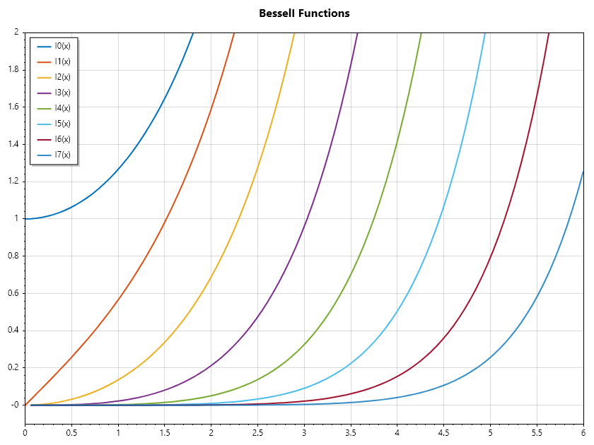
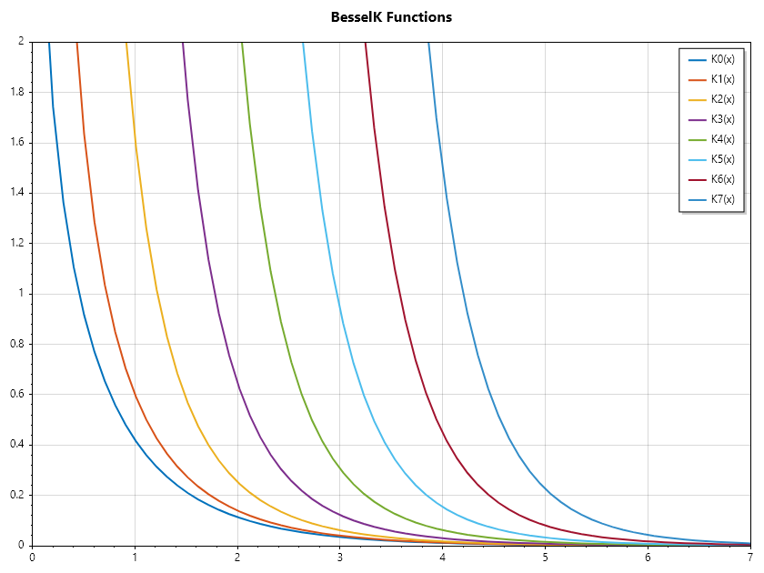
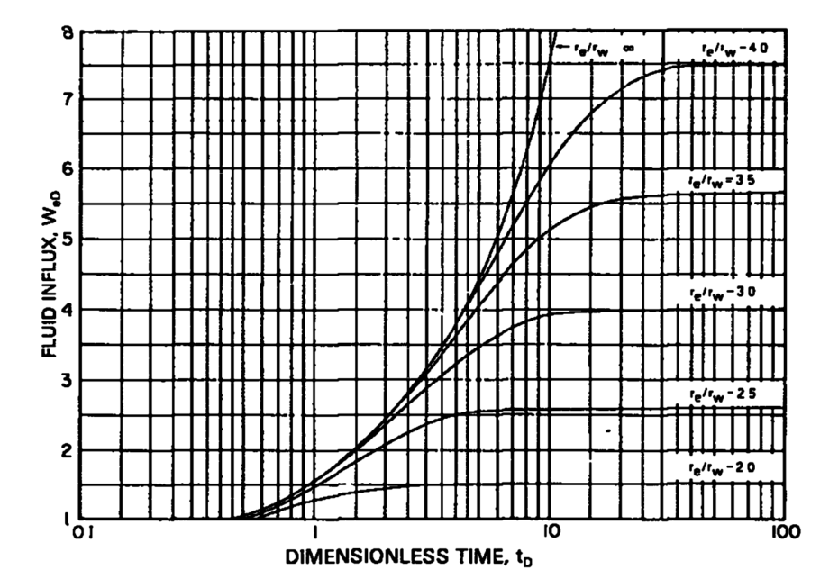
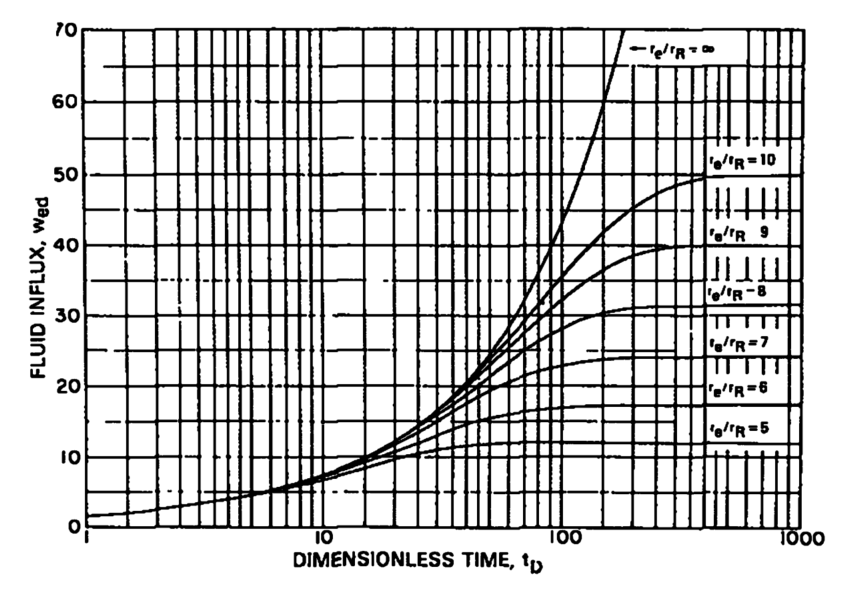

Bessel Functions
================

Bessel Functions
----------------
Bessel functions are a family of solutions to Bessel's differential equation, which appears in many physical problems involving cylindrical or spherical symmetry. They are named after the German mathematician Friedrich Wilhelm Bessel, who first studied them in the early 19th century.

Bessel's Differential Equation
~~~~~~~~~~~~~~~~~~~~~~~~~~~~~~
The general form of Bessel's differential equation is: 

.. math::

   x^2 \frac{d^2y}{dx^2} + x\frac{dy}{dx} + (x^2 - n^2)y = 0

where: math:`n`  is a parameter that determines the order of the Bessel function.

Types of Bessel Functions
~~~~~~~~~~~~~~~~~~~~~~~~~
#  **Bessel Functions of the First Kind** :math:`(J_n(x))` These functions are denoted by :math:`(J_n(x))` and are solutions to Bessel's differential equation that are finite at the origin (for non-negative integer orders). They are commonly used in problems involving wave propagation, static potentials and flow in porous media.

.. math::

   J_n(x) = \sum_{m = 0}^{\infty} \frac{(-1)^m}{m!\Gamma(m+n+1)}\left(\frac{x}{2}\right)^{2m + n}

.. code-block:: csharp

   ColVec x = Linspace(0, 10);
   Indexer Z = new(0, 8);
   Matrix J = Z.Select(z => BesselJ(z, x)).ToList();
   Plot(x, J, Linewidth: 2);
   Axis([0, 10, -0.5, 1]);
   Title("BesselJ Functions");
   Legend(Z.Select(z => $"J{z}(x)"), UpperRight);
   SaveAs("BesselJ-Functions.png");

.. figure:: images/BesselJ-Functions.png
   :align: center
   :alt: BesselJ-Functions.png

#. **Bessel Functions of the Second  Kind** :math:`(Y_n(x))` These functions are denoted by :math:`(Y_n(x))`,  are also solutions to Bessel's differential equation but have a singularity at the origin. They are often used in conjunction with :math:`(J_n(x))`  to form a complete set of solutions.

.. math::

   Y_n(x) = \frac{J_n(x)\cos(n\pi) - J_{-n}(x)}{\sin(n\pi)}

.. code-block:: csharp

   ColVec x = Linspace(0, 10);
   Indexer Z = new(0, 8);
   Matrix Y = Z.Select(z => BesselY(z, x)).ToList();
   Plot(x, Y, Linewidth: 2);
   Title("BesselY Functions");
   Axis([0, 10, -0.8, 0.6]);
   Legend(Z.Select(z => $"Y{z}(x)"), LowerRight);
   SaveAs("BesselY-Functions.png");

.. figure:: images/BesselY-Functions.png
   :align: center
   :alt: BesselY-Functions.png

#. **Modified Bessel Functions (** :math:`I_n(x)` **and** :math:`K_n(x)` **)**: These functions are solutions to the modified Bessel's differential equation, which is obtained by replacing  :math:`x` with :math:`ix` in the original equation. They are used in problems involving heat conduction and diffusion.

.. math::

   I_n(x) = \sum_{m = 0}^{\infty} \frac{1}{m!\Gamma(m+n+1)}\left(\frac{x}{2}\right)^{2m + n}

.. code-block:: csharp

   ColVec x = Linspace(0, 6);
   Indexer Z = new(0, 8);
   Matrix I = Z.Select(z => BesselI(z, x)).ToList();
   Plot(x, I, Linewidth: 2);
   Title("BesselI Functions");
   Axis([0, 6, -0.1, 2]);
   Legend(Z.Select(z => $"I{z}(x)"), UpperLeft);
   SaveAs("BesselI-Functions.png");

.. math::

   K_n(x) = \frac{\pi}{2}\frac{I_{-n}(x) - I_n(x)}{\sin(n\pi)}

.. code-block:: csharp

   ColVec x = Linspace(0, 10);
   Indexer Z = new(0, 8);
   Matrix K = Z.Select(z => BesselK(z, x)).ToList();
   Plot(x, K, Linewidth: 2);
   Title("BesselK Functions");
   Axis([0, 7, 0, 2]);
   Legend(Z.Select(z => $"K{z}(x)"), UpperRight);
   SaveAs("BesselK-Functions.png");

Application of some Special Functions
-------------------------------------
There are several applications of special functions: from function approximation using chebysheve polynomial, to quadrature using Legendre and Laguerre Polynomials, and solution of laplace equation in cylindrical coordinate using Bessel functions.

Water Influx Estimation
~~~~~~~~~~~~~~~~~~~~~~~
One example of application of special functions in the use of bessel function in the estimation of water influx in cylindrical coordinates. 
Water influx in an oil reservoir is the migration of water from an aquifer into the pore spaces of the reservoir rock containing oil.  This water movement is primarily driven by pressure differences between the aquifer and the reservoir as the oil is produced and reservoir pressure declines.  The water influx can provide pressure support, helping to maintain reservoir pressure and sustain oil production. Hence, understanding and accurate estimation of water influx is crucial for optimizing oil recovery strategies and the long-term economic viability of an oil field.
For use in material balance computation in edge drive configuration, reservoir engneering books provide plots for Wd as a function of dimensionless radius and time

For :math:`Rd \leq 4`

For :math:`5 \leq Rd \leq 10`

In an edge drive configuration with the aquifer closed at its outer boundary, the governing equation gives:

.. math::

   \cfrac{\partial P}{\partial t} = \cfrac{ 1} { r}\cfrac{\partial}{\partial r}\left(r \cfrac{\partial P} {\partial r} \right)

.. math::

   P(t = 0, r) = 0, P(t, r = 1) = 1, \cfrac{\partial P}{\partial r}(t, r = r_D) = 0

The solution in laplace space:

.. math::

   P(s, r) = \Phi_1 I_0(r\sqrt{ s}) + \Phi_2 K_0(r\sqrt{ s})

Using the boundary conditions to evaluate the constants and substitute them:

.. math::

   P(s, r) = \cfrac{ K_1(r_D\sqrt{ s}) I_0(r\sqrt{ s}) +I_1(r_D\sqrt{ s}) K_0(r\sqrt{ s})}{ s(K_1(r_D\sqrt{ s}) I_0(\sqrt{ s}) +I_1(r_D\sqrt{ s}) K_0(\sqrt{ s}))}

From Darcy law, we know that the rate of water influx is proportional to the negative rate of change of pressure with respect to radial position at the reservoir aquifer boundary, hence total water influx after a time t is thus:

.. math::

   W(t) = \int_{ 0}^{ t_D} -\cfrac{\partial P} {\partial r} (\tau, r = 1) \partial \tau

This can be accomplised by performing the integration in laplace space before inverting to time space.

.. math::

   W(t) = \mathcal{L}^{ -1}\left(\frac{-1} {s} \cfrac{\partial P}{\partial r}(s, r = 1) \right)

.. math::

   W(t) = \mathcal{L}^{ -1}\left(\frac{1} { s\sqrt{ s} } \cfrac{ I_1(r_D\sqrt{ s}) K_1(\sqrt{ s}) -K_1(r_D\sqrt{ s}) I_1(\sqrt{ s})} { (I_1(r_D\sqrt{ s}) K_0(\sqrt{ s}) +K_1(r_D\sqrt{ s}) I_0(\sqrt{ s}))} \right)

Lets see how to compute water influx, and generate the started water influx plot as shown above

.. code-block:: csharp

   double I0(double x) => BesselI(0, x);
   double I1(double x) => BesselI(1, x);
   double K0(double x) => BesselK(0, x);
   double K1(double x) => BesselK(1, x);
   // define Wd function in time space.
   double EdgeClosedBoundaryRadial_Wd(double tD, double rD)
   {
       // define the embedded laplace space solution
       double LapW(double s)
       {
           double sqrts = Sqrt(s), sqrts3 = s * sqrts;
           double Num = K1(sqrts), Den = K0(sqrts);
           if (!double.IsInfinity(rD))
           {
               double rDsqrts = rD*sqrts;
               Num = I1(rDsqrts) * Num - K1(rDsqrts) * I1(sqrts);
               Den = I1(rDsqrts) * Den + K1(rDsqrts) * I0(sqrts);
           }
           return Num /(Den * sqrts3);
       }
       return tD == 0 ? 0 : NiLaplace(LapW, tD);
   }

   // define the time and radial mesh
   double[] Rd = [2, 2.5, 3, 3.5, 4, double.PositiveInfinity];
   ColVec Td = Logspace(-1, 2), Wd;
   int end = Rd.Length - 1;
   // compute the water influx and plot
   Subplot(2, 1, 0);
   HoldOn();
   List<string> lgd = [];
   foreach (double rD in Rd)
   {
       Wd = Arrayfun(tD => EdgeClosedBoundaryRadial_Wd(tD, rD), Td);
       SemiLogx(Td, Wd, Linewidth: 2); lgd.Add("rD = " + rD);
   }
   Xlabel("tD"); Ylabel("WD");
   Legend(lgd, UpperLeft);
   Axis([0.1, 100, 1, 8]);
   Title("Dimensionless Water Influx Rd <= 4");

   // define the time and radial mesh
   Rd = [5, 6, 7, 8, 9, 10, double.PositiveInfinity];
   Td = Logspace(0, 3); end = Rd.Length - 1;

   // compute the water influx and plot
   Subplot(2, 1, 1);
   HoldOn();
   lgd = [];
   foreach (double rD in Rd)
   {
       Wd = Arrayfun(tD => EdgeClosedBoundaryRadial_Wd(tD, rD), Td);
       SemiLogx(Td, Wd, Linewidth: 2); lgd.Add("rD = " + rD);
   }
   Xlabel("tD"); Ylabel("WD");
   Legend(lgd, UpperLeft);
   Axis([1, 1000, 0, 70]);
   Title("Dimensionless Water Influx Rd >= 5");
   SaveAs("Dimensionless-Water-Influx.png", 600, 900);
   CloseFig();

.. figure:: images/Dimensionless-Water-Influx.png
   :align: center
   :alt: Dimensionless-Water-Influx.png

Cooling a Nuclear Fuel Rod
~~~~~~~~~~~~~~~~~~~~~~~~~~
Imagine a long, solid cylindrical fuel rod of radius :math:`R`. Initially, the rod is at a uniform temperature :math:`T_0`. At :math:`t = 0`, the rod is plunged into a cooling bath that keeps the outer surface at exactly :math:`0\circ C`. We want to find the temperature :math:`T(r, t)` at any radial distance r and any time :math:`t`.
* **1.The Governing Equation** The heat conduction in the rod(assuming no variation along the length) is governed by: 

.. math::

   \cfrac{\partial T}{\partial t} = \alpha \left(\cfrac{\partial^2 T}{\partial r^2}  + \cfrac{1}{r} \cfrac{\partial T}{\partial t} \right)

Where :math:`\alpha` is the thermal diffusivity.

* **2.The Need for Special Functions** When we use Separation of Variables by assuming :math:`T(r, t) = R(r)\theta(t)`, the radial part of the equation becomes:

.. math::

   r^2 R'' + r R' + \lambda^2 r^2 R = 0

This is a specific form of Bessel's Differential Equation of order zero. The solution cannot be expressed in terms of elementary functions (like polynomials or logs). Instead, we must use: :math:`J_0(x)`: The Bessel function of the first kind of order zero.

* **3.The Solution**
The general solution for the temperature profile involves an infinite series of these Bessel functions:

.. math::

   T(r,t) = \sum_{n = 1}^{\infty}c_n J_0\left(\cfrac{x_n r}{R} \right) e^{-\alpha (x_n/R)^2 t}

In this formula: :math:`x_n`  are the roots(zeros) of the Bessel function :math:`J_0`, :math:`c_n` are constants determined by the initial temperature :math:`T_0` using the Orthogonality Property of Bessel functions.
