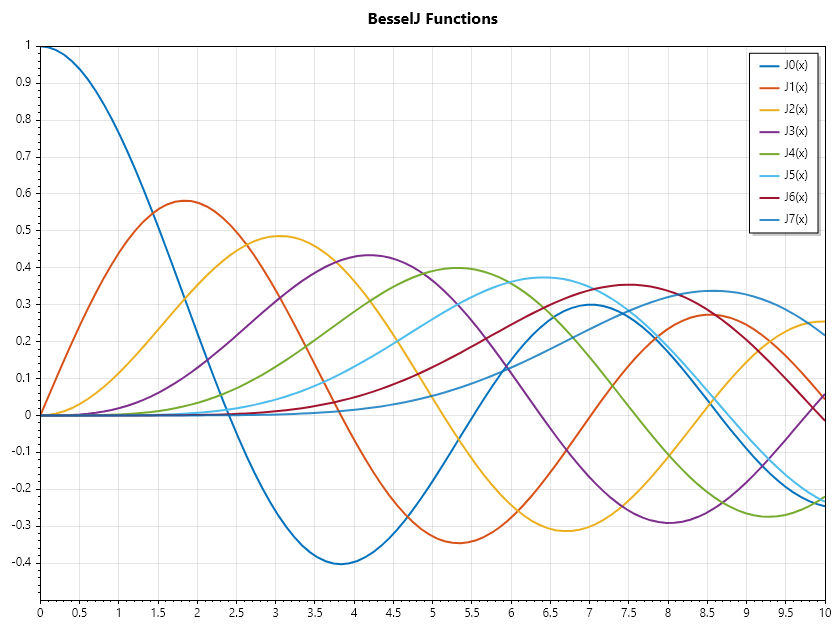
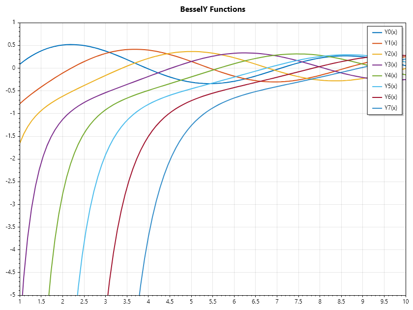
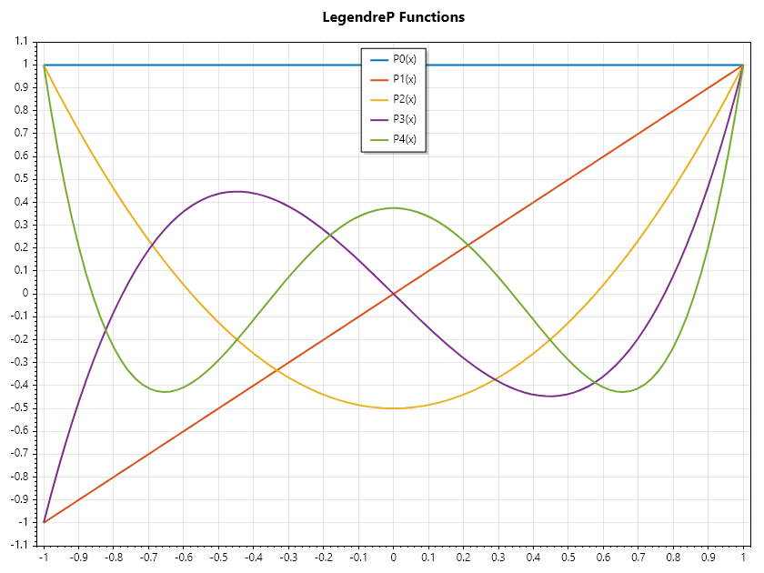
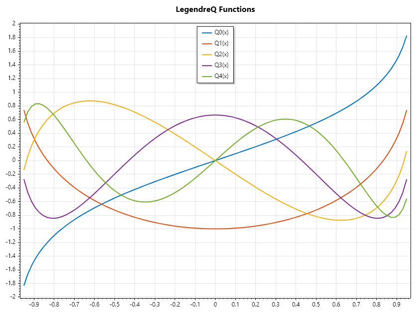
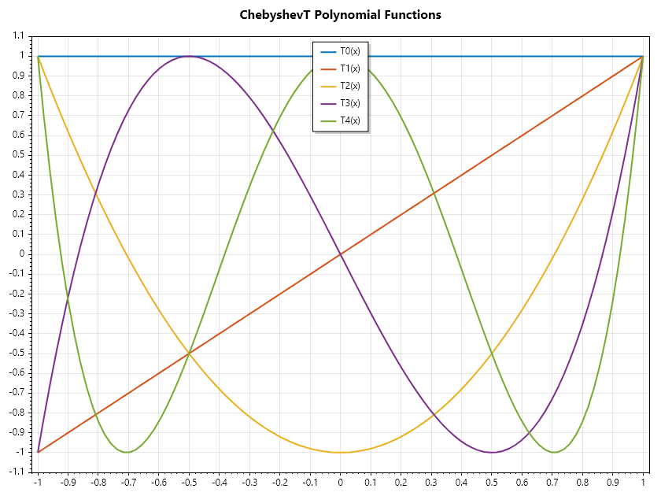
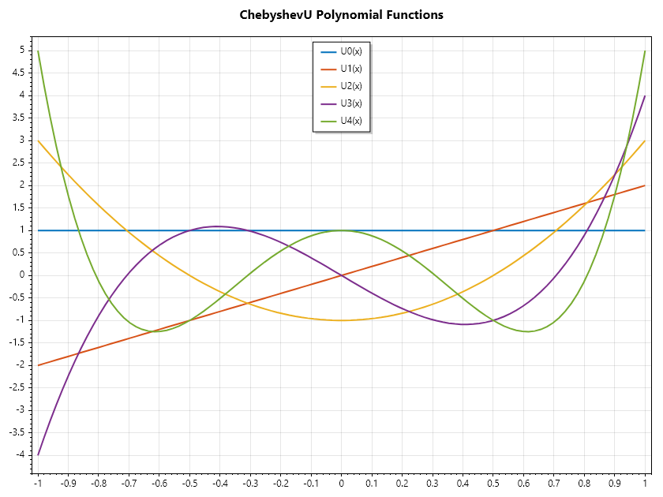
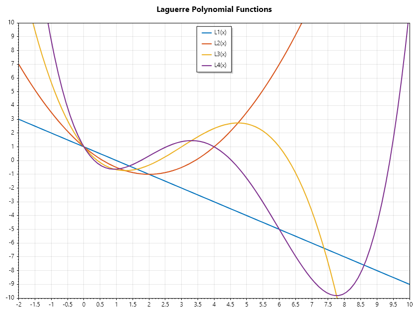
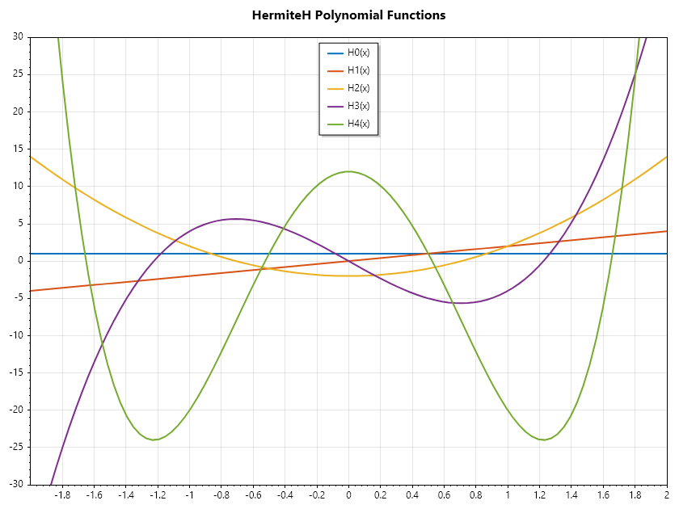
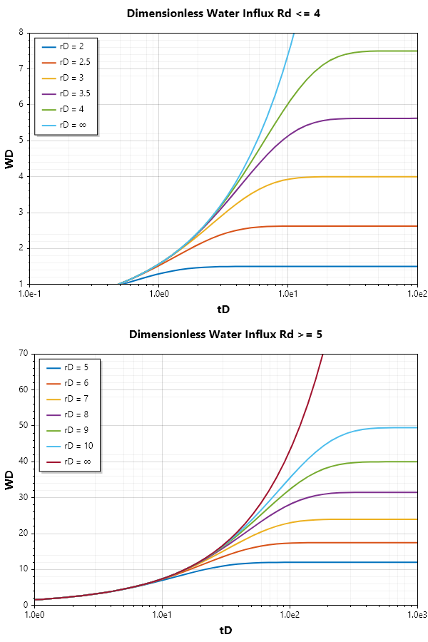

Bessel Hypergeometric
=====================

Bessel Functions
================
Bessel functions are a family of solutions to Bessel's differential equation, which appears in many physical problems involving cylindrical or spherical symmetry. They are named after the German mathematician Friedrich Wilhelm Bessel, who first studied them in the early 19th century.

Bessel's Differential Equation
------------------------------
The general form of Bessel's differential equation is: 

.. math::

   x^2 \frac{d^2y}{dx^2} + x\frac{dy}{dx} + (x^2 - n^2)y = 0

where: math:`n`  is a parameter that determines the order of the Bessel function.

Types of Bessel Functions
-------------------------
#  **Bessel Functions of the First Kind** :math:`(J_n(x))` These functions are denoted by :math:`(J_n(x))` and are solutions to Bessel's differential equation that are finite at the origin (for non-negative integer orders). They are commonly used in problems involving wave propagation, static potentials and flow in porous media.

.. math::

   J_n(x) = \sum_{m = 0}^{\infty} \frac{(-1)^m}{m!\Gamma(m+n+1)}\left(\frac{x}{2}\right)^{2m + n}

#. **Bessel Functions of the Second  Kind** :math:`(Y_n(x))` These functions are denoted by :math:`(Y_n(x))`,  are also solutions to Bessel's differential equation but have a singularity at the origin. They are often used in conjunction with :math:`(J_n(x))`  to form a complete set of solutions.

.. math::

   Y_n(x) = \frac{J_n(x)\cos(n\pi) - J_{-n}(x)}{\sin(n\pi)}

#. **Modified Bessel Functions (** :math:`I_n(x)` **and** :math:`K_n(x)` **)**: These functions are solutions to the modified Bessel's differential equation, which is obtained by replacing  :math:`x` with :math:`ix` in the original equation. They are used in problems involving heat conduction and diffusion.

.. math::

   I_n(x) = \sum_{m = 0}^{\infty} \frac{1}{m!\Gamma(m+n+1)}\left(\frac{x}{2}\right)^{2m + n}

.. math::

   K_n(x) = \frac{\pi}{2}\frac{I_{-n}(x) - I_n(x)}{\sin(n\pi)}

.. code-block:: csharp

   ColVec x = Linspace(0, 10);
   Indexer Z = new(0, 8);
   Matrix J = Z.Select(z => BesselJ(z, x)).ToList();
   Plot(x, J, Linewidth: 2);
   Axis([0, 10, -0.5, 1]);
   Title("BesselJ Functions");
   Legend(Z.Select(z => $"J{z}(x)"), UpperRight);
   SaveAs("BesselJ-Functions.png");

.. code-block:: csharp

   ColVec x = Linspace(1, 10);
   Indexer Z = new(0, 8);
   Matrix Y = Z.Select(z => BesselY(z, x)).ToList();
   Plot(x, Y, Linewidth: 2);
   Title("BesselY Functions");
   Axis([1, 10, -5, 1]);
   Legend(Z.Select(z => $"Y{z}(x)"), UpperRight);
   SaveAs("BesselY-Functions.png");

Legendre Functions
==================
Legendre polynomials are a set of orthogonal polynomials that arise in solving certain types of differential equations, particularly in physics and engineering. They are named after the French mathematician Adrien-Marie Legendre.

The Legendre polynomials :math:`P_n(x)` are solutions to Legendre's differential equation:

.. math::

   (1 - x^2) \frac{d^2y}{dx^2} - 2x\frac{dy}{dx} + n(n+1)y = 0

where: math:`n` is a non-negative integer.

Some key properties of Legendre polynomials include:

#. Orthogonality: They are orthogonal with respect to the weight function :math:`w(x) = 1`  on the interval :math:`[-1,1]`.
#. Normalization: :math:`P_n(1) = 1` for all :math:`n`
#. Recurrence Relation: They satisfy the recurrence relation:

.. math::

   (n+1)P_{n+1}(x) = (2n + 1)xP_{n}(x) - nP_{n-1}(x)

Types of Legendre polynomials
-----------------------------
**Legendre polynomials of the First Kind** :math:`(P_n(x))`

.. math::

   P_n(z) =  \frac{1}{2^n}\sum_{k=0}^{\lfloor \frac{n}{2} \rfloor} \frac{(-1)^k(2n-2k)!}{k!(n-k)!(n - 2k)!}x^{n-2k}

.. code-block:: csharp

   ColVec x = Linspace(-1, 1);
   Indexer Z = new(0, 5);
   Matrix P = Z.Select(z => LegendreP(z, x)).ToList();
   Plot(x, P, Linewidth: 2);
   Title("LegendreP Functions");
   Legend(Z.Select(z => $"P{z}(x)"), UpperCenter);
   SaveAs("LegendreP-Functions.png");

**Legendre polynomials of the Second Kind** :math:`(Q_n(x))`

.. math::

   Q_n(z) = \frac{1}{2}P_n(x)\ln\left(\frac{1+x}{1-x}\right) + \sum_{k=1}^{\lfloor \frac{n+1}{2} \rfloor} \frac{2n - 4k + 3}{(2k - 1)(n - k + 1)}P_{n - 2k + 1}(x)

.. code-block:: csharp

   ColVec x = Linspace(-0.95, 0.95);
   Indexer Z = new(0, 5);
   Matrix Q = Z.Select(z => LegendreQ(z, x)).ToList();
   Plot(x, Q, Linewidth: 2);
   Title("LegendreQ Functions");
   Legend(Z.Select(z => $"Q{z}(x)"), UpperCenter);
   SaveAs("LegendreQ-Functions.png");

Chebyshev polynomials
=====================
Chebyshev polynomials are a sequence of orthogonal polynomials that are widely used in numerical analysis, approximation theory, and other areas of mathematics. 
There are two main types of Chebyshev polynomials: those of the first kind, denoted as :math:`T_n(x)` and those of the second kind, denoted as :math:`U_n(x)`.

Types of Chebyshev polynomials
------------------------------
**ChebyshevT polynomials of the First Kind** :math:`(T_n(x))`

.. math::

   \begin{array}{rcl}
   T_0(x) &=& 1                                             \\
   T_1(x) &=& x                                             \\
   T_{n+1}(x) &=& 2xT_n(x) - T_{n-1}(x) ~\text{for}~ n \geq 1 
   \end{array}

.. code-block:: csharp

   ColVec x = Linspace(-1, 1);
   Indexer Z = new(0, 5);
   Matrix T = Z.Select(z => ChebyshevT(z, x)).ToList();
   Plot(x, T, Linewidth: 2);
   Title("ChebyshevT Polynomial Functions");
   Legend(Z.Select(z => $"T{z}(x)"), UpperCenter);
   SaveAs("ChebyshevT-Polynomial-Functions.png");

**ChebyshevU polynomials of the Second Kind** :math:`(U_n(x))`

.. math::

   \begin{array}{rcl} 
   U_0(x) &=& 1                                             \\
   U_1(x) &=&2x                                             \\
   U_{ n+1} (x) &=&2xU_n(x) - U_{ n-1} (x) ~\text{ for} ~n \geq 1
   \end{array}

.. code-block:: csharp

   ColVec x = Linspace(-1, 1);
   Indexer Z = new(0, 5);
   Matrix T = Z.Select(z => ChebyshevU(z, x)).ToList();
   Plot(x, T, Linewidth: 2);
   Title("ChebyshevU Polynomial Functions");
   Legend(Z.Select(z => $"U{z}(x)"), UpperCenter);
   SaveAs("ChebyshevU-Polynomial-Functions.png");

Laguerre Polynomial
===================
Laguerre polynomials are a sequence of orthogonal polynomials named after the French mathematician Edmond Laguerre. These polynomials are solutions to the Laguerre differential equation:

.. math::

   x \cfrac{d^2y}{dx^2} + (1 - x)\cfrac{dy}{dx} + ny = 0

where: math:`n` is a non-negative integer. The Laguerre polynomials are denoted by :math:`L_n(x)` and have several important properties and applications.

It can be generated by the following recurrent relation

.. math::

   \begin{array}{rcl}
   L_0(x) &=& 1                                             \\
   L_1(x) &=& 1 - x                                          \\
   (n + 1)L_{n+1}(x) &=& (2n + 1 - x)L_n(x) - nL_{n-1}(x) ~\text{for}~ n \geq 1 
   \end{array}

.. code-block:: csharp

   ColVec x = Linspace(-2, 10);
   Indexer Z = new(1, 5);
   Matrix P = Z.Select(z => Laguerre(z, x)).ToList();
   Plot(x, P, Linewidth: 2);
   Title("Laguerre Polynomial Functions");
   Axis([-2, 10, -10, 10]);
   Legend(Z.Select(z => $"L{z}(x)"), UpperCenter);
   SaveAs("Laguerre-Polynomial-Functions.png");

Hermite Polynomials
===================
Hermite polynomials are a classical sequence of orthogonal polynomials that arise in various fields of mathematics and physics. Named after the French mathematician Charles Hermite, these polynomials are particularly significant in probability theory, combinatorics, and quantum mechanics.

.. math::

   x \cfrac{d^2y}{dx^2} - 2x\cfrac{dy}{dx} + 2ny = 0

where :math:`n` is a non-negative integer. The Hermite polynomials are denoted by :math:`H_n(x)` and have several important properties and applications.
It can be generated by the following recurrent relation

.. math::

   \begin{array}{rcl}
   H_0(x) &=& 1                                                    \\
   H_1(x) &=& 2x                                                   \\
   H_{n+1}(x) &=& 2x H_n(x) - 2n H_{n-1}(x) ~\text{for}~ n \geq 1 
   \end{array}

.. code-block:: csharp

   ColVec x = Linspace(-2, 2);
   Indexer Z = new(0, 5);
   Matrix T = Z.Select(z => HermiteH(z, x)).ToList();
   Plot(x, T, Linewidth: 2);
   Title("HermiteH Polynomial Functions");
   Axis([-2, 2, -30, 30]);
   Legend(Z.Select(z => $"H{z}(x)"), UpperCenter);
   SaveAs("HermiteH-Polynomial-Functions.png");

Application of Special Function
===============================
One example of application of special functions in the use of bessel function in the estimation of water influx in cylindrical coordinates. 
Water influx in an oil reservoir is the migration of water from an aquifer into the pore spaces of the reservoir rock containing oil.  This water movement is primarily driven by pressure differences between the aquifer and the reservoir as the oil is produced and reservoir pressure declines.  The water influx can provide pressure support, helping to maintain reservoir pressure and sustain oil production. Hence, understanding and accurate estimation of water influx is crucial for optimizing oil recovery strategies and the long-term economic viability of an oil field.
For use in material balance computation in edge drive configuration, reservoir engneering books provide plots for Wd as a function of dimensionless radius and time

For :math:`Rd \leq 4`

..figure:: images/Water-Influx-from-Craft-and-Hawkins_4dn.png
:align: center
:alt: Water-Influx-from-Craft-and-Hawkins_4dn.png

For :math:`5 \leq Rd \leq 10`

..figure:: images/Water-Influx-from-Craft-and-Hawkins_5up.png
:align: center
:alt: Water-Influx-from-Craft-and-Hawkins_5up.png

In an edge drive configuration with the aquifer closed at its outer boundary, the governing equation gives:

.. math::

   \cfrac{\partial P}{\partial t} = \cfrac{ 1} { r}\cfrac{\partial}{\partial r}\left(r \cfrac{\partial P} {\partial r} \right)

.. math::

   P(t = 0, r) = 0, P(t, r = 1) = 1, \cfrac{\partial P}{\partial r}(t, r = r_D) = 0

The solution in laplace space:

.. math::

   P(s, r) = \Phi_1 I_0(r\sqrt{ s}) + \Phi_2 K_0(r\sqrt{ s})

Using the boundary conditions to evaluate the constants and substitute them:

.. math::

   P(s, r) = \cfrac{ K_1(r_D\sqrt{ s}) I_0(r\sqrt{ s}) +I_1(r_D\sqrt{ s}) K_0(r\sqrt{ s})}{ s(K_1(r_D\sqrt{ s}) I_0(\sqrt{ s}) +I_1(r_D\sqrt{ s}) K_0(\sqrt{ s}))}

From Darcy law, we know that the rate of water influx is proportional to the negative rate of change of pressure with respect to radial position at the reservoir aquifer boundary, hence total water influx after a time t is thus:

.. math::

   W(t) = \int_{ 0}^{ t_D} -\cfrac{\partial P} {\partial r} (\tau, r = 1) \partial \tau

This can be accomplised by performing the integration in laplace space before inverting to time space.

.. math::

   W(t) = \mathcal{L}^{ -1}\left(\frac{-1} {s} \cfrac{\partial P}{\partial r}(s, r = 1) \right)

.. math::

   W(t) = \mathcal{L}^{ -1}\left(\frac{1} { s\sqrt{ s} } \cfrac{ I_1(r_D\sqrt{ s}) K_1(\sqrt{ s}) -K_1(r_D\sqrt{ s}) I_1(\sqrt{ s})} { (I_1(r_D\sqrt{ s}) K_0(\sqrt{ s}) +K_1(r_D\sqrt{ s}) I_0(\sqrt{ s}))} \right)

Lets see how to compute water influx, and generate the started water influx plot as shown above

.. code-block:: csharp

   double I0(double x) => BesselI(0, x); 
   double I1(double x) => BesselI(1, x);
   double K0(double x) => BesselK(0, x);
   double K1(double x) => BesselK(1, x);
   // define Wd function in time space.
   double EdgeClosedBoundaryRadial_Wd(double tD, double rD)
   {
       // define the embedded laplace space solution
       double LapW(double s)
       {
           double sqrts = Sqrt(s), sqrts3 = s * sqrts;
           double Num = K1(sqrts), Den = K0(sqrts);
           if(!double.IsInfinity(rD))
           {
               double rDsqrts = rD*sqrts;
               Num = I1(rDsqrts) * Num - K1(rDsqrts) * I1(sqrts);
               Den = I1(rDsqrts) * Den + K1(rDsqrts) * I0(sqrts);
           }
           return Num /(Den * sqrts3);
       }
       return tD == 0 ? 0 : NiLaplace(LapW, tD);
   }

   // define the time and radial mesh
   double[] Rd = [2, 2.5, 3, 3.5, 4, double.PositiveInfinity];
   ColVec Td = Logspace(-1, 2), Wd;
   int end = Rd.Length - 1;
   // compute the water influx and plot
   Subplot(2, 1, 0);
   hold = true;
   List<string> lgd = [];
   foreach (double rD in Rd)
   {
       Wd = Td.Select(tD => EdgeClosedBoundaryRadial_Wd(tD, rD)).ToList();
       SemiLogx(Td, Wd, Linewidth: 2); lgd.Add("rD = " + rD);
   }
   lgd[end] = "rD = ∞";
   Xlabel("tD"); Ylabel("WD");
   Legend(lgd, UpperLeft);
   Axis([0.1, 100, 1, 8]);
   Title("Dimensionless Water Influx Rd <= 4");

   // define the time and radial mesh
   Rd = [5, 6, 7, 8, 9, 10, 50];
   Td = Logspace(0, 3); end = Rd.Length - 1;

   // compute the water influx and plot
   Subplot(2, 1, 1);
   hold = true;
   lgd = [];
   foreach (double rD in Rd)
   {
       Wd = Td.Select(tD => EdgeClosedBoundaryRadial_Wd(tD, rD)).ToList();
       SemiLogx(Td, Wd, Linewidth: 2); lgd.Add("rD = " + rD);
   }
   lgd[end] = "rD = ∞";
   Xlabel("tD"); Ylabel("WD");
   Legend(lgd, UpperLeft);
   Axis([1, 1000, 0, 70]);
   Title("Dimensionless Water Influx Rd >= 5");
   SaveAs("Dimensionless-Water-Influx.png");

