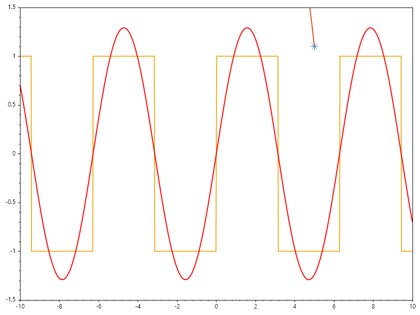
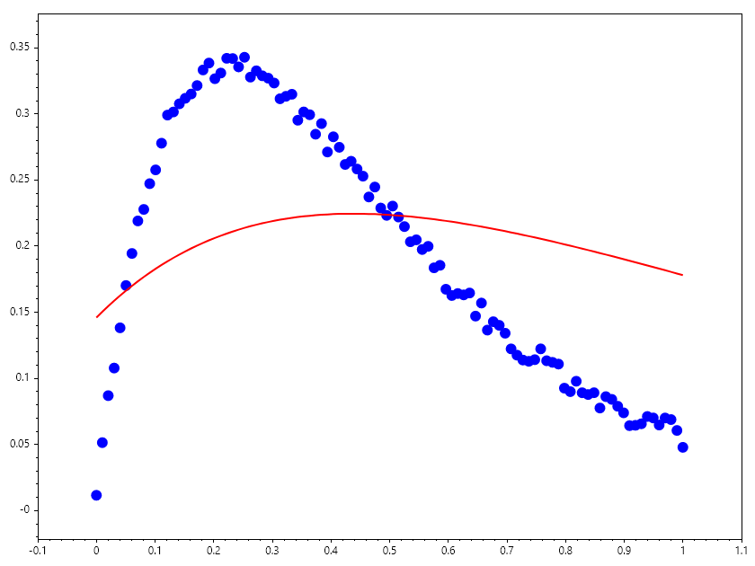

Curve Fitting
=============

Curve Fitting
-------------
Curve fitting is a mathematical technique used to construct a curve that best fits a series of data points. It is widely applied in data analysis, statistics, and machine learning to model relationships between variables.

Types of Curve Fitting:
~~~~~~~~~~~~~~~~~~~~~~~
1. Linear Regression: Fits a straight line to the data points.
2. Polynomial Regression: Fits a polynomial curve of degree n to the data points.
3. Nonlinear Regression: Fits a nonlinear model to the data points.

Example: Polynomial Curve Fitting
~~~~~~~~~~~~~~~~~~~~~~~~~~~~~~~~~
Given a set of data points, we can fit a polynomial curve using least squares optimization.

.. math::

   \min_{\mathbf{p}} \sum_{i=1}^{n} (y_i - P(x_i; \mathbf{p}))^2

.. code-block:: csharp

   // Sample data points
   double[] xData = [1, 2, 3, 4, 5];
   double[] yData = [2.2, 3.0, 3.2, 2.5, 1.1];
   // Fit a polynomial of degree 2
   int degree = 2;
   var coefficients = Polyfit(xData, yData, degree);
   Scatter(xData, yData, "*", 15); HoldOn();
   // Generate fitted curve
   double[] xFit = Linspace(1, 5, 100);
   double[] yFit = Polyval(coefficients, xFit);
   Plot(xFit, yFit, Linewidth: 2);
   SaveAs("CurveFitting.png");

.. figure:: images/CurveFitting.png
   :align: center
   :alt: CurveFitting.png

Example: Fourier Series Fitting
~~~~~~~~~~~~~~~~~~~~~~~~~~~~~~~
Evaluating a Fourier series numerically involves transforming an infinite 
sum of trigonometric terms into a computationally stable, finite calculation
while controlling truncation errors, floating-point precision loss, and
spectral artifacts.

Mathematical Formulation
========================
A truncated Fourier series approximating a periodic function :math:`f(x)` on 
the interval :math:`[-\pi, \pi]` with :math:`N` harmonics is defined as:

.. math::

   f_N(x) = \frac{a_0}{2} + \sum_{n=1}^{N} \left( a_n \cos(nx) + b_n \sin(nx) \right)

In complex exponential form, which is computationally convenient for many 
numerical implementations, the series is expressed as:

.. math::

   f_N(x) = \sum_{n=-N}^{N} c_n e^{i n x}

where the complex coefficients :math:`c_n` relate to the real coefficients via:

.. math::

   c_0 = \frac{a_0}{2}, \quad c_n = \frac{a_n - i b_n}{2}, \quad c_{-n} = \frac{a_n + i b_n}{2}

.. code-block:: csharp

   ColVec x = Linspace(-10, 10, 1001);
   ColVec Rect = Sign(Sin(x));
   Plot(x, Rect, Linewidth: 2); HoldOn();
   var fourier = Plot(x, 0 * x, "r", Linewidth: 2);
   Axis([x[0], x[^1], -1.5, 1.5]);
   List<ColVec> A = [Cos(x * 0)];
   byte[] Animfun(int N)
   {
       for (int n = 1; n <= (N + 1); n++)
       {
           A.Add(Cos(n * x));
           A.Add(Sin(n * x));
       }
       ColVec p = Mldivide(A, Rect);
       fourier.Ydata = A * p;
       return GetFrame();
   }
   AnimationMaker(Animfun, "FourierFit.gif", 5, 100);
   CloseFig();

Example: Bi-Exponential Curve Fitting
~~~~~~~~~~~~~~~~~~~~~~~~~~~~~~~~~~~~~
This exercise covers non-linear parameter estimation using least-squares optimization 
to fit a bi-exponential model to noisy data while visualizing optimizer convergence.

The objective is to fit data points :math:`(x_d, y_d)` to a bi - exponential model:

.. math::

   f(x; \theta) = \theta_2 e^{\theta_0 x} + \theta_3 e^{\theta_1 x}

where: math:`\theta = [\theta_0, \theta_1, \theta_2, \theta_3] ^ T` represents the unknown parameters.

Find :math:`\hat{\theta}` minimizing the sum of squared residuals:

.. math::

   \hat{\theta} = \arg\min_{\theta} \sum_{d=1}^D (y_d - f(x_d; \theta))^2

.. code-block:: csharp

   ColVec noise, weight = new double[100]; double[] x0;
   static ColVec fun(ColVec x, ColVec xdata) => x[2] * Exp(x[0] * xdata) + x[3] * Exp(x[1] * xdata);
   ColVec xdata = Linspace(0, 1); noise = Rand(xdata.Numel);
   ColVec ydata = fun(x0 = [-4, -5, 4, -4], xdata) + 0.02 * noise;
   x0 = [-1, -2, 1, -1]; weight[xdata < 0.5] = 1;
   var opts = OptimSet(Display: true, MaxIter: 200, StepTol: 1e-6, OptimalityTol: 1e-6);
   var ans = Lsqcurvefit(fun, x0, xdata, ydata, options: opts);
   AnimateHistory(fun, xdata, ydata, ans.history, "Fitting.gif");

Ouput

.. terminal::

                                               Norm of      First-order 
    Iteration   Func-count       Resnorm          step       optimality 
        0            5          1.7196e0                       3.5568e0 
        1           11         7.9375e-1     2.5462e-1         1.4671e0 
        2           17         5.2398e-1     2.3653e-1        2.9600e-1 
        3           23         4.4577e-1     5.2594e-1        1.4509e-1 
        4           29         2.6483e-1      2.0293e0        6.9149e-1 
        5           35         1.0830e-1      2.9903e0        7.1340e-1 
        6           41         5.7652e-3     5.1947e-1        6.2624e-2 
        7           48         4.2052e-3     2.1162e-1        3.6264e-2 
        8           55         3.9200e-3     1.6207e-1        1.9912e-2 
        9           62         3.7631e-3     1.2078e-1        1.1774e-2 
       10           68         3.7196e-3     2.6087e-1        5.3233e-2 
       11           75         3.4543e-3     1.4227e-1        1.8299e-2 
       12           82         3.3808e-3     1.0948e-1        1.0947e-2 
       13           89         3.3373e-3     8.5580e-2        6.8322e-3 
       14           96         3.3085e-3     7.0003e-2        4.6379e-3 
       15          102         3.2971e-3     1.6073e-1        2.4007e-2 
       16          109         3.2410e-3     1.0587e-1        1.0361e-2 
       17          116         3.2214e-3     8.1682e-2        6.1686e-3 
       18          123         3.2100e-3     6.5388e-2        3.9349e-3 
       19          130         3.2026e-3     5.4085e-2        2.6784e-3 
       20          136         3.2016e-3     1.1994e-1        1.3045e-2 
       21          143         3.1867e-3     8.1282e-2        5.7027e-3 
       22          150         3.1820e-3     6.0875e-2        3.1738e-3 
       23          157         3.1796e-3     4.7297e-2        1.8956e-3 
       24          164         3.1782e-3     3.7788e-2        1.1990e-3 
       25          170         3.1776e-3     7.3581e-2        4.5182e-3 
       26          176         3.1774e-3     8.4647e-2        5.7949e-3 
       27          182         3.1753e-3     4.8267e-2        1.7961e-3 
       28          188         3.1751e-3     1.1131e-2        9.2574e-5 
       29          194         3.1751e-3     7.6851e-4        4.4128e-7 

.. code-block:: csharp

   ColVec xdata, ydata, times, y_est, filltime, sgy, filly, lower, upper;

   double[] x_dat = [0.9, 1.5, 13.8, 19.8, 24.1, 28.2, 35.2, 60.3, 74.6, 81.3];
   double[] y_dat = [455.2, 428.6, 124.1, 67.3, 43.2, 28.1, 13.1, -0.4, -1.3, -1.5];
   xdata = x_dat; ydata = y_dat; times = Linspace(x_dat[0], x_dat[9]);
   double[] x0 = [100, -1];

   static ColVec fun(ColVec x, ColVec xdata) => x[0] * Exp(x[1] * xdata);
   var opts = OptimSet(Display: true, MaxIter: 200, StepTol: 1e-6, OptimalityTol: 1e-6);
   var ans = Lsqcurvefit(fun, x0, xdata, ydata, options: opts);

   Scatter(xdata, ydata); HoldOn();
   Plot(times, y_est = fun(ans.x, times), "r", Linewidth: 2);
   filltime = Vcart(times, times.Reverse().ToList());
   sgy = Interp1(xdata, ans.sigma_y, times);
   lower = y_est - 20 * sgy; upper = y_est + 20 * sgy;
   filly = Vcart(lower, upper.Reverse().ToList());
   Fill(filltime, filly, "g", 0.2); HoldOff();
   Axis([xdata.Min()-0.01*xdata.Range(), xdata.Max()+0.01*xdata.Range(),
   ydata.Min()-0.1*ydata.Range(), ydata.Max()+0.1*ydata.Range()]);
   SaveAs("CurveFitting.png");
   AnimateHistory(fun, xdata, ydata, ans.history, "CurveFitting.gif");

Ouput

.. terminal::

                                               Norm of      First-order 
    Iteration   Func-count       Resnorm          step       optimality 
        0            3          3.5968e5                       2.8768e4 
        1            7          2.9148e5      4.5301e1         6.3631e4 
        2           11          1.4328e5      7.0536e1         1.8724e5 
        3           15          5.8838e4      8.1015e1         1.7583e5 
        4           19          2.1604e4      7.9171e1         1.3573e5 
        5           23          2.4371e3      8.1537e1         4.6492e4 
        6           27          6.2429e1      3.5477e1         8.8212e3 
        7           31          9.6405e0      5.5200e0         5.2344e2 
        8           35          9.5049e0     2.7383e-1         4.5771e0 
        9           39          9.5049e0     3.5902e-3        1.3319e-2 
       10           43          9.5049e0     9.0844e-6        5.6927e-6 

.. figure:: images/CurveFitting.png
   :align: center
   :alt: CurveFitting.png

.. figure:: images/CurveFitting.gif
   :align: center
   :alt: CurveFitting.gif

        }
    }
}
