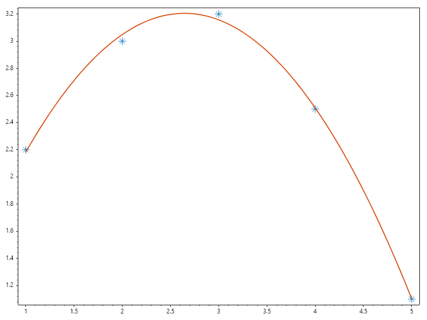
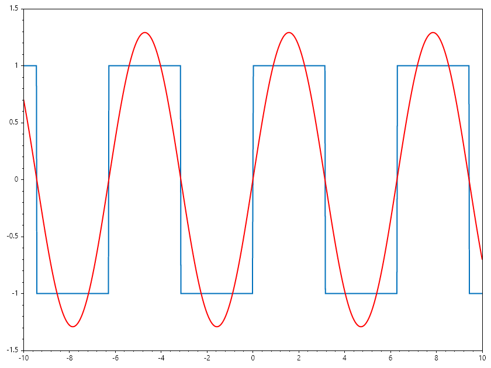
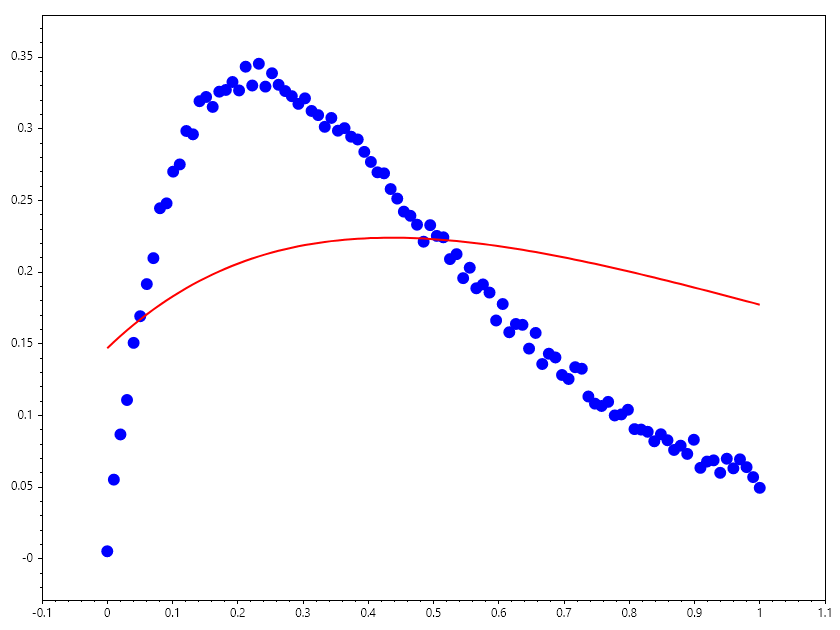
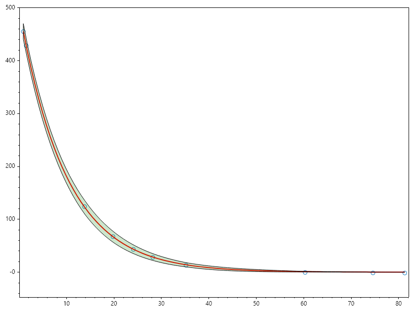
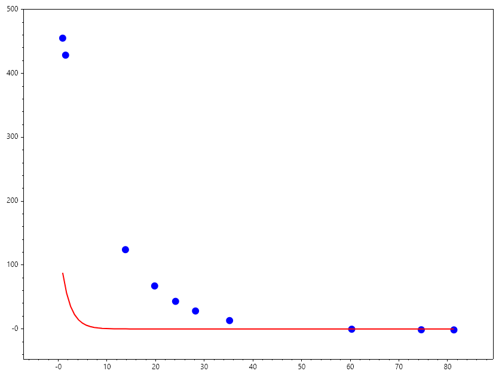
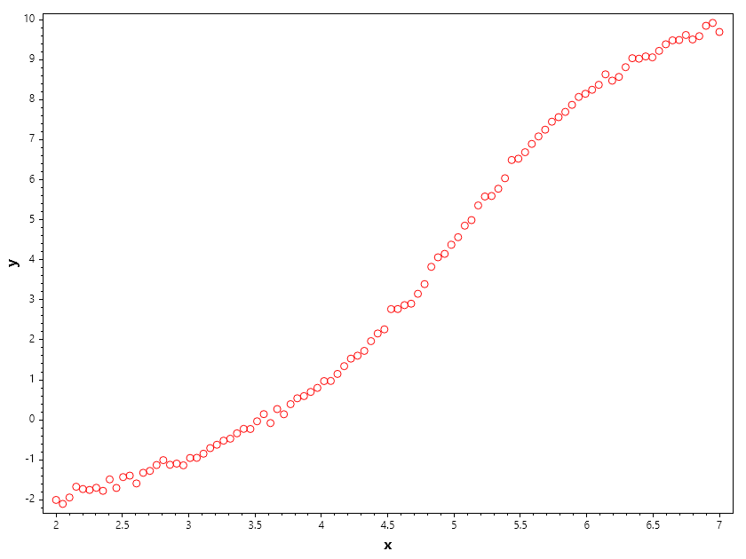
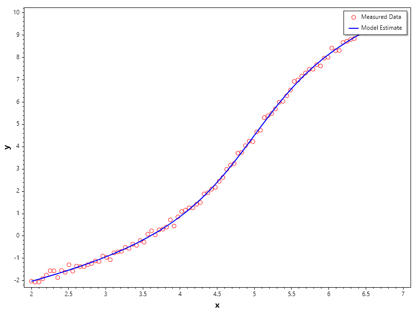
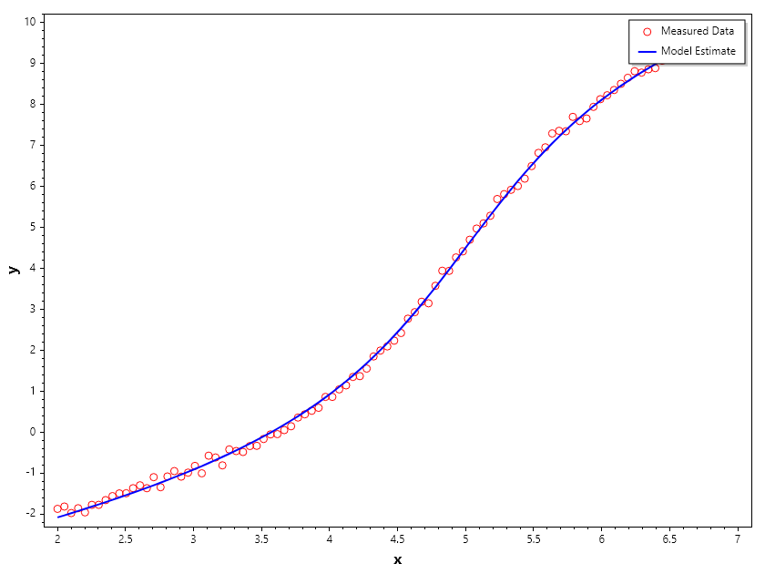

Curve Fitting
=============

Curve Fitting
-------------
Curve fitting is a mathematical technique used to construct a curve that best fits a series of data points. It is widely applied in data analysis, statistics, and machine learning to model relationships between variables.

Types of Curve Fitting:
~~~~~~~~~~~~~~~~~~~~~~~
1. Linear Regression: Fits a straight line to the data points.
2. Polynomial Regression: Fits a polynomial curve of degree n to the data points.
3. Nonlinear Regression: Fits a nonlinear model to the data points.

Example: Polynomial Curve Fitting
~~~~~~~~~~~~~~~~~~~~~~~~~~~~~~~~~
Given a set of data points, we can fit a polynomial curve using least squares optimization.

.. math::

   \min_{\mathbf{p}} \sum_{i=1}^{n} (y_i - P(x_i; \mathbf{p}))^2

.. code-block:: csharp

   // Sample data points
   double[] xData = [1, 2, 3, 4, 5];
   double[] yData = [2.2, 3.0, 3.2, 2.5, 1.1];
   // Fit a polynomial of degree 2
   int degree = 2;
   var coefficients = Polyfit(xData, yData, degree);
   Scatter(xData, yData, "*", 15); HoldOn();
   // Generate fitted curve
   double[] xFit = Linspace(1, 5, 100);
   double[] yFit = Polyval(coefficients, xFit);
   Plot(xFit, yFit, Linewidth: 2);
   SaveAs("Polynomial_Fitting.png");
   CloseFig();

Example: Fourier Series Fitting
~~~~~~~~~~~~~~~~~~~~~~~~~~~~~~~
Evaluating a Fourier series numerically involves transforming an infinite 
sum of trigonometric terms into a computationally stable, finite calculation
while controlling truncation errors, floating-point precision loss, and
spectral artifacts.

Mathematical Formulation:

A truncated Fourier series approximating a periodic function :math:`f(x)` on 
the interval :math:`[-\pi, \pi]` with :math:`N` harmonics is defined as:

.. math::

   f_N(x) = \frac{a_0}{2} + \sum_{n=1}^{N} \left( a_n \cos(nx) + b_n \sin(nx) \right)

In complex exponential form, which is computationally convenient for many 
numerical implementations, the series is expressed as:

.. math::

   f_N(x) = \sum_{n=-N}^{N} c_n e^{i n x}

where the complex coefficients :math:`c_n` relate to the real coefficients via:

.. math::

   c_0 = \frac{a_0}{2}, \quad c_n = \frac{a_n - i b_n}{2}, \quad c_{-n} = \frac{a_n + i b_n}{2}

.. code-block:: csharp

   ColVec x = Linspace(-10, 10, 1001);
   ColVec Rect = Sign(Sin(x));
   Plot(x, Rect, Linewidth: 2); HoldOn();
   var fourier = Plot(x, 0 * x, "r", Linewidth: 2);
   Axis([x[0], x[^1], -1.5, 1.5]);
   
   byte[] Animfun(int N)
   {
       Matrix A = Zeros(1001, 2 * N + 3);
       A[.., 0] = Ones(1001);
       for (int n = 1; n <= (N + 1); n++)
       {
           A[.., 2 * n-1] = Cos(n * x); 
           A[.., 2 * n] = Sin(n * x);
       }
       ColVec p = Mldivide(A, Rect);
       fourier.Ydata = A * p;
       return GetFrame();
   }
   AnimationMaker(Animfun, "FourierFitting.gif", 5, 100);
   CloseFig();

Example: Bi-Exponential Curve Fitting
~~~~~~~~~~~~~~~~~~~~~~~~~~~~~~~~~~~~~
This exercise covers non-linear parameter estimation using least-squares optimization 
to fit a bi-exponential model to noisy data while visualizing optimizer convergence.

The objective is to fit data points :math:`(x_d, y_d)` to a bi - exponential model:

.. math::

   f(x; \theta) = \theta_2 e^{\theta_0 x} + \theta_3 e^{\theta_1 x}

where  math:`\theta = [\theta_0, \theta_1, \theta_2, \theta_3]^T` represents the unknown parameters.

Find :math:`\hat{\theta}` minimizing the sum of squared residuals:

.. math::

   \hat{\theta} = \arg\min_{\theta} \sum_{d=1}^D (y_d - f(x_d; \theta))^2

.. code-block:: csharp

   ColVec noise, weight = new double[100]; double[] x0;
   static ColVec fun(ColVec x, ColVec xdata) => x[2] * Exp(x[0] * xdata) + x[3] * Exp(x[1] * xdata);
   ColVec xdata = Linspace(0, 1); noise = Rand(xdata.Numel);
   ColVec ydata = fun(x0 = [-4, -5, 4, -4], xdata) + 0.02 * noise;
   x0 = [-1, -2, 1, -1]; weight[xdata < 0.5] = 1;
   var opts = OptimSet(Display: true, MaxIter: 200, StepTol: 1e-6, OptimalityTol: 1e-6);
   var ans = Lsqcurvefit(fun, x0, xdata, ydata, options: opts);
   AnimateHistory(fun, xdata, ydata, ans.history, "Bi_Exponential_Fitting.gif");
   CloseFig();

Ouput

.. terminal::

                                               Norm of      First-order 
    Iteration   Func-count       Resnorm          step       optimality 
        0            5          1.7318e0                       3.6211e0 
        1           11         7.9530e-1     2.5523e-1         1.4803e0 
        2           17         5.2328e-1     2.3650e-1        2.9770e-1 
        3           23         4.4587e-1     5.2233e-1        1.4373e-1 
        4           29         2.6634e-1      2.0176e0        6.8925e-1 
        5           35         1.1058e-1      3.0067e0        7.2289e-1 
        6           41         6.0050e-3     4.4680e-1        8.5358e-2 
        7           47         5.3426e-3     4.7180e-1        1.4465e-1 
        8           53         4.8116e-3     3.9766e-1        1.2651e-1 
        9           59         4.0953e-3     2.9717e-1        7.8787e-2 
       10           65         3.7202e-3     1.7462e-1        2.7865e-2 
       11           71         3.6682e-3     6.3027e-2        3.5902e-3 
       12           77         3.6673e-3     9.9354e-3        8.9152e-5 
       13           83         3.6673e-3     5.2142e-4        2.4861e-7 

.. code-block:: csharp

   ColVec xdata, ydata, times, y_est, filltime, sgy, filly, lower, upper;

   double[] x_dat = [0.9, 1.5, 13.8, 19.8, 24.1, 28.2, 35.2, 60.3, 74.6, 81.3];
   double[] y_dat = [455.2, 428.6, 124.1, 67.3, 43.2, 28.1, 13.1, -0.4, -1.3, -1.5];
   xdata = x_dat; ydata = y_dat; times = Linspace(x_dat[0], x_dat[9]);
   double[] x0 = [100, -1];

   static ColVec fun(ColVec x, ColVec xdata) => x[0] * Exp(x[1] * xdata);
   var opts = OptimSet(Display: true, MaxIter: 200, StepTol: 1e-6, OptimalityTol: 1e-6);
   var ans = Lsqcurvefit(fun, x0, xdata, ydata, options: opts);

   Scatter(xdata, ydata); HoldOn();
   Plot(times, y_est = fun(ans.x, times), "r", Linewidth: 2);
   filltime = Vcart(times, times.Reverse().ToList());
   sgy = Interp1(xdata, ans.sigma_y, times);
   lower = y_est - 20 * sgy; upper = y_est + 20 * sgy;
   filly = Vcart(lower, upper.Reverse().ToList());
   Fill(filltime, filly, "g", 0.2); HoldOff();
   Axis([xdata.Min()-0.01*xdata.Range(), xdata.Max()+0.01*xdata.Range(),
   ydata.Min()-0.1*ydata.Range(), ydata.Max()+0.1*ydata.Range()]);
   SaveAs("CurveFitting.png");
   AnimateHistory(fun, xdata, ydata, ans.history, "CurveFitting.gif");
   CloseFig();

Ouput

.. terminal::

                                               Norm of      First-order 
    Iteration   Func-count       Resnorm          step       optimality 
        0            3          3.5968e5                       2.8768e4 
        1            7          2.9148e5      4.5301e1         6.3631e4 
        2           11          1.4328e5      7.0536e1         1.8724e5 
        3           15          5.8838e4      8.1015e1         1.7583e5 
        4           19          2.1604e4      7.9171e1         1.3573e5 
        5           23          2.4371e3      8.1537e1         4.6492e4 
        6           27          6.2429e1      3.5477e1         8.8212e3 
        7           31          9.6405e0      5.5200e0         5.2344e2 
        8           35          9.5049e0     2.7383e-1         4.5771e0 
        9           39          9.5049e0     3.5902e-3        1.3319e-2 
       10           43          9.5049e0     9.0844e-6        5.6927e-6 

Lsqcurvefit allows the use of constraints. 
1. Seed data for reproducability

.. code-block:: csharp

   int seed = 23;
   Random rng = new(seed);
   ColVec xdata, ydata, noise = Randn(100);
   double[] xstar = [2, 4, 5, 0.5];

   ColVec model(ColVec x, ColVec xdata) => x[0] + x[1] * Atan(xdata - x[2]) + x[3] * xdata;
   xdata = Linspace(2,7); ydata = model(xstar, xdata) + noise/10;
   Scatter(xdata, ydata, "ro");

   Xlabel("x"); Ylabel("y"); 
   SaveAs("Seeded_Curve_Fitting_Data.png");
   CloseFig();

2. Fitting with Linear constraint

.. code-block:: csharp

   int seed = 23;
   Random rng = new(seed);
   ColVec xdata, ydata, noise = Randn(100);
   double[] xstar = [2, 4, 5, 0.5], startpt = [1, 2, 3, 1];

   ColVec model(ColVec x, ColVec xdata) => x[0] + x[1] * Atan(xdata - x[2]) + x[3] * xdata;
   RowVec A = new double[] { -1, -1, 1, 1 };
   ColVec fineq(ColVec x) => A * x; ColVec lb = Zeros(4), ub = 7 + lb;
   xdata = Linspace(2, 7); ydata = model(xstar, xdata) + noise / 10;

   var opts = OptimSet(Display: true, MaxIter: 200, StepTol: 1e-6, OptimalityTol: 1e-6);
   var ans = Lsqcurvefit(model, startpt, xdata, ydata, fineq, null, lb, ub, options: opts);
   Console.WriteLine($"x = {ans.x.T}");
   Console.WriteLine($"c = {fineq(ans.x)}");

   Scatter(xdata, ydata, "ro"); HoldOn();
   Plot(xdata, ans.y_hat, "-b", Linewidth: 2);

   Xlabel("x"); Ylabel("y");
   Legend(["Measured Data", "Model Estimate"], UpperRight);
   SaveAs("Example_of_CurveFitting_using_Lsqcurvefit_with_Linear_Inequality_Constraints.png");
   CloseFig();

Ouput

.. terminal::

                                               Norm of      First-order 
    Iteration   Func-count       Resnorm          step       optimality 
        0            5          1.5800e3                       1.5123e3 
        1           11          1.2999e3     2.1003e-1         1.3133e3 
        2           17          7.9737e2     4.8388e-1         8.8844e2 
        3           23          3.0300e2     8.0640e-1         3.3669e2 
        4           29          6.1230e1     9.6914e-1         6.9314e1 
        5           35          1.0767e1     6.5761e-1         3.5939e1 
        6           41          5.8140e0     3.9314e-1         2.3365e0 
        7           47          2.9126e0     5.4179e-1         3.3570e0 
        8           53          2.5941e0     5.6287e-1         1.8089e0 
        9           59          1.1212e0     2.6985e-1        3.2543e-1 
       10           65          1.1191e0     3.9430e-3        7.2667e-2 
       11           71          1.1099e0     1.5475e-1        5.5421e-2 
       12           77          1.1097e0     1.9778e-2        1.1581e-3 
       13           83          1.1097e0     8.2115e-4        9.1756e-6 
       14           89          1.1097e0     1.0877e-5        3.4498e-8 
   x = 
      1.8365    3.9506    4.9967    0.5326
   
   c =   -0.2578

3. Fitting with nonlinear constraint.

.. code-block:: csharp

   int seed = 23;
   Random rng = new(seed);
   ColVec xdata, ydata, noise = Randn(100);
   double[] xstar = [2, 4, 5, 0.5], startpt = [1, 2, 3, 1];

   ColVec model(ColVec x, ColVec xdata) => x[0] + x[1] * Atan(xdata - x[2]) + x[3] * xdata;
   ColVec fineq(ColVec x) => x[0] * x[0] + x[1] * x[1] - 16; ColVec lb = Zeros(4), ub = 7 + lb;
   xdata = Linspace(2, 7); ydata = model(xstar, xdata) + noise / 10;

   var opts = OptimSet(Display: true, MaxIter: 200, StepTol: 1e-6, OptimalityTol: 1e-6);
   var ans = Lsqcurvefit(model, startpt, xdata, ydata, fineq, null, lb, ub, options: opts);
   Console.WriteLine($"x = {ans.x.T}");
   Console.WriteLine($"c = {fineq(ans.x)}");

   Scatter(xdata, ydata, "ro"); HoldOn();
   Plot(xdata, ans.y_hat, "-b", Linewidth: 2);

   Xlabel("x"); Ylabel("y");
   Legend(["Measured Data", "Model Estimate"], UpperRight);
   SaveAs("Example_of_CurveFitting_using_Lsqcurvefit_with_NonLinear_Inequality_Constraints.png");
   CloseFig();

Ouput

.. terminal::

                                               Norm of      First-order 
    Iteration   Func-count       Resnorm          step       optimality 
        0            5          1.5720e3                       1.5081e3 
        1           11          1.2902e3     2.1217e-1         1.3077e3 
        2           17          7.8503e2     4.8952e-1         8.8032e2 
        3           23          2.8875e2     8.1900e-1         3.2603e2 
        4           29          5.3135e1     9.7043e-1         6.8890e1 
        5           35          5.0714e0     6.2470e-1         3.7803e1 
        6           41          2.4174e0     2.0040e-1         4.0411e0 
        7           47          2.1549e0     1.8045e-1         1.2243e0 
        8           53          1.6841e0     4.0733e-1         1.5620e0 
        9           59          1.1003e0     7.2504e-1         1.6472e0 
       10           69          1.0893e0     2.2607e-2        7.0258e-1 
       11           75          1.0858e0     3.8220e-3        3.3861e-1 
       12           81          1.0853e0     1.0253e-3        3.7569e-1 
       13           87          1.0852e0     3.1324e-4        3.8717e-1 
       14           93          1.0852e0     6.6067e-4        4.1054e-1 
       15           99          1.0851e0     7.6031e-4        4.3918e-1 
       16          105          1.0851e0     3.6679e-4        4.5359e-1 
       17          111          1.0851e0     6.1510e-5        4.5605e-1 
       18          117          1.0851e0     3.2168e-6        4.5619e-1 
   x = 
      1.3515    3.7648    5.0100    0.6382
   
   c =    0.0000

