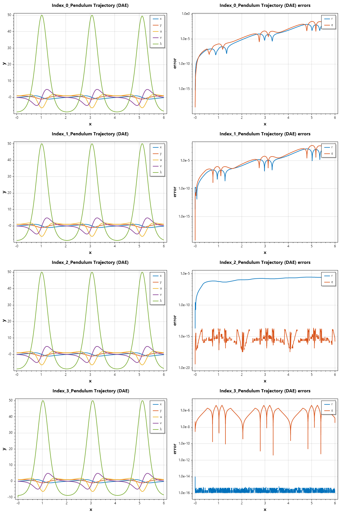

Differential Algebraic Equations
================================

1. Introduction to DAEs
-----------------------
Differential-Algebraic Equations are a class of functional equations that contain both differential equations (describing the evolution of the system) and algebraic constraints (restricting the state space). Unlike standard Ordinary Differential Equations (ODEs), DAEs are not explicitly solved for all derivatives.

A general DAE system is expressed in the implicit form: :math:`F(t, y, y') = 0`

If the Jacobian :math:`\frac{\partial F}{\partial y'}` is non-singular, the system is essentially an implicit ODE. If it is singular, the system is a "true" DAE.

2. The Concept of Index
-----------------------
The difficulty of solving a DAE is measured by its **index**. The most common definition is the **differentiation index**: the number of times you must differentiate the algebraic constraints to express the system as a set of explicit ODEs.
* **Index 0:** An ODE.
* **Index 1:** The most common solvable DAE (e.g., the algebraic variables can be solved for directly).
* **Higher Index (2+):** These are numerically unstable and usually require index reduction techniques before solving.

3. Solving DAEs with `sepalsolver`
----------------------------------
In modern computational environments like C#, DAEs can be solved using the `SepalSolver` library, which utilizes a Mass Matrix formulation:
:math:`M y' = f(t, y)`
Where :math:`M` is a singular matrix.

---

4. Examples and Applications
----------------------------

.. Admonition:: Example 1 : 

   **Example 1: The Robertson Problem (Chemical Kinetics)**
   This is a classic stiff DAE representing the reaction of three species. It is an Index-1 DAE where the total mass is conserved via an algebraic constraint.
   
   
   
   .. code-block:: csharp
   
      double[] robertson_f(double t, double[] y) =>
          [(-0.04 * y[0] + 1e4 * y[1] * y[2]),
           (0.04 * y[0] - 1e4 * y[1] * y[2] - 3e7 * y[1]*y[1]),
           y[0] + y[1] + y[2] - 1.0];
   
      double[,] mass_f(double t, double[] y) => Diag([1, 1, 0]);
   
      double[] y0 = [1.0, 0.0, 0.0];
      (ColVec T, Matrix Y) = Ode45a(robertson_f, mass_f, y0, [0, 1e7]);
      // Plot the result
      Y[.., 1] = 1e4*Y[.., 1];
      SemiLogx(T, Y);
      Xlabel("Time t"); Ylabel("Soluton y");
      Legend(["y_1", "1e4*y_2", "y_3"], MiddleLeft);
      Title("Solution of Robertson's ODE with ODE45a");
      SaveAs("Robertson-ODE-given-points-Ode45a.png");
   
   
   .. figure:: images/Robertson-ODE-given-points-Ode45a.png
      :align: center
      :alt: Robertson-ODE-given-points-Ode45a.png
   

.. Admonition:: Example 1 :  The Simple Pendulum (Index-1)

   A pendulum in Cartesian coordinates is naturally an Index-3 DAE. We solve the stabilized Index-1 version by including velocity constraints.
   
   The position of the pendulum :math:`(x, y)` must satisfy the rigid rod constraint: 
   :math:`x^2 + y^2 - 1 = 0`
   
   **The Index-1 Formulation**
   To reduce the index, we differentiate the constraint twice. The second derivative introduces the accelerations :math:`x''` and :math:`y''`, allowing us to solve for the Lagrange multiplier :math:`\lambda` (tension).
   
   The resulting Index-1 system is:
   
   .. math::
   
      \begin{array}{rcl}
      x' &=& u \\
      y' &=& v \\
      u' &=& -\lambda x \\
      v' &=& -\lambda  y - g \\
      0 &=& u^2 + v^2 - y g - \lambda
      \end{array}    
   
   
   
   
   .. code-block:: csharp
   
      double g = 9.81;
   
      // State vector y = [x, y, u, v, λ]
      double[] pendulum_f(double t, double[] y) =>
          [y[2],
           y[3],
           -y[0] * y[4],
           -y[1] * y[4] - g,
           y[2]*y[2] + y[3]*y[3] - y[1] * g - y[4]];
   
      double[,] mass_f(double t, double[] y) => Diag([1, 1, 1, 1, 0]);
   
      double[] y0 = [0, 1, 1, 0, 1 - g];
      var opts = Odeset(Stats: true, RelTol: 1e-6);
      (ColVec T, Matrix Y) = Ode45a(pendulum_f, mass_f, y0, [0, 6], opts);
      Plot(T, Y, Linewidth: 2); Xlabel("x"); Ylabel("y");
      Legend(["x", "y", "u", "v", "λ"]);
      Title("Pendulum Trajectory (DAE)");
      SaveAs("Index_1-Pendulum-Problem-Ode45a.png");
   
   
   Ouput
   
   .. terminal::
   
      Summary of statistics by Ode45a
              1320 successful steps
              19 failed attempts
              36984 function evaluations
              1339 partial derivatives
              5356 LU decompositions
              23577 solutions of linear systems
      
   
   .. figure:: images/Index_1-Pendulum-Problem-Ode45a.png
      :align: center
      :alt: Index_1-Pendulum-Problem-Ode45a.png
   

As an exercise, the reader is encouraged to solve the problem using 
this initial condition y0 = [1, 0, 0, 1, 1];

.. Admonition:: Example 2 :  Semi-Explicit DAE (The Transistor Amplifier)**

   This example mimics the "hbdae" problem from MathWorks, representing an electrical circuit with nonlinear components.
   
   The transistor amplifier circuit contains six resistors, three capacitors, and a transistor.
   
   .. figure:: images/Transistor.png
       :align: center
       :alt: Transistor.png
   
   - The initial voltage signal is :math:`U_e(t) = 0.4\sin(200\pi t)`.
   - The operating voltage is :math:`U_b = 6`.
   - The voltages at the nodes are given by: :math:`U_i(t)(i = 1, 2, 3, 4, 5)`.
   - The values of the resistors  :math:`R_i(t)(i = 1, 2, 3, 4, 5)`. are constant, and the current through each resistor satisfies :math:`I = U/R`.
   - The values of the capacitors :math:`C_i(i = 1, 2, 3)` are constant, and the current through each capacitor satisfies :math:`I=C⋅dU/dt`.
   
   The goal is to solve for the output voltage through node 5, :math:`U_5(t)`.
   Using Kirchoff's law to equalize the current through each node (1 through 5), you can obtain a system of five equations describing the circuit:
   
   Node 1: :math:`C_1(U'_2 - U'_1) = (U_1 - U_e(t))/R_0`
   
   Node 2: :math:`C_1(U'_1 - U'_2) = (U_2 - U_b)/R_1 + U_2/R_1 + 0.01f(U_2 - U_3)`
   
   Node 3: :math:`-C_2U'_3 = U_3/R_3 - f(U_2 - U_3)`
   
   Node 4: :math:`C_3(U'_5 - U'_4) = (U_4 - U_b)/R_4 + 0.99f(U_2 - U_3)`
   
   Node 5: :math:`C_3(U'_4 - U'_5) = U_5/R_5`
   
   By extracting the coeeficients of the derivatives into a matrix, we have:
   
   .. math::
   
      \begin{pmatrix}
      -c_{1} &  c_{1} &     0    &    0     &     0    \\
      c_{1} & -c_{1} &     0    &    0     &     0    \\
      0    &   0    & -c_{ 2}  &    0     &     0    \\
      0    &   0    &    0     & -c_{ 3}  &  c_{ 3}  \\
      0    &   0    &    0     &  c_{ 3}  & -c_{ 3}
      \end{pmatrix}
      \begin{pmatrix}
      U'_1 \\  U'_2 \\ U'_3 \\ U'_4 \\ U'_5 
      \end{pmatrix} = 
      \begin{pmatrix}
      (U_1 - U_e(t))/R_0 \\  
      (U_2 - U_b)/R_1 + U_2/R_1 + 0.01f(U_2 - U_3) \\ 
      U_3/R_3 - f(U_2 - U_3) \\ 
      (U_4 - U_b)/R_4 + 0.99f(U_2 - U_3) \\ 
      U_5/R_5
      \end{pmatrix}
   
   
   
   .. code-block:: csharp
   
      double Ub = 6, R0 = 1000, R15 = 9000, alpha = 0.99,
          beta = 1e-6, Uf = 0.026, c1 = 1e-6, c2 = 2e-6, c3 = 3e-6;
      double[,] Mass(double t, double[] y) => new double[,]
      {
          {-c1,  c1,  0,   0,   0 },
          { c1, -c1,  0,   0,   0 },
          { 0,   0,  -c2,  0,   0 },
          { 0,   0,   0,  -c3,  c3},
          { 0,   0,   0,   c3, -c3}
      };
      double Ue(double t) => 0.4 * Sin(200 * pi * t);
      double[] dudt(double t, double[] u)
      {
          double f23 = beta * (Exp((u[1] - u[2]) / Uf) - 1);
          return [ -(Ue(t) - u[0])/R0,
                   -(Ub/R15 - u[1]*2/R15 - (1-alpha)*f23),
                   -(f23 - u[2]/R15),
                   -((Ub - u[3])/R15 - alpha*f23),
                   u[4]/R15 ];
      }
      double[] tspan = [0, 0.1];
      double[] y0 = [0, Ub / 2, Ub / 2, Ub, 0];
   
      var opts = Odeset(RelTol: 1e-5);
      (ColVec T, Matrix Y) = Ode45a(dudt, Mass, y0, tspan, opts);
      Scatter(T, Arrayfun(Ue, T), "o"); HoldOn();
      Plot(T, Y[.., 4], "--r"); HoldOff();
      Legend(["Input", "Output"], UpperLeft);
      Xlabel("Time t"); Ylabel("Solution y");
      Title("One Transistor Amplifier DAE Problem-Ode45a");
      SaveAs("One-Transistor-Amplifier-DAE-Problem-Ode45a.png");
   
   
   .. figure:: images/One-Transistor-Amplifier-DAE-Problem-Ode45a.png
      :align: center
      :alt: One-Transistor-Amplifier-DAE-Problem-Ode45a.png
   

.. Admonition:: Example 3 :  The Akzo Nobel Problem

   A high-dimensional DAE describing a chemical process with 6 differential and 2 algebraic equations. This tests the solver's ability to handle stiff systems with coupled variables.
   
   **Mathematical Description:**
   The system is defined by reaction rates :math:`r_i` and concentrations :math:`y_1, ..., y_8`:
   
   
   .. math::
   
      \begin{array}{rcl}
      r_1 &=& k_1 \cdot y_1^4 \cdot y_2^{0.5}\\
      r_2 &=& k_2 \cdot y_3 \cdot y_4 \\
      r_3 &=& k_2 / K \cdot y_1 \cdot y_5\\
      r_4 &=& k_3 \cdot y_1 \cdot y_4^2\\
      r_5 &=& k_4 \cdot y_6^2 \cdot y_2^{0.5}
      \end{array}
   
   
   The differential equations are:
   
   .. math::
   
      \begin{array}{rcl}
      y_1' &=& -2r_1 + r_2 - r_3 - r_4\\
      y_2' &=& -0.5r_1 - r_5 + 0.5F_{in}\\
      y_3' &=& r_1 - r_2 + r_3\\
      y_4' &=& -r_2 + r_3 - 2r_4\\
      y_5' &=& r_2 - r_3 + r_4\\
      y_6' &=& -r_5
      \end{array}
   
   
   The algebraic constraints (Equilibrium):
   
   .. math::
   
      \begin{array}{rcl}
      0 &=& y_1 \cdot y_3 - y_7\\
      0 &=& y_4 \cdot y_5 - y_8
      \end{array}
   
   
   
   .. code-block:: csharp
   
      double k1 = 18.7, k2 = 0.58, k3 = 0.09, k4 = 0.42, K = 34.4, Fin = 0.012;
      double r1(double[] y) => k1 * Pow(y[0], 4) * Pow(y[1], 0.5);
      double r2(double[] y) => k2 * y[2] * y[3];
      double r3(double[] y) => (k2 / K) * y[0] * y[4];
      double r4(double[] y) => k3 * y[0] * Pow(y[3], 2);
      double r5(double[] y) => k4 * Pow(y[5], 2) * Pow(y[1], 0.5);
   
      double[] akzo_f(double t, double[] y) =>
          [
              -2*r1(y) + r2(y) - r3(y) - r4(y),
              -0.5*r1(y) - r5(y) + 0.5*Fin,
              r1(y) - r2(y) + r3(y),
              -r2(y) + r3(y) - 2*r4(y),
              r2(y) - r3(y) + r4(y),
              -r5(y),
              y[0] * y[2] - y[6],
              y[3] * y[4] - y[7]
          ];
   
      double[,] mass_f(double t, double[] y) => Diag([1, 1, 1, 1, 1, 1, 0, 0]);
      double[] y0 = [0.444, 0.0012, 0.0, 0.0037, 0.0, 0.0, 0.0, 0.0];
      (ColVec T, Matrix Y) = Ode45a(akzo_f, mass_f, y0, [0, 180]);
      Plot(T, Y);
      Xlabel("Time"); Ylabel("Concentration");
      Title("Akzo Nobel Chemical Kinetics (DAE)");
      SaveAs("Akzo-Nobel-Ode45a.png");
   
   
   .. figure:: images/Akzo-Nobel-Ode45a.png
      :align: center
      :alt: Akzo-Nobel-Ode45a.png
   

Index-2 DAE
-----------
Most DAE solvers usually avoid solving DAEs in index 2 form. But SepalSolver is able to handle most index 2 DAEs to a relative tolerance of :math:`10^{-4}`.

Now we look at examples of index 2 DAEs

.. Admonition:: Example 4 :  

   Usnig the example from "On the numerical solution of differential–algebraic equations with index-2" by Ercan Celık
   
   .. math::
   
      \begin{align}
      x'_1 &= \left(\alpha - \cfrac{1}{2 - t}\right)x_1 + (2 - t)\alpha z + \cfrac{3 - t}{2 - t}x_2 \\
      x'_2 &= \cfrac{1 - \alpha}{t - 2} x_1 - x_2 + (\alpha - 1)z + 2e^t \\
      0 &= (t + 2)x_1 + (t^2 - 4)x_2 - (t^2 + t - 2)e^t
      \end{align}
   
   
   Intial condition: :math:`x_1(0) = 1, x_2(0) = 1`;
   
   SepalSolver has the ability to compute consistent initial conditions for index 2 DAEs, so we can solve this problem without manually differentiating the algebraic constraint.
   
   
   .. code-block:: csharp
   
      // define the DAE
      double alpha = 10;
      double[] Ercan(double t, double[] x) =>
          [ (alpha - 1/(2-t))*x[0] + (2-t)*alpha*x[2] + (3-t)/(2-t)*x[1],
            (1-alpha)/(t-2)*x[0] - x[1] + (alpha-1)*x[2] + 2*Exp(t),
            (t+2)*x[0] + (t*t-4)*x[1] - (t*t+t-2)*Exp(t) ];
   
      double[,] mass_f(double t, double[] x) => Diag([1, 1, 0]);
      double[] y0 = [1, 1, 0]; // only the differential variables need initial conditions
      var opts = Odeset(Stats: true);
      (ColVec T, Matrix Y) = Ode45a(Ercan, mass_f, y0, [0, 1], opts);
      Scatter(T, Hcart(Exp(T), Exp(T), -Exp(T).Div(2-T)), "o"); HoldOn();
      Plot(T, Y); HoldOff();
      Xlabel("Time t"); Ylabel("Solution x");
      Legend(["x_1_Exact", "x_2_Exact", "z_Exact", "x_1_NumSol", "x_2_NumSol", "z_NumSol"]);
      Title("Index-2 DAE Example (Ercan Celık)");
      SaveAs("Index-2-DAE-Ercan-Celik.png");
   
      // We can actually print out the result to compare with the analytical solution
      Console.WriteLine("""
              t   ||  x_1_NumSol(t)  |  x_1_Exact(t)  ||  x_2_NumSol(t)  |  x_2_Exact(t)  ||   z_NumSol(t)   |   z_Exact(t) 
          --------++-----------------+----------------++-----------------+----------------++-----------------+---------------
          """);
      for (int i = 0; i < T.Numel; i++)
      {
          Console.WriteLine($"""
                {T[i]:F2}  ||     {Y[i, 0]:F6}    |    {Exp(T[i]):F6}    ||     {Y[i, 1]:F6}    |    {Exp(T[i]):F6}    ||     {Y[i, 2]:F6}   |  {-Exp(T[i])/(2-T[i]):F6}
              """);
      }
   
      // We can compute the solution to a higher accuracy 
      Console.WriteLine("\n\nNow we compute the solution to a higher accuracy (RelTol = 1e-5):\n");
      opts = Odeset(Stats: true, RelTol: 1e-5);
      (T, Y) = Ode45a(Ercan, mass_f, y0, [0, 1], opts);
      Console.WriteLine("""
              t   ||  x_1_NumSol(t)  |  x_1_Exact(t)  ||  x_2_NumSol(t)  |  x_2_Exact(t)  ||   z_NumSol(t)   |   z_Exact(t) 
          --------++-----------------+----------------++-----------------+----------------++-----------------+---------------
          """);
      for (int i = 0; i < T.Numel; i++)
      {
          Console.WriteLine($"""
                {T[i]:F2}  ||     {Y[i, 0]:F6}    |    {Exp(T[i]):F6}    ||     {Y[i, 1]:F6}    |    {Exp(T[i]):F6}    ||     {Y[i, 2]:F6}   |  {-Exp(T[i])/(2-T[i]):F6}
              """);
      }
   
   
   Ouput
   
   .. terminal::
   
      Summary of statistics by Ode45a
              13 successful steps
              1 failed attempts
              581 function evaluations
              14 partial derivatives
              55 LU decompositions
              456 solutions of linear systems
      
          t   ||  x_1_NumSol(t)  |  x_1_Exact(t)  ||  x_2_NumSol(t)  |  x_2_Exact(t)  ||   z_NumSol(t)   |   z_Exact(t) 
      --------++-----------------+----------------++-----------------+----------------++-----------------+---------------
        0.00  ||     1.000000    |    1.000000    ||     1.000000    |    1.000000    ||     -0.500000   |  -0.500000
        0.01  ||     1.010050    |    1.010050    ||     1.010050    |    1.010050    ||     -0.507565   |  -0.507563
        0.07  ||     1.068361    |    1.068367    ||     1.068364    |    1.068367    ||     -0.552529   |  -0.552451
        0.17  ||     1.180678    |    1.180728    ||     1.180701    |    1.180728    ||     -0.644069   |  -0.643846
        0.27  ||     1.304848    |    1.304907    ||     1.304873    |    1.304907    ||     -0.752803   |  -0.752599
        0.37  ||     1.442086    |    1.442145    ||     1.442109    |    1.442145    ||     -0.882858   |  -0.882657
        0.47  ||     1.593760    |    1.593817    ||     1.593780    |    1.593817    ||     -1.039277   |  -1.039083
        0.57  ||     1.761387    |    1.761440    ||     1.761403    |    1.761440    ||     -1.228633   |  -1.228453
        0.67  ||     1.946645    |    1.946692    ||     1.946657    |    1.946692    ||     -1.459589   |  -1.459433
        0.77  ||     2.151388    |    2.151428    ||     2.151395    |    2.151428    ||     -1.743763   |  -1.743644
        0.87  ||     2.377665    |    2.377695    ||     2.377669    |    2.377695    ||     -2.097043   |  -2.096976
        0.88  ||     2.401569    |    2.401591    ||     2.401571    |    2.401591    ||     -2.136823   |  -2.136897
        0.95  ||     2.577929    |    2.577937    ||     2.577929    |    2.577937    ||     -2.448177   |  -2.448159
        1.00  ||     2.718279    |    2.718282    ||     2.718279    |    2.718282    ||     -2.718276   |  -2.718282
      
      
      Now we compute the solution to a higher accuracy (RelTol = 1e-5):
      
      Summary of statistics by Ode45a
              28 successful steps
              3 failed attempts
              1238 function evaluations
              31 partial derivatives
              121 LU decompositions
              979 solutions of linear systems
      
          t   ||  x_1_NumSol(t)  |  x_1_Exact(t)  ||  x_2_NumSol(t)  |  x_2_Exact(t)  ||   z_NumSol(t)   |   z_Exact(t) 
      --------++-----------------+----------------++-----------------+----------------++-----------------+---------------
        0.00  ||     1.000000    |    1.000000    ||     1.000000    |    1.000000    ||     -0.500000   |  -0.500000
        0.01  ||     1.010050    |    1.010050    ||     1.010050    |    1.010050    ||     -0.507565   |  -0.507563
        0.03  ||     1.032886    |    1.032886    ||     1.032886    |    1.032886    ||     -0.524948   |  -0.524936
        0.06  ||     1.065689    |    1.065689    ||     1.065689    |    1.065689    ||     -0.550377   |  -0.550352
        0.10  ||     1.104920    |    1.104922    ||     1.104921    |    1.104922    ||     -0.581502   |  -0.581469
        0.14  ||     1.148497    |    1.148500    ||     1.148498    |    1.148500    ||     -0.616999   |  -0.616961
        0.18  ||     1.195493    |    1.195496    ||     1.195495    |    1.195496    ||     -0.656388   |  -0.656347
        0.22  ||     1.245612    |    1.245615    ||     1.245613    |    1.245615    ||     -0.699681   |  -0.699638
        0.26  ||     1.298867    |    1.298871    ||     1.298869    |    1.298871    ||     -0.747165   |  -0.747120
        0.30  ||     1.355433    |    1.355437    ||     1.355435    |    1.355437    ||     -0.799302   |  -0.799255
        0.35  ||     1.415576    |    1.415580    ||     1.415578    |    1.415580    ||     -0.856699   |  -0.856650
        0.39  ||     1.479636    |    1.479640    ||     1.479637    |    1.479640    ||     -0.920110   |  -0.920059
        0.44  ||     1.548019    |    1.548024    ||     1.548021    |    1.548024    ||     -0.990458   |  -0.990405
        0.48  ||     1.621215    |    1.621219    ||     1.621216    |    1.621219    ||     -1.068881   |  -1.068827
        0.53  ||     1.699808    |    1.699813    ||     1.699810    |    1.699813    ||     -1.156799   |  -1.156743
        0.58  ||     1.784512    |    1.784517    ||     1.784513    |    1.784517    ||     -1.256006   |  -1.255948
        0.63  ||     1.876211    |    1.876216    ||     1.876212    |    1.876216    ||     -1.368817   |  -1.368758
        0.68  ||     1.976027    |    1.976033    ||     1.976029    |    1.976033    ||     -1.498292   |  -1.498233
        0.73  ||     2.085432    |    2.085438    ||     2.085433    |    2.085438    ||     -1.648598   |  -1.648540
        0.79  ||     2.206429    |    2.206434    ||     2.206430    |    2.206434    ||     -1.825633   |  -1.825578
        0.80  ||     2.219616    |    2.219621    ||     2.219617    |    2.219621    ||     -1.845573   |  -1.845588
        0.82  ||     2.269376    |    2.269379    ||     2.269376    |    2.269379    ||     -1.922397   |  -1.922397
        0.86  ||     2.364151    |    2.364153    ||     2.364151    |    2.364153    ||     -2.074605   |  -2.074582
        0.87  ||     2.377149    |    2.377151    ||     2.377149    |    2.377151    ||     -2.096067   |  -2.096072
        0.89  ||     2.432778    |    2.432779    ||     2.432778    |    2.432779    ||     -2.189791   |  -2.189788
        0.93  ||     2.542586    |    2.542587    ||     2.542586    |    2.542587    ||     -2.383354   |  -2.383338
        0.94  ||     2.558171    |    2.558172    ||     2.558171    |    2.558172    ||     -2.411757   |  -2.411761
        0.97  ||     2.625979    |    2.625980    ||     2.625979    |    2.625980    ||     -2.538294   |  -2.538292
        1.00  ||     2.718281    |    2.718282    ||     2.718281    |    2.718282    ||     -2.718283   |  -2.718282
   
   .. figure:: images/Index-2-DAE-Ercan-Celik.png
      :align: center
      :alt: Index-2-DAE-Ercan-Celik.png
   
   
   

.. Admonition:: Example 5 :  Pendulum position constraint (Index-2)

   To reduce the index, if we differentiated the constraint once instead of twice, we end up with index 2 problem. 
   
   The resulting Index-1 system is:
   
   .. math::
   
      \begin{array}{rcl}
      x' &=& u \\
      y' &=& v \\
      u' &=& -\lambda x \\
      v' &=& -\lambda  y - g \\
      0 &=& x u + y v
      \end{array}    
   
   
   
   
   .. code-block:: csharp
   
      double g = 9.81;
   
      // State vector y = [x, y, u, v, λ]
      double[] pendulum_f(double t, double[] y) =>
          [y[2],
           y[3],
           -y[0] * y[4],
           -y[1] * y[4] - g,
           y[0]*y[2] + y[1]*y[3]];
   
      double[,] mass_f = Diag([1, 1, 1, 1, 0]);
   
      double[] y0 = [0, 1, 1, 0, -1];
      var opts = Odeset(Stats: true);
      (ColVec T, Matrix Y) = Ode45a(pendulum_f, mass_f, y0, [0, 6], opts);
      Plot(T, Y, Linewidth: 2); Xlabel("x"); Ylabel("y");
      Legend(["x", "y", "u", "v", "λ"]);
      Title("Pendulum Trajectory (DAE)");
      SaveAs("Index_2-Pendulum-Problem-Ode45a.png");
   
      Console.WriteLine("\n\n");
      Console.WriteLine(Hcart(T, Y));
   
   
   
   Ouput
   
   .. terminal::
   
      Summary of statistics by Ode45a
              316 successful steps
              134 failed attempts
              15715 function evaluations
              450 partial derivatives
              1610 LU decompositions
              11388 solutions of linear systems
      
      
      
      
      
         0.0000   -0.0000    1.0000    1.0000    0.0000   -8.8100
         0.0600    0.0603    0.9982    1.0159   -0.0614   -8.7513
         0.1275    0.1306    0.9914    1.0715   -0.1411   -8.5506
         0.2089    0.2222    0.9750    1.1904   -0.2713   -8.0594
         0.3049    0.3459    0.9383    1.3951   -0.5142   -6.9615
         0.3164    0.3621    0.9322    1.4232   -0.5528   -6.8125
         0.3688    0.4401    0.8980    1.5559   -0.7626   -5.7912
         0.3780    0.4545    0.8908    1.5794   -0.8059   -5.5935
         0.4213    0.5253    0.8510    1.6858   -1.0405   -4.4095
         0.4289    0.5382    0.8429    1.7032   -1.0875   -4.1842
         0.4655    0.6019    0.7986    1.7771   -1.3395   -2.8690
         0.4721    0.6137    0.7896    1.7882   -1.3899   -2.6159
         0.5045    0.6722    0.7404    1.8277   -1.6595   -1.1564
         0.5104    0.6831    0.7304    1.8319   -1.7134   -0.8727
         0.5399    0.7373    0.6757    1.8335   -2.0007    0.7477
         0.5454    0.7473    0.6646    1.8299   -2.0577    1.0633
         0.5726    0.7966    0.6046    1.7892   -2.3575    2.8392
         0.5776    0.8056    0.5926    1.7771   -2.4160    3.1822
         0.6028    0.8493    0.5281    1.6914   -2.7202    5.0899
         0.6074    0.8571    0.5152    1.6704   -2.7790    5.4589
         0.6310    0.8949    0.4463    1.5372   -3.0825    7.4957
         0.6354    0.9017    0.4326    1.5067   -3.1407    7.8904
         0.6576    0.9333    0.3593    1.3236   -3.4379   10.0544
         0.6618    0.9387    0.3448    1.2833   -3.4943   10.4744
         0.6831    0.9637    0.2673    1.0481   -3.7786   12.7616
         0.6872    0.9678    0.2519    0.9975   -3.8319   13.2059
         0.7077    0.9854    0.1705    0.7086   -4.0956   15.6096
         0.7116    0.9881    0.1544    0.6474   -4.1441   16.0768
         0.7316    0.9976    0.0692    0.3039   -4.3784   18.5880
         0.7351    0.9986    0.0539    0.2383   -4.4167   19.0337
         0.7496    1.0000   -0.0114   -0.0523   -4.5654   20.9590
         0.7728    0.9929   -0.1197   -0.5736   -4.7582   24.1473
         0.7759    0.9910   -0.1341   -0.6468   -4.7786   24.5668
         0.7894    0.9800   -0.1993   -0.9871   -4.8536   26.4858
         0.8151    0.9457   -0.3250   -1.6889   -4.9139   30.1861
         0.8186    0.9397   -0.3421   -1.7884   -4.9127   30.6860
         0.8341    0.9084   -0.4183   -2.2456   -4.8770   32.9270
         0.8370    0.9018   -0.4323   -2.3321   -4.8646   33.3410
         0.8517    0.8642   -0.5032   -2.7784   -4.7722   35.4242
         0.8545    0.8562   -0.5168   -2.8660   -4.7483   35.8266
         0.8694    0.8102   -0.5863   -3.3227   -4.5917   37.8682
         0.8723    0.8004   -0.5996   -3.4120   -4.5545   38.2636
         0.8875    0.7449   -0.6672   -3.8739   -4.3249   40.2490
         0.8905    0.7332   -0.6801   -3.9633   -4.2728   40.6322
         0.9062    0.6676   -0.7446   -4.4195   -3.9621   42.5246
         0.9093    0.6538   -0.7567   -4.5066   -3.8934   42.8881
         0.9255    0.5771   -0.8167   -4.9437   -3.4936   44.6434
         0.9287    0.5611   -0.8278   -5.0256   -3.4067   44.9784
         0.9456    0.4725   -0.8814   -5.4270   -2.9090   46.5448
         0.9490    0.4539   -0.8911   -5.5003   -2.8020   46.8409
         0.9661    0.3570   -0.9342   -5.8298   -2.2278   48.0954
         0.9693    0.3385   -0.9410   -5.8826   -2.1163   48.3101
         0.9844    0.2477   -0.9689   -6.0991   -1.5592   49.1193
         0.9872    0.2308   -0.9730   -6.1317   -1.4544   49.2532
         1.0003    0.1497   -0.9888   -6.2549   -0.9473   49.7070
         1.0241   -0.0005   -1.0000   -6.3437    0.0034   50.0166
         1.0268   -0.0180   -0.9999   -6.3424    0.1141   50.0429
         1.0344   -0.0661   -0.9979   -6.3264    0.4191   49.9805
         1.0492   -0.1593   -0.9873   -6.2432    1.0071   49.6605
         1.0724   -0.3013   -0.9536   -5.9801    1.8892   48.6528
         1.0756   -0.3204   -0.9473   -5.9316    2.0060   48.4965
         1.0905   -0.4066   -0.9136   -5.6723    2.5244   47.4952
         1.0934   -0.4232   -0.9061   -5.6146    2.6220   47.2835
         1.1090   -0.5080   -0.8614   -5.2761    3.1119   45.9572
         1.1122   -0.5250   -0.8511   -5.1993    3.2074   45.6655
         1.1297   -0.6120   -0.7909   -4.7544    3.6789   43.8828
         1.1331   -0.6279   -0.7783   -4.6629    3.7616   43.5239
         1.1502   -0.7036   -0.7106   -4.1777    4.1365   41.5227
         1.1534   -0.7171   -0.6970   -4.0819    4.1994   41.1310
         1.1699   -0.7801   -0.6257   -3.5885    4.4743   39.0255
         1.1730   -0.7913   -0.6115   -3.4925    4.5190   38.6152
         1.1889   -0.8428   -0.5383   -3.0060    4.7061   36.4570
         1.1919   -0.8518   -0.5239   -2.9121    4.7349   36.0366
         1.2073   -0.8930   -0.4501   -2.4423    4.8463   33.8614
         1.2103   -0.9002   -0.4356   -2.3524    4.8614   33.4377
         1.2253   -0.9322   -0.3622   -1.9070    4.9082   31.2766
         1.2282   -0.9376   -0.3478   -1.8222    4.9117   30.8557
         1.2429   -0.9612   -0.2759   -1.4077    4.9044   28.7390
         1.2457   -0.9651   -0.2619   -1.3293    4.8983   28.3271
         1.2600   -0.9813   -0.1926   -0.9511    4.8471   26.2872
         1.2877   -0.9982   -0.0604   -0.2822    4.6613   22.4055
         1.2914   -0.9991   -0.0431   -0.1998    4.6290   21.8887
         1.3048   -0.9999    0.0180    0.0812    4.5012   20.0915
         1.3268   -0.9935    0.1142    0.4895    4.2593   17.2674
         1.3303   -0.9917    0.1290    0.5487    4.2177   16.8234
         1.3479   -0.9796    0.2013    0.8219    3.9995   14.7008
         1.3515   -0.9765    0.2158    0.8737    3.9526   14.2683
         1.3710   -0.9570    0.2903    1.1215    3.6970   12.0840
         1.3748   -0.9526    0.3045    1.1653    3.6455   11.6598
         1.3951   -0.9269    0.3755    1.3669    3.3744    9.5784
         1.3991   -0.9213    0.3889    1.4016    3.3208    9.1766
         1.4200   -0.8903    0.4554    1.5568    3.0434    7.2256
         1.4241   -0.8838    0.4680    1.5827    2.9891    6.8488
         1.4459   -0.8481    0.5300    1.6944    2.7116    5.0329
         1.4893   -0.7715    0.6364    1.8151    2.2004    1.9245
         1.4952   -0.7607    0.6492    1.8228    2.1360    1.5172
         1.5222   -0.7113    0.7030    1.8370    1.8586   -0.0568
         1.5732   -0.6183    0.7860    1.7924    1.4101   -2.4770
         1.5801   -0.6061    0.7954    1.7813    1.3573   -2.7872
         1.6116   -0.5510    0.8346    1.7199    1.1354   -3.9302
         1.6723   -0.4509    0.8927    1.5737    0.7949   -5.6188
         1.7566   -0.3271    0.9451    1.3630    0.4717   -7.1514
         1.7675   -0.3124    0.9500    1.3377    0.4399   -7.3351
         1.8178   -0.2479    0.9689    1.2306    0.3149   -7.8810
         1.9098   -0.1419    0.9900    1.0843    0.1555   -8.4896
         2.0178   -0.0301    0.9997    1.0046    0.0303   -8.7756
         2.1196    0.0724    0.9975    1.0233   -0.0743   -8.7157
         2.2056    0.1637    0.9867    1.1099   -0.1841   -8.3978
         2.2985    0.2738    0.9620    1.2727   -0.3622   -7.6607
         2.3090    0.2873    0.9580    1.2952   -0.3884   -7.5668
         2.3548    0.3489    0.9373    1.4008   -0.5215   -6.9501
         2.3638    0.3617    0.9324    1.4230   -0.5521   -6.8149
         2.4115    0.4324    0.9019    1.5434   -0.7399   -5.9035
         2.4204    0.4462    0.8951    1.5661   -0.7807   -5.7166
         2.4634    0.5158    0.8569    1.6729   -1.0071   -4.5782
         2.4710    0.5288    0.8490    1.6908   -1.0531   -4.3585
         2.5081    0.5928    0.8055    1.7682   -1.3013   -3.0684
         2.5147    0.6047    0.7966    1.7801   -1.3512   -2.8195
         2.5475    0.6638    0.7482    1.8240   -1.6182   -1.3813
         2.5535    0.6747    0.7383    1.8290   -1.6717   -1.1019
         2.5833    0.7294    0.6843    1.8357   -1.9567    0.4968
         2.5888    0.7396    0.6733    1.8331   -2.0134    0.8088
         2.6163    0.7896    0.6139    1.7979   -2.3124    2.5678
         2.6214    0.7987    0.6020    1.7869   -2.3708    2.9075
         2.6468    0.8431    0.5380    1.7070   -2.6748    4.7989
         2.6515    0.8511    0.5253    1.6870   -2.7336    5.1647
         2.6752    0.8897    0.4569    1.5600   -3.0375    7.1851
         2.6796    0.8966    0.4433    1.5307   -3.0959    7.5766
         2.7020    0.9290    0.3706    1.3540   -3.3942    9.7246
         2.7063    0.9346    0.3561    1.3149   -3.4509   10.1414
         2.7277    0.9604    0.2792    1.0863   -3.7373   12.4132
         2.7317    0.9647    0.2639    1.0370   -3.7910   12.8545
         2.7524    0.9833    0.1829    0.7549   -4.0578   15.2438
         2.7563    0.9861    0.1669    0.6950   -4.1070   15.7082
         2.7763    0.9968    0.0822    0.3583   -4.3455   18.2061
         2.7799    0.9980    0.0665    0.2923   -4.3857   18.6611
         2.7953    1.0002   -0.0022   -0.0099   -4.5461   20.6851
         2.8203    0.9931   -0.1184   -0.5673   -4.7568   24.1097
         2.8234    0.9912   -0.1333   -0.6426   -4.7778   24.5404
         2.8370    0.9801   -0.1992   -0.9865   -4.8539   26.4801
         2.8629    0.9457   -0.3255   -1.6914   -4.9143   30.1961
         2.8663    0.9397   -0.3426   -1.7912   -4.9130   30.6969
         2.8819    0.9082   -0.4188   -2.2490   -4.8769   32.9394
         2.8848    0.9016   -0.4329   -2.3355   -4.8645   33.3535
         2.8995    0.8640   -0.5038   -2.7820   -4.7717   35.4368
         2.9023    0.8560   -0.5174   -2.8697   -4.7477   35.8391
         2.9172    0.8099   -0.5869   -3.3264   -4.5906   37.8803
         2.9201    0.8001   -0.6002   -3.4158   -4.5533   38.2757
         2.9353    0.7445   -0.6678   -3.8777   -4.3233   40.2604
         2.9383    0.7328   -0.6807   -3.9671   -4.2710   40.6434
         2.9540    0.6671   -0.7452   -4.4233   -3.9598   42.5349
         2.9571    0.6533   -0.7573   -4.5104   -3.8910   42.8981
         2.9733    0.5766   -0.8172   -4.9473   -3.4905   44.6522
         2.9765    0.5606   -0.8283   -5.0292   -3.4035   44.9870
         2.9935    0.4718   -0.8819   -5.4303   -2.9051   46.5518
         2.9969    0.4533   -0.8916   -5.5035   -2.7979   46.8476
         3.0139    0.3563   -0.9346   -5.8324   -2.2235   48.0992
         3.0171    0.3378   -0.9414   -5.8851   -2.1120   48.3133
         3.0322    0.2470   -0.9692   -6.1009   -1.5551   49.1197
         3.0350    0.2302   -0.9733   -6.1333   -1.4503   49.2532
         3.0481    0.1492   -0.9890   -6.2560   -0.9436   49.7049
         3.0718   -0.0010   -1.0002   -6.3441    0.0063   50.0119
         3.0746   -0.0184   -1.0000   -6.3428    0.1168   50.0379
         3.0822   -0.0667   -0.9979   -6.3265    0.4231   49.9745
         3.0971   -0.1602   -0.9872   -6.2424    1.0131   49.6511
         3.1203   -0.3026   -0.9533   -5.9773    1.8973   48.6360
         3.1235   -0.3217   -0.9470   -5.9285    2.0142   48.4788
         3.1384   -0.4081   -0.9131   -5.6678    2.5330   47.4719
         3.1414   -0.4247   -0.9055   -5.6098    2.6307   47.2591
         3.1570   -0.5096   -0.8606   -5.2698    3.1207   45.9264
         3.1602   -0.5266   -0.8503   -5.1926    3.2162   45.6334
         3.1777   -0.6135   -0.7899   -4.7467    3.6866   43.8463
         3.1811   -0.6294   -0.7773   -4.6551    3.7691   43.4868
         3.1982   -0.7049   -0.7095   -4.1695    4.1425   41.4839
         3.2014   -0.7184   -0.6959   -4.0737    4.2051   41.0918
         3.2178   -0.7812   -0.6245   -3.5803    4.4787   38.9855
         3.2210   -0.7923   -0.6104   -3.4843    4.5232   38.5750
         3.2368   -0.8437   -0.5371   -2.9979    4.7091   36.4166
         3.2399   -0.8527   -0.5227   -2.9041    4.7377   35.9961
         3.2553   -0.8938   -0.4488   -2.4346    4.8481   33.8211
         3.2583   -0.9009   -0.4344   -2.3447    4.8631   33.3975
         3.2733   -0.9327   -0.3610   -1.8997    4.9090   31.2371
         3.2762   -0.9382   -0.3466   -1.8150    4.9124   30.8163
         3.2908   -0.9617   -0.2747   -1.4009    4.9043   28.7007
         3.2937   -0.9656   -0.2607   -1.3226    4.8981   28.2890
         3.3079   -0.9817   -0.1914   -0.9450    4.8464   26.2507
         3.3356   -0.9984   -0.0594   -0.2771    4.6597   22.3727
         3.3394   -0.9993   -0.0421   -0.1949    4.6274   21.8564
         3.3527   -1.0000    0.0189    0.0849    4.4997   20.0652
         3.3745   -0.9936    0.1145    0.4907    4.2589   17.2578
         3.3780   -0.9918    0.1293    0.5498    4.2173   16.8146
         3.3956   -0.9796    0.2016    0.8230    3.9990   14.6923
         3.3993   -0.9765    0.2161    0.8747    3.9521   14.2598
         3.4187   -0.9570    0.2906    1.1224    3.6965   12.0762
         3.4226   -0.9526    0.3048    1.1661    3.6449   11.6520
         3.4428   -0.9269    0.3757    1.3677    3.3737    9.5713
         3.4468   -0.9213    0.3892    1.4023    3.3201    9.1695
         3.4678   -0.8903    0.4557    1.5575    3.0427    7.2191
         3.4719   -0.8838    0.4683    1.5834    2.9884    6.8424
         3.4937   -0.8480    0.5302    1.6950    2.7109    5.0271
         3.5371   -0.7714    0.6366    1.8154    2.1997    1.9198
         3.5430   -0.7606    0.6494    1.8231    2.1353    1.5126
         3.5700   -0.7112    0.7032    1.8372    1.8580   -0.0609
         3.6210   -0.6182    0.7862    1.7925    1.4095   -2.4800
         3.6279   -0.6060    0.7957    1.7814    1.3567   -2.7901
         3.6594   -0.5508    0.8348    1.7200    1.1348   -3.9326
         3.7201   -0.4507    0.8929    1.5737    0.7944   -5.6202
         3.8045   -0.3269    0.9453    1.3630    0.4714   -7.1519
         3.8154   -0.3122    0.9502    1.3378    0.4395   -7.3354
         3.8657   -0.2477    0.9691    1.2307    0.3145   -7.8809
         3.9577   -0.1417    0.9901    1.0846    0.1552   -8.4885
         4.0656   -0.0299    0.9998    1.0052    0.0300   -8.7736
         4.1674    0.0727    0.9976    1.0241   -0.0746   -8.7130
         4.2534    0.1640    0.9867    1.1109   -0.1847   -8.3940
         4.3463    0.2743    0.9619    1.2739   -0.3633   -7.6545
         4.3569    0.2879    0.9580    1.2965   -0.3896   -7.5603
         4.4027    0.3496    0.9372    1.4024   -0.5231   -6.9413
         4.4118    0.3624    0.9323    1.4246   -0.5538   -6.8055
         4.4594    0.4332    0.9016    1.5450   -0.7422   -5.8912
         4.4683    0.4470    0.8949    1.5677   -0.7831   -5.7040
         4.5112    0.5166    0.8565    1.6742   -1.0098   -4.5642
         4.5189    0.5295    0.8486    1.6921   -1.0558   -4.3442
         4.5559    0.5935    0.8051    1.7692   -1.3042   -3.0530
         4.5625    0.6054    0.7963    1.7810   -1.3541   -2.8039
         4.5952    0.6644    0.7477    1.8246   -1.6214   -1.3644
         4.6012    0.6754    0.7378    1.8295   -1.6748   -1.0847
         4.6310    0.7301    0.6838    1.8358   -1.9600    0.5153
         4.6365    0.7402    0.6728    1.8331   -2.0168    0.8275
         4.6640    0.7902    0.6133    1.7976   -2.3159    2.5875
         4.6691    0.7993    0.6014    1.7865   -2.3743    2.9275
         4.6945    0.8436    0.5374    1.7061   -2.6783    4.8198
         4.6992    0.8517    0.5246    1.6861   -2.7371    5.1857
         4.7229    0.8902    0.4562    1.5586   -3.0410    7.2071
         4.7273    0.8970    0.4426    1.5292   -3.0994    7.5988
         4.7497    0.9294    0.3698    1.3520   -3.3977    9.7477
         4.7539    0.9350    0.3554    1.3128   -3.4544   10.1647
         4.7753    0.9608    0.2784    1.0838   -3.7406   12.4373
         4.7794    0.9651    0.2631    1.0343   -3.7943   12.8788
         4.8000    0.9836    0.1821    0.7517   -4.0609   15.2688
         4.8039    0.9864    0.1660    0.6918   -4.1100   15.7334
         4.8240    0.9970    0.0813    0.3546   -4.3483   18.2320
         4.8276    0.9981    0.0656    0.2886   -4.3883   18.6863
         4.8429    1.0003   -0.0028   -0.0129   -4.5479   20.7032
         4.8677    0.9932   -0.1186   -0.5680   -4.7573   24.1113
         4.8708    0.9913   -0.1334   -0.6431   -4.7783   24.5412
         4.8845    0.9802   -0.1993   -0.9869   -4.8543   26.4794
         4.9103    0.9458   -0.3256   -1.6916   -4.9147   30.1940
         4.9138    0.9398   -0.3426   -1.7914   -4.9134   30.6947
         4.9293    0.9083   -0.4189   -2.2492   -4.8773   32.9369
         4.9322    0.9017   -0.4329   -2.3357   -4.8649   33.3509
         4.9469    0.8641   -0.5038   -2.7823   -4.7720   35.4339
         4.9498    0.8561   -0.5174   -2.8699   -4.7480   35.8362
         4.9646    0.8100   -0.5869   -3.3268   -4.5909   37.8772
         4.9676    0.8002   -0.6003   -3.4161   -4.5536   38.2725
         4.9828    0.7446   -0.6679   -3.8781   -4.3236   40.2570
         4.9858    0.7329   -0.6808   -3.9675   -4.2713   40.6400
         5.0014    0.6672   -0.7453   -4.4237   -3.9600   42.5312
         5.0045    0.6534   -0.7574   -4.5108   -3.8912   42.8945
         5.0207    0.5766   -0.8173   -4.9477   -3.4907   44.6484
         5.0239    0.5606   -0.8284   -5.0296   -3.4036   44.9831
         5.0409    0.4718   -0.8820   -5.4307   -2.9052   46.5476
         5.0443    0.4533   -0.8917   -5.5040   -2.7981   46.8434
         5.0614    0.3563   -0.9347   -5.8328   -2.2236   48.0948
         5.0645    0.3379   -0.9415   -5.8856   -2.1120   48.3089
         5.0797    0.2471   -0.9693   -6.1014   -1.5552   49.1152
         5.0824    0.2302   -0.9734   -6.1338   -1.4503   49.2486
         5.0955    0.1492   -0.9891   -6.2565   -0.9436   49.7003
         5.1193   -0.0010   -1.0003   -6.3446    0.0063   50.0071
         5.1220   -0.0184   -1.0001   -6.3432    0.1169   50.0332
         5.1297   -0.0668   -0.9980   -6.3270    0.4232   49.9697
         5.1445   -0.1603   -0.9874   -6.2429    1.0133   49.6463
         5.1678   -0.3027   -0.9534   -5.9777    1.8976   48.6311
         5.1710   -0.3218   -0.9471   -5.9289    2.0145   48.4739
         5.1859   -0.4082   -0.9132   -5.6681    2.5334   47.4670
         5.1888   -0.4247   -0.9056   -5.6101    2.6311   47.2542
         5.2044   -0.5097   -0.8607   -5.2700    3.1211   45.9215
         5.2077   -0.5267   -0.8504   -5.1929    3.2166   45.6285
         5.2251   -0.6136   -0.7900   -4.7469    3.6870   43.8416
         5.2285   -0.6295   -0.7774   -4.6552    3.7695   43.4821
         5.2456   -0.7050   -0.7096   -4.1697    4.1429   41.4793
         5.2489   -0.7185   -0.6960   -4.0738    4.2056   41.0873
         5.2653   -0.7813   -0.6246   -3.5804    4.4792   38.9812
         5.2685   -0.7924   -0.6104   -3.4844    4.5236   38.5707
         5.2843   -0.8438   -0.5372   -2.9980    4.7095   36.4125
         5.2874   -0.8528   -0.5227   -2.9042    4.7381   35.9921
         5.3027   -0.8939   -0.4489   -2.4346    4.8485   33.8174
         5.3057   -0.9010   -0.4344   -2.3447    4.8635   33.3937
         5.3207   -0.9329   -0.3610   -1.8997    4.9094   31.2336
         5.3237   -0.9383   -0.3466   -1.8150    4.9128   30.8129
         5.3383   -0.9618   -0.2747   -1.4009    4.9047   28.6976
         5.3412   -0.9657   -0.2607   -1.3225    4.8984   28.2859
         5.3554   -0.9818   -0.1914   -0.9449    4.8467   26.2479
         5.3831   -0.9985   -0.0594   -0.2770    4.6601   22.3704
         5.3868   -0.9994   -0.0421   -0.1947    4.6277   21.8541
         5.4002   -1.0001    0.0189    0.0851    4.5000   20.0633
         5.4220   -0.9937    0.1145    0.4908    4.2592   17.2566
         5.4255   -0.9919    0.1293    0.5499    4.2177   16.8135
         5.4431   -0.9797    0.2016    0.8231    3.9993   14.6915
         5.4467   -0.9766    0.2162    0.8748    3.9525   14.2591
         5.4662   -0.9571    0.2906    1.1225    3.6968   12.0756
         5.4701   -0.9527    0.3048    1.1663    3.6452   11.6515
         5.4903   -0.9270    0.3758    1.3678    3.3740    9.5710
         5.4943   -0.9215    0.3892    1.4025    3.3204    9.1693
         5.5152   -0.8904    0.4558    1.5576    3.0430    7.2190
         5.5194   -0.8839    0.4683    1.5836    2.9887    6.8423
         5.5411   -0.8481    0.5303    1.6952    2.7111    5.0273
         5.5846   -0.7715    0.6367    1.8157    2.1999    1.9202
         5.5905   -0.7607    0.6495    1.8234    2.1355    1.5131
         5.6175   -0.7112    0.7033    1.8375    1.8581   -0.0602
         5.6685   -0.6183    0.7863    1.7928    1.4096   -2.4791
         5.6754   -0.6060    0.7958    1.7817    1.3569   -2.7892
         5.7069   -0.5509    0.8350    1.7202    1.1349   -3.9315
         5.7676   -0.4507    0.8930    1.5740    0.7945   -5.6190
         5.8520   -0.3269    0.9454    1.3634    0.4714   -7.1505
         5.8629   -0.3122    0.9504    1.3381    0.4396   -7.3340
         5.9132   -0.2476    0.9692    1.2311    0.3145   -7.8793
         6.0000   -0.1472    0.9894    1.0914    0.1624   -8.4647
      
   
   .. figure:: images/Index_2-Pendulum-Problem-Ode45a.png
      :align: center
      :alt: Index_2-Pendulum-Problem-Ode45a.png
   
   Observe that the initial condition supplied for :math:`\lambda` was :math:`-1`; but the result returned shown that the correct initial condition for the algebraic variable :math:`\lambda` is :math:`-8.81`.
   Sending in a wrong initial condition was done on purpose, to test the ability of sepalsolver to compute the initial condition of the algebraic variable. 
   

Solving Index 3
~~~~~~~~~~~~~~~
To show more capability of the sepalsolver with higher index DAEs, we present this solution of the Pendulum equation from index 0 to index 3 below

% --- Index 0 ---

.. math::

   \begin{aligned}
      \dot{x} &= u \\
      \dot{y} &= v \\
      \dot{u} &= -x \lambda \\
      \dot{v} &= -y \lambda - g \\
      \dot{\lambda} &= -2\lambda(xu + yv) - 3gv
   \end{aligned}

% --- Index 1 ---

.. math::

   \begin{aligned}
      \dot{x} &= u \\
      \dot{y} &= v \\
      \dot{u} &= -x \lambda \\
      \dot{v} &= -y \lambda - g \\
      0 &= u^2 + v^2 - y g - \lambda
   \end{aligned}

% --- Index 2 ---

.. math::

   \begin{aligned}
      \dot{x} &= u \\
      \dot{y} &= v \\
      \dot{u} &= -x \lambda \\
      \dot{v} &= -y \lambda - g \\
      0 &= x u + y v
   \end{ aligned}

% --- Index 3 ---

.. math::

   \begin{aligned}
      \dot{x} &= u \\
      \dot{y} &= v \\
      \dot{u} &= -x \lambda \\
      \dot{v} &= -y \lambda - g \\
      0 &= x^2 + y^2 - 1
   \end{aligned}

.. code-block:: csharp

   double g = 9.81; ColVec T; Matrix Y;
   double[] y0 = [0, 1, 1, 0, 1 - g], interval = [0, 6];
   var opts = Odeset(Stats: true, RelTol: 1e-6);
   double[,] Mass = Diag([1, 1, 1, 1, 0]);
   Matrix Error(Matrix Y) => Hcart(Abs(Y[.., 0].Pow(2) + Y[.., 1].Pow(2) - 1),
                                   Abs(Y[.., 0].Times(Y[.., 2]) + Y[.., 1].Times(Y[.., 3])));
   void ResultPloter(ColVec T, Matrix Y, int index)
   {
       Subplot(4, 2, 2 * index);
       Plot(T, Y, Linewidth: 2); GridOn();
       Xlabel("x"); Ylabel("y");
       Legend(["x", "y", "u", "v", "λ"]);
       Title($"Index_{index}_Pendulum Trajectory (DAE)");

       Subplot(4, 2, 2 * index + 1);
       SemiLogy(T, Error(Y), Linewidth: 2); GridOn();
       Xlabel("x"); Ylabel("error");
       Legend(["r", "ε"]);
       Title($"Index_{index}_Pendulum Trajectory (DAE) errors");
   }

   // Index 0
   (T, Y) = Ode45((t, y) => [y[2], y[3], -y[0] * y[4], -y[1] * y[4] - g,
           -2 * y[4] * (y[0] * y[2] + y[1] * y[3]) - 3 * g * y[3]],
           y0, interval, opts); ResultPloter(T, Y, 0);
   // Index 1
   (T, Y) = Ode45a((t, y) => [y[2], y[3], -y[0] * y[4], -y[1] * y[4] - g,
            y[2]*y[2] + y[3]*y[3] - y[1] * g - y[4]], Mass, 
            y0, interval, opts); ResultPloter(T, Y, 1);
   // Index 2
   (T, Y) = Ode45a((t, y) => [y[2], y[3], -y[0] * y[4], -y[1] * y[4] - g,
            y[0]*y[2] + y[1]*y[3]], Mass, 
            y0, interval, opts); ResultPloter(T, Y, 2);
   // Index 3
   (T, Y) = Ode45a((t, y) => [y[2], y[3], -y[0] * y[4], -y[1] * y[4] - g,
            y[0]*y[0] + y[1]*y[1] - 1], Mass, 
            y0, interval, opts); ResultPloter(T, Y, 3);

   SaveAs("Pendulum-Problem-Ode45a.png", 1200, 1800);
   CloseFig();

Ouput

.. terminal::

   Summary of statistics by Ode45
           192 successful steps
           3 failed attempts
           1171 function evaluations
   
   Summary of statistics by Ode45a
           1222 successful steps
           10 failed attempts
           34364 function evaluations
           1232 partial derivatives
           4928 LU decompositions
           22026 solutions of linear systems
   
   Summary of statistics by Ode45a
           965 successful steps
           13 failed attempts
           35795 function evaluations
           978 partial derivatives
           3912 LU decompositions
           25998 solutions of linear systems
   
   Summary of statistics by Ode45a
           10949 successful steps
           26 failed attempts
           343159 function evaluations
           10975 partial derivatives
           43897 LU decompositions
           233402 solutions of linear systems
   

