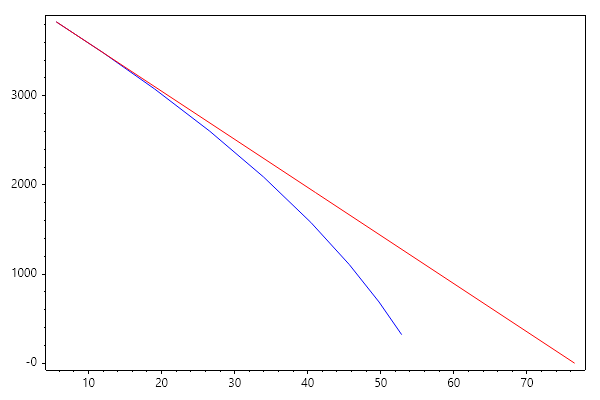
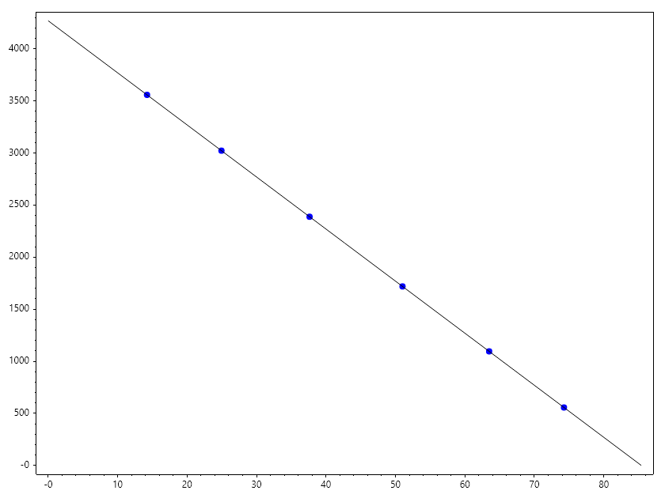

Gas Reservoir Material Balance
==============================

**Definition:**
The Gas Material Balance equation (GMBE) is based on the principle of
conservation of mass. For a volumetric gas reservoir (no water drive),
the relationship between reservoir pressure and cumulative production
is linear when expressed as :math:`p/z` vs. :math:`G_p`.

The p/z Equation
~~~~~~~~~~~~~~~~
For a volumetric reservoir, the relationship is defined as:

.. math::

   \frac{p}{z} = \frac{p_i}{z_i} \left( 1 - \frac{G_p}{G} \right)

Where:

- :math:`p` = current average reservoir pressure (psia)

- :math:`z` = gas deviation factor at pressure :math:`p`

- :math:`p_i, z_i` = initial reservoir pressure and gas deviation factor

- :math:`G_p` = cumulative gas production (Bscf)

- :math:`G` = Original Gas-In-Place (OGIP) (Bscf)

**Numerical Example:**

Given:

- :math:`p_i = 4000 \, \text{psia}, z_i = 0.91`

- :math:`G = 100 \, \text{Bscf}`

- Current :math:`G_p = 20 \, \text{Bscf}`

- Current :math:`z = 0.88`

.. math::

   \frac{p}{0.88} = \frac{4000}{0.91} \left( 1 - \frac{20}{100} \right) \
   \frac{p}{0.88} = 4395.6 \cdot 0.8 = 3516.5 \
   p = 3516.5 \cdot 0.88 = 3094.5 , \text{psia}

.. code-block:: csharp

   double G = 100; // Bscf (OGIP)
   double Gp = 20; // Bscf (Produced)
   double pi = 4000; // psia
   double zi = 0.91;
   double z_current = 0.88;
   double p_over_z = (pi / zi) * (1 - (Gp / G));
   double p_current = p_over_z * z_current;
   Console.WriteLine($"Current Reservoir Pressure (p) = {p_current:F2} psia");

Ouput

.. terminal::

   Current Reservoir Pressure (p) = 3094.51 psia

Material Balance with Water Drive
~~~~~~~~~~~~~~~~~~~~~~~~~~~~~~~~~
If an active aquifer is present, water influx (:math:`W_e`) maintains reservoir
pressure, causing the :math:`p/z` plot to deviate from a straight line.

**General Equation:**

.. math::

   G_p B_g + W_p B_w = G(B_g - B_{gi}) + W_e + B_{gi} \frac{c_w W + c_f V_p}{1 - S_{wi}} \Delta p

**Numerical Example (Solving for OGIP with Water Influx):**

.. code-block:: csharp

   double Gp = 15.0; // Bscf
   double Bg = 0.00085; // res ft3/scf (Current)
   double Bgi = 0.00072; // res ft3/scf (Initial)
   double We = 2.5e6; // res ft3 (Water influx)
   // G = (Gp * Bg - We) / (Bg - Bgi)
   double G_scf = (Gp * 1e9 * Bg - We) / (Bg - Bgi);
   double G_Bscf = G_scf / 1e9;
   Console.WriteLine($"Calculated OGIP (G) = {G_Bscf:F2} Bscf");

Ouput

.. terminal::

   Calculated OGIP (G) = 78.85 Bscf

Drive Mechanisms and p/z Signatures
~~~~~~~~~~~~~~~~~~~~~~~~~~~~~~~~~~~
The shape of the :math:`p/z` curve is a diagnostic tool for identifying reservoir behavior:

.. list-table:: 
   :header-rows: 1

   * - Curve Shape
     - Drive Mechanism
     - Interpretation
   * - **Straight Line**
     - Volumetric
     - No water influx; depletion drive only.
   * - **Concave Up**
     - Water Drive
     - Aquifer is providing pressure support.
   * - **Concave Down**
     - Geopressured
     - Rock/water expansion significant at high :math:`P`.

Advanced Problem
~~~~~~~~~~~~~~~~
Given the following data

.. code-block:: csharp

   double gas_g = 0.8;
   double res_T = 550; // Rankine
   ColVec P = new double[] { 300, 600, 900, 1200, 1500, 1800, 2100, 2400, 2700 }; // psia
   ColVec G = new double[] { 52.86, 49.76, 45.69, 40.43, 33.95, 26.60, 19.05, 11.94, 5.58 };

- 1. Use Sutton correlation to compute, PseudoCritical Temperature and Pressure

- 2. Implement a function to compute Z factor based on Hall and Yaborough or Dranchuk Abou Kassem

- 3. Compute p/z

- 4. Determine of it is linear. 

- 5. Classify the drive mechanism

.. code-block:: csharp

   double gas_g = 0.8;
   double res_T = 550; // Rankine
   ColVec P = new double[] { 300, 600, 900, 1200, 1500, 1800, 2100, 2400, 2700 }; // psia
   ColVec G = new double[] { 52.86, 49.76, 45.69, 40.43, 33.95, 26.60, 19.05, 11.94, 5.58 };

   // Z factor application
   static double ZfactorHY(double Pr, double Tr)
   {
       double z = 1, t, tm1, tm1e2, A, B,
           C, D, r, y2, y3, y4, Den;
       if (Pr != 0)
       {
           t = 1 / Tr;
           tm1 = 1 - t; tm1e2 = tm1 * tm1;
           A = 0.06125 * t * Exp(-1.2 * Pow(1 - t, 2));
           B = t * (14.76 - t * (9.76 - t * 4.58));
           C = t * (90.7 - t * (242.2 - t * 42.4));
           D = 2.18 + 2.82 * t; r = A * Pr;
           var yfunc = new Func<double, double>(y =>
           {
               y2 = y * y; y3 = y2 * y; y4 = y3 * y;
               Den = Pow(1 - y, 3);
               return -A * Pr + (y + y2 + y3 - y4) / Den -
               B * y2 + C * Pow(y, D);
           });
           r *= Pr < 5 ? 2 : 1;
           r /= Pr > 13 ? 2 : 1;
           double y = Fsolve(yfunc, r);
           z = A * Pr / y;
       }
       return z;
   }

   double s = gas_g;
   // Sutton's Correlation for Tpc
   double T_pc = 169.2 + 349.5 * s - 74.0 * Pow(s, 2);

   // Sutton's Correlation for ppc
   double P_pc = 756.8 - 131.0 * s - 3.6 * Pow(s, 2);

   double T = res_T, Tr = T/T_pc;
   ColVec Z = Arrayfun(p => ZfactorHY(p/P_pc, Tr), P);
   ColVec PZ = P.Div(Z);
   double m = (PZ[^2] - PZ[^1])/(G[^2] - G[^1]);
   ColVec Pl = new double[] { PZ[^1], 0 }, Gl = new double[] { G[^1], G[^1] -PZ[^1]/m };

   Plot(G, PZ, "b"); HoldOn();
   Plot(Gl, Pl, "r"); HoldOff();
   SaveAs("Gas_Reservoir_MB.png");

// 

Exercise
~~~~~~~~
Given the production history of Gas Reservoir below

.. code-block:: csharp

   double[] P = [2500, 2100, 1700, 1300, 900, 500];
   double[] G = [14.2314, 24.9498, 37.6355, 51.0163, 63.4889, 74.2625];
   double[] Z = [0.7027, 0.6949, 0.7120, 0.7564, 0.8219, 0.8988];

   double[] PZ = [.. P.Zip(Z, (p, z) => p/z)];

   var p = Polyfit(G, PZ, 1);
   double GIIP = -p[1]/p[0];
   Scatter(G, PZ, "fob"); HoldOn();
   Plot([0, GIIP], [p[1], 0], "k"); HoldOff();
   SaveAs("Gas_Reserve_Exercise.png");

1. Determine the type of the reservoir
2. Estimate the Initial Gas In-place

