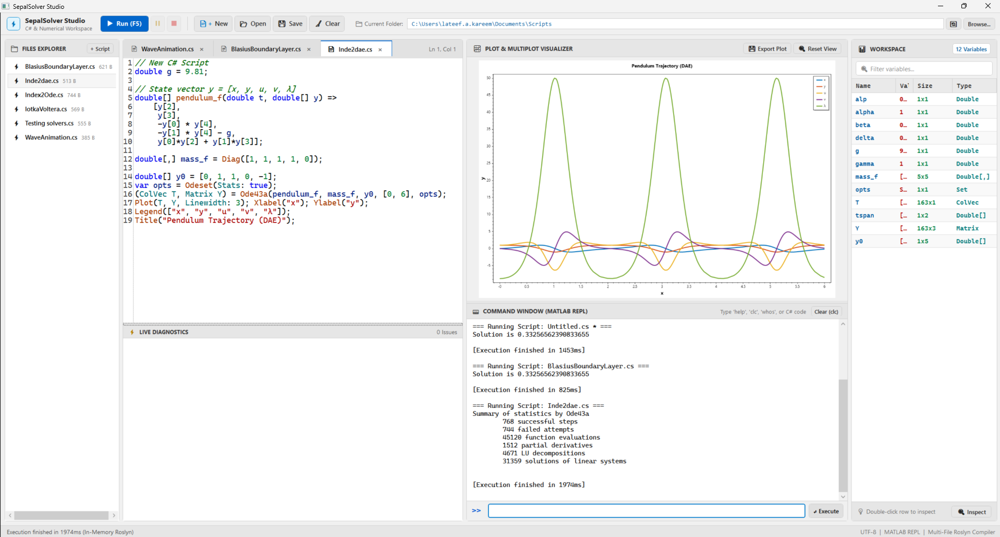

Getting Started with SepalSolver Studio
#######################################

**SepalSolver Studio** is an interactive, technical computing environment designed specifically for engineering, scientific computing, and numerical simulation in C#. While traditional numerical analysis in .NET often requires creating standalone console applications, compiling projects, and configuring package references, SepalSolver Studio provides an immediate, unified workspace—combining the responsiveness and rapid prototyping of MATLAB or RStudio with the raw computational speed and type-safety of modern C#.

.. contents:: Table of Contents
   :local:
   :depth: 2

1. Overview & Philosophy
************************

Scientific computing is inherently exploratory: engineers and researchers formulate hypotheses, execute calculations, visualize responses, and iteratively refine algorithms. In languages like MATLAB and Python, this workflow is facilitated through read-eval-print loops (REPLs) and dedicated IDEs.

SepalSolver Studio brings this same intuitive paradigm to C# and .NET. Key advantages include:

- **Zero-Boilerplate Scripting:** Write mathematical expressions, declare variables, and call high-performance solvers without wrapping your code in namespaces, classes, or static ``Main`` methods.
- **Immediate Interactive Feedback:** Execute one-line commands or multi-line algorithms and observe outputs instantly in the Command Window.
- **Integrated High-Performance Plotting:** Generate publication-ready 2D and multi-panel engineering plots directly within the workspace.
- **Rich Variable Inspection:** Monitor variables, vectors, and matrices in real time, with interactive spreadsheet-style grid viewers.

2. User Interface & Workspace Tour
**********************************

SepalSolver Studio features a clean, responsive four-panel layout arranged to support an efficient engineering workflow:

.. list-table::
   :widths: 20 25 55
   :header-rows: 1

   * - Panel
     - Location
     - Purpose
   * - **Files Explorer**
     - Left Column
     - Browse the active working directory, open, run, rename, and manage C# numerical scripts (``.cs``), data files, and images.
   * - **Code Editor**
     - Center-Left Column
     - Multi-tab C# script editor with syntax highlighting, line numbering, find-and-replace, and live Roslyn compiler diagnostics.
   * - **Plot Visualizer**
     - Center-Right (Top)
     - Interactive 2D technical plotting canvas powered by ScottPlot, featuring zoom, pan, view reset, and figure export.
   * - **Command Window**
     - Center-Right (Bottom)
     - Interactive REPL prompt (``>>``) for instant expression evaluation, solver execution, and quick experimentation.
   * - **Workspace Inspector**
     - Right Column
     - Live catalog of all variables currently resident in memory, displaying variable names, data types, array dimensions, and value previews.

Files Explorer (Current Folder)
~~~~~~~~~~~~~~~~~~~~~~~~~~~~~~~
The left pane serves as your project navigation hub. It displays all files located in the active directory path shown in the top toolbar.

- **+ Script Button:** Quickly generates a new, numbered C# script in the active folder.
- **Context Menu:** Right-click any file to open it in the editor, run it immediately, rename, delete, or reveal it in Windows Explorer.
- **Path Bar:** Click **Browse...** to change your working directory or type a path directly into the bar.

Multi-Tab Code Editor
~~~~~~~~~~~~~~~~~~~~~
The code editor supports working with multiple scripts simultaneously across tabs. It includes:

- **Visual Studio / Antigravity Syntax Highlighting:** Clear color coding for keywords, types, methods, numbers, strings, and comments.
- **Live Diagnostics Panel:** A bottom status bar that monitors syntax and compilation issues in real time, displaying error codes, line numbers, and descriptive explanations before you execute your code.
- **Find and Replace (Ctrl+F / Ctrl+H):** A floating search tool with case-matching and incremental navigation.

Plot & Multiplot Visualizer
~~~~~~~~~~~~~~~~~~~~~~~~~~~
Scientific plots generated via SepalSolver's plotting API automatically render in this panel.

- **Interactive Navigation:** Click and drag with the left mouse button to pan across curves; right-click and drag or use the scroll wheel to zoom smoothly.
- **Reset View:** Returns the axis limits to automatically fit all plotted curves and data.
- **Export Plot:** Saves the rendered graphic as a high-resolution PNG image directly to disk.

Interactive Command Window (REPL)
~~~~~~~~~~~~~~~~~~~~~~~~~~~~~~~~~
Located directly below the plot visualizer, the Command Window provides a direct ``>>`` prompt for rapid calculations and testing:

- Press **Enter** on the input line to evaluate commands immediately.
- Use the **Up** and **Down** arrow keys to cycle through previously executed commands.
- View execution time benchmarks and formatted numerical results.

Workspace Variable Inspector
~~~~~~~~~~~~~~~~~~~~~~~~~~~~
The right-hand panel keeps track of every variable currently resident in memory:

- Shows variable names, C# types (e.g. ``double``, ``ColVec``, ``Matrix``), shapes/dimensions (e.g., ``[5 x 5]``), and summary values.
- **Double-Click Inspection:** Double-clicking any vector, matrix, or array opens the **Variable Viewer Dialog**, displaying the numerical data in a tabular, spreadsheet-like grid with row and column indices.

3. Interactive Computing in the Command Window
**********************************************

The Command Window allows you to interact with SepalSolver just like a scientific calculator or MATLAB console.

Basic Calculations
~~~~~~~~~~~~~~~~~~
You can evaluate arithmetic expressions, define variables, and perform array operations directly at the ``>>`` prompt:

.. code-block:: csharp

   >> 2.5 * Sin(pi / 4) + Sqrt(16)
   ans = 5.767766952966369

   >> double[] x = [1.0, 2.0, 3.0, 4.0, 5.0];
   >> double sum = Sum(x);
   >> Console.WriteLine($"Sum = {sum}");

Output

.. terminal::

   Sum = 15

Built-in Environment Commands
~~~~~~~~~~~~~~~~~~~~~~~~~~~~~
SepalSolver Studio includes familiar built-in management commands:

.. list-table::
   :widths: 20 80
   :header-rows: 1

   * - Command
     - Description
   * - ``clc``
     - Clears all text and output from the Command Window.
   * - ``clear``
     - Clears all variables from the Workspace memory.
   * - ``whos``
     - Prints a formatted table of all active variables, types, and dimensions.
   * - ``help``
     - Displays quick reference documentation and command summaries.
   * - ``pwd``
     - Prints the current working directory path.
   * - ``dir`` / ``ls``
     - Lists all files and subdirectories in the current working folder.
   * - ``cd <path>``
     - Changes the active working directory.

Example: Using whos
~~~~~~~~~~~~~~~~~~~
After defining several matrices and vectors, entering ``whos`` displays your active workspace:

.. code-block:: csharp

   >> Matrix A = Eye(3);
   >> ColVec b = [1.0, 2.0, 3.0];
   >> whos

Output

.. terminal::

   Variables in Workspace:
     Name         Type          Size         Value
     -----------------------------------------------------
     A            Matrix        3 x 3        [1, 0, 0; 0, 1, 0; 0, 0, 1]
     b            ColVec        3 x 1        [1; 2; 3]
     x            Double[]      5 x 1        [1, 2, 3, 4, 5]
     sum          Double        1 x 1        15

4. Writing and Executing Scripts
********************************

For multi-step numerical algorithms, scripts allow you to organize code, save procedures, and rerun calculations with different parameters.

Creating and Saving Scripts
~~~~~~~~~~~~~~~~~~~~~~~~~~~
1. Click **+ Script** in the Files Explorer, or press **Ctrl+N** on your keyboard.
2. A new tab opens in the Code Editor named ``Untitled1.cs``.
3. Write your numerical algorithm.
4. Press **Ctrl+S** to save the file with a descriptive name (e.g., ``DampedOscillator.cs``).

Execution Controls
~~~~~~~~~~~~~~~~~~
- **Run (F5):** Compiles and runs the currently active script tab.
- **Pause:** Temporarily halts the execution of animated or iterative solvers.
- **Stop (Shift+F5):** Immediately terminates the running script.
- **Clear (Ctrl+L):** Clears the plot canvas and resets the console output.

Keyboard Shortcuts Reference
~~~~~~~~~~~~~~~~~~~~~~~~~~~~
.. list-table::
   :widths: 25 75
   :header-rows: 1

   * - Shortcut
     - Action
   * - **F5**
     - Run the active script
   * - **Shift + F5**
     - Stop running script execution
   * - **Ctrl + N**
     - Create a new script tab
   * - **Ctrl + O**
     - Open an existing script file
   * - **Ctrl + S**
     - Save the active script
   * - **Ctrl + F**
     - Open Find toolbar
   * - **Ctrl + H**
     - Open Replace toolbar
   * - **Ctrl + L**
     - Clear plot canvas and console output

5. Data Visualization & Plotting Workflow
*****************************************

SepalSolver Studio embeds real-time 2D plotting capabilities. The plotting API mirrors standard scientific plotting syntax, allowing you to create customized technical curves with minimal code.

Basic Line Plot
~~~~~~~~~~~~~~~
To generate a plot, simply prepare your independent and dependent data arrays and call ``Plot()``:

.. code-block:: csharp

   // Generate domain from 0 to 2*PI
   ColVec x = Linspace(0, 2 * pi, 200);
   ColVec y = Sin(x);

   // Render plot
   Plot(x, y, Linewidth: 2);
   Title("Sine Wave");
   Xlabel("Angle (radians)");
   Ylabel("Amplitude");
   GridOn();

Multi-Curve Plots & Legends
~~~~~~~~~~~~~~~~~~~~~~~~~~~
Multiple curves can be overlaid on the same canvas with custom colors, line widths, and legend labels:

.. code-block:: csharp

   ColVec x = Linspace(0, 10, 300);
   ColVec y1 = Exp(-0.2 * x) .* Cos(2 * x);
   ColVec y2 = Exp(-0.2 * x);
   ColVec y3 = -Exp(-0.2 * x);

   Plot(x, y1, Linewidth: 2);
   Hold(true);
   Plot(x, y2, Linestyle: "--", Linewidth: 1.5);
   Plot(x, y3, Linestyle: "--", Linewidth: 1.5);
   Legend(["Response", "Upper Envelope", "Lower Envelope"]);
   Title("Damped Harmonic Response");
   Xlabel("Time (s)");
   Ylabel("Displacement (m)");

6. Inspecting Variables and Matrices
************************************

Engineering workflows frequently involve inspecting large coefficient matrices, state vectors, and solution histories. SepalSolver Studio provides specialized tools for numerical data inspection:

1. **Workspace Grid Preview:** At a glance, observe variable names, types, dimensions, and numerical ranges.
2. **Variable Viewer Dialog:** When working with large 2D matrices (e.g., finite-difference Jacobians or stiffness matrices), double-click the variable entry in the Workspace table. An interactive data window opens, displaying:
   - Formatted scientific notation (e.g. ``1.2345e-04``).
   - Dynamic row and column coordinate headers.
   - Fast virtualized scrolling for matrices with thousands of elements.

7. Complete Hands-on Tutorial
*****************************

Let us walk through a complete, end-to-end example: finding the roots of a high-degree polynomial and visualizing both the curve and its roots in SepalSolver Studio.

Step 1: Create the Script
~~~~~~~~~~~~~~~~~~~~~~~~~
Create a new script named ``PolynomialAnalysis.cs`` in the editor and enter the following code:

.. code-block:: csharp

   // Define polynomial coefficients: f(x) = x^4 - 3x^3 - x^2 + 3x
   double[] p = [1.0, -3.0, -1.0, 3.0, 0.0];

   // 1. Calculate polynomial roots
   Complex[] roots = Roots(p);
   Console.WriteLine("Computed Roots of Polynomial:");
   for (int i = 0; i < roots.Length; i++)
   {
       Console.WriteLine($"  Root {i + 1}: {roots[i].Real:F4}");
   }

   // 2. Evaluate polynomial over a smooth domain
   ColVec x = Linspace(-1.5, 3.5, 400);
   ColVec y = Polyval(p, x);

   // 3. Visualize curve and highlight zero-axis
   Plot(x, y, Linewidth: 2);
   Hold(true);
   Plot(x, Zeros(x.Length), Linestyle: ":", Linewidth: 1);
   Title("Polynomial Function f(x) = x^4 - 3x^3 - x^2 + 3x");
   Xlabel("x");
   Ylabel("f(x)");
   Grid(true);

Step 2: Run the Script
~~~~~~~~~~~~~~~~~~~~~~
Press **F5** (or click the blue **Run** button on the top toolbar).

Step 3: Observe the Results
~~~~~~~~~~~~~~~~~~~~~~~~~~~
1. **In the Command Window:** The console displays the computed real roots:

Output

.. terminal::

   Computed Roots of Polynomial:
     Root 1: 3.0000
     Root 2: 1.0000
     Root 3: -1.0000
     Root 4: 0.0000

2. **In the Plot Visualizer:** A high-resolution graphic appears showing the quartic curve with its characteristic local extrema, clearly crossing the zero-axis at :math:`x = -1, 0, 1, 3`.
3. **In the Workspace Panel:** The variables ``p``, ``roots``, ``x``, and ``y`` appear in the catalog, ready for further interactive querying or spreadsheet inspection.

Congratulations! You are now equipped to navigate SepalSolver Studio and utilize its interactive tools to explore the numerical methods covered throughout this book.
