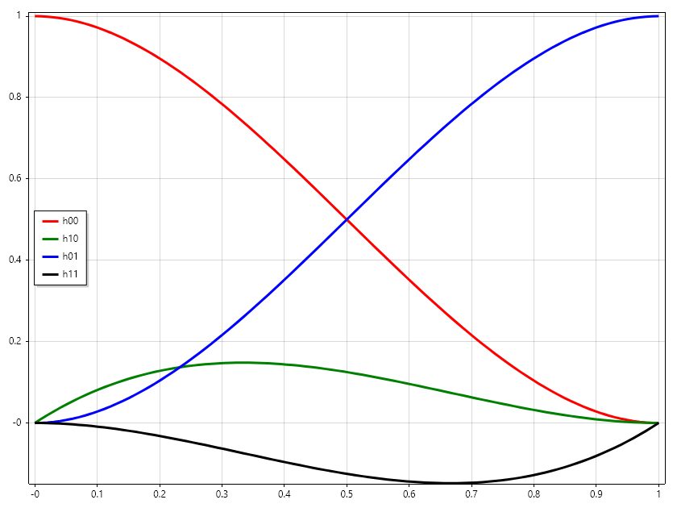
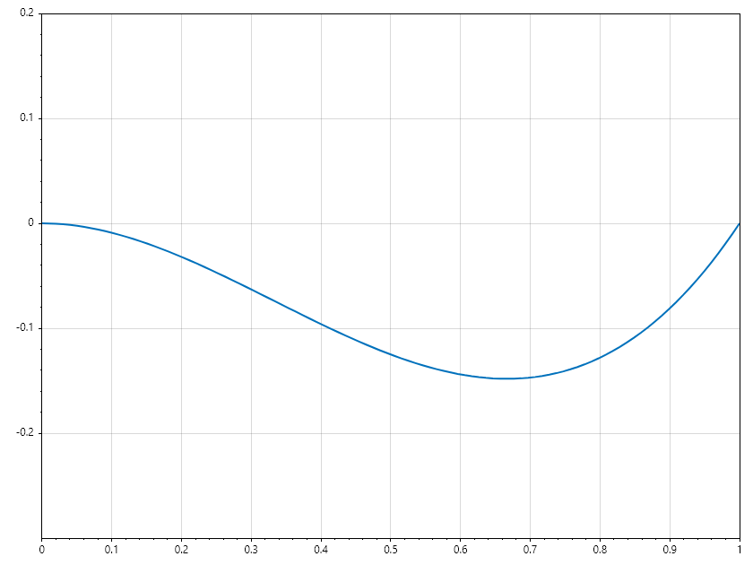

Hemite Spline
=============

Hermite Interpolation
---------------------

Hermite Interpolation is a method of interpolating data points that accounts for not only the values of the function but also the values of its derivatives. While standard linear or polynomial interpolation only ensures the curve passes through the points :math:`(x_i, y_i)`. Hermite interpolation ensures the curve matches the "slope"(tangent) at those points as well. This results in a much smoother and more physically realistic transition between points, particularly in motion planning or structural deflection models where velocity or tangency must be continuous. 

1. The Cubic Hermite Spline
~~~~~~~~~~~~~~~~~~~~~~~~~~~
The most common form is the Cubic Hermite Spline. For a single interval between :math:`x_0` and :math:`x_1`
the interpolant is a third-degree polynomial.To construct it, we need four pieces of information: 
* The starting and ending values: :math:`y_0` and :math:`y_1` 
* The starting and ending derivatives (slopes): :math:`y'_0` and :math:`y'_1` 

The resulting curve is expressed using Hermite Basis Functions, which act as weights for the coordinates and the slopes.

.. code-block:: csharp

   ColVec t = Linspace(0, 1), t2 = t.Pow(2), t3 = t.Pow(3);
   ColVec h00 = 2 * t3 - 3 * t2 + 1, h10 = t3 - 2 * t2 + t,
          h01 = -2 * t3 + 3 * t2, h11 = t3 - t2;

   Plot(t, h00, "r", 3); hold = true;
   Plot(t, h10, "g", 3);
   Plot(t, h01, "b", 3);
   Plot(t, h11, "k", 3); hold = false;
   Legend(["h00", "h10", "h01", "h11"], MiddleLeft);
   SaveAs("hermite_modes.png");

2. Implementation in SepalSolver
~~~~~~~~~~~~~~~~~~~~~~~~~~~~~~~~
In SepalSolver, Hermite interpolation is often used when the user provides a "slope vector" alongside their dataset. This is common in trajectory generation where you know where a robot should be and how fast it should be moving at that specific moment. 

.. code-block:: csharp

   double[] x = [0.0, 1.0]; 
   double[] y = [0.0, 10.0];
   double[] dy = [0.0, 0.0]; // Zero velocity at start and end
   
   // Estimate value at x = 0.5
   double xq = 0.5;

   // Manually implementing Hermite interpolation
   double x0 = x[0], x1 = x[1], y0 = y[0], y1 = y[1], m0 = dy[0], m1 = dy[1];
   double dx = x1 - x0, t = (xq - x0) / dx, t2 = t * t, t3 = t2 * t;
   double h00 = 2 * t3 - 3 * t2 + 1, 
          h10 = t3 - 2 * t2 + t,
          h01 = -2 * t3 + 3 * t2, 
          h11 = t3 - t2;
   double result = h00 * y0 + h10 * dx * m0 + h01 * y1 + h11 * dx * m1;
   
   // Because slopes are 0, this creates an S-curve rather than a straight line
   Console.WriteLine($"Smooth transition value: {result}"); 

Ouput

.. terminal::

   Smooth transition value: 5

Examples
--------

.. Admonition:: Example 1 :  Compare Linear and Hermite interpolation for sparsely compited sin(x)

   If sin(x) is give at 7 points between :math:`0` and :math:`\pi`. Interpolate for sin(x) for 100 points between :math:`0` and :math:`\pi` using linear and hermite spline and compare the plots.
   
   .. code-block:: csharp
   
      // Using linear interpolation
      ColVec x = Linspace(0, 2*pi, 7), s = Sin(x);
      ColVec xq = Linspace(0, 2*pi), sq = Interp1(x, s, xq);
      Scatter(x, s, "fob", 10); hold = true;
      Plot(xq, sq, "g");
               
      // using hermite interpolation
      int j = 1;
      ColVec c = Cos(x);
      
      ColVec sh = Zeros(xq.Numel);
      for (int i = 0; i < xq.Numel; i++)
      {
          while (xq[i] > x[j]) j++;
   
          double x0 = x[j-1], x1 = x[j], y0 = s[j-1], y1 = s[j], m0 = c[j-1], m1 = c[j];
          double dx = x1 - x0, t = (xq[i] - x0) / dx, t2 = t * t, t3 = t2 * t;
   
          double h00 = 2 * t3 - 3 * t2 + 1, 
                 h10 = t3 - 2 * t2 + t,
                 h01 = -2 * t3 + 3 * t2, 
                 h11 = t3 - t2;
          sh[i] = h00 * y0 + h10 * dx * m0 + h01 * y1 + h11 * dx * m1;
      }
      Plot(xq, sh, "r", 3);
      Plot(xq, Sin(xq), "--k", 2); hold = false;
      SaveAs("hermite_vs_linear.png");
   
   
   .. figure:: images/hermite_vs_linear.png
      :align: center
      :alt: hermite_vs_linear.png
   
   

.. Admonition:: Example 2 : 

   If a robot moves from point A to point B, a linear path causes an abrupt change in velocity at the corners. By using Hermite interpolation and specifying the desired entry/exit velocity vectors, we create a path that the robot can follow without stopping or jerking. 
   
   
   .. code-block:: csharp
   
      double[] t = [0, 5, 10];    // Time
      double[] pos = [0, 20, 50]; // Position
      double[] vel = [0, 10, 0];  // Specific velocities at those times
   

Key Difference: Hermite vs. Cubic Spline
~~~~~~~~~~~~~~~~~~~~~~~~~~~~~~~~~~~~~~~~

.. list-table:: 
   :header-rows: 1

   * - Feature
     - Hermite Interpolation
     - Cubic Spline
   * - **Input Requirements**
     - Requires :math:`y` and :math:`y'` (slopes)
     - Requires only :math:`y`
   * - **Local Control**
     - Changing one slope only affects the two adjacent segments
     - Changing one point can affect the entire curve
   * - **Complexity**
     - Mathematically simpler (local calculation)
     - Requires solving a system of equations (global)
     - 

Exercise: Animation of Slope Impact
~~~~~~~~~~~~~~~~~~~~~~~~~~~~~~~~~~~
**Task**: Observe how changing the slope :math:`dy` at the first point affects the plot of the function. 

.. code-block:: csharp

   //define hemitespline function
   double[] HermiteFun(double[] x, double[] y, double[] dy, double[] xq)
   {
       double[] yq = new double[xq.Length];
       int j = 1;
       for (int i = 0; i < xq.Length; i++)
       {
           while (xq[i] > x[j]) j++;

           double x0 = x[j-1], x1 = x[j], y0 = y[j-1], y1 = y[j], m0 = dy[j-1], m1 = dy[j];
           double dx = x1 - x0, t = (xq[i] - x0) / dx, t2 = t * t, t3 = t2 * t;

           double h00 = 2 * t3 - 3 * t2 + 1,
                  h10 = t3 - 2 * t2 + t,
                  h01 = -2 * t3 + 3 * t2,
                  h11 = t3 - t2;
           yq[i] = h00 * y0 + h10 * dx * m0 + h01 * y1 + h11 * dx * m1;
       }
       return yq;
   }

   // define x and y
   double[] x = [0, 1];
   double[] y = [0, 0];

   // start with this slope
   double[] dy = [-1, 1];

   // define querry points
   double[] xq = Linspace(0, 1);
   double[] yq = HermiteFun(x, y, dy, xq);

   // plot the result.
   var plt = Plot(xq, yq, Linewidth: 2);
   Axis([0, 1, -0.3, 0.2]);

   // set up animation function
   byte[] animfun(int i)
   {
       dy[0] = Sin(pi + i * 0.02*pi);           // increase the starting slope
       plt.Ydata = HermiteFun(x, y, dy, xq);    // update interpolated values
       return GetFrame();                       //  return the frame
   }

   // Animate the plot
   AnimationMaker(animfun, "Impact_of_changing_slope_at_x_0.gif", 30, 100);

</example 4>

.. Admonition:: Example 5 :  Using Hermite Spline as Sin Approximator

   Lets use table of Sine and Cosine at 15 degrees interval given in table
   
   .. list-table:: 
      :header-rows: 1
   
      * - Angle (°)
        - Sine (:math:`\sin`)
        - Cosine (:math:`\cos`)
      * - 0°
        - :math:`0`
        - :math:`1`
      * - 15°
        - :math:`\cfrac{\sqrt{6} - \sqrt{2}}{4}`
        - :math:`\cfrac{\sqrt{6} + \sqrt{2}}{4}`
      * - 30°
        - :math:`\cfrac{1}{2}`
        - :math:`\cfrac{\sqrt{3}}{2}`
      * - 45°
        - :math:`\cfrac{\sqrt{2}}{2}`
        - :math:`\cfrac{\sqrt{2}}{2}`
      * - 60°
        - :math:`\cfrac{\sqrt{3}}{2}`
        - :math:`\cfrac{1}{2}`
      * - 75°
        - :math:`\cfrac{\sqrt{6} + \sqrt{2}}{4}`
        - :math:`\cfrac{\sqrt{6} - \sqrt{2}}{4}`
      * - 90°
        - :math:`1`
        - :math:`0`
   
   
   .. code-block:: csharp
   
      // compute square roots of 2 and 3;
      double sqrt2 = Sqrt(2), sqrt3 = Sqrt(3);
   
      // define arrays of angle, sine and cosines
      double[] Sines = [0, sqrt2*(sqrt3-1)/4, 0.5, sqrt2/2, sqrt3/2, sqrt2*(sqrt3+1)/4, 1];
      double[] Cosines = [1, sqrt2*(sqrt3+1)/4, sqrt3/2, sqrt2/2, 0.5, sqrt2*(sqrt3-1)/4, 0];
   
      double SineByHermite(double a)
      {
          double da = 15;
          int i = (int)(a/da);
          double t = (a - i*da)/da;
          if (t == 0)
              return Sines[i];
          else
          {
             
              double t2 = t * t, t3 = t2 * t, dx = da*pi/180;
              double y0 = Sines[i], y1 = Sines[i+1], m0 = Cosines[i], m1 = Cosines[i+1];
              double h00 = 2 * t3 - 3 * t2 + 1,  h10 = t3 - 2 * t2 + t,
                     h01 = -2 * t3 + 3 * t2,  h11 = t3 - t2;
              return h00 * y0 + h10 * dx * m0 + h01 * y1 + h11 * dx * m1;
          }
      }
   
      double[] x = [.. Rand(20).Select(a => 80*a+10)];
      Console.WriteLine("""
            Angle  |  Sineapprox  |    Sine
          ---------+--------------+-------------
          """);
      foreach (double a in x)
          Console.WriteLine($"""
                {a:F2}  |   {SineByHermite(a):F6}   |  {Sin(a*pi/180):F6}
              """);
   
   
   Ouput
   
   .. terminal::
   
        Angle  |  Sineapprox  |    Sine
      ---------+--------------+-------------
        27.97  |   0.468987   |  0.468988
        65.90  |   0.912810   |  0.912820
        69.80  |   0.938509   |  0.938518
        71.87  |   0.950371   |  0.950376
        29.56  |   0.493290   |  0.493290
        76.76  |   0.973402   |  0.973404
        71.50  |   0.948301   |  0.948307
        60.02  |   0.866175   |  0.866175
        50.60  |   0.772688   |  0.772696
        53.65  |   0.805436   |  0.805445
        53.73  |   0.806202   |  0.806212
        64.43  |   0.902061   |  0.902069
        84.28  |   0.995007   |  0.995018
        72.78  |   0.955179   |  0.955182
        10.22  |   0.177413   |  0.177414
        46.00  |   0.719297   |  0.719298
        40.87  |   0.654379   |  0.654384
        26.38  |   0.444338   |  0.444341
        50.27  |   0.769025   |  0.769033
        80.79  |   0.987110   |  0.987121
