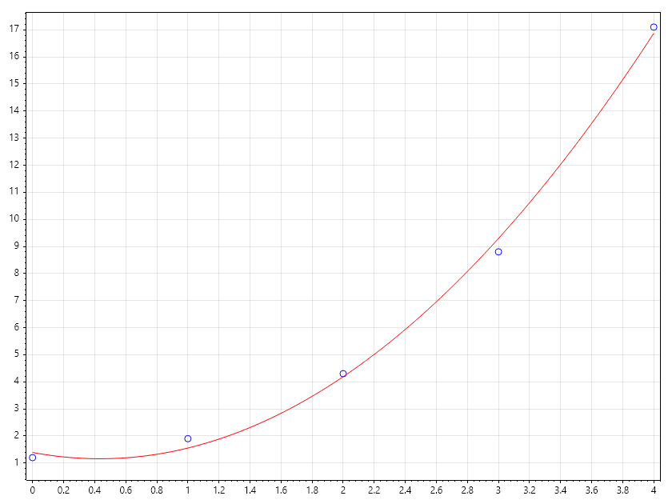

Interpolation by Polynomial
===========================

Interpolation via Polynomial Fitting
------------------------------------
While standard interpolation (like linear or Hermite) forces a curve to pass through every single data point, Polynomial Fit Interpolation uses a global model to approximate the data. This is particularly useful when you have many data points that might contain noise, or when you want a single mathematical expression to describe the entire dataset.

1. The Strategy
~~~~~~~~~~~~~~~
- Modeling: Use Polyfit to find the coefficients of a polynomial of degree :math:N that best represents the data.
- Estimation: Use Evaluate to calculate the value of that polynomial at any arbitrary point :math:`x`.

2. Global vs. Local Interpolation
~~~~~~~~~~~~~~~~~~~~~~~~~~~~~~~~~

.. code-block:: csharp

   // Measured data points
   double[] X = [0.0, 1.0, 2.0, 3.0, 4.0], Y = [1.2, 1.9, 4.3, 8.8, 17.1];

   // Stage 1: Fit a quadratic (N=2) to create the model
   double[] model = Polyfit(X, Y, 2);

   // Stage 2: Interpolate at a point between 2.0 and 3.0
   double[] x = Linspace(0, 4);
   double evaluator(double x) => Polyval(model, x);
   double[] estimate = [.. x.Select(evaluator)];

   Scatter(X, Y, "fob"); hold = true;
   Plot(x, estimate, "r");
   SaveAs("Polynomial_Interpolation_Ex1.png");

Examples
--------

.. Admonition:: Example 1 :  Signal Denoising and Prediction

   In sensor applications, individual readings often jump due to electronic noise.By fitting a low-degree polynomial to a window of data, you "smooth out" the noise.You can then interpolate to find values at high-frequency time steps that the sensor didn't actually record.
   
   
   .. code-block:: csharp
   
      double[] time = [0.1, 0.2, 0.3, 0.4, 0.5], volts = [1.02, 1.05, 1.01, 1.08, 1.04];
      // Fit a line (N=1) to find the steady trend
      double[] trend = Polyfit(time, volts, 1);
   
      // Interpolate at a point in the middle
      double midVoltage = Polyval(trend, 0.25);
   
   

.. Admonition:: Example 2 :  Structural Deformation Mapping

   If you measure the deflection of a beam at 5 specific locations, a polynomial fit of degree 3 or 4 can describe the continuous "shape" of the beam.You can then use this model to interpolate the deflection at any other point along the beam's length.
   
   .. code-block:: csharp
   
   
      double[] x = Linspace(0,10, 5), y = [0, 0, 0, -0.05, -0.02];
      ColVec xc = x, yc = y;
      double[] coeffs = Polyfit(x, y, 3); //degree2
      ColVec xq = Linspace(0, 10);
      ColVec yq = Arrayfun(x => Polyval(coeffs, x), xq);
      Scatter(xc, yc, "for", 20); hold = true;
      Plot(xq, yq, "b"); hold  = false;
      SaveAs("Polynomial_Interpolation_Ex3.png");
   
   
   .. figure:: images/Polynomial_Interpolation_Ex3.png
      :align: center
      :alt: Polynomial_Interpolation_Ex3.png
   

Exercise: Choosing the Degree
~~~~~~~~~~~~~~~~~~~~~~~~~~~~~
Task: Determine which degree :math:N is most appropriate for the data and evaluate.

.. code-block:: csharp

   double[] x = [1, 2, 3, 4, 5, 6], y = [2.1, 4.2, 5.9, 8.1, 10.3, 11.9];
   Looks like y = 2x//
   Task: Fit a linear model and interpolate at x = 3.5
   int degree = ____;
   double[] p = Polyfit(x, y, degree);

   double result = Polyval(p, 3.5);

   // Expected: Roughly 7.0
   Console.WriteLine($"Result at 3.5: :math:`{result}`");

