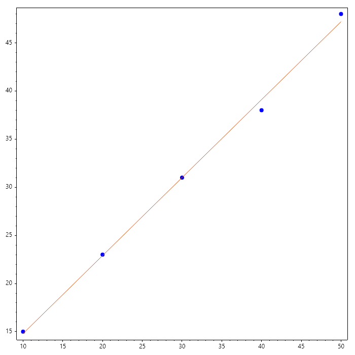

Solution of Linear Systems
==========================

Solving a system of linear equations is the most fundamental task in
computational science. The goal is to find the vector :math:x that
satisfies the relationship between the coefficient matrix :math:A
and the result vector :math:b.

1. Direct Methods
-----------------

Direct methods aim to find the exact solution (within rounding error)
in a finite number of steps.

* Gaussian Elimination: The classic method of transforming :math:A
into an upper triangular matrix using row operations.
* LU Decomposition: As discussed previously, factorizing :math:A = LU
is the standard approach for systems where :math:b changes but
:math:A remains constant.
* Cholesky Decomposition: A specialized, faster version of LU for
matrices that are symmetric and positive-definite.

.. code-block:: csharp

   // Solve linear system of equations
   Matrix A = new double[,] 
   { 
       {  1,  1,  1,  1 },
       {  2, -1,  3, -1 },
       { -1,  4, -1,  2 },
       {  3,  2,  2, -1 }
   };
   ColVec b = new double[] { 10, 5, 8, 20 };
   ColVec x = Mldivide(A, b);
   Console.WriteLine($"A = \n{A}");
   Console.WriteLine($"b = \n{b}");
   Console.WriteLine($"x = \n{x}");

Ouput

.. terminal::

   A = 
   
    1   1   1   1 
    2  -1   3  -1 
   -1   4  -1   2 
    3   2   2  -1 
   
   b = 
   
   10 
    5 
    8 
   20 
   
   x = 
   
      6.9130
      2.2174
     -1.4348
      2.3043
   
. 2. Iterative Method
---------------------
SepalSolver provides two major iterative solvers. Conjugate Gradient (`ConjGrad`) for large sparse symmetric matrices and the Generalized Minimum Residual (`GenMinRes`) for large sparse nonsymmetric matrices. 

.. Admonition:: Example 1 :  Generalized Minimum Residual 

   This eaxample shows how to use generalized minimum residutal method. Pay attention to how the Matrix was made. 
   
   .. code-block:: csharp
   
      int n = 1000;
      ColVec a = Ones(n-1), b = Ones(n), e = -a, c = 2 * e;
      ColVec d = -10 + 3 * b;
      Matrix A = Diag([e, d, c], [-1, 0, 1]);
      var (x_iter, flag, res, iter, resvec) = GenMinRes(A, b, 1e-6, 20);
      Console.WriteLine($"x = {x_iter[..10].T}...{x_iter[^10..].T}");
      Console.WriteLine($"flag = {flag}");
      Console.WriteLine($"iter = {iter}");
      Console.WriteLine($"res = {res}");
   
   
   Ouput
   
   .. terminal::
   
      x = 
        -0.1149   -0.0978   -0.1003   -0.1000   -0.1000   -0.1000   -0.1000   -0.1000   -0.1000   -0.1000
      ...
        -0.1000   -0.1000   -0.1000   -0.1000   -0.0999   -0.1002   -0.0992   -0.1027   -0.0911   -0.1298
      
      flag = 0
      iter = 9
      res = 3.6283012552149844E-07

.. Admonition:: Example 2 :  Conjugate Gradient

   This eaxample shows how to use conjugate gradient.
   
   .. code-block:: csharp
   
      int n = 1000;
      ColVec a = Ones(n-1), b = Ones(n);
      ColVec d = -5 +  b;
      Matrix A = Diag([a, d, a], [-1, 0, 1]);
      var (x_iter, flag, res, iter, resvec) = ConjGrad(A, b, 1e-6, 20);
      Console.WriteLine($"x = {x_iter[..10].T}...{x_iter[^10..].T}");
      Console.WriteLine($"flag = {flag}");
      Console.WriteLine($"iter = {iter}");
      Console.WriteLine($"res = {res}");
   
   
   Ouput
   
   .. terminal::
   
      x = 
        -0.3660   -0.4641   -0.4904   -0.4974   -0.4994   -0.5000   -0.5000   -0.5000   -0.5000   -0.5000
      ...
        -0.5000   -0.5000   -0.5000   -0.5000   -0.5000   -0.4994   -0.4974   -0.4904   -0.4641   -0.3660
      
      flag = 0
      iter = 6
      res = 8.189558921548077E-07

. 3. Overdetermined Systems (Least Squares)
-------------------------------------------
SepalSolver also perform compute least square solution when the number of rows exceed number of columns. .i.e, where there are more equations than variables being solved. Sepalsolver would compute a least square solution to the problem by transforming :math:`Ax = b` into :math:`A^TAx = A^Tb`, which now has equal number of equations and variable. 
When there are more equations than unknowns (common in data fitting), there is often no "perfect" solution. We instead find the :math:`x` that minimizes the error :math:`||Ax - b||^2`.

Consider a phenomenon in which temperature and pressure are linearly related. i.e :math:`P = mT + e`. Even though there are just 2 variables, we have 5 measurements. 

.. math::

   A = [T, 1], \quad b = T;
   
   A^TAx = A^Tb
   
   x = (A^TA)\(A^Tb)

.. code-block:: csharp

   // Data
   double[] T = [10, 20, 30, 40, 50];
   double[] P = [15, 23, 31, 38, 48];

   // Construct least square problem
   Matrix A = T.Select(t => new RowVec([t, 1])).ToList();
   ColVec b = P;

   // Compute m and e
   var x = Mldivide(A, b);
   Console.WriteLine($"m = {x[0]}, e = {x[1]}");

   Scatter(T, P, "fob"); HoldOn();
   Plot(T, A*x); HoldOff();

   SaveAs("LeastSquare-Solution.png");

Ouput

.. terminal::

   m = 0.8099999999999999, e = 6.700000000000002

3. Matrix Condition Number
--------------------------

A system is "ill-conditioned" if a tiny change in :math:b causes
a massive change in :math:x. This is measured by the Condition
Number :math:\kappa(A).

* Low :math:`\kappa`: Stable system.
* High :math:`\kappa`: Unstable; numerical solutions may be garbage.

