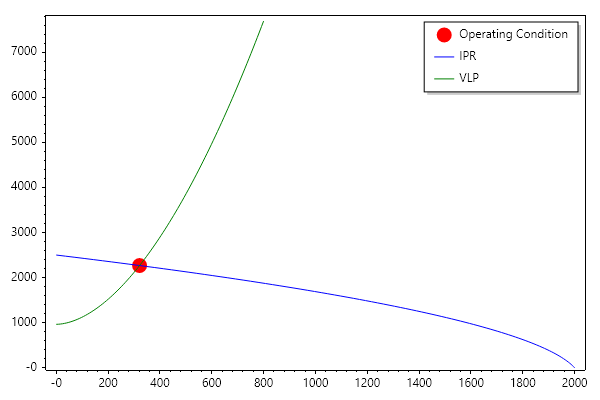
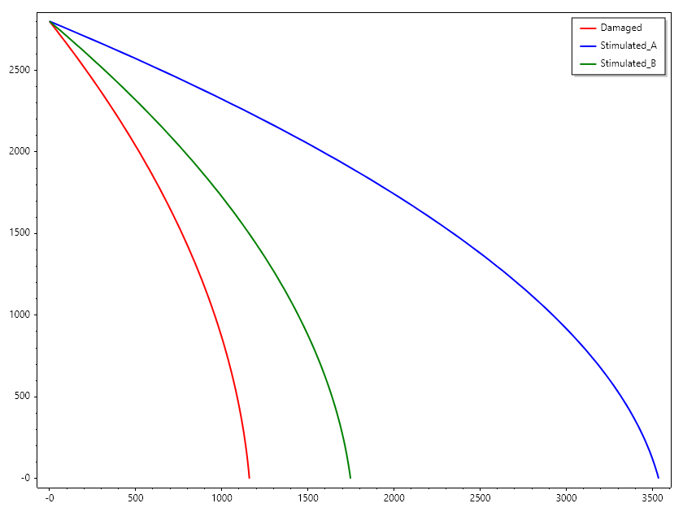
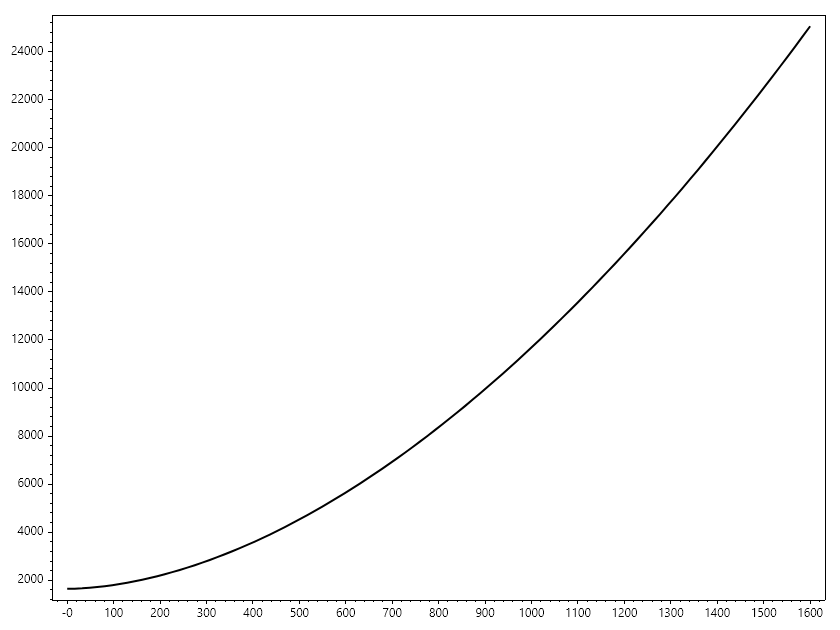

Nodal Analysis
==============

Definition:
Nodal Analysis is a method used to evaluate a complete producing system by
isolating a single point (the Node) and ensuring the pressure and flow rate
are consistent across that point. In petroleum production, the most common
node is the Bottom-hole, where the Inflow (IPR) meets the Outflow (VLP).

The Node Concept
~~~~~~~~~~~~~~~~
For any given node, two conditions must be met:

1. Flow into the node equals flow out of the node.

2. Only one pressure can exist at the node at a given flow rate.

The Node Equations:

- Inflow (Supply): :math:`p_{node} = p_r - \Delta p_{reservoir}`

- Outflow (Demand): :math:`p_{node} = p_{surf} + \Delta p_{tubing} + \Delta p_{choke}`

Determining the Operating Point
~~~~~~~~~~~~~~~~~~~~~~~~~~~~~~~
The intersection of the IPR curve and the VLP curve represents the
Operating Point. This is the only rate (:math:q_{actual}) at which the
well will naturally flow for a given set of conditions.

Numerical Example:

Consider a well with:

- Reservoir Pressure (:math:`p_r`) = 3500 psi

- Productivity Index (:math:`J`) = 1.2 STB/day/psi

- Surface Pressure (:math:`p_{surf}`) = 250 psi

- VLP is simplified as: :math:`p_{wf} = p_{surf} + 0.00002 q^{1.8}; + \rho/144`

To find the operating point, we solve for :math:`q` where :math:`p_{wf, IPR} = p_{wf, VLP}`.

.. code-block:: csharp

   //IPR Input
   double q_max = 2000; // STB/day
   double p_r = 2500; // psi
   double p_wf = 1000; // psi

   //IPR
   double qfun(double pwf) => q_max * (1 - 0.2 * (pwf / p_r) - 0.8 * Pow(pwf / p_r, 2));
   ColVec P_ipr = Linspace(0, p_r);
   ColVec Q_ipr = Arrayfun(qfun, P_ipr);

   // VLP Inputs
   double p_surf = 200; // psi (Wellhead Pressure)
   double depth = 2000; // ft
                     

   // VLP
   double pressureGradient(double z, double p, double q)
   {
       double density = 55.0; // lb/ft3 (Oil)
       double friction_grad = 0.00002 * Pow(q, 1.8); // Simplified friction term
       double hydro_grad = density / 144.0; // psi/ft
       return hydro_grad + friction_grad;
   }
   double pfun(double q_g)
   {
       var (Z, P) = Ode45((z, p) => pressureGradient(z, p, q_g), p_surf, [0, depth]);
       double p_wf = P[^1]; // extract the pressure at the bottom
       return p_wf;
   }

   ColVec Q_vlp = Linspace(0, 800);
   ColVec P_vlp = Arrayfun(pfun, Q_vlp);

   (double operating_q, double operating_p) = Intersection(Q_vlp, P_vlp, Q_ipr, P_ipr);
   // Assuming a simple bisection or search between 0 and AOF
   Scatter(operating_q, operating_p, "for", 15); HoldOn();
   Plot(Q_ipr, P_ipr, "b");
   Plot(Q_vlp, P_vlp, "g"); HoldOff();
   Legend(["Operating Condition", "IPR", "VLP"]);
   SaveAs("Nodal_Analysis.png");

Sensitivity Analysis
~~~~~~~~~~~~~~~~~~~~
Nodal analysis is most powerful when performing "What-If" scenarios. By
shifting the curves, engineers can predict the impact of changes:

.. list-table:: 
   :header-rows: 1

   * - Change
     - Curve Affected
     - Result on Operating Point
   * - Increase Reservoir Pressure
     - IPR(Shifts Up)
     - Increase in :math:`q` and :math:`p_{ wf}`.
   * - Wellbore Stimulation(Skin < 0)
     - IPR(Gets Steeper)
     - Increase in :math: q.
   * - Increase Tubing Diameter
     - VLP(Shifts Down)
     - Increase in :math:`q`, decrease in :math:`p_{ wf}`.
   * - Increase Water Cut
     - VLP(Shifts Up)
     - Decrease in :math:`q`(due to heavier fluid).
     - 

Stimulation Economics: A Nodal Analysis Case Study
~~~~~~~~~~~~~~~~~~~~~~~~~~~~~~~~~~~~~~~~~~~~~~~~~~

**Problem Statement:**
An oil company is evaluating two competing stimulation proposals to improve the
productivity of a damaged well. The well is currently performing poorly due to
a high skin factor (:math:`s = +5`). The goal is to determine which intervention
provides the best return on investment by calculating the production gain
per million USD spent.

Reservoir and Well Data

.. list-table:: 
   :header-rows: 1

   * - Parameter
     - Value
     - Unit
   * - Reservoir Pressure(:math:`p_r`)
     - 2800
     - psia
   * - Bubble Point(:math:`p_b`)
     - 3000
     - psia
   * - Current Skin Factor(:math:`s_{ current}`)
     - +5
     - dimensionless
   * - Max Flow Rate(Ideal :math:`q_{ max}`)
     - 2000
     - STB/day
   * - Reservoir Radius / Wellbore Radius(:math:`r_e/r_w`)
     - 1000
     - dimensionless
   * - Well Depth
     - 4000
     - ft
   * - Oil Density
     - 55.0
     - :math:`lb/ft^3`
   * - Surface Pressure(:math:`p_{ surf}`)
     - 200
     - psia

**Stimulation Offers:**

***Company A(Hydraulic Frac):**Reduces skin to :math:`-3`. Cost: **$10M**.
* **Company B(Acid Wash):**Reduces skin to :math:`+1`. Cost: **$5M**.

Solution
- 1. Compute IPR and Flow Efficiency
Since the reservoir pressure(:math:`p_r = 2800`) is below the bubble point(:math:`p_b = 3000`), the well follows Vogel's non-linear behavior. We first determine the Flow Efficiency (:math:`FE`) for each skin scenario.
The relationship between skin and productivity adjustment is: :math:`J_{ ratio} = \frac{\ln(r_e/r_w)}{\ln(r_e/r_w) + s}`

.. code-block:: csharp

   //IPR Input
   double q_max = 2000; // STB/day
   double p_r = 2800; // psi

   //IPR
   double qfun(double pwf) => q_max * (1 - 0.2 * (pwf / p_r) - 0.8 * Pow(pwf / p_r, 2));
   ColVec P_ipr = Linspace(0, p_r);
   ColVec Q_ipr = Arrayfun(qfun, P_ipr);

   // Adjusting for Damage and Stimulation
   double r_e_r_w = 1000;
   double FE_Damaged = Log(r_e_r_w)/(Log(r_e_r_w) + 5);
   double FE_Stimulation_A = Log(r_e_r_w)/(Log(r_e_r_w) + -3);
   double FE_Stimulation_B = Log(r_e_r_w)/(Log(r_e_r_w) + 1);
   ColVec Q_ipr_Damaged = Q_ipr * FE_Damaged;
   ColVec Q_ipr_Stimulated_A = Q_ipr * FE_Stimulation_A;
   ColVec Q_ipr_Stimulated_B = Q_ipr * FE_Stimulation_B;

   Plot(Q_ipr_Damaged, P_ipr, "r", 2); HoldOn();
   Plot(Q_ipr_Stimulated_A, P_ipr, "b", 2); 
   Plot(Q_ipr_Stimulated_B, P_ipr, "g", 2); HoldOff();
   Legend(["Damaged", "Stimulated_A", "Stimulated_B"]);
   SaveAs("IPR_Stimulation_Economics_Case_Study.png");

- 2. Compute the VLP
The Vertical Lift Performance is calculated by integrating the hydrostatic and frictional pressure drops from the surface to the bottom-hole.

.. code-block:: csharp

   // VLP Inputs
   double p_surf = 200; // psi (Wellhead Pressure)
   double depth = 4000; // ft

   // VLP
   double pressureGradient(double z, double p, double q)
   {
       double density = 52.0; // lb/ft3 (Oil)
       double friction_grad = 1e-5 * Pow(q, 1.8); // Simplified friction term
       double hydro_grad = density / 144.0; // psi/ft
       return hydro_grad + friction_grad;
   }
   double pfun(double q_o)
   {
       var (Z, P) = Ode45((z, p) => pressureGradient(z, p, q_o), p_surf, [0, depth]);
       double p_wf = P[^1]; // extract the pressure at the bottom
       return p_wf;
   }

   ColVec Q_vlp = Linspace(0, 1600);
   ColVec P_vlp = Arrayfun(pfun, Q_vlp);

   Plot(Q_vlp, P_vlp, "k", 2); 
   SaveAs("VLP_Stimulation_Economics_Case_Study.png");

- 3. Nodal Analysis and Operating Points
We find the intersection where: math:`p_{ wf, IPR} = p_{ wf, VLP}` for each case using ** SepalSolver**.

.. code-block:: csharp

   //IPR Input
   double q_max = 2000; // STB/day
   double p_r = 2800; // psi

   //IPR
   double qfun(double pwf) => q_max * (1 - 0.2 * (pwf / p_r) - 0.8 * Pow(pwf / p_r, 2));
   ColVec P_ipr = Linspace(0, p_r);
   ColVec Q_ipr = Arrayfun(qfun, P_ipr);

   // Adjusting for Damage and Stimulation
   double r_e_r_w = 1000;
   double FE_Damaged = Log(r_e_r_w)/(Log(r_e_r_w) + 5);
   double FE_Stimulation_A = Log(r_e_r_w)/(Log(r_e_r_w) + -3);
   double FE_Stimulation_B = Log(r_e_r_w)/(Log(r_e_r_w) + 1);
   ColVec Q_ipr_Damaged = Q_ipr * FE_Damaged;
   ColVec Q_ipr_Stimulated_A = Q_ipr * FE_Stimulation_A;
   ColVec Q_ipr_Stimulated_B = Q_ipr * FE_Stimulation_B;

   // VLP Inputs
   double p_surf = 200; // psi (Wellhead Pressure)
   double depth = 4000; // ft

   // VLP
   double pressureGradient(double z, double p, double q)
   {
       double density = 52.0; // lb/ft3 (Oil)
       double friction_grad = 1e-5 * Pow(q, 1.8); // Simplified friction term
       double hydro_grad = density / 144.0; // psi/ft
       return hydro_grad + friction_grad;
   }
   double pfun(double q_o)
   {
       var (Z, P) = Ode45((z, p) => pressureGradient(z, p, q_o), p_surf, [0, depth]);
       double p_wf = P[^1]; // extract the pressure at the bottom
       return p_wf;
   }

   ColVec Q_vlp = Linspace(0, 1600);
   ColVec P_vlp = Arrayfun(pfun, Q_vlp);

   var (current_q, current_p) = Intersection(Q_ipr_Damaged, P_ipr, Q_vlp, P_vlp);
   var (stimulatedA_q, stimulatedA_p) = Intersection(Q_ipr_Stimulated_A, P_ipr, Q_vlp, P_vlp);
   var (stimulatedB_q, stimulatedB_p) = Intersection(Q_ipr_Stimulated_B, P_ipr, Q_vlp, P_vlp);

- 4. Production Improvement and Economics

.. code-block:: csharp

   //IPR Input
   double q_max = 2000; // STB/day
   double p_r = 2800; // psi

   //IPR
   double qfun(double pwf) => q_max * (1 - 0.2 * (pwf / p_r) - 0.8 * Pow(pwf / p_r, 2));
   ColVec P_ipr = Linspace(0, p_r);
   ColVec Q_ipr = Arrayfun(qfun, P_ipr);

   // Adjusting for Damage and Stimulation
   double r_e_r_w = 1000;
   double FE_Damaged = Log(r_e_r_w)/(Log(r_e_r_w) + 5);
   double FE_Stimulation_A = Log(r_e_r_w)/(Log(r_e_r_w) + -3);
   double FE_Stimulation_B = Log(r_e_r_w)/(Log(r_e_r_w) + 1);
   ColVec Q_ipr_Damaged = Q_ipr * FE_Damaged;
   ColVec Q_ipr_Stimulated_A = Q_ipr * FE_Stimulation_A;
   ColVec Q_ipr_Stimulated_B = Q_ipr * FE_Stimulation_B;

   // VLP Inputs
   double p_surf = 200; // psi (Wellhead Pressure)
   double depth = 4000; // ft

   // VLP
   double pressureGradient(double z, double p, double q)
   {
       double density = 52.0; // lb/ft3 (Oil)
       double friction_grad = 1e-5 * Pow(q, 1.8); // Simplified friction term
       double hydro_grad = density / 144.0; // psi/ft
       return hydro_grad + friction_grad;
   }
   double pfun(double q_o)
   {
       var (Z, P) = Ode45((z, p) => pressureGradient(z, p, q_o), p_surf, [0, depth]);
       double p_wf = P[^1]; // extract the pressure at the bottom
       return p_wf;
   }

   ColVec Q_vlp = Linspace(0, 1600);
   ColVec P_vlp = Arrayfun(pfun, Q_vlp);

   var (current_q, current_p) = Intersection(Q_ipr_Damaged, P_ipr, Q_vlp, P_vlp);
   var (stimulatedA_q, stimulatedA_p) = Intersection(Q_ipr_Stimulated_A, P_ipr, Q_vlp, P_vlp);
   var (stimulatedB_q, stimulatedB_p) = Intersection(Q_ipr_Stimulated_B, P_ipr, Q_vlp, P_vlp);

   double BarrelPerDollar_A = (stimulatedA_q - current_q)/10;
   double BarrelPerDollar_B = (stimulatedB_q - current_q)/5;

   Console.WriteLine($"Barrel Per Dollar for Quote A: {BarrelPerDollar_A}");
   Console.WriteLine($"Barrel Per Dollar for Quote B: {BarrelPerDollar_B}");

Ouput

.. terminal::

   Barrel Per Dollar for Quote A: 3.5733706107198175
   Barrel Per Dollar for Quote B: 3.4741949196266146

