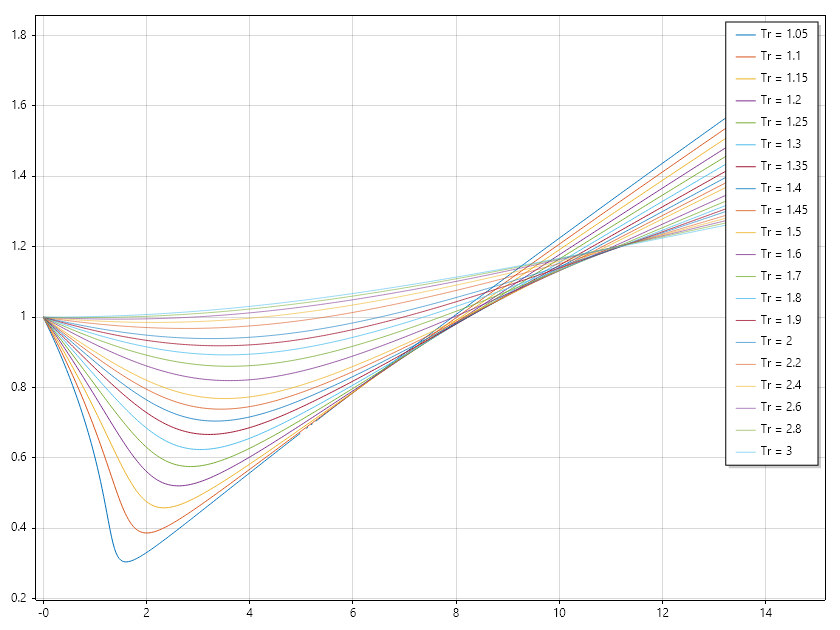
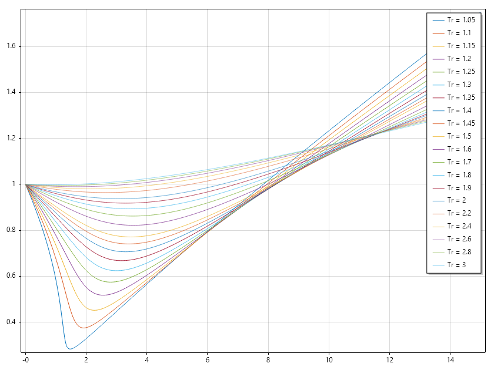
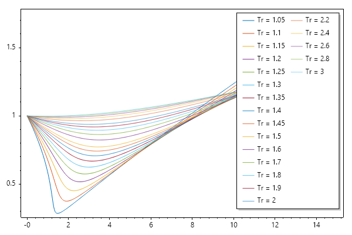
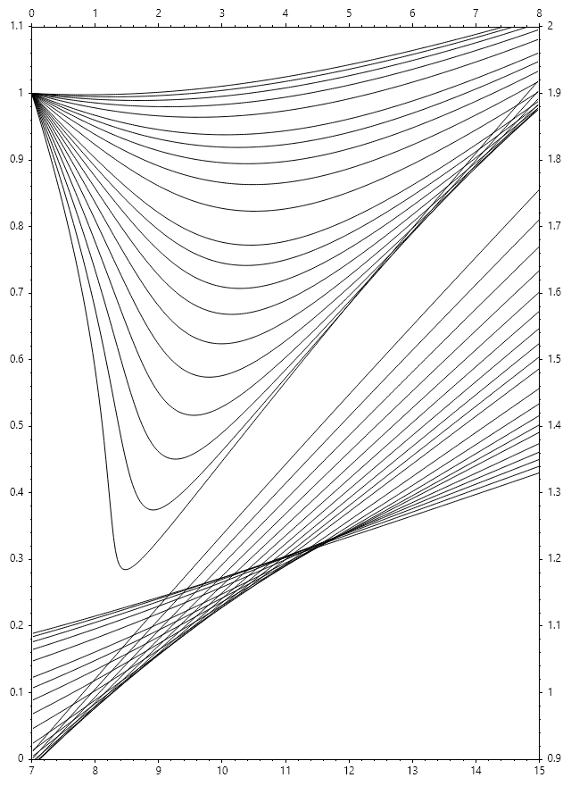

Nonlinear Equation
==================

Root of a nonlinear equation near initial guess :math:`x_0` can be found using ``Fzero`` or `Fsolve`. It numerically locates a value: :math:`x` such that: :math:`f(x) = 0`. This is particularly useful when analytical solutions are difficult or impossible to obtain.

To solve the equation: :math:`x\exp(x) = 2`, start with initial guess of :math:`x_0 = 0.5`;

.. code-block:: csharp

   //Single nonlinear equation
   double f(double x) => x * Exp(x) - 2;

   // solve equation using fzero
   double x = Fzero(f, 0.5);
   Console.WriteLine($"x = {x}");

Ouput

.. terminal::

   x = 0.8526055020137255
In this case, Fzero first search for an interval that brackets the root. Then uses brent's method to hone in on the root. 
If we are sure of the interval containing the root, we can save the effort spent on bracketing the root by supplying that. 

.. code-block:: csharp

   //Single nonlinear equation (bracketted)
   double f(double x) => x * Exp(x) - 2;
   double x = Fzero(f, [0.5, 1]);
   Console.WriteLine($"x = {x}");

Ouput

.. terminal::

   x = 0.8526055020137254

To have window into the solution process, we can using solver setting `SolverSet()` to get the solver to print out the result after each iteration. 

.. code-block:: csharp

   // Single nonlinear equation
   double f(double x) => x * Exp(x) - 2;

   // set solver behaviour
   var opts = SolverSet(Display: true);

   // solve equation using fzero
   double x = Fzero(f, 0.5, opts);
   Console.WriteLine($"x = {x}");

Ouput

.. terminal::

   
    Search for an interval around 0.5 containing a sign change:
   fun-count     a          f(a)           b          f(b)     Procedure 
       1         5e-1   -1.1756e+0         5e-1   -1.1756e+0   initial interval 
       3    4.7172e-1    -1.244e+0    5.2828e-1    -1.104e+0   search          
       5       4.6e-1   -1.2713e+0       5.4e-1   -1.0734e+0   search          
       7    4.4343e-1   -1.3091e+0    5.5657e-1    -1.029e+0   search          
       9       4.2e-1   -1.3608e+0       5.8e-1    -9.641e-1   search          
      11    3.8686e-1   -1.4304e+0    6.1314e-1   -8.6802e-1   search          
      13       3.4e-1   -1.5223e+0       6.6e-1   -7.2304e-1   search          
      15    2.7373e-1   -1.6401e+0    7.2627e-1   -4.9853e-1   search          
      17       1.8e-1   -1.7845e+0       8.2e-1   -1.3819e-1   search          
      19    4.7452e-2   -1.9502e+0    9.5255e-1     4.693e-1   search          
   
    Solving for solution between 0.047452 and 0.952548
   fun-count     x         f(x)       Procedure 
      19    9.5255e-1     4.693e-1    initial        
      20    7.7699e-1    -3.101e-1    interpolation  
      21    8.4684e-1   -2.4938e-2    interpolation  
      22    8.5264e-1    1.5721e-4    interpolation  
      23    8.5261e-1   -6.9891e-7    interpolation  
      24    8.5261e-1  -1.9465e-11    interpolation  
      25    8.5261e-1         0e+0    interpolation  
   x = 0.8526055020137255

SepalSolver also has gradient based "Fsolve", which can use finite difference, user defined functions, or automatic differentiation methods to evaluate the gradient. How to do this is demonstrated in the following example. 

1. Using finite difference

.. code-block:: csharp

   // define the function
   double fun(double x) => 3 * x - Cos(x * x) - 0.5;

   // set initial guess
   double x0 = 0.1;

   // call the solver
   var opts = SolverSet(Display: true);
   var x = Fsolve(fun, x0, opts);

   // display the result
   Console.WriteLine($"x = {x}");

Ouput

.. terminal::

   Func-count      x               f(x) 
        1      1.00000E-1     -1.19995E+0
        3      4.99717E-1      3.01682E-2
        5      4.90426E-1      6.23785E-5
        7      4.90406E-1     2.82767E-10
        9      4.90406E-1     3.33067E-16
       11      4.90406E-1    -2.22045E-16
   x = 0.49040645392576704

2. Using user defined function example

.. code-block:: csharp

   // define the function
   double fun(double x) => 3 * x - Cos(x * x) - 0.5;

   // set initial guess
   double x0 = 0.1;

   // call the solver
   Func<double, double> userJacobian = x => 3 - 2 * x * Sin(x * x);
   var opts = SolverSet(Display: true, UserDefinedJac: userJacobian);
   var x = Fsolve(fun, x0, opts);

   // display the result
   Console.WriteLine($"x = {x}");

Ouput

.. terminal::

   Func-count      x               f(x) 
        1      1.00000E-1     -1.19995E+0
        2      5.00250E-1      3.19000E-2
        3      4.88660E-1     -5.64664E-3
        4      4.90699E-1      9.45758E-4
        5      4.90357E-1     -1.59959E-4
        6      4.90415E-1      2.70102E-5
        7      4.90405E-1     -4.56212E-6
        8      4.90407E-1      7.70522E-7
        9      4.90406E-1     -1.30139E-7
       10      4.90406E-1      2.19800E-8
       11      4.90406E-1     -3.71236E-9
       12      4.90406E-1     6.27006E-10
       13      4.90406E-1    -1.05899E-10
       14      4.90406E-1     1.78858E-11
       15      4.90406E-1    -3.02058E-12
       16      4.90406E-1     5.10036E-13
       17      4.90406E-1    -8.58202E-14
       18      4.90406E-1     1.44329E-14
       19      4.90406E-1    -2.55351E-15
       20      4.90406E-1     5.55112E-16
       21      4.90406E-1    -2.22045E-16
   x = 0.49040645392576704

3. Using automatic differentiation example

.. code-block:: csharp

   // define the function (the variable must be of the type AUTODIFF)
   AutoDiff fun(AutoDiff x) => 3 * x - Cos(x * x) - 0.5;

   // set initial guess
   double x0 = 0.1;

   // call the solver
   var opts = SolverSet(Display: true);
   var x = Fsolve(fun, x0, opts);

   // display the result
   Console.WriteLine($"x = {x}");

Ouput

.. terminal::

   Func-count      x               f(x) 
        1      1.00000E-1     -1.19995E+0
        2      4.99717E-1      3.01682E-2
        3      4.90426E-1      6.23684E-5
        4      4.90406E-1     2.62401E-10
        5      4.90406E-1      0.00000E+0
        6      4.90406E-1      0.00000E+0
   x = 0.4904064539257671

by setting the solver setting in the case of bracketed root, we can see how the solution process differs from the case of a single initial guess. 

.. code-block:: csharp

   // Single nonlinear equation
   double f(double x) => x * Exp(x) - 2;

   // set solver behaviour
   var opts = SolverSet(Display: true);

   // solve equation using fzero
   double x = Fzero(f, [0.5, 1], opts);
   Console.WriteLine($"x = {x}");

Ouput

.. terminal::

   fun-count     x         f(x)       Procedure 
       2         1e+0    7.1828e-1    initial        
       3    8.1037e-1   -1.7768e-1    interpolation  
       4    8.4798e-1    -2.004e-2    interpolation  
       5    8.5263e-1    9.9913e-5    interpolation  
       6    8.5261e-1   -3.5651e-7    interpolation  
       7    8.5261e-1  -6.3105e-12    interpolation  
       8    8.5261e-1  -2.2204e-16    interpolation  
   x = 0.8526055020137254

Practical Application
---------------------
The gas compressibility factor (Z-factor) measures how much a real gas deviates from ideal gas behavior. It is defined as:

.. math::

   Z = \frac{P V}{n R T}

where:

- :math:`P` = pressure
- :math:`V` = volume
- :math:`n` = number of moles
- :math:`R` = gas constant
- :math:`T` = temperature

Accurate determination of :math:`Z` is essential in petroleum engineering for reservoir simulation, material balance, and pipeline design.
Unlike explicit correlations, which provide :math:`Z` directly as a function of pseudo-reduced pressure (:math:`P_{pr}`) and pseudo-reduced temperature (:math:`T_{pr}`), **implicit correlations** require solving an equation iteratively because :math:`Z` appears on both sides of the equation.

The **Hall–Yarbrough correlation (1973)** is one of the most widely used implicit methods for estimating Z. It was developed based on the hard-sphere equation of state and tested against multiple reservoir gas systems.
The general form is:

.. math::

   \begin{array}{c}
   A = 0.06125t \exp\left(-1.2(1 - t)^2\right) \\
   B = 14.76t - 9.76t^2 + 4.58t^3 \\
   C = 90.7t - 242.2t^2 + 42.4t^3 \\
   D = 2.18 + 2.82t \\
   -AP_{pr} + \cfrac{y + y^2 + y^3 - y^4}{(1 - y)^3} - By^2 + Cy^D = 0 \\
   Z = \cfrac{A P_{pr}}{y}
   \end{array}

where:

- :math:`P_{pr} = P/P_c` (pseudo-reduced pressure)
- :math:`T_{pr} = T/T_c` (pseudo-reduced temperature)
- :math:`t = 1/T_{pr}` 
- :math:`P_c, T_c` = pseudo-critical properties of the gas mixture

Because reduced density equation is nonlinear, iterative numerical methods such as Newton–Raphson or successive substitution are required to solve it.

**Applications**

- Reservoir engineering: material balance calculations and reserves estimation.
- Pipeline design: predicting pressure drop and flow efficiency.
- Simulation software: incorporated into PVT packages for automated Z-factor evaluation.

.. code-block:: csharp

   //Z factor application
   static double ZfactorHY(double Pr, double Tr)
   {
       double z = 1, t, tm1, tm1e2, A, B,
           C, D, r, y2, y3, y4, Den;
       if (Pr != 0)
       {
           t = 1 / Tr;
           tm1 = 1 - t; tm1e2 = tm1 * tm1;
           A = 0.06125 * t * Exp(-1.2 * Pow(1 - t, 2));
           B = t * (14.76 - t * (9.76 - t * 4.58));
           C = t * (90.7 - t * (242.2 - t * 42.4));
           D = 2.18 + 2.82 * t; r = A * Pr;
           var yfunc = new Func<double, double>(y =>
           {
               y2 = y * y; y3 = y2 * y; y4 = y3 * y;
               Den = Pow(1 - y, 3);
               return -A * Pr + (y + y2 + y3 - y4) / Den -
               B * y2 + C * Pow(y, D);
           });
           r *= Pr < 5 ? 2 : 1;
           r /= Pr > 13 ? 2 : 1;
           double y = Fsolve(yfunc, r);
           z = A * Pr / y;
       }
       return z;
   }

   // set up ressure and temperature mesh
   ColVec Pr = Linspace(0, 15, 501);
   double[] Tr = [1.05,    1.10,   1.15,   1.20,   1.25,   1.30,   1.35,
                      1.40,    1.45,   1.50,   1.60,   1.70,   1.80,   1.90,
                      2.00,    2.20,   2.40,   2.60,   2.80,   3.00];

   // compute z factors and plot them
   List<string> Tlabels = [.. Tr.Select(tr => "Tr = " + tr)];
   Matrix ZHY = Meshfun(ZfactorHY, Pr, Tr);

   // Plot result.
   Plot(Pr, ZHY);
   Legend(Tr.Select(tr => "Tr = " + tr), UpperRight);
   SaveAs("Zfactor_Hall_Yarborough_.png");

   // Literature style plot
   Figure(640, 880);
   var z1 = Plot(Pr[Pr <= 8], ZHY[Pr <= 8, ..], "k"); HoldOn();
   var z2 = Plot(Pr[Pr >= 7], ZHY[Pr >= 7, ..], "k"); HoldOff();
   SetAxis(z1, X_Axis.Top, Y_Axis.Left, 0, 8, 0, 1.1);
   SetAxis(z2, X_Axis.Bottom, Y_Axis.Right, 7, 15, 0.9, 2.0);
   SaveAs("Hall_Yarborough_Chart.png");
   CloseFig();

.. code-block:: csharp

   static double ZfactorDAK(double Ppr, double Tpr)
   {
       double z = 1;
       if (Ppr != 0)
       {
           double Tpr2 = Tpr * Tpr, Tpr3 = Tpr2 * Tpr,
               Tpr4 = Tpr3 * Tpr, Tpr5 = Tpr4 * Tpr,
           A1 = 0.3265, A2 = -1.0700, A3 = -0.5339,
           A4 = 0.01569, A5 = -0.05165, A6 = 0.5475,
           A7 = -0.7361, A8 = 0.1844, A9 = 0.1056,
           A10 = 0.6134, A11 = 0.7210,
           R1 = A1 + A2 / Tpr + A3 / Tpr3 + A4 / Tpr4 + A5 / Tpr5,
           R2 = 0.27 * Ppr / Tpr,
           R3 = A6 + A7 / Tpr + A8 / Tpr2,
           R4 = A9 * (A7 / Tpr + A8 / Tpr2),
           R5 = A10 / Tpr3;
           double yfunc(double y)
           {
               double y2 = y * y, y5 = y2 * y2 * y;
               double E = (1 + A11 * y2) * Exp(-A11 * y2);
               return R5 * y2 * E + R1 * y - R2 / y + R3 * y2 - R4 * y5 + 1;
           }
           ;
           var options = SolverSet(StepFactor: 0.5);
           double y = Fsolve(yfunc, R2, options);
           z = R2 / y;
       }
       return z;
   }

   // set up ressure and temperature mesh
   ColVec Pr = Linspace(0, 15, 501);
   double[] Tr = [1.05,    1.10,   1.15,   1.20,   1.25,   1.30,   1.35,
                  1.40,    1.45,   1.50,   1.60,   1.70,   1.80,   1.90,
                  2.00,    2.20,   2.40,   2.60,   2.80,   3.00];

   // compute z factors and plot them
   List<string> Tlabels = [.. Tr.Select(tr => "Tr = " + tr)];
   Matrix ZDAK = Meshfun(ZfactorDAK, Pr, Tr);

   // Plot result.
   Plot(Pr, ZDAK);
   Legend(Tr.Select(tr => "Tr = " + tr), UpperRight);
   SaveAs("Zfactor_Dranchuk_Abou_Kassem.png");

   // Literature style plot
   Figure(640, 880);
   var z1 = Plot(Pr[Pr <= 8], ZDAK[Pr <= 8, ..], "k"); HoldOn();
   var z2 = Plot(Pr[Pr >= 7], ZDAK[Pr >= 7, ..], "k"); HoldOff();
   SetAxis(z1, X_Axis.Top, Y_Axis.Left, 0, 8, 0, 1.1);
   SetAxis(z2, X_Axis.Bottom, Y_Axis.Right, 7, 15, 0.9, 2.0);
   SaveAs("Dranchuk_Abou_Kassem_Chart.png");
   CloseFig();

.. code-block:: csharp

   static double ZfactorDPR(double Pr, double Tr)
   {
       double z = 1;
       if (Pr != 0)
       {
           double Tr2 = Tr * Tr, Tr3 = Tr2 * Tr, E,
               A1 = 0.31506237, A2 = -1.04670990, A3 = -0.57832720, A4 = 0.53530771,
               A5 = -0.61232032, A6 = -0.10488813, A7 = 0.68157001, A8 = 0.68446549,
               T1 = A1 + A2 / Tr + A3 / Tr3, T2 = A4 + A5 / Tr, T3 = A5 * A6 / Tr,
               T4 = A7 / Tr3, T5 = 0.27 * Pr / Tr, y2, y5, v = T5;
           var yfunc = new Func<double, double>(y =>
           {
               y2 = y * y; y5 = y2 * y2 * y; E = (1 + A8 * y2) * Exp(-A8 * y2);
               return 1 + T1 * y + T2 * y2 + T3 * y5 + T4 * y2 * E - T5 / y;
           });
           var options = SolverSet(StepFactor: 0.5);
           double y = Fsolve(yfunc, v, options);
           z = 0.27 * Pr / (Tr * y);
       }
       return z;
   }

   // set up ressure and temperature mesh
   ColVec Pr = Linspace(0, 15, 501);
   double[] Tr = [1.05,    1.10,   1.15,   1.20,   1.25,   1.30,   1.35,
                  1.40,    1.45,   1.50,   1.60,   1.70,   1.80,   1.90,
                  2.00,    2.20,   2.40,   2.60,   2.80,   3.00];

   // compute z factors and plot them
   List<string> Tlabels = [.. Tr.Select(tr => "Tr = " + tr)];
   Matrix ZDPR = Meshfun(ZfactorDPR, Pr, Tr);

   // Plot result.
   Plot(Pr, ZDPR);
   Legend(Tr.Select(tr => "Tr = " + tr), UpperRight);
   SaveAs("Zfactor_Dranchuk_Purvis_Robinson.png");

   // Literature style plot
   Figure(640, 880);
   var z1 = Plot(Pr[Pr <= 8], ZDPR[Pr <= 8, ..], "k"); HoldOn();
   var z2 = Plot(Pr[Pr >= 7], ZDPR[Pr >= 7, ..], "k"); HoldOff();
   SetAxis(z1, X_Axis.Top, Y_Axis.Left, 0, 8, 0, 1.1);
   SetAxis(z2, X_Axis.Bottom, Y_Axis.Right, 7, 15, 0.9, 2.0);
   SaveAs("Dranchuk_Purvis_Robinson_Chart.png");
   CloseFig();

