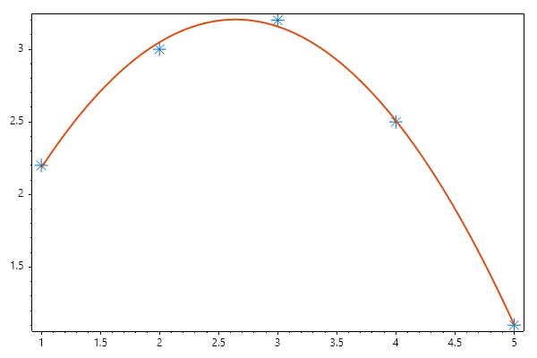
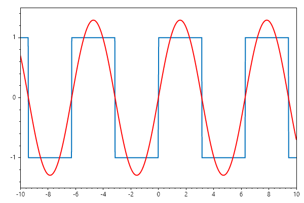
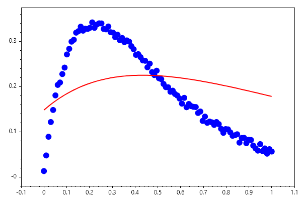
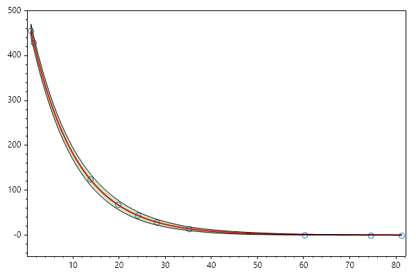
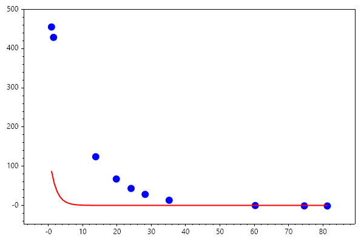
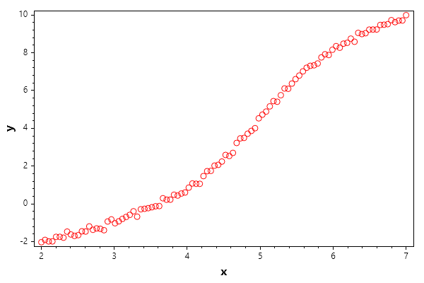
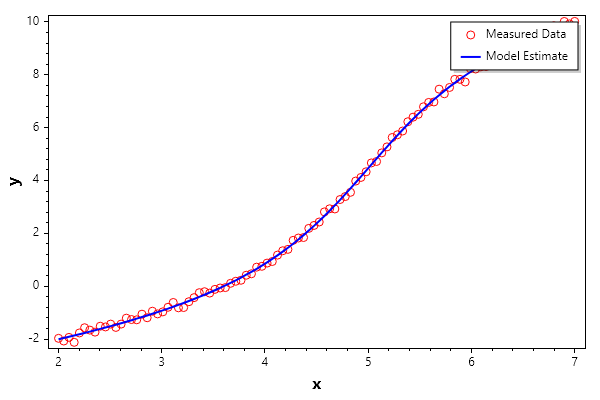
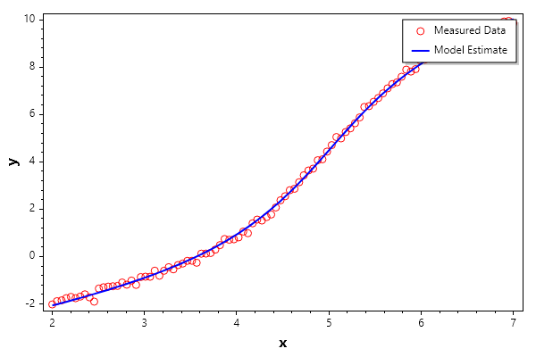

Curve Fitting
=============

Curve Fitting
-------------
Curve fitting is a mathematical technique used to construct a curve that best fits a series of data points. It is widely applied in data analysis, statistics, and machine learning to model relationships between variables.

Types of Curve Fitting:
~~~~~~~~~~~~~~~~~~~~~~~
1. Linear Regression: Fits a straight line to the data points.
2. Polynomial Regression: Fits a polynomial curve of degree n to the data points.
3. Nonlinear Regression: Fits a nonlinear model to the data points.

Example: Polynomial Curve Fitting
~~~~~~~~~~~~~~~~~~~~~~~~~~~~~~~~~
Given a set of data points, we can fit a polynomial curve using least squares optimization.

.. math::

   \min_{\mathbf{p}} \sum_{i=1}^{n} (y_i - P(x_i; \mathbf{p}))^2

.. code-block:: csharp

   // Sample data points
   double[] xData = [1, 2, 3, 4, 5];
   double[] yData = [2.2, 3.0, 3.2, 2.5, 1.1];
   // Fit a polynomial of degree 2
   int degree = 2;
   var coefficients = Polyfit(xData, yData, degree);
   Scatter(xData, yData, "*", 15); HoldOn();
   // Generate fitted curve
   double[] xFit = Linspace(1, 5, 100);
   double[] yFit = Polyval(coefficients, xFit);
   Plot(xFit, yFit, Linewidth: 2);
   SaveAs("Polynomial_Fitting.png");
   CloseFig();

Example: Fourier Series Fitting
~~~~~~~~~~~~~~~~~~~~~~~~~~~~~~~
Evaluating a Fourier series numerically involves transforming an infinite 
sum of trigonometric terms into a computationally stable, finite calculation
while controlling truncation errors, floating-point precision loss, and
spectral artifacts.

Mathematical Formulation:

A truncated Fourier series approximating a periodic function :math:`f(x)` on 
the interval :math:`[-\pi, \pi]` with :math:`N` harmonics is defined as:

.. math::

   f_N(x) = \frac{a_0}{2} + \sum_{n=1}^{N} \left( a_n \cos(nx) + b_n \sin(nx) \right)

In complex exponential form, which is computationally convenient for many 
numerical implementations, the series is expressed as:

.. math::

   f_N(x) = \sum_{n=-N}^{N} c_n e^{i n x}

where the complex coefficients :math:`c_n` relate to the real coefficients via:

.. math::

   c_0 = \frac{a_0}{2}, \quad c_n = \frac{a_n - i b_n}{2}, \quad c_{-n} = \frac{a_n + i b_n}{2}

.. code-block:: csharp

   ColVec x = Linspace(-10, 10, 1001);
   ColVec Rect = Sign(Sin(x));
   Plot(x, Rect, Linewidth: 2); HoldOn();
   var fourier = Plot(x, 0 * x, "r", Linewidth: 2);
   Axis([x[0], x[^1], -1.5, 1.5]);
   
   byte[] Animfun(int N)
   {
       Matrix A = Zeros(1001, 2 * N + 3);
       A[.., 0] = Ones(1001);
       for (int n = 1; n <= (N + 1); n++)
       {
           A[.., 2 * n-1] = Cos(n * x); 
           A[.., 2 * n] = Sin(n * x);
       }
       ColVec p = Mldivide(A, Rect);
       fourier.Ydata = A * p;
       return GetFrame();
   }
   AnimationMaker(Animfun, "FourierFitting.gif", 5, 100);
   CloseFig();

Example: Bi-Exponential Curve Fitting
~~~~~~~~~~~~~~~~~~~~~~~~~~~~~~~~~~~~~
This exercise covers non-linear parameter estimation using least-squares optimization 
to fit a bi-exponential model to noisy data while visualizing optimizer convergence.

The objective is to fit data points :math:`(x_d, y_d)` to a bi - exponential model:

.. math::

   f(x; \theta) = \theta_2 e^{\theta_0 x} + \theta_3 e^{\theta_1 x}

where  math:`\theta = [\theta_0, \theta_1, \theta_2, \theta_3]^T` represents the unknown parameters.

Find :math:`\hat{\theta}` minimizing the sum of squared residuals:

.. math::

   \hat{\theta} = \arg\min_{\theta} \sum_{d=1}^D (y_d - f(x_d; \theta))^2

.. code-block:: csharp

   ColVec noise, weight = new double[100]; double[] x0;
   static ColVec fun(ColVec x, ColVec xdata) => x[2] * Exp(x[0] * xdata) + x[3] * Exp(x[1] * xdata);
   ColVec xdata = Linspace(0, 1); noise = Rand(xdata.Numel);
   ColVec ydata = fun(x0 = [-4, -5, 4, -4], xdata) + 0.02 * noise;
   x0 = [-1, -2, 1, -1]; weight[xdata < 0.5] = 1;
   var opts = OptimSet(Display: true, MaxIter: 200, StepTol: 1e-6, OptimalityTol: 1e-6);
   var ans = Lsqcurvefit(fun, x0, xdata, ydata, options: opts);
   AnimateHistory(fun, xdata, ydata, ans.history, "Bi_Exponential_Fitting.gif");
   CloseFig();

Ouput

.. terminal::

                                               Norm of      First-order 
    Iteration   Func-count       Resnorm          step       optimality 
        0            5          1.7264e0                       3.6131e0 
        1           11         7.8415e-1     2.5664e-1         1.4823e0 
        2           17         5.1111e-1     2.3488e-1        2.9820e-1 
        3           23         4.3697e-1     5.0724e-1        1.3735e-1 
        4           29         2.6263e-1      1.9591e0        6.6932e-1 
        5           35         1.1530e-1      3.0286e0        7.3890e-1 
        6           41         5.5026e-3     4.1833e-1        9.9935e-2 
        7           47         4.2027e-3     4.2244e-1        1.1478e-1 
        8           53         3.8190e-3     3.5935e-1        9.9303e-2 
        9           59         3.3001e-3     2.4420e-1        5.1823e-2 
       10           65         3.1260e-3     1.1856e-1        1.2721e-2 
       11           71         3.1149e-3     3.0422e-2        8.4215e-4 
       12           77         3.1149e-3     2.8867e-3        7.5999e-6 
       13           83         3.1149e-3     7.3495e-5        4.8688e-9 

.. code-block:: csharp

   ColVec xdata, ydata, times, y_est, filltime, sgy, filly, lower, upper;

   double[] x_dat = [0.9, 1.5, 13.8, 19.8, 24.1, 28.2, 35.2, 60.3, 74.6, 81.3];
   double[] y_dat = [455.2, 428.6, 124.1, 67.3, 43.2, 28.1, 13.1, -0.4, -1.3, -1.5];
   xdata = x_dat; ydata = y_dat; times = Linspace(x_dat[0], x_dat[9]);
   double[] x0 = [100, -1];

   static ColVec fun(ColVec x, ColVec xdata) => x[0] * Exp(x[1] * xdata);
   var opts = OptimSet(Display: true, MaxIter: 200, StepTol: 1e-6, OptimalityTol: 1e-6);
   var ans = Lsqcurvefit(fun, x0, xdata, ydata, options: opts);

   Scatter(xdata, ydata); HoldOn();
   Plot(times, y_est = fun(ans.x, times), "r", Linewidth: 2);
   filltime = Vcart(times, times.Reverse().ToList());
   sgy = Interp1(xdata, ans.sigma_y, times);
   lower = y_est - 20 * sgy; upper = y_est + 20 * sgy;
   filly = Vcart(lower, upper.Reverse().ToList());
   Fill(filltime, filly, "g", 0.2); HoldOff();
   Axis([xdata.Min()-0.01*xdata.Range(), xdata.Max()+0.01*xdata.Range(),
   ydata.Min()-0.1*ydata.Range(), ydata.Max()+0.1*ydata.Range()]);
   SaveAs("CurveFitting.png");
   AnimateHistory(fun, xdata, ydata, ans.history, "CurveFitting.gif");
   CloseFig();

Ouput

.. terminal::

                                               Norm of      First-order 
    Iteration   Func-count       Resnorm          step       optimality 
        0            3          3.5968e5                       2.8768e4 
        1            7          2.9148e5      4.5301e1         6.3631e4 
        2           11          1.4328e5      7.0536e1         1.8724e5 
        3           15          5.8838e4      8.1015e1         1.7583e5 
        4           19          2.1604e4      7.9171e1         1.3573e5 
        5           23          2.4371e3      8.1537e1         4.6492e4 
        6           27          6.2429e1      3.5477e1         8.8212e3 
        7           31          9.6405e0      5.5200e0         5.2344e2 
        8           35          9.5049e0     2.7383e-1         4.5771e0 
        9           39          9.5049e0     3.5902e-3        1.3319e-2 
       10           43          9.5049e0     9.0844e-6        5.6776e-6 

Lsqcurvefit allows the use of constraints. 
1. Seed data for reproducability

.. code-block:: csharp

   int seed = 23;
   Random rng = new(seed);
   ColVec xdata, ydata, noise = Randn(100);
   double[] xstar = [2, 4, 5, 0.5];

   ColVec model(ColVec x, ColVec xdata) => x[0] + x[1] * Atan(xdata - x[2]) + x[3] * xdata;
   xdata = Linspace(2,7); ydata = model(xstar, xdata) + noise/10;
   Scatter(xdata, ydata, "ro");

   Xlabel("x"); Ylabel("y"); 
   SaveAs("Seeded_Curve_Fitting_Data.png");
   CloseFig();

2. Fitting with Linear constraint

.. code-block:: csharp

   int seed = 23;
   Random rng = new(seed);
   ColVec xdata, ydata, noise = Randn(100);
   double[] xstar = [2, 4, 5, 0.5], startpt = [1, 2, 3, 1];

   ColVec model(ColVec x, ColVec xdata) => x[0] + x[1] * Atan(xdata - x[2]) + x[3] * xdata;
   RowVec A = new double[] { -1, -1, 1, 1 };
   ColVec fineq(ColVec x) => A * x; ColVec lb = Zeros(4), ub = 7 + lb;
   xdata = Linspace(2, 7); ydata = model(xstar, xdata) + noise / 10;

   var opts = OptimSet(Display: true, MaxIter: 200, StepTol: 1e-6, OptimalityTol: 1e-6);
   var ans = Lsqcurvefit(model, startpt, xdata, ydata, fineq, null, lb, ub, options: opts);
   Console.WriteLine($"x = {ans.x.T}");
   Console.WriteLine($"c = {fineq(ans.x)}");

   Scatter(xdata, ydata, "ro"); HoldOn();
   Plot(xdata, ans.y_hat, "-b", Linewidth: 2);

   Xlabel("x"); Ylabel("y");
   Legend(["Measured Data", "Model Estimate"], UpperRight);
   SaveAs("Example_of_CurveFitting_using_Lsqcurvefit_with_Linear_Inequality_Constraints.png");
   CloseFig();

Ouput

.. terminal::

                                               Norm of      First-order 
    Iteration   Func-count       Resnorm          step       optimality 
        0            5          1.5893e3                       1.5189e3 
        1           11          1.3074e3     2.1060e-1         1.3190e3 
        2           17          8.0218e2     4.8504e-1         8.9252e2 
        3           23          3.0561e2     8.0794e-1         3.3851e2 
        4           29          6.2276e1     9.7197e-1         6.9664e1 
        5           35          1.0996e1     6.6393e-1         3.7681e1 
        6           41          5.8173e0     4.0195e-1         2.4626e0 
        7           47          2.8453e0     5.4881e-1         3.3779e0 
        8           53          2.4425e0     5.6811e-1         1.8639e0 
        9           59          1.0198e0     2.6517e-1        3.3086e-1 
       10           65          1.0187e0     3.0182e-3        9.8691e-2 
       11           71          1.0019e0     2.0789e-1        9.7739e-2 
       12           77          1.0017e0     2.6157e-2        1.7895e-3 
       13           83          1.0017e0     1.0574e-3        1.6714e-5 
       14           89          1.0017e0     1.3150e-5        1.0983e-7 
   x = 
      1.9120    3.9698    5.0145    0.5216
   
   c =   -0.3457

3. Fitting with nonlinear constraint.

.. code-block:: csharp

   int seed = 23;
   Random rng = new(seed);
   ColVec xdata, ydata, noise = Randn(100);
   double[] xstar = [2, 4, 5, 0.5], startpt = [1, 2, 3, 1];

   ColVec model(ColVec x, ColVec xdata) => x[0] + x[1] * Atan(xdata - x[2]) + x[3] * xdata;
   ColVec fineq(ColVec x) => x[0] * x[0] + x[1] * x[1] - 16; ColVec lb = Zeros(4), ub = 7 + lb;
   xdata = Linspace(2, 7); ydata = model(xstar, xdata) + noise / 10;

   var opts = OptimSet(Display: true, MaxIter: 200, StepTol: 1e-6, OptimalityTol: 1e-6);
   var ans = Lsqcurvefit(model, startpt, xdata, ydata, fineq, null, lb, ub, options: opts);
   Console.WriteLine($"x = {ans.x.T}");
   Console.WriteLine($"c = {fineq(ans.x)}");

   Scatter(xdata, ydata, "ro"); HoldOn();
   Plot(xdata, ans.y_hat, "-b", Linewidth: 2);

   Xlabel("x"); Ylabel("y");
   Legend(["Measured Data", "Model Estimate"], UpperRight);
   SaveAs("Example_of_CurveFitting_using_Lsqcurvefit_with_NonLinear_Inequality_Constraints.png");
   CloseFig();

Ouput

.. terminal::

                                               Norm of      First-order 
    Iteration   Func-count       Resnorm          step       optimality 
        0            5          1.5700e3                       1.5039e3 
        1           11          1.2893e3     2.1177e-1         1.3040e3 
        2           17          7.8604e2     4.8868e-1         8.7765e2 
        3           23          2.9090e2     8.1807e-1         3.2498e2 
        4           29          5.4045e1     9.7198e-1         6.9301e1 
        5           35          5.3353e0     6.2871e-1         4.1755e1 
        6           41          2.4548e0     2.0672e-1         4.5870e0 
        7           47          2.1941e0     1.7821e-1         1.1274e0 
        8           53          1.7523e0     3.9469e-1         1.5052e0 
        9           59          1.2088e0     6.9879e-1         1.5846e0 
       10           69          1.1964e0     2.1768e-2        6.7728e-1 
       11           76          1.1850e0     2.1206e-2        6.6036e-1 
       12           84          1.1815e0     6.6292e-3        6.5752e-1 
       13           92          1.1804e0     2.0891e-3        6.5655e-1 
       14          100          1.1801e0     6.5993e-4        6.5623e-1 
       15          106          1.1800e0     3.8852e-4        4.3417e-1 
       16          112          1.1795e0     8.6663e-4        3.0685e-1 
       17          118          1.1792e0     1.0045e-3        2.6442e-1 
       18          124          1.1792e0     4.5704e-4        2.6683e-1 
       19          130          1.1792e0     7.3489e-5        2.6852e-1 
       20          136          1.1791e0     1.1963e-4        2.6884e-1 
       21          142          1.1790e0     3.5624e-4        2.7040e-1 
       22          148          1.1787e0     9.4203e-4        2.8034e-1 
       23          154          1.1786e0     3.0901e-4        2.8537e-1 
       24          160          1.1785e0     4.6586e-4        2.9437e-1 
       25          166          1.1782e0     1.0790e-3        3.2120e-1 
       26          172          1.1780e0     1.5825e-3        3.7232e-1 
       27          178          1.1779e0     1.0726e-3        4.1266e-1 
       28          184          1.1779e0     2.6722e-4        4.2328e-1 
       29          190          1.1779e0     2.1373e-5        4.2415e-1 
       30          196          1.1779e0     7.2464e-7        4.2418e-1 
   x = 
      1.3493    3.7656    5.0258    0.6466
   
   c =    0.0000

