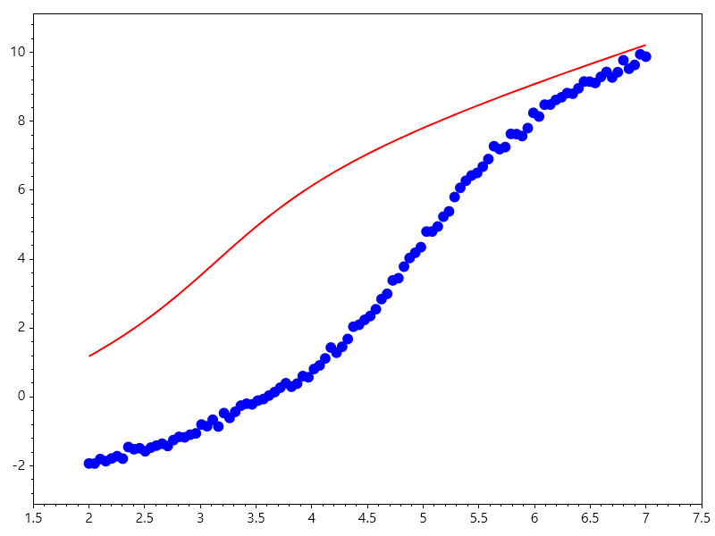

Curve Fitting
=============

Curve Fitting
-------------
Curve fitting is a mathematical technique used to construct a curve that best fits a series of data points. It is widely applied in data analysis, statistics, and machine learning to model relationships between variables.

Types of Curve Fitting:
^^^^^^^^^^^^^^^^^^^^^^^
1. Linear Regression: Fits a straight line to the data points.
2. Polynomial Regression: Fits a polynomial curve of degree n to the data points.
3. Nonlinear Regression: Fits a nonlinear model to the data points.

Example: Polynomial Curve Fitting
^^^^^^^^^^^^^^^^^^^^^^^^^^^^^^^^^
Given a set of data points, we can fit a polynomial curve using least squares optimization.

.. math::

   \min_{\mathbf{p}} \sum_{i=1}^{n} (y_i - P(x_i; \mathbf{p}))^2

Polynomial curve fitting constructs an :math:`n`-th degree polynomial model whose coefficients minimize the squared discrepancy between observed values and model predictions. Using `Polyfit`, SepalSolver constructs and solves the underlying Vandermonde matrix in a linear least-squares sense, returning the polynomial coefficients in descending order of power. The resulting curve is evaluated across the domain using `Polyval` and plotted against the discrete sample points.

.. code-block:: csharp

   // -------------------------------------------------------------------------
   // 1. Observed Experimental Data Points
   // -------------------------------------------------------------------------
   // Sample discrete measurements exhibiting parabolic curvature (inverted peak)
   double[] xData = [1.0, 2.0, 3.0, 4.0, 5.0];
   double[] yData = [2.2, 3.0, 3.2, 2.5, 1.1];

   // -------------------------------------------------------------------------
   // 2. Linear Least-Squares Polynomial Regression
   // -------------------------------------------------------------------------
   // Specify polynomial degree n = 2: p(x) = c0*x^2 + c1*x + c2
   int degree = 2;

   // Polyfit constructs and solves the Vandermonde matrix in least-squares sense
   // Returns coefficient vector in descending powers: [c0, c1, c2]
   var coefficients = Polyfit(xData, yData, degree);

   // -------------------------------------------------------------------------
   // 3. Observed Data Plotting
   // -------------------------------------------------------------------------
   // Render experimental discrete points using asterisk markers ("*") with size 15
   Scatter(xData, yData, "*", 15);
   HoldOn();

   // -------------------------------------------------------------------------
   // 4. Smooth Fitted Trajectory Evaluation
   // -------------------------------------------------------------------------
   // Discretize continuous evaluation domain across [1, 5] with 100 points
   double[] xFit = Linspace(1.0, 5.0, 100);

   // Polyval evaluates the polynomial using Horner's method at each point in xFit:
   // yFit[k] = c0 * xFit[k]^2 + c1 * xFit[k] + c2
   double[] yFit = Polyval(coefficients, xFit);

   // Overlay the smooth quadratic fit as a solid curve (linewidth = 2)
   Plot(xFit, yFit, Linewidth: 2);

   // -------------------------------------------------------------------------
   // 5. Figure Export & Resource Cleanup
   // -------------------------------------------------------------------------
   // Save graphic to file and release plotting canvas context
   SaveAs("Polynomial_Fitting.png");
   CloseFig();

.. figure:: images/Polynomial_Fitting.png
   :align: center
   :alt: Polynomial_Fitting.png

Mathematical Theory: Vandermonde System and Horner Evaluation
"""""""""""""""""""""""""""""""""""""""""""""""""""""""""""""
An :math:`n`-th degree polynomial is expressed in descending powers as:

.. math::

   P(x; \mathbf{c}) = c_0 x^n + c_1 x^{n-1} + \dots + c_{n-1} x + c_n

For :math:`M` data pairs :math:`(x_i, y_i)`, the condition :math:`P(x_i; \mathbf{c}) \approx y_i` establishes the overdetermined linear matrix equation:

.. math::

   V \mathbf{c} \approx \mathbf{y}

where :math:`V \in \mathbb{R}^{M \times (n+1)}` is the Vandermonde matrix:

.. math::

   V = \begin{bmatrix}
   x_1^n & x_1^{n-1} & \cdots & x_1 & 1 \\
   x_2^n & x_2^{n-1} & \cdots & x_2 & 1 \\
   \vdots & \vdots & \ddots & \vdots & \vdots \\
   x_M^n & x_M^{n-1} & \cdots & x_M & 1
   \end{bmatrix}, \quad
   \mathbf{c} = \begin{bmatrix} c_0 \\ c_1 \\ \vdots \\ c_n \end{bmatrix}, \quad
   \mathbf{y} = \begin{bmatrix} y_1 \\ y_2 \\ \vdots \\ y_M \end{bmatrix}

The unique least-squares solution satisfies the normal equations :math:`V^T V \mathbf{c} = V^T \mathbf{y}`. In `Polyfit`, numerical instability associated with squaring the condition number :math:`\kappa(V^T V) = (\kappa(V))^2` is avoided by computing a QR decomposition:

.. math::

   V = Q R = \begin{bmatrix} Q_1 & Q_2 \end{bmatrix} \begin{bmatrix} R_1 \\ 0 \end{bmatrix}

which reduces the problem to back-substitution on the upper-triangular factor :math:`R_1 \mathbf{c} = Q_1^T \mathbf{y}`.

In `Polyval`, the resulting polynomial is evaluated via Horner's algorithmic nesting:

.. math::

   P(x) = \left(\dots\left((c_0 x + c_1)x + c_2\right)x + \dots + c_{n-1}\right)x + c_n

reducing computation from :math:`O(n^2)` arithmetic operations to :math:`n` multiplications and :math:`n` additions while minimizing rounding errors.

Example: Fourier Series Fitting
^^^^^^^^^^^^^^^^^^^^^^^^^^^^^^^
Evaluating a Fourier series numerically involves transforming an infinite 
sum of trigonometric terms into a computationally stable, finite calculation
while controlling truncation errors, floating-point precision loss, and
spectral artifacts.

Mathematical Formulation:

A truncated Fourier series approximating a periodic function :math:`f(x)` on 
the interval :math:`[-\pi, \pi]` with :math:`N` harmonics is defined as:

.. math::

   f_N(x) = \frac{a_0}{2} + \sum_{n=1}^{N} \left( a_n \cos(nx) + b_n \sin(nx) \right)

In complex exponential form, which is computationally convenient for many 
numerical implementations, the series is expressed as:

.. math::

   f_N(x) = \sum_{n=-N}^{N} c_n e^{i n x}

where the complex coefficients :math:`c_n` relate to the real coefficients via:

.. math::

   c_0 = \frac{a_0}{2}, \quad c_n = \frac{a_n - i b_n}{2}, \quad c_{-n} = \frac{a_n + i b_n}{2}

In this implementation, the Fourier approximation of a periodic square wave is solved as a linear least-squares problem:

.. math::

   A \mathbf{p} \approx \mathbf{y}

The harmonic design matrix :math:`A` contains columns for the DC offset alongside pairs of sine and cosine terms up to harmonic order :math:`N + 1`. The optimal coefficients :math:`\mathbf{p}` are obtained through matrix left division (`Mldivide`). Progressive reconstruction frames are captured iteratively via `GetFrame()` to compile an animated demonstration of harmonic synthesis using `AnimationMaker`.

.. code-block:: csharp

   // -------------------------------------------------------------------------
   // 1. Target Signal Definition (Square Wave)
   // -------------------------------------------------------------------------
   // Create an odd-count grid spanning [-10, 10] with 1001 discrete points
   ColVec x = Linspace(-10, 10, 1001);

   // Generate periodic square wave via the signum function applied to sin(x):
   // Rect(x) = +1 when sin(x) > 0, -1 when sin(x) < 0
   ColVec Rect = Sign(Sin(x));

   // -------------------------------------------------------------------------
   // 2. Base Plot Setup
   // -------------------------------------------------------------------------
   // Plot the true target square wave as the static background curve
   Plot(x, Rect, Linewidth: 2);
   HoldOn();

   // Instantiate dynamic curve object for Fourier approximation (initialized to zero)
   // Storing the handle in 'fourier' enables fast in-place Ydata updates per frame
   var fourier = Plot(x, 0 * x, "r", Linewidth: 2);

   // Lock coordinate axes bounds: x from start to end, y from -1.5 to +1.5
   Axis([x[0], x[^1], -1.5, 1.5]);

   // -------------------------------------------------------------------------
   // 3. Animation Frame Generator (Progressive Harmonic Synthesis)
   // -------------------------------------------------------------------------
   // Evaluated iteratively for harmonic orders N = 0, 1, 2, ...
   byte[] Animfun(int N)
   {
       // Number of harmonic basis functions:
       // Constant term (1) + pairs of cos/sin harmonics up to order (N + 1)
       // Total columns = 1 + 2 * (N + 1) = 2 * N + 3
       Matrix A = Zeros(1001, 2 * N + 3);

       // Column 0: Constant DC bias basis vector (a0)
       A[.., 0] = Ones(1001);

       // Populate trigonometric basis matrix columns
       for (int n = 1; n <= (N + 1); n++)
       {
           A[.., 2 * n - 1] = Cos(n * x); // Even basis: cos(n * x)
           A[.., 2 * n] = Sin(n * x); // Odd basis:  sin(n * x)
       }

       // ---------------------------------------------------------------------
       // Solve Linear Least Squares: A * p ~= Rect
       // ---------------------------------------------------------------------
       // Mldivide (equivalent to MATLAB's backslash '\') solves:
       // p = (A^T * A)^(-1) * A^T * Rect
       // Yielding optimal Fourier coefficients: [a0, a1, b1, a2, b2, ...]
       ColVec p = Mldivide(A, Rect);

       // Reconstruct approximation curve and update line object in-place
       fourier.Ydata = A * p;

       // Capture current canvas buffer as raw image bytes for GIF encoding
       return GetFrame();
   }

   // -------------------------------------------------------------------------
   // 4. Compile and Export Animated GIF
   // -------------------------------------------------------------------------
   // AnimationMaker iterates N over [0, frameCount), calling Animfun for each frame
   // Parameters: frameCallback, filename, frameRate (fps), loopCount/duration
   AnimationMaker(Animfun, "FourierFitting.gif", 5, 100);

   // Release graphic context and memory handles
   CloseFig();

.. figure:: images/
   :align: center
   :alt: 

.. figure:: images/FourierFitting.gif
   :align: center
   :alt: FourierFitting.gif

Mathematical Theory: Discrete Orthogonal Projection and Gibbs Phenomenon
""""""""""""""""""""""""""""""""""""""""""""""""""""""""""""""""""""""""
A continuous periodic function :math:`f(x)` with period :math:`T = 2\pi` has exact analytical Fourier coefficients given by:

.. math::

   a_n = \frac{1}{\pi} \int_{-\pi}^{\pi} f(x) \cos(nx) \, dx, \quad b_n = \frac{1}{\pi} \int_{-\pi}^{\pi} f(x) \sin(nx) \, dx

When discretizing over an :math:`M`-point vector :math:`\mathbf{x}`, numerical quadrature is replaced by projection onto a discrete trigonometric basis matrix:

.. math::

   A = \begin{bmatrix} \mathbf{1} & \cos(\mathbf{x}) & \sin(\mathbf{x}) & \cdots & \cos((N+1)\mathbf{x}) & \sin((N+1)\mathbf{x}) \end{bmatrix} \in \mathbb{R}^{M \times (2N+3)}

The coefficients :math:`\mathbf{p}` are obtained by minimizing the Euclidean norm of the residual vector :math:`\mathbf{r} = A\mathbf{p} - \text{Rect}(\mathbf{x})`:

.. math::

   \min_{\mathbf{p}} \| A \mathbf{p} - \text{Rect}(\mathbf{x}) \|_2^2 \implies \mathbf{p} = (A^T A)^{-1} A^T \text{Rect}(\mathbf{x})

Because the columns of :math:`A` are mutually orthogonal under uniform sampling:

.. math::

   \sum_{k=1}^M \cos(j x_k) \sin(l x_k) = 0, \quad \sum_{k=1}^M \cos(j x_k) \cos(l x_k) \approx \frac{M}{2} \delta_{jl}

the Gram matrix :math:`A^T A` remains well-conditioned and diagonally dominant.

Near the step transitions where :math:`\sin(x) = 0`, the partial Fourier sum exhibits the **Gibbs phenomenon**. For a unit step discontinuity :math:`\Delta y = 2`, the limiting overshoot value as :math:`N \to \infty` does not tend to zero:

.. math::

   \lim_{N \to \infty} f_N\left(\frac{\pi}{N}\right) = \frac{2}{\pi} \int_0^{\pi} \frac{\sin(t)}{t} \, dt = \frac{2}{\pi} \text{Si}(\pi) \approx 1.17898

resulting in an asymptotic overshoot of approximately :math:`8.95\%` of the jump magnitude.

Example: Bi-Exponential Curve Fitting
^^^^^^^^^^^^^^^^^^^^^^^^^^^^^^^^^^^^^
This exercise covers non-linear parameter estimation using least-squares optimization 
to fit a bi-exponential model to noisy data while visualizing optimizer convergence.

The objective is to fit data points :math:`(x_d, y_d)` to a bi - exponential model:

.. math::

   f(x; \theta) = \theta_2 e^{\theta_0 x} + \theta_3 e^{\theta_1 x}

where :math:`\theta = [\theta_0, \theta_1, \theta_2, \theta_3]^T` represents the unknown parameters.

Find :math:`\hat{\theta}` minimizing the sum of squared residuals:

.. math::

   \hat{\theta} = \arg\min_{\theta} \sum_{d=1}^D (y_d - f(x_d; \theta))^2

Bi-exponential models represent dual-rate decay processes commonly encountered in fluid relaxation and chemical dynamics. Because these models are sensitive to parameter correlation, visualizing solver progress helps monitor convergence behavior. This example configures `Lsqcurvefit` with stopping tolerances and exports the iterative parameter descent to an animated GIF using `AnimateHistory`.

.. code-block:: csharp

   // -------------------------------------------------------------------------
   // 1. Array & Vector Preallocations
   // -------------------------------------------------------------------------
   ColVec noise;
   ColVec weight = new double[100]; // Pre-allocate weight vector of length 100
   double[] x0;                     // Parameter vector placeholder

   // -------------------------------------------------------------------------
   // 2. Forward Bi-Exponential Model Definition
   // -------------------------------------------------------------------------
   // Model: f(x, xdata) = x[2]*exp(x[0]*xdata) + x[3]*exp(x[1]*xdata)
   // Represents dual-decay / dual-relaxation processes common in physics/PVT:
   // x[0], x[1]: Decay rate constants
   // x[2], x[3]: Component amplitudes
   static ColVec Fun(ColVec x, ColVec xdata) =>
       x[2] * Exp(x[0] * xdata) + x[3] * Exp(x[1] * xdata);

   // -------------------------------------------------------------------------
   // 3. Synthetic Data Synthesis with Uniform Noise
   // -------------------------------------------------------------------------
   // Create 100 uniformly spaced samples over [0, 1]
   ColVec xdata = Linspace(0, 1);
   noise = Rand(xdata.Numel); // Uniform noise distribution on [0, 1)

   // True parameter ground truth: x0 = [-4, -5, 4, -4]
   // y(t) = 4*exp(-4*t) - 4*exp(-5*t) + 0.02 * noise
   ColVec ydata = Fun(x0 = [-4.0, -5.0, 4.0, -4.0], xdata) + 0.02 * noise;

   // -------------------------------------------------------------------------
   // 4. Initial Estimate & Domain-Selective Weight Mask
   // -------------------------------------------------------------------------
   // Reset x0 to serve as the initial parameter guess for the solver
   x0 = [-1.0, -2.0, 1.0, -1.0];

   // Boolean indexing: assign higher weight priority (1.0) where xdata < 0.5
   weight[xdata < 0.5] = 1.0;

   // -------------------------------------------------------------------------
   // 5. Solver Setup
   // -------------------------------------------------------------------------
   var opts = OptimSet(
       Display: true,
       MaxIter: 200,
       StepTol: 1e-6,
       OptimalityTol: 1e-6
   );

   // -------------------------------------------------------------------------
   // 6. Execute Least Squares Optimization
   // -------------------------------------------------------------------------
   // Optimizes parameters x starting from x0 to minimize ||Fun(x, xdata) - ydata||^2
   var ans = Lsqcurvefit(
       Fun,
       x0,
       xdata,
       ydata,
       options: opts
   );

   // -------------------------------------------------------------------------
   // 7. Dynamic Convergence Animation & Cleanup
   // -------------------------------------------------------------------------
   // Creates an animated GIF rendering the model fit at every iteration recorded in ans.history
   AnimateHistory(Fun, xdata, ydata, ans.history, "Bi_Exponential_Fitting.gif" );

   // Close the graphics context and release resources
   CloseFig();

Ouput

.. terminal::

                                               Norm of      First-order 
    Iteration   Func-count       Resnorm          step       optimality 
        0            5          1.7223e0                       3.5904e0 
        1           11         7.7801e-1     2.5764e-1         1.4807e0 
        2           17         5.0453e-1     2.3404e-1        2.9823e-1 
        3           23         4.3224e-1     4.9856e-1        1.3367e-1 
        4           29         2.6080e-1      1.9263e0        6.5727e-1 
        5           35         1.1879e-1      3.0420e0        7.4624e-1 
        6           41         5.9388e-3     4.3236e-1        1.0257e-1 
        7           47         4.7247e-3     4.4740e-1        1.3157e-1 
        8           53         4.3351e-3     3.8791e-1        1.1975e-1 
        9           59         3.6744e-3     2.8523e-1        7.2643e-2 
       10           65         3.3509e-3     1.6240e-1        2.4216e-2 
       11           71         3.3115e-3     5.4746e-2        2.7319e-3 
       12           77         3.3110e-3     7.5151e-3        5.1497e-5 
       13           83         3.3110e-3     2.7996e-4        7.1549e-8 

.. figure:: images/Bi_Exponential_Fitting.gif
   :align: center
   :alt: Bi_Exponential_Fitting.gif

Mathematical Theory: Gauss-Newton, Levenberg-Marquardt, and Ill-Conditioning
""""""""""""""""""""""""""""""""""""""""""""""""""""""""""""""""""""""""""""
The objective is to minimize the sum of squared residuals:

.. math::

   S(\boldsymbol{\theta}) = \frac{1}{2} \sum_{i=1}^M r_i(\boldsymbol{\theta})^2 = \frac{1}{2} \|\mathbf{r}(\boldsymbol{\theta})\|_2^2

where the scalar residual is :math:`r_i(\boldsymbol{\theta}) = f(x_i; \boldsymbol{\theta}) - y_i`.

The gradient :math:`\nabla S` and Hessian :math:`\nabla^2 S` are:

.. math::

   \nabla S(\boldsymbol{\theta}) = J(\boldsymbol{\theta})^T \mathbf{r}(\boldsymbol{\theta}), \quad \nabla^2 S(\boldsymbol{\theta}) = J(\boldsymbol{\theta})^T J(\boldsymbol{\theta}) + \sum_{i=1}^M r_i(\boldsymbol{\theta}) \nabla^2 r_i(\boldsymbol{\theta})

where :math:`J \in \mathbb{R}^{M \times 4}` is the Jacobian matrix containing partial derivatives:

.. math::

   J_{i,:} = \begin{bmatrix}
   \frac{\partial f}{\partial \theta_0} & \frac{\partial f}{\partial \theta_1} & \frac{\partial f}{\partial \theta_2} & \frac{\partial f}{\partial \theta_3}
   \end{bmatrix} = \begin{bmatrix}
   \theta_2 x_i e^{\theta_0 x_i} & \theta_3 x_i e^{\theta_1 x_i} & e^{\theta_0 x_i} & e^{\theta_1 x_i}
   \end{bmatrix}

The Levenberg-Marquardt algorithm computes parameter step updates :math:`\Delta \boldsymbol{\theta}` by regularizing the Gauss-Newton approximation:

.. math::

   \left( J^T J + \lambda \, \text{diag}(J^T J) \right) \Delta \boldsymbol{\theta} = -J^T \mathbf{r}

Bi-exponential sums are ill-conditioned because the basis vectors :math:`e^{\theta_0 x}` and :math:`e^{\theta_1 x}` become linearly dependent when :math:`\theta_0 \approx \theta_1`. Consequently, the matrix :math:`J^T J` develops a condition number :math:`\kappa(J^T J) \gg 1`, producing an elongated valley in parameter space where small shifts in decay rates can be compensated by large shifts in amplitudes.

Example: Non-Linear Regression with Confidence Shading
^^^^^^^^^^^^^^^^^^^^^^^^^^^^^^^^^^^^^^^^^^^^^^^^^^^^^^
Fitting single-exponential decay models to experimental measurements requires quantifying the uncertainty associated with the estimated curve. In this example, `Lsqcurvefit` computes optimal decay parameters, and the point-wise prediction error :math:`\sigma_y` is interpolated over the observation domain with `Interp1`. A continuous confidence region is constructed via closed-polygon vertex concatenation using `Vcart` and shaded using `Fill`.

.. math::

   f(x; \mathbf{x}) = x_0 e^{x_1 x}

.. code-block:: csharp

   // -------------------------------------------------------------------------
   // 1. Observed Data Setup
   // -------------------------------------------------------------------------
   // Raw experimental time series and decaying response measurements
   ColVec xdata = new([0.9, 1.5, 13.8, 19.8, 24.1, 28.2, 35.2, 60.3, 74.6, 81.3]);
   ColVec ydata = new([455.2, 428.6, 124.1, 67.3, 43.2, 28.1, 13.1, -0.4, -1.3, -1.5]);

   // Smooth evaluation grid spanning from min to max observed times
   // xdata[^1] accesses the last element using C# index from end
   ColVec times = Linspace(xdata[0], xdata[^1]);

   // -------------------------------------------------------------------------
   // 2. Model & Initial Estimates
   // -------------------------------------------------------------------------
   // Single-exponential decay model: f(x, t) = x[0] * exp(x[1] * t)
   // x[0]: Initial amplitude / scale factor
   // x[1]: Decay rate constant (expected to be negative)
   static ColVec Fun(ColVec x, ColVec xdata) => x[0] * Exp(x[1] * xdata);

   // Initial parameter estimates: x0 = [amplitude, decay_rate]
   ColVec x0 = new([100.0, -1.0]);

   // -------------------------------------------------------------------------
   // 3. Solver Configuration & Optimization
   // -------------------------------------------------------------------------
   var opts = OptimSet(
       Display: true,
       MaxIter: 200,
       StepTol: 1e-6,
       OptimalityTol: 1e-6
   );

   // Fit unconstrained model using non-linear least squares
   var ans = Lsqcurvefit(Fun, x0, xdata, ydata, options: opts);

   // -------------------------------------------------------------------------
   // 4. Uncertainty Band & Shading Polygon Construction
   // -------------------------------------------------------------------------
   // Evaluate fitted curve across the smooth evaluation grid
   ColVec y_est = Fun(ans.x, times);

   // Interpolate point-wise standard errors (sigma_y) across smooth evaluation grid
   ColVec sgy = Interp1(xdata, ans.sigma_y, times);

   // Define lower and upper uncertainty bounds (scaled error envelope)
   ColVec lower = y_est - 20.0 * sgy;
   ColVec upper = y_est + 20.0 * sgy;

   // Build closed 2D polygon vertices for Fill():
   // Traverse forward along upper bound, then reverse along lower bound
   ColVec filltime = Vcart(times, times.Reverse().ToList());
   ColVec filly = Vcart(lower, upper.Reverse().ToList());

   // -------------------------------------------------------------------------
   // 5. Visualization & Plot Stacking
   // -------------------------------------------------------------------------
   Scatter(xdata, ydata); // Plot measured data points
   HoldOn();

   // Plot continuous fitted curve as a solid red line
   Plot(times, y_est, "r", Linewidth: 2);

   // Fill uncertainty polygon with semi-transparent green (alpha = 0.2)
   Fill(filltime, filly, "g", 0.2);
   HoldOff();

   // Save high-resolution chart
   SaveAs("CurveFitting.png");

   // -------------------------------------------------------------------------
   // 6. Animated Convergence & Cleanup
   // -------------------------------------------------------------------------
   // Export iterative fitting convergence to an animated GIF
   AnimateHistory(Fun, xdata, ydata, ans.history, "CurveFitting.gif");

   CloseFig();

Ouput

.. terminal::

                                               Norm of      First-order 
    Iteration   Func-count       Resnorm          step       optimality 
        0            3          3.5968e5                       2.8768e4 
        1            7          2.9148e5      4.5301e1         6.3631e4 
        2           11          1.4328e5      7.0536e1         1.8724e5 
        3           15          5.8838e4      8.1015e1         1.7583e5 
        4           19          2.1604e4      7.9171e1         1.3573e5 
        5           23          2.4371e3      8.1537e1         4.6492e4 
        6           27          6.2429e1      3.5477e1         8.8212e3 
        7           31          9.6405e0      5.5200e0         5.2344e2 
        8           35          9.5049e0     2.7383e-1         4.5771e0 
        9           39          9.5049e0     3.5902e-3        1.3319e-2 
       10           43          9.5049e0     9.0844e-6        5.6776e-6 

.. figure:: images/CurveFitting.png
   :align: center
   :alt: CurveFitting.png

.. figure:: images/CurveFitting.gif
   :align: center
   :alt: CurveFitting.gif

Mathematical Theory: Covariance Estimation and Error Propagation
""""""""""""""""""""""""""""""""""""""""""""""""""""""""""""""""
At the converged parameter vector :math:`\hat{\mathbf{x}} \in \mathbb{R}^P`, the unbiased estimate of measurement error variance :math:`s^2` is computed from the residual vector :math:`\mathbf{r}` across :math:`M` data points:

.. math::

   s^2 = \frac{\|\mathbf{y} - f(\mathbf{x}_{\text{data}}; \hat{\mathbf{x}})\|_2^2}{M - P} = \frac{\sum_{i=1}^M (y_i - \hat{y}_i)^2}{M - P}

where :math:`M - P` denotes the degrees of freedom (:math:`10 - 2 = 8`).

The parameter covariance matrix :math:`\Sigma_{\hat{\mathbf{x}}}` is derived by linearizing about the optimum using the converged Jacobian :math:`J = \nabla_{\mathbf{x}} f`:

.. math::

   \Sigma_{\hat{\mathbf{x}}} = s^2 \left( J^T J \right)^{-1}

By first-order Taylor series error propagation, the variance of the model prediction at any point :math:`t` is:

.. math::

   \sigma_y^2(t) = \nabla_{\mathbf{x}} f(t; \hat{\mathbf{x}})^T \, \Sigma_{\hat{\mathbf{x}}} \, \nabla_{\mathbf{x}} f(t; \hat{\mathbf{x}})

For :math:`f(t; \mathbf{x}) = x_0 e^{x_1 t}`, the gradient vector is:

.. math::

   \nabla_{\mathbf{x}} f(t; \hat{\mathbf{x}}) = \begin{bmatrix} e^{\hat{x}_1 t} \\ \hat{x}_0 t e^{\hat{x}_1 t} \end{bmatrix}

Pointwise standard deviations :math:`\sigma_y = \sqrt{\sigma_y^2(t)}` form the uncertainty envelope :math:`\hat{y}(t) \pm k \sigma_y(t)`, representing confidence bounds on the expected response curve.

Example: Generating Seeded Synthetic Datasets
^^^^^^^^^^^^^^^^^^^^^^^^^^^^^^^^^^^^^^^^^^^^^
Deterministic synthetic data generation guarantees reproducibility across benchmarks and case studies. This snippet defines a non-linear forward model combining an arc-tangent transition with linear drift:

.. math::

   f(x; \mathbf{x}^*) = x_0^* + x_1^* \arctan(x - x_2^*) + x_3^* x

A fixed seed ensures that the synthetic Gaussian white noise generated by `Randn` produces identical numerical observations every time the script is executed.

.. code-block:: csharp

   // -------------------------------------------------------------------------
   // 1. Reproducible Random Number Generation Setup
   // -------------------------------------------------------------------------
   int seed = 23; rgn = new(seed); // Fixes the pseudo-random generator state

   // generate 100 Gaussian white noise samples
   // Randn draws from a standard normal distribution: N(0, 1)
   ColVec noise = Randn(100);

   // -------------------------------------------------------------------------
   // 2. Ground Truth Parameters & Model Definition
   // -------------------------------------------------------------------------
   // True physical parameter vector: [x0, x1, x2, x3]
   ColVec xstar = new([2.0, 4.0, 5.0, 0.5]);

   // Non-linear forward model:
   // f(x, xdata) = x[0] + x[1] * Atan(xdata - x[2]) + x[3] * xdata
   // Represents a sigmoid transition (inflection point at x[2]) plus a linear baseline drift (x[3])
   static ColVec Model(ColVec x, ColVec xdata) =>
       x[0] + x[1] * Atan(xdata - x[2]) + x[3] * xdata;

   // -------------------------------------------------------------------------
   // 3. Synthetic Observation Synthesis
   // -------------------------------------------------------------------------
   // Discretize independent domain into 100 uniform points from 2.0 to 7.0
   ColVec xdata = Linspace(2.0, 7.0);

   // Generate synthetic measurements: true response + scaled noise (std dev = 0.1)
   ColVec ydata = Model(xstar, xdata) + noise / 10.0;

   // -------------------------------------------------------------------------
   // 4. Data Visualization and Image Export
   // -------------------------------------------------------------------------
   // Plot raw observations as red circular markers ("ro")
   Scatter(xdata, ydata, "ro");

   // Axis labeling for clear publication figure output
   Xlabel("x"); Ylabel("y");

   // Save high-resolution graphic to disk and clear the figure buffer
   SaveAs("Seeded_Curve_Fitting_Data.png");
   CloseFig();

   // -------------------------------------------------------------------------
   // 5. Solver Configuration via OptimSet
   // -------------------------------------------------------------------------
   var opts = OptimSet(
       Display: true,
       MaxIter: 200,
       StepTol: 1e-6,
       OptimalityTol: 1e-6
   );

   // -------------------------------------------------------------------------
   // 6. Execute UnConstrained Least Squares
   // -------------------------------------------------------------------------
   ColVec startpt = new([1.0, 2.0, 3.0, 1.0]);
   var ans = Lsqcurvefit(
       Model,
       startpt,
       xdata,
       ydata,
       options: opts
   );

   AnimateHistory(Model, xdata, ydata, ans.history, "Unconstrained_CurveFitting_using_Lsqcurvefit.gif");

Ouput

.. terminal::

                                               Norm of      First-order 
    Iteration   Func-count       Resnorm          step       optimality 
        0            5          1.5906e3                       1.5249e3 
        1           11          1.3041e3     2.1383e-1         1.3224e3 
        2           17          7.9123e2     4.9292e-1         8.9064e2 
        3           23          2.8998e2     8.2236e-1         3.3071e2 
        4           29          5.0017e1     9.7220e-1         1.0579e2 
        5           35          5.8941e0     6.0134e-1         4.2802e1 
        6           41          2.9724e0     2.1572e-1         5.0114e0 
        7           47          2.6433e0     2.0208e-1         1.3380e0 
        8           53          2.0560e0     4.5480e-1         1.8061e0 
        9           59          1.3311e0     8.0822e-1         1.9632e0 
       10           65          1.0189e0     7.4625e-1         1.0945e0 
       11           71         9.8936e-1     2.7540e-1        1.2649e-1 
       12           77         9.8896e-1     3.5002e-2        2.7565e-3 
       13           83         9.8896e-1     1.4283e-3        2.5553e-5 
       14           89         9.8896e-1     1.7847e-5        1.6509e-7 

.. figure:: images/Seeded_Curve_Fitting_Data.png
   :align: center
   :alt: Seeded_Curve_Fitting_Data.png

Mathematical Theory: Sigmoidal Response and Gaussian Noise Injection
""""""""""""""""""""""""""""""""""""""""""""""""""""""""""""""""""""
The benchmark forward model exhibits a sigmoidal inflection at :math:`x = x_2^*` superimposed on a linear background trend:

.. math::

   y(x) = x_0^* + x_1^* \arctan(x - x_2^*) + x_3^* x

Key analytical characteristics include:

.. math::

   \lim_{x \to \pm \infty} \arctan(x - x_2^*) = \pm \frac{\pi}{2}, \quad \left. \frac{d^2 y}{dx^2} \right|_{x = x_2^*} = \left. \frac{-2 x_1^* (x - x_2^*)}{(1 + (x - x_2^*)^2)^2} \right|_{x = x_2^*} = 0

Measurement corruption is modeled by independent, identically distributed (i.i.d.) zero-mean Gaussian perturbations:

.. math::

   y_i = y(x_i) + \epsilon_i, \quad \epsilon_i \sim \mathcal{N}(0, \sigma^2)

With scale factor :math:`\sigma = \frac{1}{10} = 0.1`, the probability density of an observation :math:`y_i` conditioned on ground truth :math:`\mathbf{x}^*` is:

.. math::

   p(y_i \mid x_i; \mathbf{x}^*) = \frac{1}{\sqrt{2\pi \sigma^2}} \exp\left( -\frac{(y_i - f(x_i; \mathbf{x}^*))^2}{2\sigma^2} \right)

Under this Gaussian distribution, minimizing the least-squares objective :math:`\sum (y_i - f(x_i; \mathbf{x}))^2` is equivalent to Maximum Likelihood Estimation (MLE) of parameter vector :math:`\mathbf{x}`.

