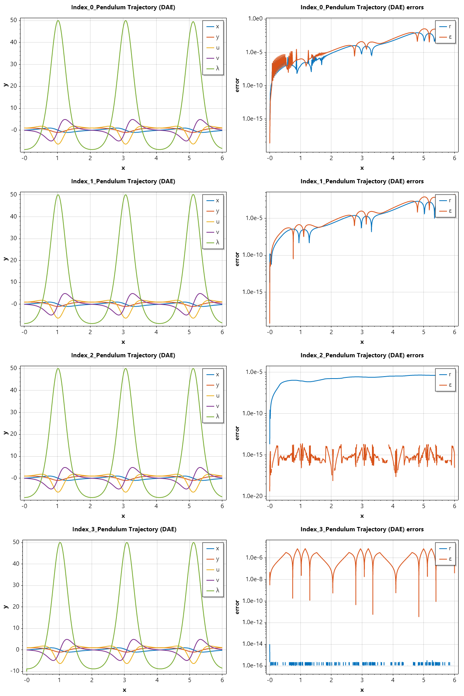

Differential Algebraic Equations
================================

1. Introduction to DAEs
-----------------------
Differential-Algebraic Equations are a class of functional equations that contain both differential equations (describing the evolution of the system) and algebraic constraints (restricting the state space). Unlike standard Ordinary Differential Equations (ODEs), DAEs are not explicitly solved for all derivatives.

A general DAE system is expressed in the implicit form: :math:`F(t, y, y') = 0`

If the Jacobian :math:`\frac{\partial F}{\partial y'}` is non-singular, the system is essentially an implicit ODE. If it is singular, the system is a "true" DAE.

2. The Concept of Index
-----------------------
The difficulty of solving a DAE is measured by its **index**. The most common definition is the **differentiation index**: the number of times you must differentiate the algebraic constraints to express the system as a set of explicit ODEs.
* **Index 0:** An ODE.
* **Index 1:** The most common solvable DAE (e.g., the algebraic variables can be solved for directly).
* **Higher Index (2+):** These are numerically unstable and usually require index reduction techniques before solving.

3. Solving DAEs with `sepalsolver`
----------------------------------
In modern computational environments like C#, DAEs can be solved using the `SepalSolver` library, which utilizes a Mass Matrix formulation:
:math:`M y' = f(t, y)`
Where :math:`M` is a singular matrix.

---

4. Examples and Applications
----------------------------

.. admonition:: Example 1 : 

   **Example 1: The Robertson Problem (Chemical Kinetics)**
   This is a classic stiff DAE representing the reaction of three species. It is an Index-1 DAE where the total mass is conserved via an algebraic constraint.
   
   
   
   .. code-block:: csharp
   
      double[] robertson_f(double t, double[] y) =>
          [(-0.04 * y[0] + 1e4 * y[1] * y[2]),
           (0.04 * y[0] - 1e4 * y[1] * y[2] - 3e7 * y[1]*y[1]),
           y[0] + y[1] + y[2] - 1.0];
   
      double[,] mass_f = Diag([1, 1, 0]);
   
      double[] y0 = [1.0, 0.0, 0.0];
      (ColVec T, Matrix Y) = Ode43a(robertson_f, mass_f, y0, [0, 1e7]);
      // Plot the result
      Y[.., 1] = 1e4*Y[.., 1];
      SemiLogx(T, Y);
      Xlabel("Time t"); Ylabel("Soluton y");
      Legend(["y_1", "1e4*y_2", "y_3"], MiddleLeft);
      Title("Solution of Robertson's ODE with ODE43a");
      SaveAs("Robertson-ODE-given-points-Ode43a.png");
   
   
   .. figure:: images/Robertson-ODE-given-points-Ode43a.png
      :align: center
      :alt: Robertson-ODE-given-points-Ode43a.png
   

.. admonition:: Example 1 :  The Simple Pendulum (Index-1)

   A pendulum in Cartesian coordinates is naturally an Index-3 DAE. We solve the stabilized Index-1 version by including velocity constraints.
   
   The position of the pendulum :math:`(x, y)` must satisfy the rigid rod constraint: 
   :math:`x^2 + y^2 - 1 = 0`
   
   **The Index-1 Formulation**
   To reduce the index, we differentiate the constraint twice. The second derivative introduces the accelerations :math:`x''` and :math:`y''`, allowing us to solve for the Lagrange multiplier :math:`\lambda` (tension).
   
   The resulting Index-1 system is:
   
   .. math::
   
      \begin{array}{rcl}
      x' &=& u \\
      y' &=& v \\
      u' &=& -\lambda x \\
      v' &=& -\lambda  y - g \\
      0 &=& u^2 + v^2 - y g - \lambda
      \end{array}    
   
   
   
   
   .. code-block:: csharp
   
      double g = 9.81;
   
      // State vector y = [x, y, u, v, λ]
      double[] pendulum_f(double t, double[] y) =>
          [y[2],
           y[3],
           -y[0] * y[4],
           -y[1] * y[4] - g,
           y[2]*y[2] + y[3]*y[3] - y[1] * g - y[4]];
   
      double[,] mass_f = Diag([1, 1, 1, 1, 0]);
   
      double[] y0 = [0, 1, 1, 0, 1 - g];
      var opts = Odeset(Stats: true, RelTol: 1e-6);
      (ColVec T, Matrix Y) = Ode43a(pendulum_f, mass_f, y0, [0, 6], opts);
      Plot(T, Y, Linewidth: 2); Xlabel("x"); Ylabel("y");
      Legend(["x", "y", "u", "v", "λ"]);
      Title("Pendulum Trajectory (DAE)");
      SaveAs("Index_1-Pendulum-Problem-Ode43a.png");
   
   
   Ouput
   
   .. terminal::
   
      Summary of statistics by Ode43a
              1054 successful steps
              16 failed attempts
              30517 function evaluations
              1070 partial derivatives
              4280 LU decompositions
              19799 solutions of linear systems
      
   
   .. figure:: images/Index_1-Pendulum-Problem-Ode43a.png
      :align: center
      :alt: Index_1-Pendulum-Problem-Ode43a.png
   

As an exercise, the reader is encouraged to solve the problem using 
this initial condition y0 = [1, 0, 0, 1, 1];

.. admonition:: Example 2 :  Semi-Explicit DAE (The Transistor Amplifier)**

   This example mimics the "hbdae" problem from MathWorks, representing an electrical circuit with nonlinear components.
   
   The transistor amplifier circuit contains six resistors, three capacitors, and a transistor.
   
   .. figure:: images/Transistor.png
       :align: center
       :alt: Transistor.png
   
   - The initial voltage signal is :math:`U_e(t) = 0.4\sin(200\pi t)`.
   - The operating voltage is :math:`U_b = 6`.
   - The voltages at the nodes are given by: :math:`U_i(t)(i = 1, 2, 3, 4, 5)`.
   - The values of the resistors  :math:`R_i(t)(i = 1, 2, 3, 4, 5)`. are constant, and the current through each resistor satisfies :math:`I = U/R`.
   - The values of the capacitors :math:`C_i(i = 1, 2, 3)` are constant, and the current through each capacitor satisfies :math:`I=C⋅dU/dt`.
   
   The goal is to solve for the output voltage through node 5, :math:`U_5(t)`.
   Using Kirchoff's law to equalize the current through each node (1 through 5), you can obtain a system of five equations describing the circuit:
   
   Node 1: :math:`C_1(U'_2 - U'_1) = (U_1 - U_e(t))/R_0`
   
   Node 2: :math:`C_1(U'_1 - U'_2) = (U_2 - U_b)/R_1 + U_2/R_1 + 0.01f(U_2 - U_3)`
   
   Node 3: :math:`-C_2U'_3 = U_3/R_3 - f(U_2 - U_3)`
   
   Node 4: :math:`C_3(U'_5 - U'_4) = (U_4 - U_b)/R_4 + 0.99f(U_2 - U_3)`
   
   Node 5: :math:`C_3(U'_4 - U'_5) = U_5/R_5`
   
   By extracting the coeeficients of the derivatives into a matrix, we have:
   
   .. math::
   
      \begin{pmatrix}
      -c_{1} &  c_{1} &     0    &    0     &     0    \\
      c_{1} & -c_{1} &     0    &    0     &     0    \\
      0    &   0    & -c_{ 2}  &    0     &     0    \\
      0    &   0    &    0     & -c_{ 3}  &  c_{ 3}  \\
      0    &   0    &    0     &  c_{ 3}  & -c_{ 3}
      \end{pmatrix}
      \begin{pmatrix}
      U'_1 \\  U'_2 \\ U'_3 \\ U'_4 \\ U'_5 
      \end{pmatrix} = 
      \begin{pmatrix}
      (U_1 - U_e(t))/R_0 \\  
      (U_2 - U_b)/R_1 + U_2/R_1 + 0.01f(U_2 - U_3) \\ 
      U_3/R_3 - f(U_2 - U_3) \\ 
      (U_4 - U_b)/R_4 + 0.99f(U_2 - U_3) \\ 
      U_5/R_5
      \end{pmatrix}
   
   
   
   .. code-block:: csharp
   
      double Ub = 6, R0 = 1000, R15 = 9000, alpha = 0.99,
          beta = 1e-6, Uf = 0.026, c1 = 1e-6, c2 = 2e-6, c3 = 3e-6;
      double[,] Mass = new double[,]
      {
          {-c1,  c1,  0,   0,   0 },
          { c1, -c1,  0,   0,   0 },
          { 0,   0,  -c2,  0,   0 },
          { 0,   0,   0,  -c3,  c3},
          { 0,   0,   0,   c3, -c3}
      };
      double Ue(double t) => 0.4 * Sin(200 * pi * t);
      double[] dudt(double t, double[] u)
      {
          double f23 = beta * (Exp((u[1] - u[2]) / Uf) - 1);
          return [ -(Ue(t) - u[0])/R0,
                   -(Ub/R15 - u[1]*2/R15 - (1-alpha)*f23),
                   -(f23 - u[2]/R15),
                   -((Ub - u[3])/R15 - alpha*f23),
                   u[4]/R15 ];
      }
      double[] tspan = [0, 0.1];
      double[] y0 = [0, Ub / 2, Ub / 2, Ub, 0];
   
      var opts = Odeset(RelTol: 1e-5);
      (ColVec T, Matrix Y) = Ode43a(dudt, Mass, y0, tspan, opts);
      Scatter(T, Arrayfun(Ue, T), "o"); HoldOn();
      Plot(T, Y[.., 4], "--r"); HoldOff();
      Legend(["Input", "Output"], UpperLeft);
      Xlabel("Time t"); Ylabel("Solution y");
      Title("One Transistor Amplifier DAE Problem-Ode43a");
      SaveAs("One-Transistor-Amplifier-DAE-Problem-Ode43a.png");
   
   
   .. figure:: images/One-Transistor-Amplifier-DAE-Problem-Ode43a.png
      :align: center
      :alt: One-Transistor-Amplifier-DAE-Problem-Ode43a.png
   

.. admonition:: Example 3 :  The Akzo Nobel Problem

   A high-dimensional DAE describing a chemical process with 6 differential and 2 algebraic equations. This tests the solver's ability to handle stiff systems with coupled variables.
   
   **Mathematical Description:**
   The system is defined by reaction rates :math:`r_i` and concentrations :math:`y_1, ..., y_8`:
   
   
   .. math::
   
      \begin{array}{rcl}
      r_1 &=& k_1 \cdot y_1^4 \cdot y_2^{0.5}\\
      r_2 &=& k_2 \cdot y_3 \cdot y_4 \\
      r_3 &=& k_2 / K \cdot y_1 \cdot y_5\\
      r_4 &=& k_3 \cdot y_1 \cdot y_4^2\\
      r_5 &=& k_4 \cdot y_6^2 \cdot y_2^{0.5}
      \end{array}
   
   
   The differential equations are:
   
   .. math::
   
      \begin{array}{rcl}
      y_1' &=& -2r_1 + r_2 - r_3 - r_4\\
      y_2' &=& -0.5r_1 - r_5 + 0.5F_{in}\\
      y_3' &=& r_1 - r_2 + r_3\\
      y_4' &=& -r_2 + r_3 - 2r_4\\
      y_5' &=& r_2 - r_3 + r_4\\
      y_6' &=& -r_5
      \end{array}
   
   
   The algebraic constraints (Equilibrium):
   
   .. math::
   
      \begin{array}{rcl}
      0 &=& y_1 \cdot y_3 - y_7\\
      0 &=& y_4 \cdot y_5 - y_8
      \end{array}
   
   
   
   .. code-block:: csharp
   
      double k1 = 18.7, k2 = 0.58, k3 = 0.09, k4 = 0.42, K = 34.4, Fin = 0.012;
      double r1(double[] y) => k1 * Pow(y[0], 4) * Pow(y[1], 0.5);
      double r2(double[] y) => k2 * y[2] * y[3];
      double r3(double[] y) => (k2 / K) * y[0] * y[4];
      double r4(double[] y) => k3 * y[0] * Pow(y[3], 2);
      double r5(double[] y) => k4 * Pow(y[5], 2) * Pow(y[1], 0.5);
   
      double[] akzo_f(double t, double[] y) =>
          [
              -2*r1(y) + r2(y) - r3(y) - r4(y),
              -0.5*r1(y) - r5(y) + 0.5*Fin,
              r1(y) - r2(y) + r3(y),
              -r2(y) + r3(y) - 2*r4(y),
              r2(y) - r3(y) + r4(y),
              -r5(y),
              y[0] * y[2] - y[6],
              y[3] * y[4] - y[7]
          ];
   
      double[,] mass_f = Diag([1, 1, 1, 1, 1, 1, 0, 0]);
      double[] y0 = [0.444, 0.0012, 0.0, 0.0037, 0.0, 0.0, 0.0, 0.0];
      (ColVec T, Matrix Y) = Ode43a(akzo_f, mass_f, y0, [0, 180]);
      Plot(T, Y);
      Xlabel("Time"); Ylabel("Concentration");
      Title("Akzo Nobel Chemical Kinetics (DAE)");
      SaveAs("Akzo-Nobel-Ode43a.png");
   
   
   .. figure:: images/Akzo-Nobel-Ode43a.png
      :align: center
      :alt: Akzo-Nobel-Ode43a.png
   

Index-2 DAE
-----------
Most DAE solvers usually avoid solving DAEs in index 2 form. But SepalSolver is able to handle most index 2 DAEs to a relative tolerance of :math:`10^{-4}`.

Now we look at examples of index 2 DAEs

.. admonition:: Example 4 :  

   Usnig the example from "On the numerical solution of differential–algebraic equations with index-2" by Ercan Celık
   
   .. math::
   
      \begin{align}
      x'_1 &= \left(\alpha - \cfrac{1}{2 - t}\right)x_1 + (2 - t)\alpha z + \cfrac{3 - t}{2 - t}x_2 \\
      x'_2 &= \cfrac{1 - \alpha}{t - 2} x_1 - x_2 + (\alpha - 1)z + 2e^t \\
      0 &= (t + 2)x_1 + (t^2 - 4)x_2 - (t^2 + t - 2)e^t
      \end{align}
   
   
   Intial condition: :math:`x_1(0) = 1, x_2(0) = 1`;
   
   SepalSolver has the ability to compute consistent initial conditions for index 2 DAEs, so we can solve this problem without manually differentiating the algebraic constraint.
   
   
   .. code-block:: csharp
   
      // define the DAE
      double alpha = 10;
      double[] Ercan(double t, double[] x) =>
          [ (alpha - 1/(2-t))*x[0] + (2-t)*alpha*x[2] + (3-t)/(2-t)*x[1],
            (1-alpha)/(t-2)*x[0] - x[1] + (alpha-1)*x[2] + 2*Exp(t),
            (t+2)*x[0] + (t*t-4)*x[1] - (t*t+t-2)*Exp(t) ];
   
      double[,] mass_f = Diag([1, 1, 0]);
      double[] y0 = [1, 1, 0]; // only the differential variables need initial conditions
      var opts = Odeset(Stats: true);
      (ColVec T, Matrix Y) = Ode43a(Ercan, mass_f, y0, [0, 1], opts);
      Scatter(T, Hcart(Exp(T), Exp(T), -Exp(T).Div(2-T)), "o"); HoldOn();
      Plot(T, Y); HoldOff();
      Xlabel("Time t"); Ylabel("Solution x");
      Legend(["x_1_Exact", "x_2_Exact", "z_Exact", "x_1_NumSol", "x_2_NumSol", "z_NumSol"]);
      Title("Index-2 DAE Example (Ercan Celık)");
      SaveAs("Index-2-DAE-Ercan-Celik.png");
   
      // We can actually print out the result to compare with the analytical solution
      Console.WriteLine("""
              t   ||  x_1_NumSol(t)  |  x_1_Exact(t)  ||  x_2_NumSol(t)  |  x_2_Exact(t)  ||   z_NumSol(t)   |   z_Exact(t) 
          --------++-----------------+----------------++-----------------+----------------++-----------------+---------------
          """);
      for (int i = 0; i < T.Numel; i++)
      {
          Console.WriteLine($"""
                {T[i]:F2}  ||     {Y[i, 0]:F6}    |    {Exp(T[i]):F6}    ||     {Y[i, 1]:F6}    |    {Exp(T[i]):F6}    ||     {Y[i, 2]:F6}   |  {-Exp(T[i])/(2-T[i]):F6}
              """);
      }
   
      // We can compute the solution to a higher accuracy 
      Console.WriteLine("\n\nNow we compute the solution to a higher accuracy (RelTol = 1e-5):\n");
      opts = Odeset(Stats: true, RelTol: 1e-5);
      (T, Y) = Ode43a(Ercan, mass_f, y0, [0, 1], opts);
      Console.WriteLine("""
              t   ||  x_1_NumSol(t)  |  x_1_Exact(t)  ||  x_2_NumSol(t)  |  x_2_Exact(t)  ||   z_NumSol(t)   |   z_Exact(t) 
          --------++-----------------+----------------++-----------------+----------------++-----------------+---------------
          """);
      for (int i = 0; i < T.Numel; i++)
      {
          Console.WriteLine($"""
                {T[i]:F2}  ||     {Y[i, 0]:F6}    |    {Exp(T[i]):F6}    ||     {Y[i, 1]:F6}    |    {Exp(T[i]):F6}    ||     {Y[i, 2]:F6}   |  {-Exp(T[i])/(2-T[i]):F6}
              """);
      }
   
   
   Ouput
   
   .. terminal::
   
      Summary of statistics by Ode43a
              11 successful steps
              0 failed attempts
              486 function evaluations
              11 partial derivatives
              44 LU decompositions
              384 solutions of linear systems
      
          t   ||  x_1_NumSol(t)  |  x_1_Exact(t)  ||  x_2_NumSol(t)  |  x_2_Exact(t)  ||   z_NumSol(t)   |   z_Exact(t) 
      --------++-----------------+----------------++-----------------+----------------++-----------------+---------------
        0.00  ||     1.000000    |    1.000000    ||     1.000000    |    1.000000    ||     -0.500000   |  -0.500000
        0.01  ||     1.010050    |    1.010050    ||     1.010050    |    1.010050    ||     -0.507565   |  -0.507563
        0.11  ||     1.116229    |    1.116278    ||     1.116252    |    1.116278    ||     -0.590847   |  -0.590623
        0.21  ||     1.233620    |    1.233678    ||     1.233645    |    1.233678    ||     -0.689409   |  -0.689206
        0.31  ||     1.363366    |    1.363425    ||     1.363390    |    1.363425    ||     -0.806963   |  -0.806760
        0.41  ||     1.506760    |    1.506818    ||     1.506781    |    1.506818    ||     -0.947883   |  -0.947684
        0.51  ||     1.665236    |    1.665291    ||     1.665254    |    1.665291    ||     -1.117834   |  -1.117645
        0.61  ||     1.840381    |    1.840431    ||     1.840395    |    1.840431    ||     -1.324222   |  -1.324051
        0.71  ||     2.033947    |    2.033991    ||     2.033957    |    2.033991    ||     -1.576879   |  -1.576737
        0.81  ||     2.247872    |    2.247908    ||     2.247878    |    2.247908    ||     -1.889096   |  -1.888998
        0.91  ||     2.484298    |    2.484323    ||     2.484300    |    2.484323    ||     -2.279232   |  -2.279195
        1.00  ||     2.718273    |    2.718282    ||     2.718273    |    2.718282    ||     -2.718256   |  -2.718282
      
      
      Now we compute the solution to a higher accuracy (RelTol = 1e-5):
      
      Summary of statistics by Ode43a
              51 successful steps
              35 failed attempts
              3034 function evaluations
              86 partial derivatives
              309 LU decompositions
              2367 solutions of linear systems
      
          t   ||  x_1_NumSol(t)  |  x_1_Exact(t)  ||  x_2_NumSol(t)  |  x_2_Exact(t)  ||   z_NumSol(t)   |   z_Exact(t) 
      --------++-----------------+----------------++-----------------+----------------++-----------------+---------------
        0.00  ||     1.000000    |    1.000000    ||     1.000000    |    1.000000    ||     -0.500000   |  -0.500000
        0.01  ||     1.010050    |    1.010050    ||     1.010050    |    1.010050    ||     -0.507565   |  -0.507563
        0.05  ||     1.055859    |    1.055862    ||     1.055860    |    1.055862    ||     -0.542729   |  -0.542680
        0.10  ||     1.106491    |    1.106495    ||     1.106493    |    1.106495    ||     -0.582788   |  -0.582733
        0.15  ||     1.160230    |    1.160235    ||     1.160233    |    1.160235    ||     -0.626743   |  -0.626688
        0.20  ||     1.217541    |    1.217546    ||     1.217543    |    1.217546    ||     -0.675286   |  -0.675228
        0.25  ||     1.278831    |    1.278837    ||     1.278834    |    1.278837    ||     -0.729138   |  -0.729077
        0.30  ||     1.344534    |    1.344540    ||     1.344536    |    1.344540    ||     -0.789137   |  -0.789074
        0.35  ||     1.415157    |    1.415164    ||     1.415160    |    1.415164    ||     -0.856313   |  -0.856246
        0.40  ||     1.491307    |    1.491315    ||     1.491310    |    1.491315    ||     -0.931942   |  -0.931872
        0.45  ||     1.573719    |    1.573727    ||     1.573722    |    1.573727    ||     -1.017643   |  -1.017570
        0.51  ||     1.663297    |    1.663305    ||     1.663299    |    1.663305    ||     -1.115494   |  -1.115418
        0.57  ||     1.761180    |    1.761188    ||     1.761182    |    1.761188    ||     -1.228234   |  -1.228155
        0.63  ||     1.868846    |    1.868855    ||     1.868848    |    1.868855    ||     -1.359569   |  -1.359489
        0.69  ||     1.988277    |    1.988287    ||     1.988280    |    1.988287    ||     -1.514704   |  -1.514624
        0.69  ||     2.001288    |    2.001297    ||     2.001290    |    2.001297    ||     -1.532126   |  -1.532146
        0.75  ||     2.115598    |    2.115605    ||     2.115600    |    2.115605    ||     -1.691651   |  -1.691592
        0.76  ||     2.130305    |    2.130311    ||     2.130306    |    2.130311    ||     -1.712822   |  -1.712838
        0.76  ||     2.143131    |    2.143136    ||     2.143132    |    2.143136    ||     -1.731493   |  -1.731506
        0.77  ||     2.156035    |    2.156039    ||     2.156036    |    2.156039    ||     -1.750408   |  -1.750419
        0.77  ||     2.169016    |    2.169019    ||     2.169016    |    2.169019    ||     -1.769571   |  -1.769581
        0.78  ||     2.182075    |    2.182078    ||     2.182075    |    2.182078    ||     -1.788987   |  -1.788995
        0.79  ||     2.195212    |    2.195215    ||     2.195213    |    2.195215    ||     -1.808659   |  -1.808667
        0.79  ||     2.208429    |    2.208431    ||     2.208429    |    2.208431    ||     -1.828592   |  -1.828599
        0.80  ||     2.221725    |    2.221727    ||     2.221725    |    2.221727    ||     -1.848791   |  -1.848796
        0.80  ||     2.235101    |    2.235103    ||     2.235101    |    2.235103    ||     -1.869259   |  -1.869264
        0.81  ||     2.248557    |    2.248559    ||     2.248558    |    2.248559    ||     -1.890001   |  -1.890005
        0.82  ||     2.262095    |    2.262096    ||     2.262095    |    2.262096    ||     -1.911022   |  -1.911025
        0.82  ||     2.275714    |    2.275715    ||     2.275714    |    2.275715    ||     -1.932326   |  -1.932329
        0.83  ||     2.289415    |    2.289416    ||     2.289415    |    2.289416    ||     -1.953919   |  -1.953921
        0.83  ||     2.303198    |    2.303199    ||     2.303198    |    2.303199    ||     -1.975804   |  -1.975806
        0.84  ||     2.317065    |    2.317065    ||     2.317065    |    2.317065    ||     -1.997988   |  -1.997989
        0.85  ||     2.331014    |    2.331015    ||     2.331015    |    2.331015    ||     -2.020474   |  -2.020476
        0.85  ||     2.345048    |    2.345049    ||     2.345048    |    2.345049    ||     -2.043269   |  -2.043270
        0.86  ||     2.359167    |    2.359167    ||     2.359167    |    2.359167    ||     -2.066378   |  -2.066379
        0.86  ||     2.373370    |    2.373370    ||     2.373370    |    2.373370    ||     -2.089806   |  -2.089806
        0.87  ||     2.387659    |    2.387659    ||     2.387659    |    2.387659    ||     -2.113558   |  -2.113559
        0.88  ||     2.402033    |    2.402034    ||     2.402033    |    2.402034    ||     -2.137641   |  -2.137641
        0.88  ||     2.416495    |    2.416495    ||     2.416495    |    2.416495    ||     -2.162059   |  -2.162060
        0.89  ||     2.431043    |    2.431043    ||     2.431043    |    2.431043    ||     -2.186820   |  -2.186820
        0.89  ||     2.445679    |    2.445679    ||     2.445679    |    2.445679    ||     -2.211929   |  -2.211929
        0.90  ||     2.460403    |    2.460403    ||     2.460403    |    2.460403    ||     -2.237392   |  -2.237392
        0.91  ||     2.475216    |    2.475216    ||     2.475216    |    2.475216    ||     -2.263215   |  -2.263216
        0.91  ||     2.490118    |    2.490118    ||     2.490118    |    2.490118    ||     -2.289406   |  -2.289406
        0.92  ||     2.505109    |    2.505110    ||     2.505110    |    2.505110    ||     -2.315970   |  -2.315970
        0.92  ||     2.520191    |    2.520191    ||     2.520191    |    2.520191    ||     -2.342915   |  -2.342915
        0.93  ||     2.535364    |    2.535364    ||     2.535364    |    2.535364    ||     -2.370246   |  -2.370246
        0.94  ||     2.550628    |    2.550628    ||     2.550628    |    2.550628    ||     -2.397972   |  -2.397972
        0.94  ||     2.565984    |    2.565984    ||     2.565984    |    2.565984    ||     -2.426100   |  -2.426100
        0.95  ||     2.580822    |    2.580822    ||     2.580822    |    2.580822    ||     -2.453504   |  -2.453504
        0.95  ||     2.594249    |    2.594249    ||     2.594249    |    2.594249    ||     -2.478496   |  -2.478496
        1.00  ||     2.718281    |    2.718282    ||     2.718281    |    2.718282    ||     -2.718285   |  -2.718282
   
   .. figure:: images/Index-2-DAE-Ercan-Celik.png
      :align: center
      :alt: Index-2-DAE-Ercan-Celik.png
   
   
   

.. admonition:: Example 5 :  Pendulum position constraint (Index-2)

   To reduce the index, if we differentiated the constraint once instead of twice, we end up with index 2 problem. 
   
   The resulting Index-1 system is:
   
   .. math::
   
      \begin{array}{rcl}
      x' &=& u \\
      y' &=& v \\
      u' &=& -\lambda x \\
      v' &=& -\lambda  y - g \\
      0 &=& x u + y v
      \end{array}    
   
   
   
   
   .. code-block:: csharp
   
      double g = 9.81;
   
      // State vector y = [x, y, u, v, λ]
      double[] pendulum_f(double t, double[] y) =>
          [y[2],
           y[3],
           -y[0] * y[4],
           -y[1] * y[4] - g,
           y[0]*y[2] + y[1]*y[3]];
   
      double[,] mass_f = Diag([1, 1, 1, 1, 0]);
   
      double[] y0 = [0, 1, 1, 0, -1];
      var opts = Odeset(Stats: true);
      (ColVec T, Matrix Y) = Ode43a(pendulum_f, mass_f, y0, [0, 6], opts);
      Plot(T, Y, Linewidth: 2); Xlabel("x"); Ylabel("y");
      Legend(["x", "y", "u", "v", "λ"]);
      Title("Pendulum Trajectory (DAE)");
      SaveAs("Index_2-Pendulum-Problem-Ode43a.png");
   
      Console.WriteLine("\n\n");
      Console.WriteLine(Hcart(T, Y));
   
   
   
   Ouput
   
   .. terminal::
   
      Summary of statistics by Ode43a
              768 successful steps
              744 failed attempts
              45120 function evaluations
              1512 partial derivatives
              4671 LU decompositions
              31359 solutions of linear systems
      
      
      
      
      
         0.0000   -0.0000    1.0000    1.0000    0.0000   -8.8100
         0.0600    0.0603    0.9982    1.0159   -0.0614   -8.7513
         0.1448    0.1492    0.9888    1.0920   -0.1648   -8.4683
         0.1558    0.1614    0.9869    1.1065   -0.1809   -8.4239
         0.1669    0.1737    0.9848    1.1221   -0.1979   -8.3622
         0.1780    0.1862    0.9825    1.1387   -0.2158   -8.2949
         0.1890    0.1989    0.9800    1.1563   -0.2347   -8.2215
         0.2001    0.2118    0.9773    1.1749   -0.2546   -8.1419
         0.2112    0.2249    0.9744    1.1945   -0.2757   -8.0555
         0.2222    0.2383    0.9712    1.2150   -0.2981   -7.9621
         0.2333    0.2518    0.9678    1.2364   -0.3217   -7.8612
         0.2444    0.2656    0.9641    1.2588   -0.3468   -7.7523
         0.2554    0.2797    0.9601    1.2820   -0.3735   -7.6350
         0.2665    0.2940    0.9558    1.3060   -0.4017   -7.5088
         0.2776    0.3086    0.9512    1.3309   -0.4318   -7.3731
         0.2886    0.3235    0.9462    1.3564   -0.4637   -7.2273
         0.2997    0.3386    0.9409    1.3826   -0.4976   -7.0708
         0.3108    0.3541    0.9352    1.4094   -0.5336   -6.9029
         0.3218    0.3698    0.9291    1.4367   -0.5718   -6.7229
         0.3329    0.3859    0.9226    1.4644   -0.6125   -6.5301
         0.3440    0.4022    0.9155    1.4924   -0.6557   -6.3236
         0.3550    0.4189    0.9080    1.5206   -0.7015   -6.1026
         0.3661    0.4359    0.9000    1.5489   -0.7502   -5.8662
         0.3772    0.4532    0.8914    1.5772   -0.8018   -5.6135
         0.3882    0.4708    0.8822    1.6052   -0.8566   -5.3435
         0.3993    0.4887    0.8725    1.6328   -0.9147   -5.0551
         0.4104    0.5069    0.8620    1.6598   -0.9761   -4.7472
         0.4214    0.5255    0.8508    1.6860   -1.0412   -4.4187
         0.4325    0.5443    0.8389    1.7111   -1.1101   -4.0684
         0.4436    0.5633    0.8262    1.7350   -1.1829   -3.6951
         0.4546    0.5826    0.8127    1.7571   -1.2597   -3.2973
         0.4657    0.6022    0.7983    1.7774   -1.3407   -2.8739
         0.4766    0.6216    0.7833    1.7951   -1.4246   -2.4314
         0.4872    0.6408    0.7677    1.8098   -1.5105   -1.9732
         0.4976    0.6596    0.7516    1.8215   -1.5985   -1.4990
         0.5077    0.6781    0.7350    1.8301   -1.6885   -1.0086
         0.5176    0.6963    0.7177    1.8352   -1.7805   -0.5015
         0.5274    0.7142    0.6999    1.8369   -1.8744    0.0225
         0.5370    0.7318    0.6815    1.8349   -1.9702    0.5640
         0.5463    0.7489    0.6627    1.8291   -2.0671    1.1190
         0.5554    0.7656    0.6434    1.8194   -2.1650    1.6872
         0.5644    0.7817    0.6236    1.8058   -2.2637    2.2684
         0.5731    0.7974    0.6034    1.7881   -2.3631    2.8630
         0.5816    0.8127    0.5827    1.7663   -2.4631    3.4711
         0.5901    0.8274    0.5616    1.7402   -2.5637    4.0925
         0.5983    0.8416    0.5401    1.7099   -2.6647    4.7276
         0.6064    0.8554    0.5180    1.6751   -2.7660    5.3761
         0.6144    0.8686    0.4955    1.6358   -2.8675    6.0382
         0.6223    0.8813    0.4726    1.5919   -2.9689    6.7139
         0.6300    0.8935    0.4491    1.5434   -3.0702    7.4030
         0.6377    0.9051    0.4253    1.4900   -3.1712    8.1055
         0.6452    0.9161    0.4009    1.4318   -3.2716    8.8214
         0.6527    0.9266    0.3762    1.3687   -3.3714    9.5505
         0.6601    0.9364    0.3509    1.3006   -3.4703   10.2928
         0.6674    0.9456    0.3253    1.2274   -3.5682   11.0481
         0.6746    0.9542    0.2992    1.1490   -3.6647   11.8163
         0.6817    0.9621    0.2726    1.0654   -3.7598   12.5971
         0.6888    0.9694    0.2457    0.9765   -3.8531   13.3906
         0.6958    0.9759    0.2183    0.8823   -3.9444   14.1963
         0.7028    0.9817    0.1905    0.7827   -4.0336   15.0142
         0.7097    0.9867    0.1623    0.6777   -4.1202   15.8441
         0.7166    0.9910    0.1337    0.5672   -4.2042   16.6856
         0.7232    0.9944    0.1059    0.4558   -4.2820   17.5053
         0.7290    0.9968    0.0805    0.3513   -4.3494   18.2509
         0.7342    0.9983    0.0576    0.2544   -4.4074   18.9242
         0.7389    0.9993    0.0372    0.1657   -4.4569   19.5267
         0.7429    0.9998    0.0191    0.0861   -4.4986   20.0568
         0.7463    1.0000    0.0038    0.0172   -4.5327   20.5086
         0.7731    0.9927   -0.1208   -0.5790   -4.7596   24.1815
         0.7773    0.9900   -0.1409   -0.6813   -4.7875   24.7664
         0.7815    0.9869   -0.1611   -0.7858   -4.8129   25.3623
         0.7857    0.9834   -0.1815   -0.8925   -4.8358   25.9613
         0.7899    0.9794   -0.2019   -1.0012   -4.8559   26.5630
         0.7942    0.9750   -0.2225   -1.1120   -4.8732   27.1670
         0.7984    0.9700   -0.2431   -1.2247   -4.8877   27.7729
         0.8026    0.9646   -0.2637   -1.3393   -4.8990   28.3805
         0.8068    0.9587   -0.2844   -1.4556   -4.9072   28.9892
         0.8110    0.9523   -0.3051   -1.5737   -4.9122   29.5988
         0.8152    0.9454   -0.3258   -1.6934   -4.9138   30.2088
         0.8195    0.9380   -0.3466   -1.8147   -4.9119   30.8188
         0.8237    0.9301   -0.3673   -1.9373   -4.9064   31.4283
         0.8279    0.9217   -0.3879   -2.0613   -4.8972   32.0369
         0.8321    0.9127   -0.4086   -2.1864   -4.8843   32.6441
         0.8363    0.9032   -0.4292   -2.3126   -4.8674   33.2495
         0.8406    0.8932   -0.4496   -2.4398   -4.8466   33.8525
         0.8448    0.8827   -0.4700   -2.5677   -4.8217   34.4528
         0.8490    0.8716   -0.4903   -2.6963   -4.7927   35.0496
         0.8532    0.8599   -0.5105   -2.8254   -4.7595   35.6426
         0.8574    0.8477   -0.5305   -2.9549   -4.7220   36.2312
         0.8617    0.8350   -0.5503   -3.0845   -4.6801   36.8149
         0.8659    0.8217   -0.5700   -3.2142   -4.6338   37.3931
         0.8701    0.8079   -0.5894   -3.3437   -4.5830   37.9653
         0.8743    0.7935   -0.6086   -3.4729   -4.5277   38.5309
         0.8785    0.7786   -0.6276   -3.6016   -4.4679   39.0893
         0.8827    0.7631   -0.6463   -3.7296   -4.4035   39.6401
         0.8870    0.7471   -0.6647   -3.8568   -4.3345   40.1825
         0.8912    0.7305   -0.6829   -3.9829   -4.2609   40.7161
         0.8954    0.7135   -0.7007   -4.1077   -4.1827   41.2403
         0.8996    0.6959   -0.7182   -4.2311   -4.0998   41.7545
         0.9038    0.6778   -0.7353   -4.3528   -4.0124   42.2581
         0.9081    0.6592   -0.7520   -4.4727   -3.9205   42.7506
         0.9123    0.6400   -0.7683   -4.5905   -3.8240   43.2314
         0.9165    0.6204   -0.7843   -4.7061   -3.7230   43.6999
         0.9207    0.6003   -0.7998   -4.8192   -3.6176   44.1556
         0.9249    0.5798   -0.8148   -4.9297   -3.5078   44.5979
         0.9292    0.5588   -0.8293   -5.0373   -3.3938   45.0264
         0.9334    0.5373   -0.8434   -5.1419   -3.2755   45.4404
         0.9376    0.5154   -0.8570   -5.2432   -3.1532   45.8395
         0.9418    0.4930   -0.8700   -5.3412   -3.0269   46.2232
         0.9460    0.4703   -0.8825   -5.4355   -2.8967   46.5909
         0.9502    0.4472   -0.8945   -5.5260   -2.7628   46.9423
         0.9545    0.4237   -0.9058   -5.6125   -2.6252   47.2768
         0.9587    0.3998   -0.9166   -5.6949   -2.4843   47.5940
         0.9629    0.3756   -0.9268   -5.7730   -2.3400   47.8934
         0.9671    0.3511   -0.9363   -5.8467   -2.1926   48.1748
         0.9713    0.3263   -0.9453   -5.9157   -2.0422   48.4377
         0.9756    0.3012   -0.9536   -5.9800   -1.8891   48.6818
         0.9798    0.2759   -0.9612   -6.0394   -1.7334   48.9067
         0.9840    0.2503   -0.9682   -6.0938   -1.5753   49.1121
         0.9882    0.2245   -0.9745   -6.1431   -1.4150   49.2977
         0.9924    0.1985   -0.9801   -6.1871   -1.2528   49.4633
         0.9965    0.1729   -0.9849   -6.2250   -1.0930   49.6052
         1.0005    0.1484   -0.9889   -6.2563   -0.9391   49.7227
         1.0042    0.1250   -0.9922   -6.2817   -0.7917   49.8178
         1.0077    0.1028   -0.9947   -6.3018   -0.6513   49.8930
         1.0111    0.0818   -0.9967   -6.3171   -0.5184   49.9504
         1.0142    0.0621   -0.9981   -6.3283   -0.3938   49.9922
         1.0171    0.0439   -0.9990   -6.3359   -0.2782   50.0208
         1.0433   -0.1223   -0.9925   -6.2844    0.7741   49.7906
         1.0466   -0.1430   -0.9897   -6.2626    0.9047   49.7468
         1.0499   -0.1636   -0.9865   -6.2374    1.0345   49.6525
         1.0532   -0.1842   -0.9829   -6.2089    1.1635   49.5457
         1.0565   -0.2046   -0.9788   -6.1772    1.2914   49.4263
         1.0598   -0.2250   -0.9744   -6.1421    1.4183   49.2946
         1.0631   -0.2452   -0.9695   -6.1039    1.5439   49.1506
         1.0664   -0.2653   -0.9642   -6.0625    1.6682   48.9945
         1.0697   -0.2853   -0.9585   -6.0180    1.7912   48.8263
         1.0730   -0.3051   -0.9523   -5.9705    1.9126   48.6463
         1.0763   -0.3247   -0.9458   -5.9200    2.0324   48.4545
         1.0796   -0.3442   -0.9389   -5.8666    2.1505   48.2512
         1.0829   -0.3635   -0.9316   -5.8103    2.2669   48.0364
         1.0863   -0.3826   -0.9239   -5.7513    2.3813   47.8105
         1.0896   -0.4015   -0.9159   -5.6895    2.4939   47.5735
         1.0929   -0.4201   -0.9075   -5.6251    2.6044   47.3257
         1.0962   -0.4386   -0.8987   -5.5582    2.7128   47.0672
         1.0995   -0.4569   -0.8895   -5.4887    2.8190   46.7983
         1.1028   -0.4749   -0.8801   -5.4169    2.9230   46.5192
         1.1061   -0.4927   -0.8702   -5.3428    3.0246   46.2301
         1.1094   -0.5102   -0.8601   -5.2665    3.1239   45.9312
         1.1127   -0.5274   -0.8496   -5.1880    3.2208   45.6228
         1.1160   -0.5445   -0.8388   -5.1075    3.3152   45.3051
         1.1193   -0.5612   -0.8277   -5.0251    3.4071   44.9783
         1.1226   -0.5776   -0.8163   -4.9408    3.4963   44.6427
         1.1259   -0.5938   -0.8046   -4.8547    3.5830   44.2986
         1.1292   -0.6097   -0.7926   -4.7670    3.6670   43.9462
         1.1325   -0.6253   -0.7804   -4.6777    3.7483   43.5857
         1.1358   -0.6406   -0.7679   -4.5870    3.8269   43.2175
         1.1391   -0.6556   -0.7551   -4.4949    3.9027   42.8417
         1.1424   -0.6703   -0.7421   -4.4015    3.9758   42.4588
         1.1457   -0.6847   -0.7288   -4.3069    4.0461   42.0688
         1.1490   -0.6988   -0.7154   -4.2112    4.1136   41.6722
         1.1523   -0.7125   -0.7017   -4.1145    4.1782   41.2691
         1.1556   -0.7260   -0.6878   -4.0169    4.2401   40.8599
         1.1589   -0.7391   -0.6736   -3.9186    4.2991   40.4448
         1.1622   -0.7518   -0.6594   -3.8195    4.3553   40.0241
         1.1655   -0.7643   -0.6449   -3.7198    4.4086   39.5981
         1.1688   -0.7764   -0.6302   -3.6196    4.4592   39.1671
         1.1721   -0.7882   -0.6154   -3.5189    4.5069   38.7312
         1.1754   -0.7997   -0.6005   -3.4179    4.5518   38.2909
         1.1787   -0.8108   -0.5853   -3.3166    4.5940   37.8463
         1.1821   -0.8216   -0.5701   -3.2152    4.6334   37.3978
         1.1854   -0.8320   -0.5547   -3.1137    4.6700   36.9455
         1.1887   -0.8421   -0.5393   -3.0121    4.7040   36.4899
         1.1920   -0.8519   -0.5237   -2.9107    4.7352   36.0310
         1.1953   -0.8614   -0.5080   -2.8093    4.7638   35.5693
         1.1986   -0.8705   -0.4922   -2.7083    4.7898   35.1049
         1.2019   -0.8793   -0.4763   -2.6075    4.8132   34.6381
         1.2052   -0.8877   -0.4604   -2.5071    4.8340   34.1691
         1.2085   -0.8958   -0.4444   -2.4071    4.8523   33.6983
         1.2118   -0.9036   -0.4283   -2.3076    4.8682   33.2258
         1.2151   -0.9111   -0.4122   -2.2088    4.8816   32.7518
         1.2184   -0.9182   -0.3961   -2.1105    4.8926   32.2767
         1.2217   -0.9250   -0.3799   -2.0130    4.9012   31.8007
         1.2250   -0.9315   -0.3637   -1.9162    4.9076   31.3239
         1.2283   -0.9377   -0.3475   -1.8202    4.9117   30.8465
         1.2316   -0.9435   -0.3313   -1.7251    4.9136   30.3689
         1.2349   -0.9491   -0.3150   -1.6309    4.9134   29.8913
         1.2382   -0.9543   -0.2988   -1.5377    4.9110   29.4137
         1.2415   -0.9592   -0.2826   -1.4455    4.9066   28.9365
         1.2448   -0.9639   -0.2664   -1.3543    4.9003   28.4598
         1.2481   -0.9682   -0.2502   -1.2643    4.8919   27.9838
         1.2514   -0.9722   -0.2341   -1.1753    4.8817   27.5087
         1.2547   -0.9760   -0.2180   -1.0876    4.8697   27.0347
         1.2580   -0.9794   -0.2019   -1.0010    4.8559   26.5619
         1.2613   -0.9826   -0.1859   -0.9157    4.8403   26.0906
         1.2646   -0.9855   -0.1699   -0.8317    4.8231   25.6209
         1.2679   -0.9881   -0.1540   -0.7489    4.8043   25.1529
         1.2712   -0.9904   -0.1382   -0.6675    4.7839   24.6868
         1.2745   -0.9925   -0.1224   -0.5874    4.7620   24.2228
         1.2778   -0.9943   -0.1067   -0.5087    4.7387   23.7610
         1.2812   -0.9958   -0.0911   -0.4313    4.7140   23.3015
         1.2845   -0.9971   -0.0756   -0.3553    4.6879   22.8444
         1.2878   -0.9982   -0.0601   -0.2808    4.6606   22.3900
         1.2911   -0.9990   -0.0448   -0.2077    4.6321   21.9383
         1.2944   -0.9996   -0.0295   -0.1360    4.6023   21.4894
         1.2977   -0.9999   -0.0144   -0.0658    4.5715   21.0435
         1.3277   -0.9930    0.1182    0.5057    4.2480   17.1548
         1.3333   -0.9899    0.1419    0.5993    4.1805   16.4442
         1.3389   -0.9863    0.1652    0.6887    4.1115   15.7583
         1.3446   -0.9822    0.1881    0.7741    4.0410   15.0839
         1.3502   -0.9776    0.2106    0.8553    3.9694   14.4213
         1.3558   -0.9725    0.2328    0.9326    3.8967   13.7706
         1.3614   -0.9671    0.2545    1.0059    3.8231   13.1321
         1.3671   -0.9612    0.2757    1.0754    3.7489   12.5057
         1.3727   -0.9550    0.2966    1.1411    3.6741   11.8917
         1.3783   -0.9484    0.3170    1.2031    3.5990   11.2901
         1.3839   -0.9415    0.3371    1.2615    3.5236   10.7009
         1.3895   -0.9342    0.3567    1.3164    3.4482   10.1242
         1.3952   -0.9267    0.3758    1.3679    3.3728    9.5600
         1.4008   -0.9189    0.3946    1.4160    3.2975    9.0083
         1.4064   -0.9108    0.4129    1.4609    3.2225    8.4690
         1.4120   -0.9025    0.4308    1.5028    3.1479    7.9420
         1.4176   -0.8939    0.4483    1.5416    3.0738    7.4274
         1.4233   -0.8851    0.4654    1.5774    3.0002    6.9249
         1.4289   -0.8762    0.4820    1.6105    2.9273    6.4346
         1.4345   -0.8670    0.4983    1.6408    2.8551    5.9563
         1.4401   -0.8577    0.5141    1.6686    2.7837    5.4899
         1.4458   -0.8483    0.5296    1.6938    2.7131    5.0352
         1.4514   -0.8387    0.5446    1.7166    2.6434    4.5921
         1.4570   -0.8290    0.5593    1.7371    2.5747    4.1605
         1.4626   -0.8192    0.5736    1.7554    2.5070    3.7402
         1.4682   -0.8092    0.5875    1.7716    2.4403    3.3309
         1.4739   -0.7992    0.6010    1.7858    2.3747    2.9327
         1.4795   -0.7892    0.6142    1.7980    2.3102    2.5451
         1.4851   -0.7790    0.6270    1.8084    2.2469    2.1682
         1.4907   -0.7688    0.6395    1.8170    2.1847    1.8016
         1.4963   -0.7586    0.6516    1.8240    2.1236    1.4453
         1.5020   -0.7483    0.6633    1.8294    2.0638    1.0989
         1.5076   -0.7380    0.6748    1.8332    2.0051    0.7623
         1.5132   -0.7277    0.6859    1.8357    1.9477    0.4354
         1.5188   -0.7174    0.6967    1.8368    1.8915    0.1178
         1.5245   -0.7071    0.7071    1.8367    1.8365   -0.1906
         1.5301   -0.6968    0.7173    1.8353    1.7827   -0.4899
         1.5357   -0.6864    0.7272    1.8329    1.7302   -0.7805
         1.5919   -0.5851    0.8110    1.7599    1.2697   -3.2098
         1.6019   -0.5676    0.8233    1.7401    1.1996   -3.6090
         1.6119   -0.5503    0.8350    1.7189    1.1327   -3.9528
         1.6220   -0.5332    0.8460    1.6966    1.0691   -4.2773
         1.6320   -0.5163    0.8564    1.6733    1.0087   -4.5835
         1.6420   -0.4996    0.8663    1.6492    0.9512   -4.8724
         1.6520   -0.4832    0.8755    1.6245    0.8967   -5.1447
         1.6620   -0.4671    0.8842    1.5994    0.8449   -5.4014
         1.6720   -0.4512    0.8924    1.5740    0.7958   -5.6432
         1.6821   -0.4356    0.9002    1.5485    0.7492   -5.8709
         1.6921   -0.4202    0.9075    1.5228    0.7051   -6.0852
         1.7021   -0.4050    0.9143    1.4973    0.6633   -6.2869
         1.7121   -0.3902    0.9208    1.4718    0.6237   -6.4765
         1.7221   -0.3756    0.9268    1.4467    0.5862   -6.6548
         1.7321   -0.3612    0.9325    1.4218    0.5507   -6.8224
         1.8323   -0.2303    0.9732    1.2028    0.2846   -7.9810
         1.8490   -0.2105    0.9776    1.1731    0.2525   -8.1494
         1.8629   -0.1943    0.9810    1.1500    0.2278   -8.2477
         1.9918   -0.0564    0.9985    1.0141    0.0573   -8.7311
         2.0799    0.0321    0.9996    1.0048   -0.0323   -8.7826
         2.1633    0.1177    0.9931    1.0589   -0.1255   -8.5933
         2.2668    0.2342    0.9723    1.2089   -0.2912   -7.9664
         2.2793    0.2495    0.9685    1.2330   -0.3177   -7.8775
         2.2918    0.2651    0.9643    1.2581   -0.3459   -7.7553
         2.3043    0.2810    0.9598    1.2844   -0.3761   -7.6223
         2.3169    0.2973    0.9549    1.3118   -0.4084   -7.4778
         2.3294    0.3139    0.9496    1.3401   -0.4430   -7.3209
         2.3419    0.3309    0.9438    1.3693   -0.4800   -7.1509
         2.3544    0.3482    0.9375    1.3993   -0.5197   -6.9668
         2.3669    0.3659    0.9308    1.4300   -0.5622   -6.7675
         2.3795    0.3840    0.9235    1.4613   -0.6077   -6.5520
         2.3920    0.4025    0.9155    1.4930   -0.6564   -6.3191
         2.4045    0.4214    0.9070    1.5250   -0.7086   -6.0676
         2.4170    0.4407    0.8978    1.5570   -0.7643   -5.7963
         2.4296    0.4604    0.8878    1.5889   -0.8240   -5.5037
         2.4421    0.4805    0.8771    1.6204   -0.8877   -5.1884
         2.4546    0.5010    0.8656    1.6513   -0.9558   -4.8488
         2.4671    0.5219    0.8532    1.6812   -1.0284   -4.4833
         2.4794    0.5426    0.8401    1.7091   -1.1039   -4.0995
         2.4912    0.5630    0.8266    1.7347   -1.1816   -3.7014
         2.5027    0.5831    0.8126    1.7577   -1.2613   -3.2886
         2.5139    0.6028    0.7980    1.7781   -1.3432   -2.8608
         2.5248    0.6223    0.7830    1.7957   -1.4271   -2.4178
         2.5354    0.6414    0.7674    1.8104   -1.5131   -1.9592
         2.5457    0.6602    0.7512    1.8220   -1.6012   -1.4846
         2.5559    0.6787    0.7346    1.8304   -1.6913   -0.9937
         2.5658    0.6969    0.7173    1.8355   -1.7833   -0.4862
         2.5755    0.7148    0.6995    1.8370   -1.8773    0.0383
         2.5851    0.7324    0.6811    1.8349   -1.9732    0.5801
         2.5944    0.7495    0.6622    1.8290   -2.0701    1.1356
         2.6036    0.7661    0.6429    1.8192   -2.1680    1.7040
         2.6125    0.7823    0.6231    1.8055   -2.2667    2.2856
         2.6212    0.7980    0.6029    1.7877   -2.3661    2.8805
         2.6298    0.8132    0.5822    1.7657   -2.4662    3.4889
         2.6382    0.8279    0.5611    1.7395   -2.5668    4.1107
         2.6464    0.8421    0.5395    1.7090   -2.6679    4.7460
         2.6545    0.8559    0.5174    1.6741   -2.7692    5.3949
         2.6625    0.8691    0.4949    1.6347   -2.8706    6.0573
         2.6704    0.8818    0.4719    1.5907   -2.9721    6.7333
         2.6781    0.8939    0.4485    1.5420   -3.0734    7.4227
         2.6858    0.9055    0.4246    1.4885   -3.1743    8.1256
         2.6933    0.9165    0.4003    1.4302   -3.2748    8.8418
         2.7008    0.9270    0.3755    1.3669   -3.3745    9.5712
         2.7081    0.9368    0.3502    1.2986   -3.4734   10.3138
         2.7154    0.9460    0.3246    1.2253   -3.5712   11.0694
         2.7227    0.9546    0.2984    1.1467   -3.6678   11.8379
         2.7298    0.9625    0.2719    1.0630   -3.7628   12.6190
         2.7369    0.9697    0.2449    0.9740   -3.8560   13.4127
         2.7439    0.9762    0.2175    0.8796   -3.9473   14.2188
         2.7509    0.9820    0.1897    0.7798   -4.0364   15.0369
         2.7578    0.9870    0.1615    0.6746   -4.1230   15.8670
         2.7647    0.9913    0.1329    0.5640   -4.2068   16.7088
         2.7712    0.9946    0.1051    0.4528   -4.2844   17.5262
         2.7770    0.9969    0.0798    0.3485   -4.3515   18.2696
         2.7823    0.9985    0.0570    0.2518   -4.4092   18.9408
         2.7869    0.9994    0.0366    0.1633   -4.4585   19.5412
         2.7909    0.9999    0.0187    0.0840   -4.5000   20.0691
         2.7942    1.0001    0.0034    0.0154   -4.5339   20.5184
         2.8208    0.9929   -0.1200   -0.5753   -4.7589   24.1572
         2.8250    0.9903   -0.1401   -0.6774   -4.7868   24.7413
         2.8292    0.9872   -0.1604   -0.7817   -4.8123   25.3363
         2.8334    0.9837   -0.1807   -0.8881   -4.8352   25.9342
         2.8376    0.9797   -0.2011   -0.9966   -4.8554   26.5349
         2.8418    0.9753   -0.2216   -1.1072   -4.8729   27.1379
         2.8460    0.9704   -0.2421   -1.2196   -4.8874   27.7429
         2.8503    0.9650   -0.2628   -1.3340   -4.8989   28.3495
         2.8545    0.9591   -0.2834   -1.4501   -4.9072   28.9573
         2.8587    0.9528   -0.3041   -1.5680   -4.9123   29.5659
         2.8629    0.9459   -0.3248   -1.6875   -4.9141   30.1750
         2.8671    0.9385   -0.3455   -1.8085   -4.9124   30.7841
         2.8713    0.9307   -0.3662   -1.9309   -4.9071   31.3927
         2.8755    0.9223   -0.3869   -2.0546   -4.8981   32.0005
         2.8798    0.9133   -0.4075   -2.1795   -4.8854   32.6069
         2.8840    0.9039   -0.4280   -2.3055   -4.8688   33.2115
         2.8882    0.8939   -0.4485   -2.4324   -4.8483   33.8138
         2.8924    0.8834   -0.4689   -2.5602   -4.8237   34.4134
         2.8966    0.8723   -0.4891   -2.6886   -4.7949   35.0096
         2.9008    0.8607   -0.5093   -2.8175   -4.7620   35.6019
         2.9050    0.8486   -0.5293   -2.9467   -4.7248   36.1900
         2.9092    0.8359   -0.5491   -3.0762   -4.6832   36.7731
         2.9135    0.8227   -0.5687   -3.2057   -4.6373   37.3508
         2.9177    0.8089   -0.5881   -3.3351   -4.5869   37.9226
         2.9219    0.7946   -0.6074   -3.4641   -4.5320   38.4878
         2.9261    0.7797   -0.6263   -3.5927   -4.4726   39.0460
         2.9303    0.7643   -0.6450   -3.7206   -4.4086   39.5965
         2.9345    0.7484   -0.6635   -3.8477   -4.3400   40.1388
         2.9387    0.7319   -0.6816   -3.9737   -4.2668   40.6723
         2.9430    0.7149   -0.6994   -4.0984   -4.1891   41.1964
         2.9472    0.6974   -0.7169   -4.2218   -4.1067   41.7106
         2.9514    0.6793   -0.7340   -4.3435   -4.0198   42.2143
         2.9556    0.6608   -0.7508   -4.4633   -3.9283   42.7070
         2.9598    0.6417   -0.7671   -4.5812   -3.8323   43.1880
         2.9640    0.6222   -0.7830   -4.6968   -3.7318   43.6569
         2.9682    0.6021   -0.7985   -4.8100   -3.6269   44.1130
         2.9724    0.5816   -0.8136   -4.9206   -3.5176   44.5559
         2.9767    0.5607   -0.8282   -5.0283   -3.4041   44.9849
         2.9809    0.5393   -0.8423   -5.1330   -3.2864   45.3996
         2.9851    0.5174   -0.8559   -5.2345   -3.1646   45.7995
         2.9893    0.4952   -0.8689   -5.3327   -3.0388   46.1840
         2.9935    0.4725   -0.8815   -5.4272   -2.9091   46.5527
         2.9977    0.4494   -0.8934   -5.5179   -2.7757   46.9051
         3.0019    0.4260   -0.9049   -5.6048   -2.6387   47.2407
         3.0061    0.4022   -0.9157   -5.6875   -2.4982   47.5591
         3.0104    0.3781   -0.9259   -5.7659   -2.3545   47.8599
         3.0146    0.3536   -0.9355   -5.8399   -2.2076   48.1427
         3.0188    0.3289   -0.9445   -5.9093   -2.0577   48.4070
         3.0230    0.3038   -0.9528   -5.9740   -1.9050   48.6527
         3.0272    0.2785   -0.9605   -6.0338   -1.7498   48.8792
         3.0314    0.2530   -0.9676   -6.0887   -1.5921   49.0864
         3.0356    0.2273   -0.9740   -6.1385   -1.4323   49.2738
         3.0399    0.2013   -0.9797   -6.1830   -1.2704   49.4414
         3.0440    0.1757   -0.9846   -6.2216   -1.1101   49.5860
         3.0479    0.1511   -0.9886   -6.2536   -0.9556   49.7060
         3.0517    0.1275   -0.9920   -6.2796   -0.8074   49.8035
         3.0552    0.1052   -0.9946   -6.3002   -0.6662   49.8807
         3.0586    0.0840   -0.9966   -6.3161   -0.5324   49.9399
         3.0617    0.0642   -0.9981   -6.3277   -0.4069   49.9833
         3.0646    0.0458   -0.9991   -6.3357   -0.2903   50.0132
         3.0912   -0.1222   -0.9926   -6.2849    0.7737   49.7849
         3.0945   -0.1429   -0.9899   -6.2631    0.9043   49.7420
         3.0978   -0.1636   -0.9867   -6.2379    1.0341   49.6478
         3.1011   -0.1841   -0.9830   -6.2094    1.1631   49.5410
         3.1044   -0.2046   -0.9790   -6.1777    1.2910   49.4218
         3.1077   -0.2249   -0.9745   -6.1427    1.4178   49.2901
         3.1110   -0.2452   -0.9696   -6.1044    1.5435   49.1462
         3.1143   -0.2653   -0.9643   -6.0631    1.6678   48.9902
         3.1176   -0.2852   -0.9586   -6.0186    1.7907   48.8221
         3.1209   -0.3050   -0.9525   -5.9711    1.9121   48.6422
         3.1242   -0.3246   -0.9460   -5.9206    2.0319   48.4505
         3.1275   -0.3441   -0.9391   -5.8672    2.1501   48.2473
         3.1308   -0.3634   -0.9318   -5.8110    2.2664   48.0327
         3.1341   -0.3825   -0.9241   -5.7519    2.3809   47.8069
         3.1374   -0.4014   -0.9160   -5.6902    2.4934   47.5701
         3.1407   -0.4201   -0.9076   -5.6258    2.6039   47.3224
         3.1440   -0.4386   -0.8988   -5.5589    2.7123   47.0640
         3.1473   -0.4568   -0.8897   -5.4895    2.8185   46.7953
         3.1506   -0.4748   -0.8802   -5.4177    2.9225   46.5163
         3.1539   -0.4926   -0.8704   -5.3436    3.0242   46.2273
         3.1572   -0.5101   -0.8602   -5.2673    3.1235   45.9286
         3.1605   -0.5274   -0.8498   -5.1889    3.2203   45.6204
         3.1638   -0.5444   -0.8390   -5.1084    3.3147   45.3028
         3.1671   -0.5611   -0.8279   -5.0260    3.4066   44.9762
         3.1704   -0.5776   -0.8165   -4.9417    3.4959   44.6408
         3.1738   -0.5938   -0.8048   -4.8557    3.5826   44.2968
         3.1771   -0.6097   -0.7928   -4.7680    3.6666   43.9446
         3.1804   -0.6253   -0.7806   -4.6788    3.7479   43.5843
         3.1837   -0.6406   -0.7681   -4.5880    3.8265   43.2162
         3.1870   -0.6556   -0.7553   -4.4959    3.9023   42.8407
         3.1903   -0.6703   -0.7423   -4.4025    3.9754   42.4579
         3.1936   -0.6847   -0.7290   -4.3080    4.0457   42.0681
         3.1969   -0.6987   -0.7156   -4.2123    4.1132   41.6716
         3.2002   -0.7125   -0.7019   -4.1157    4.1779   41.2688
         3.2035   -0.7259   -0.6880   -4.0181    4.2398   40.8597
         3.2068   -0.7390   -0.6739   -3.9198    4.2988   40.4448
         3.2101   -0.7518   -0.6596   -3.8207    4.3550   40.0243
         3.2134   -0.7643   -0.6451   -3.7210    4.4084   39.5985
         3.2167   -0.7764   -0.6304   -3.6208    4.4589   39.1676
         3.2200   -0.7882   -0.6156   -3.5202    4.5067   38.7319
         3.2233   -0.7996   -0.6007   -3.4192    4.5517   38.2918
         3.2266   -0.8108   -0.5856   -3.3179    4.5938   37.8474
         3.2299   -0.8216   -0.5703   -3.2165    4.6333   37.3990
         3.2332   -0.8320   -0.5550   -3.1150    4.6699   36.9470
         3.2365   -0.8421   -0.5395   -3.0135    4.7039   36.4915
         3.2398   -0.8519   -0.5239   -2.9120    4.7352   36.0328
         3.2431   -0.8614   -0.5082   -2.8107    4.7638   35.5712
         3.2464   -0.8705   -0.4924   -2.7096    4.7898   35.1070
         3.2497   -0.8793   -0.4766   -2.6089    4.8132   34.6404
         3.2530   -0.8877   -0.4606   -2.5085    4.8341   34.1716
         3.2563   -0.8958   -0.4446   -2.4085    4.8524   33.7009
         3.2596   -0.9036   -0.4286   -2.3090    4.8683   33.2285
         3.2629   -0.9111   -0.4125   -2.2102    4.8817   32.7548
         3.2662   -0.9182   -0.3963   -2.1119    4.8928   32.2798
         3.2695   -0.9250   -0.3802   -2.0144    4.9014   31.8039
         3.2728   -0.9315   -0.3640   -1.9176    4.9078   31.3272
         3.2761   -0.9377   -0.3478   -1.8216    4.9120   30.8501
         3.2794   -0.9436   -0.3315   -1.7265    4.9139   30.3726
         3.2827   -0.9491   -0.3153   -1.6323    4.9137   29.8951
         3.2861   -0.9544   -0.2991   -1.5391    4.9114   29.4177
         3.2894   -0.9593   -0.2829   -1.4469    4.9070   28.9406
         3.2927   -0.9639   -0.2667   -1.3557    4.9007   28.4640
         3.2960   -0.9682   -0.2505   -1.2657    4.8924   27.9881
         3.2993   -0.9723   -0.2343   -1.1767    4.8822   27.5132
         3.3026   -0.9760   -0.2182   -1.0890    4.8702   27.0393
         3.3059   -0.9795   -0.2022   -1.0024    4.8564   26.5666
         3.3092   -0.9826   -0.1862   -0.9171    4.8409   26.0954
         3.3125   -0.9855   -0.1702   -0.8330    4.8237   25.6258
         3.3158   -0.9881   -0.1543   -0.7503    4.8049   25.1579
         3.3191   -0.9905   -0.1385   -0.6688    4.7846   24.6920
         3.3224   -0.9926   -0.1227   -0.5887    4.7627   24.2281
         3.3257   -0.9944   -0.1070   -0.5100    4.7394   23.7663
         3.3290   -0.9959   -0.0914   -0.4326    4.7147   23.3069
         3.3323   -0.9972   -0.0759   -0.3566    4.6887   22.8500
         3.3356   -0.9983   -0.0604   -0.2821    4.6614   22.3957
         3.3389   -0.9991   -0.0451   -0.2090    4.6329   21.9441
         3.3422   -0.9997   -0.0298   -0.1373    4.6031   21.4953
         3.3455   -1.0000   -0.0147   -0.0670    4.5723   21.0494
         3.3756   -0.9931    0.1183    0.5061    4.2480   17.1511
         3.3812   -0.9900    0.1420    0.5997    4.1806   16.4404
         3.3869   -0.9864    0.1653    0.6891    4.1115   15.7544
         3.3925   -0.9822    0.1882    0.7745    4.0410   15.0799
         3.3981   -0.9777    0.2108    0.8557    3.9693   14.4173
         3.4037   -0.9726    0.2329    0.9330    3.8966   13.7665
         3.4094   -0.9672    0.2546    1.0063    3.8230   13.1279
         3.4150   -0.9613    0.2759    1.0758    3.7487   12.5015
         3.4206   -0.9551    0.2968    1.1415    3.6739   11.8875
         3.4262   -0.9485    0.3172    1.2035    3.5988   11.2858
         3.4318   -0.9416    0.3372    1.2619    3.5234   10.6966
         3.4375   -0.9343    0.3568    1.3168    3.4479   10.1199
         3.4431   -0.9267    0.3760    1.3683    3.3725    9.5556
         3.4487   -0.9189    0.3948    1.4164    3.2972    9.0039
         3.4543   -0.9108    0.4131    1.4614    3.2222    8.4645
         3.4600   -0.9025    0.4310    1.5032    3.1476    7.9376
         3.4656   -0.8939    0.4485    1.5420    3.0735    7.4229
         3.4712   -0.8851    0.4656    1.5778    2.9999    6.9205
         3.4768   -0.8762    0.4822    1.6109    2.9269    6.4302
         3.4825   -0.8670    0.4985    1.6412    2.8547    5.9519
         3.4881   -0.8577    0.5143    1.6690    2.7832    5.4855
         3.4937   -0.8483    0.5298    1.6942    2.7126    5.0309
         3.4993   -0.8387    0.5448    1.7170    2.6430    4.5878
         3.5050   -0.8290    0.5595    1.7375    2.5742    4.1562
         3.5106   -0.8191    0.5738    1.7558    2.5065    3.7359
         3.5162   -0.8092    0.5877    1.7719    2.4398    3.3267
         3.5218   -0.7992    0.6012    1.7861    2.3742    2.9285
         3.5274   -0.7891    0.6144    1.7983    2.3097    2.5410
         3.5331   -0.7790    0.6272    1.8086    2.2463    2.1641
         3.5387   -0.7688    0.6397    1.8172    2.1841    1.7976
         3.5443   -0.7586    0.6518    1.8242    2.1231    1.4413
         3.5499   -0.7483    0.6636    1.8296    2.0632    1.0950
         3.5556   -0.7380    0.6750    1.8334    2.0046    0.7584
         3.5612   -0.7277    0.6861    1.8359    1.9471    0.4315
         3.5668   -0.7173    0.6969    1.8370    1.8909    0.1140
         3.5724   -0.7070    0.7074    1.8368    1.8359   -0.1943
         3.5781   -0.6967    0.7175    1.8355    1.7821   -0.4936
         3.5837   -0.6864    0.7274    1.8330    1.7296   -0.7841
         3.6399   -0.5850    0.8112    1.7599    1.2692   -3.2127
         3.6499   -0.5675    0.8235    1.7400    1.1990   -3.6118
         3.6599   -0.5501    0.8352    1.7189    1.1322   -3.9554
         3.6700   -0.5330    0.8462    1.6965    1.0686   -4.2797
         3.6800   -0.5161    0.8566    1.6732    1.0081   -4.5858
         3.6900   -0.4995    0.8665    1.6491    0.9507   -4.8745
         3.7000   -0.4831    0.8757    1.6245    0.8962   -5.1467
         3.7100   -0.4670    0.8844    1.5993    0.8444   -5.4032
         3.7201   -0.4511    0.8926    1.5739    0.7953   -5.6449
         3.7301   -0.4354    0.9004    1.5484    0.7488   -5.8724
         3.7401   -0.4200    0.9077    1.5227    0.7047   -6.0866
         3.7501   -0.4049    0.9145    1.4972    0.6629   -6.2882
         3.7601   -0.3900    0.9209    1.4717    0.6233   -6.4777
         3.7702   -0.3754    0.9270    1.4465    0.5858   -6.6559
         3.7802   -0.3610    0.9327    1.4217    0.5503   -6.8234
         3.8804   -0.2301    0.9733    1.2027    0.2843   -7.9810
         3.8970   -0.2103    0.9778    1.1730    0.2523   -8.1492
         3.9109   -0.1942    0.9811    1.1500    0.2276   -8.2474
         4.0398   -0.0563    0.9986    1.0143    0.0571   -8.7299
         4.1280    0.0323    0.9997    1.0051   -0.0325   -8.7810
         4.2113    0.1179    0.9932    1.0593   -0.1257   -8.5914
         4.3148    0.2345    0.9724    1.2095   -0.2917   -7.9634
         4.3273    0.2498    0.9685    1.2336   -0.3181   -7.8744
         4.3398    0.2654    0.9644    1.2588   -0.3464   -7.7519
         4.3524    0.2813    0.9599    1.2851   -0.3767   -7.6187
         4.3649    0.2976    0.9549    1.3125   -0.4090   -7.4740
         4.3774    0.3142    0.9496    1.3408   -0.4437   -7.3169
         4.3899    0.3312    0.9438    1.3701   -0.4808   -7.1466
         4.4025    0.3486    0.9375    1.4001   -0.5205   -6.9621
         4.4150    0.3663    0.9308    1.4308   -0.5631   -6.7625
         4.4275    0.3844    0.9234    1.4621   -0.6087   -6.5466
         4.4401    0.4029    0.9155    1.4938   -0.6575   -6.3133
         4.4526    0.4218    0.9069    1.5258   -0.7097   -6.0614
         4.4651    0.4412    0.8977    1.5579   -0.7656   -5.7896
         4.4776    0.4609    0.8877    1.5897   -0.8253   -5.4965
         4.4902    0.4810    0.8770    1.6213   -0.8892   -5.1807
         4.5027    0.5015    0.8654    1.6521   -0.9573   -4.8405
         4.5152    0.5224    0.8530    1.6820   -1.0301   -4.4743
         4.5275    0.5431    0.8399    1.7099   -1.1057   -4.0902
         4.5393    0.5635    0.8264    1.7354   -1.1834   -3.6918
         4.5508    0.5836    0.8123    1.7584   -1.2632   -3.2787
         4.5619    0.6033    0.7978    1.7787   -1.3451   -2.8507
         4.5728    0.6227    0.7827    1.7962   -1.4291   -2.4074
         4.5834    0.6419    0.7671    1.8108   -1.5152   -1.9485
         4.5938    0.6607    0.7510    1.8224   -1.6033   -1.4736
         4.6039    0.6792    0.7343    1.8307   -1.6934   -0.9824
         4.6138    0.6974    0.7170    1.8357   -1.7855   -0.4746
         4.6236    0.7153    0.6992    1.8372   -1.8795    0.0502
         4.6331    0.7328    0.6807    1.8350   -1.9754    0.5925
         4.6425    0.7499    0.6619    1.8290   -2.0724    1.1481
         4.6516    0.7666    0.6425    1.8191   -2.1703    1.7167
         4.6605    0.7827    0.6227    1.8053   -2.2690    2.2986
         4.6692    0.7984    0.6025    1.7874   -2.3685    2.8938
         4.6778    0.8136    0.5818    1.7653   -2.4686    3.5023
         4.6862    0.8283    0.5607    1.7391   -2.5692    4.1244
         4.6944    0.8425    0.5391    1.7085   -2.6703    4.7600
         4.7025    0.8563    0.5170    1.6735   -2.7716    5.4091
         4.7105    0.8695    0.4945    1.6339   -2.8731    6.0717
         4.7184    0.8821    0.4715    1.5898   -2.9745    6.7479
         4.7261    0.8943    0.4480    1.5410   -3.0758    7.4376
         4.7338    0.9059    0.4241    1.4874   -3.1767    8.1406
         4.7413    0.9169    0.3998    1.4290   -3.2772    8.8570
         4.7488    0.9273    0.3750    1.3656   -3.3770    9.5867
         4.7561    0.9371    0.3497    1.2972   -3.4758   10.3295
         4.7634    0.9463    0.3240    1.2237   -3.5736   11.0853
         4.7706    0.9548    0.2979    1.1450   -3.6701   11.8540
         4.7778    0.9627    0.2713    1.0612   -3.7651   12.6353
         4.7849    0.9699    0.2443    0.9720   -3.8583   13.4292
         4.7919    0.9764    0.2169    0.8775   -3.9496   14.2354
         4.7988    0.9822    0.1891    0.7776   -4.0386   15.0538
         4.8058    0.9872    0.1609    0.6723   -4.1252   15.8840
         4.8126    0.9914    0.1323    0.5615   -4.2089   16.7260
         4.8192    0.9948    0.1045    0.4504   -4.2862   17.5416
         4.8250    0.9971    0.0793    0.3463   -4.3531   18.2834
         4.8302    0.9986    0.0566    0.2498   -4.4106   18.9529
         4.8348    0.9996    0.0362    0.1615   -4.4598   19.5517
         4.8388    1.0001    0.0183    0.0824   -4.5011   20.0780
         4.8421    1.0002    0.0031    0.0140   -4.5348   20.5254
         4.8685    0.9931   -0.1195   -0.5724   -4.7584   24.1381
         4.8727    0.9904   -0.1396   -0.6744   -4.7863   24.7214
         4.8769    0.9874   -0.1598   -0.7785   -4.8119   25.3156
         4.8811    0.9839   -0.1801   -0.8848   -4.8348   25.9128
         4.8853    0.9799   -0.2004   -0.9931   -4.8551   26.5127
         4.8895    0.9755   -0.2209   -1.1035   -4.8726   27.1149
         4.8937    0.9706   -0.2415   -1.2157   -4.8872   27.7191
         4.8979    0.9653   -0.2621   -1.3299   -4.8988   28.3249
         4.9022    0.9595   -0.2827   -1.4459   -4.9073   28.9320
         4.9064    0.9531   -0.3034   -1.5636   -4.9125   29.5399
         4.9106    0.9463   -0.3240   -1.6829   -4.9144   30.1483
         4.9148    0.9390   -0.3447   -1.8037   -4.9128   30.7567
         4.9190    0.9311   -0.3654   -1.9259   -4.9077   31.3646
         4.9232    0.9227   -0.3860   -2.0495   -4.8989   31.9717
         4.9274    0.9138   -0.4066   -2.1742   -4.8864   32.5775
         4.9316    0.9044   -0.4272   -2.3000   -4.8699   33.1815
         4.9358    0.8945   -0.4476   -2.4268   -4.8496   33.7832
         4.9400    0.8840   -0.4680   -2.5544   -4.8252   34.3822
         4.9442    0.8730   -0.4882   -2.6826   -4.7967   34.9778
         4.9485    0.8614   -0.5083   -2.8114   -4.7640   35.5697
         4.9527    0.8493   -0.5283   -2.9405   -4.7270   36.1573
         4.9569    0.8367   -0.5481   -3.0698   -4.6858   36.7400
         4.9611    0.8235   -0.5678   -3.1992   -4.6401   37.3174
         4.9653    0.8097   -0.5872   -3.3284   -4.5900   37.8888
         4.9695    0.7955   -0.6064   -3.4574   -4.5354   38.4537
         4.9737    0.7806   -0.6254   -3.5859   -4.4762   39.0116
         4.9779    0.7653   -0.6441   -3.7137   -4.4126   39.5619
         4.9821    0.7494   -0.6625   -3.8407   -4.3443   40.1040
         4.9863    0.7329   -0.6806   -3.9666   -4.2715   40.6374
         4.9905    0.7160   -0.6984   -4.0913   -4.1941   41.1615
         4.9948    0.6985   -0.7159   -4.2146   -4.1121   41.6757
         4.9990    0.6805   -0.7331   -4.3363   -4.0255   42.1795
         5.0032    0.6620   -0.7498   -4.4562   -3.9344   42.6723
         5.0074    0.6430   -0.7662   -4.5741   -3.8387   43.1535
         5.0116    0.6235   -0.7821   -4.6897   -3.7386   43.6226
         5.0158    0.6035   -0.7976   -4.8029   -3.6341   44.0791
         5.0200    0.5831   -0.8127   -4.9136   -3.5253   44.5223
         5.0242    0.5622   -0.8273   -5.0214   -3.4122   44.9518
         5.0284    0.5408   -0.8414   -5.1262   -3.2948   45.3670
         5.0326    0.5190   -0.8550   -5.2279   -3.1734   45.7674
         5.0368    0.4968   -0.8681   -5.3261   -3.0480   46.1526
         5.0410    0.4742   -0.8807   -5.4208   -2.9188   46.5220
         5.0453    0.4512   -0.8927   -5.5118   -2.7858   46.8752
         5.0495    0.4278   -0.9041   -5.5988   -2.6491   47.2116
         5.0537    0.4041   -0.9150   -5.6818   -2.5091   47.5310
         5.0579    0.3800   -0.9252   -5.7604   -2.3657   47.8327
         5.0621    0.3556   -0.9349   -5.8347   -2.2191   48.1166
         5.0663    0.3309   -0.9439   -5.9044   -2.0696   48.3821
         5.0705    0.3059   -0.9523   -5.9694   -1.9173   48.6289
         5.0747    0.2806   -0.9601   -6.0296   -1.7624   48.8567
         5.0789    0.2551   -0.9671   -6.0848   -1.6051   49.0652
         5.0831    0.2294   -0.9736   -6.1349   -1.4456   49.2541
         5.0873    0.2035   -0.9793   -6.1799   -1.2841   49.4231
         5.0915    0.1778   -0.9843   -6.2190   -1.1233   49.5699
         5.0955    0.1531   -0.9884   -6.2515   -0.9683   49.6918
         5.0992    0.1295   -0.9918   -6.2780   -0.8195   49.7911
         5.1028    0.1070   -0.9945   -6.2991   -0.6777   49.8699
         5.1062    0.0857   -0.9965   -6.3153   -0.5433   49.9305
         5.1093    0.0658   -0.9981   -6.3272   -0.4170   49.9751
         5.1123    0.0473   -0.9991   -6.3355   -0.2996   50.0061
         5.1390   -0.1221   -0.9927   -6.2853    0.7733   49.7795
         5.1423   -0.1429   -0.9900   -6.2635    0.9039   49.7373
         5.1456   -0.1635   -0.9868   -6.2384    1.0337   49.6431
         5.1489   -0.1841   -0.9831   -6.2099    1.1626   49.5365
         5.1522   -0.2045   -0.9791   -6.1782    1.2905   49.4173
         5.1555   -0.2249   -0.9746   -6.1432    1.4173   49.2858
         5.1588   -0.2451   -0.9697   -6.1050    1.5429   49.1420
         5.1621   -0.2652   -0.9644   -6.0637    1.6673   48.9861
         5.1654   -0.2851   -0.9587   -6.0192    1.7902   48.8181
         5.1687   -0.3049   -0.9526   -5.9718    1.9116   48.6383
         5.1720   -0.3246   -0.9461   -5.9213    2.0314   48.4468
         5.1753   -0.3440   -0.9392   -5.8679    2.1495   48.2437
         5.1786   -0.3633   -0.9319   -5.8117    2.2658   48.0293
         5.1819   -0.3824   -0.9242   -5.7527    2.3803   47.8036
         5.1852   -0.4013   -0.9162   -5.6910    2.4928   47.5669
         5.1886   -0.4200   -0.9078   -5.6266    2.6033   47.3194
         5.1919   -0.4385   -0.8990   -5.5597    2.7117   47.0612
         5.1952   -0.4567   -0.8899   -5.4904    2.8179   46.7926
         5.1985   -0.4747   -0.8804   -5.4186    2.9219   46.5138
         5.2018   -0.4925   -0.8706   -5.3446    3.0236   46.2250
         5.2051   -0.5100   -0.8604   -5.2683    3.1229   45.9265
         5.2084   -0.5273   -0.8499   -5.1899    3.2197   45.6184
         5.2117   -0.5443   -0.8392   -5.1094    3.3141   45.3010
         5.2150   -0.5610   -0.8281   -5.0271    3.4060   44.9746
         5.2183   -0.5775   -0.8167   -4.9428    3.4953   44.6394
         5.2216   -0.5937   -0.8050   -4.8568    3.5820   44.2956
         5.2249   -0.6096   -0.7930   -4.7692    3.6660   43.9436
         5.2282   -0.6252   -0.7808   -4.6799    3.7473   43.5835
         5.2315   -0.6405   -0.7683   -4.5892    3.8260   43.2156
         5.2348   -0.6555   -0.7555   -4.4972    3.9018   42.8403
         5.2381   -0.6702   -0.7425   -4.4038    3.9749   42.4577
         5.2414   -0.6846   -0.7293   -4.3093    4.0452   42.0681
         5.2447   -0.6986   -0.7158   -4.2136    4.1128   41.6718
         5.2480   -0.7124   -0.7021   -4.1170    4.1775   41.2692
         5.2513   -0.7258   -0.6882   -4.0195    4.2393   40.8603
         5.2546   -0.7390   -0.6741   -3.9211    4.2984   40.4456
         5.2579   -0.7517   -0.6598   -3.8221    4.3546   40.0253
         5.2612   -0.7642   -0.6453   -3.7224    4.4080   39.5997
         5.2645   -0.7763   -0.6307   -3.6223    4.4586   39.1690
         5.2678   -0.7881   -0.6159   -3.5216    4.5064   38.7336
         5.2711   -0.7996   -0.6009   -3.4207    4.5514   38.2936
         5.2744   -0.8107   -0.5858   -3.3194    4.5936   37.8494
         5.2777   -0.8215   -0.5706   -3.2180    4.6330   37.4012
         5.2810   -0.8320   -0.5552   -3.1165    4.6698   36.9494
         5.2843   -0.8421   -0.5398   -3.0150    4.7038   36.4941
         5.2876   -0.8519   -0.5242   -2.9136    4.7351   36.0356
         5.2909   -0.8613   -0.5085   -2.8123    4.7637   35.5742
         5.2942   -0.8705   -0.4927   -2.7112    4.7898   35.1102
         5.2975   -0.8792   -0.4769   -2.6105    4.8132   34.6437
         5.3008   -0.8877   -0.4609   -2.5101    4.8341   34.1752
         5.3041   -0.8958   -0.4449   -2.4101    4.8525   33.7047
         5.3074   -0.9036   -0.4289   -2.3107    4.8684   33.2325
         5.3107   -0.9111   -0.4128   -2.2118    4.8818   32.7589
         5.3140   -0.9182   -0.3966   -2.1136    4.8929   32.2841
         5.3173   -0.9250   -0.3805   -2.0161    4.9016   31.8084
         5.3206   -0.9315   -0.3643   -1.9193    4.9081   31.3319
         5.3239   -0.9377   -0.3481   -1.8233    4.9122   30.8549
         5.3272   -0.9436   -0.3318   -1.7282    4.9142   30.3776
         5.3306   -0.9491   -0.3156   -1.6340    4.9140   29.9002
         5.3339   -0.9544   -0.2994   -1.5408    4.9118   29.4229
         5.3372   -0.9593   -0.2832   -1.4486    4.9074   28.9460
         5.3405   -0.9639   -0.2670   -1.3574    4.9011   28.4696
         5.3438   -0.9683   -0.2508   -1.2673    4.8929   27.9939
         5.3471   -0.9723   -0.2347   -1.1784    4.8827   27.5190
         5.3504   -0.9761   -0.2185   -1.0906    4.8707   27.0453
         5.3537   -0.9795   -0.2025   -1.0040    4.8570   26.5728
         5.3570   -0.9827   -0.1865   -0.9187    4.8415   26.1017
         5.3603   -0.9856   -0.1705   -0.8346    4.8244   25.6322
         5.3636   -0.9882   -0.1546   -0.7519    4.8056   25.1645
         5.3669   -0.9906   -0.1388   -0.6704    4.7853   24.6986
         5.3702   -0.9926   -0.1230   -0.5903    4.7635   24.2348
         5.3735   -0.9945   -0.1073   -0.5115    4.7402   23.7732
         5.3768   -0.9960   -0.0917   -0.4342    4.7155   23.3139
         5.3801   -0.9973   -0.0762   -0.3582    4.6895   22.8571
         5.3834   -0.9984   -0.0607   -0.2836    4.6623   22.4028
         5.3867   -0.9992   -0.0454   -0.2105    4.6338   21.9513
         5.3900   -0.9998   -0.0301   -0.1387    4.6041   21.5026
         5.3933   -1.0001   -0.0150   -0.0685    4.5733   21.0568
         5.4235   -0.9932    0.1184    0.5065    4.2481   17.1471
         5.4291   -0.9901    0.1421    0.6001    4.1806   16.4362
         5.4347   -0.9865    0.1654    0.6896    4.1115   15.7501
         5.4404   -0.9823    0.1884    0.7749    4.0410   15.0755
         5.4460   -0.9777    0.2109    0.8562    3.9692   14.4128
         5.4516   -0.9727    0.2330    0.9335    3.8965   13.7620
         5.4572   -0.9672    0.2547    1.0068    3.8228   13.1233
         5.4629   -0.9614    0.2760    1.0763    3.7485   12.4968
         5.4685   -0.9551    0.2969    1.1420    3.6737   11.8827
         5.4741   -0.9485    0.3174    1.2040    3.5985   11.2810
         5.4798   -0.9416    0.3374    1.2624    3.5231   10.6917
         5.4854   -0.9343    0.3570    1.3173    3.4476   10.1150
         5.4910   -0.9268    0.3762    1.3688    3.3721    9.5507
         5.4966   -0.9190    0.3949    1.4169    3.2968    8.9989
         5.5023   -0.9109    0.4133    1.4618    3.2218    8.4595
         5.5079   -0.9025    0.4312    1.5036    3.1472    7.9326
         5.5135   -0.8939    0.4487    1.5424    3.0730    7.4179
         5.5191   -0.8852    0.4658    1.5783    2.9994    6.9155
         5.5248   -0.8762    0.4824    1.6113    2.9264    6.4252
         5.5304   -0.8670    0.4987    1.6416    2.8542    5.9469
         5.5360   -0.8577    0.5146    1.6694    2.7827    5.4805
         5.5416   -0.8483    0.5300    1.6946    2.7121    5.0259
         5.5473   -0.8387    0.5451    1.7174    2.6424    4.5828
         5.5529   -0.8289    0.5597    1.7378    2.5736    4.1513
         5.5585   -0.8191    0.5740    1.7561    2.5059    3.7310
         5.5641   -0.8092    0.5879    1.7722    2.4392    3.3218
         5.5698   -0.7992    0.6015    1.7864    2.3736    2.9236
         5.5754   -0.7891    0.6146    1.7986    2.3090    2.5362
         5.5810   -0.7789    0.6275    1.8089    2.2457    2.1593
         5.5866   -0.7687    0.6399    1.8175    2.1834    1.7929
         5.5923   -0.7585    0.6520    1.8244    2.1224    1.4366
         5.5979   -0.7482    0.6638    1.8298    2.0625    1.0904
         5.6035   -0.7379    0.6752    1.8336    2.0039    0.7539
         5.6091   -0.7276    0.6863    1.8361    1.9464    0.4271
         5.6148   -0.7173    0.6971    1.8372    1.8902    0.1096
         5.6204   -0.7069    0.7076    1.8370    1.8352   -0.1986
         5.6260   -0.6966    0.7178    1.8356    1.7814   -0.4978
         5.6316   -0.6863    0.7277    1.8331    1.7289   -0.7883
         5.6879   -0.5849    0.8114    1.7598    1.2685   -3.2161
         5.6979   -0.5673    0.8238    1.7400    1.1983   -3.6150
         5.7079   -0.5500    0.8355    1.7188    1.1315   -3.9584
         5.7180   -0.5329    0.8465    1.6964    1.0680   -4.2826
         5.7280   -0.5160    0.8569    1.6731    1.0075   -4.5885
         5.7380   -0.4993    0.8667    1.6490    0.9501   -4.8770
         5.7480   -0.4829    0.8759    1.6243    0.8956   -5.1491
         5.7580   -0.4668    0.8846    1.5992    0.8438   -5.4055
         5.7681   -0.4509    0.8928    1.5738    0.7948   -5.6470
         5.7781   -0.4352    0.9006    1.5482    0.7482   -5.8744
         5.7881   -0.4199    0.9079    1.5226    0.7042   -6.0885
         5.7981   -0.4047    0.9147    1.4970    0.6624   -6.2899
         5.8082   -0.3899    0.9211    1.4716    0.6228   -6.4793
         5.8182   -0.3752    0.9272    1.4464    0.5853   -6.6574
         5.8282   -0.3609    0.9329    1.4215    0.5499   -6.8247
         5.9284   -0.2299    0.9735    1.2026    0.2840   -7.9813
         6.0000   -0.1480    0.9893    1.0914    0.1633   -8.4701
      
   
   .. figure:: images/Index_2-Pendulum-Problem-Ode43a.png
      :align: center
      :alt: Index_2-Pendulum-Problem-Ode43a.png
   
   
   Observe that the initial condition supplied for :math:`\lambda` was :math:`-1`; but the result returned shown that the correct initial condition for the algebraic variable :math:`\lambda` is :math:`-8.81`.
   Sending in a wrong initial condition was done on purpose, to test the ability of sepalsolver to compute the initial condition of the algebraic variable. 
   

<header> Solving Index 3 </header>
To show more capability of the sepalsolver with higher index DAEs, we present this solution of the Pendulum equation from index 0 to index 3 below

% --- Index 0 ---

.. math::

   \begin{array}{rcl}
   \dot{x} &= u \\
   \dot{y} &= v \\
   \dot{u} &= -x \lambda \\
   \dot{v} &= -y \lambda - g \\
   \dot{\lambda} &= -2\lambda(xu + yv) - 3gv
   \end{array}

% --- Index 1 ---

.. math::

   \begin{array}{rcl}
   \dot{x} &= u \\
   \dot{y} &= v \\
   \dot{u} &= -x \lambda \\
   \dot{v} &= -y \lambda - g \\
   0 &= u^2 + v^2 - y g - \lambda
   \end{array}

% --- Index 2 ---

.. math::

   \begin{array}{rcl}
   \dot{x} &= u \\
   \dot{y} &= v \\
   \dot{u} &= -x \lambda \\
   \dot{v} &= -y \lambda - g \\
   0 &= x u + y v
   \end{array}

% --- Index 3 ---

.. math::

   \begin{array}{rcl}
   \dot{x} &= u \\
   \dot{y} &= v \\
   \dot{u} &= -x \lambda \\
   \dot{v} &= -y \lambda - g \\
   0 &= x^2 + y^2 - 1
   \end{array}

The result is assessed using these errors

.. math::

   \begin{array}{rcl}
   r &= |x^2 + y^2 - 1| \\
   \epsilon &= |xu + yv| 
   \end{array}

.. code-block:: csharp

   double g = 9.81; ColVec T; Matrix Y;
   double[] y0 = [0, 1, 1, 0, 1 - g], interval = [0, 6];
   var opts = Odeset(Stats: true, RelTol: 1e-6);
   double[,] Mass = Diag([1, 1, 1, 1, 0]);
   Matrix Error(Matrix Y) => Hcart(Abs(Y[.., 0].Pow(2) + Y[.., 1].Pow(2) - 1),
                                   Abs(Y[.., 0].Times(Y[.., 2]) + Y[.., 1].Times(Y[.., 3])));
   void ResultPloter(ColVec T, Matrix Y, int index)
   {
       Subplot(4, 2, 2 * index);
       Plot(T, Y, Linewidth: 2); GridOn();
       Xlabel("x"); Ylabel("y");
       Legend(["x", "y", "u", "v", "λ"]);
       Title($"Index_{index}_Pendulum Trajectory (DAE)");

       Subplot(4, 2, 2 * index + 1);
       SemiLogy(T, Error(Y), Linewidth: 2); GridOn();
       Xlabel("x"); Ylabel("error");
       Legend(["r", "ε"]);
       Title($"Index_{index}_Pendulum Trajectory (DAE) errors");
   }

   // Index 0
   (T, Y) = Ode45((t, y) => [y[2], y[3], -y[0] * y[4], -y[1] * y[4] - g,
           -2 * y[4] * (y[0] * y[2] + y[1] * y[3]) - 3 * g * y[3]],
           y0, interval, opts); ResultPloter(T, Y, 0);
   // Index 1
   (T, Y) = Ode43a((t, y) => [y[2], y[3], -y[0] * y[4], -y[1] * y[4] - g,
            y[2]*y[2] + y[3]*y[3] - y[1] * g - y[4]], Mass, 
            y0, interval, opts); ResultPloter(T, Y, 1);
   // Index 2
   (T, Y) = Ode43a((t, y) => [y[2], y[3], -y[0] * y[4], -y[1] * y[4] - g,
            y[0]*y[2] + y[1]*y[3]], Mass, 
            y0, interval, opts); ResultPloter(T, Y, 2);
   // Index 3
   (T, Y) = Ode43a((t, y) => [y[2], y[3], -y[0] * y[4], -y[1] * y[4] - g,
            y[0]*y[0] + y[1]*y[1] - 1], Mass, 
            y0, interval, opts); ResultPloter(T, Y, 3);

   SaveAs("Pendulum-Problem-Ode43a.png", 1200, 1800);
   CloseFig();

Ouput

.. terminal::

   Summary of statistics by Ode45
           192 successful steps
           3 failed attempts
           1171 function evaluations
   
   Summary of statistics by Ode43a
           1054 successful steps
           16 failed attempts
           30516 function evaluations
           1070 partial derivatives
           4280 LU decompositions
           19799 solutions of linear systems
   
   Summary of statistics by Ode43a
           831 successful steps
           15 failed attempts
           31649 function evaluations
           846 partial derivatives
           3384 LU decompositions
           23173 solutions of linear systems
   
   Summary of statistics by Ode43a
           8756 successful steps
           19 failed attempts
           282372 function evaluations
           8775 partial derivatives
           35097 LU decompositions
           194608 solutions of linear systems
   

