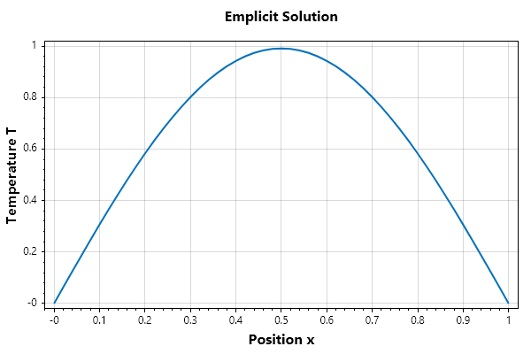
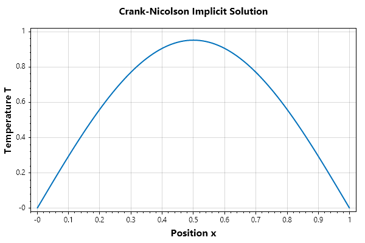
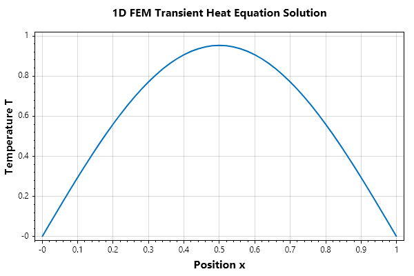
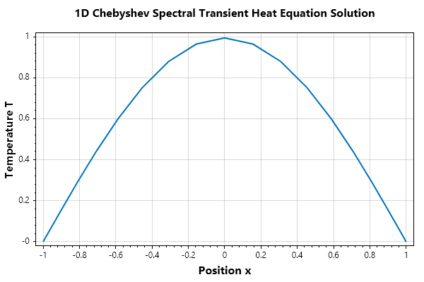

Solution Of PDE by Full Descretization
======================================

The Full Discretization Method (often referred to as direct Finite Difference Methods for space-time grids) approaches partial differential equations (PDEs) by discretizing both the spatial and temporal dimensions simultaneously onto a discrete grid.

Unlike the Method of Lines—which retains continuous time to yield an ODE system—full discretization converts the PDE directly into a system of algebraic equations that can be solved step-by-step or via matrix inversion.

How It Works:
~~~~~~~~~~~~~

The 3-Step Process 
Consider the 1D transient heat equation:

.. math::

   \frac{\partial u}{\partial t} = \alpha \frac{\partial^2 u}{\partial x^2}

1. Grid Generation: We partition space into steps of size :math:`\Delta x` (:math:`x_i = i \Delta x`) and time into steps of size :math:`\Delta t` (:math:`t^n = n \Delta t`). The discrete approximation to :math:`u(x_i, t^n)` is denoted as :math:`u_i^n`.

2. Algebraic Substitution: Both the time derivative and spatial derivative are replaced with algebraic finite difference approximations. For example, using a forward difference in time and a central difference in space:

.. math::

   \frac{u_i^{n+1} - u_i^n}{\Delta t} \approx \alpha \frac{u_{i+1}^n - 2u_i^n + u_{i-1}^n}{(\Delta x)^2}

3. Time Marching / Matrix Solution: Re-arranging the algebraic equation allows us to explicitly compute values at the next time level :math:`n+1` from known values at level :math:`n` (Explicit Scheme), or solve a linear system :math:`A u^{n+1} = B u^n` (Implicit Scheme).

## Explicit vs. Implicit Schemes

When discretizing space and time simultaneously, the evaluation point of the spatial derivative defines the nature of the solver:
- Explicit Schemes (Forward Euler): Evaluate spatial derivatives entirely at the current time step $n$. Fast per iteration, but strictly bounded by stability constraints.
- Implicit Schemes (Backward Euler / Crank-Nicolson): Evaluate spatial derivatives at the future time step :math:`n+1` (or a weighted blend). Unconditionally stable, but requires solving a system of linear equations at each time step.

Comparison: Full Discretization vs Method of Lines
Feature | Method of Lines (MOL) | Full Discretization (FDM)
Time Integration | Continuous (Handed to ODE solver) | Discrete (Fixed algebraic updates)
Solvers | High-order adaptive ODE integrators | Custom time-stepping loops / Matrix solvers
Error Control | Automated adaptive time-stepping | Manual step size selection (:math:`\Delta t, \Delta x`)
Implementation | Abstract function interfaces | Direct matrix-vector operations

Example 1: Explicit Method (FTCS Scheme)
~~~~~~~~~~~~~~~~~~~~~~~~~~~~~~~~~~~~~~~~
The Forward-Time Central-Space (FTCS) scheme explicitly updates each grid point based on its immediate neighbors at the previous time level:

.. math::

   u_i^{n+1} = u_i^n + r \left(u_{i+1}^n - 2u_i^n + u_{i-1}^n \right), \quad r = \frac{\alpha \Delta t}{(\Delta x)^2}

Stability Warning: The 1D explicit FTCS scheme is stable if and only if :math:`r \le 0.5`. Exceeding this limit causes catastrophic non-physical oscillations.

.. code-block:: csharp

   // SOLVE_HEAT_EXPLICIT Solves 1D heat equation using Explicit FTCS scheme
   // Equation: du/dt = alpha * d^2u/dx^2
   double alpha = 0.5;
   double L = 1.0;
   double t_final = 0.5;

   int Nx = 50;
   double dx = L / Nx;
   ColVec x = Linspace(0, L, Nx + 1);

   // Select dt to satisfy the stability criterion: r = alpha * dt / dx^2 <= 0.5
   double CFL = 0.45, r = CFL;
   double dt = CFL * (dx * dx) / alpha;
   int Nt = (int)(t_final / dt / 5);

   // Initial condition: u(x,0) = sin(pi * x)
   ColVec Un = Sin(pi * x), Unp1 = Zeros(Nx + 1);

   // Plot the initial condition
   var TempProfile = Plot(x, Un, Linewidth: 2);
   Title("Emplicit Solution"); GridOn();
   Xlabel("Position x"); Ylabel("Temperature T");

   byte[] Animfun(int n)
   {
       for (int m = 0; m < 5; m++)
       {// Internal grid point update
           for (int i = 1; i < Nx; i++)
               Unp1[i] = Un[i] + r * (Un[i + 1] - 2.0 * Un[i] + Un[i - 1]);

           // Dirichlet Boundary Conditions
           Unp1[0] = 0.0; Unp1[Nx] = 0.0;
           Un = Unp1.Duplicate();
           TempProfile.Ydata = Un;
       }
       return GetFrame();
   }
   AnimationMaker(Animfun, "TemperatureProfile_Explicit.gif", 10, Nt);
   CloseFig();

Example 2: Implicit Crank-Nicolson Scheme
~~~~~~~~~~~~~~~~~~~~~~~~~~~~~~~~~~~~~~~~~
The Crank-Nicolson scheme is a second-order accurate implicit method formed by averaging the central differences at time steps :math:`n` and :math:`n+1`:

.. math::

   -\frac{r}{2} u_{i-1}^{n+1} + (1 + r) u_i^{n+1} -\frac{r}{2} u_{i+1}^{n+1} = \frac{r}{2} u_{i-1}^n + (1 - r) u_i^n + \frac{r}{2} u_{i+1}^n

Expressed in matrix-vector form:

.. math::

   \mathbf{A} \mathbf{u}^{n+1} = \mathbf{B} \mathbf{u}^n

where :math:`\mathbf{A}` and :math:`\mathbf{B}` are tridiagonal matrices. This scheme is unconditionally stable for any choice of :math:`\Delta t`.

.. code-block:: csharp

   // SOLVE_HEAT_CRANK_NICOLSON Solves 1D heat equation via implicit matrix linear system
   double alpha = 0.5;
   double L = 1.0;
   double t_final = 0.5;

   int Nx = 100;
   double dx = L / Nx;
   double dt = 0.01;                        // Can take much larger time steps safely
   double r = alpha * dt / (dx * dx);

   ColVec x = Linspace(0, L, Nx + 1);
   ColVec Un = Sin(pi * x);

   // Plot the initial condition
   var TempProfile = Plot(x, Un, Linewidth: 2); GridOn();
   Title("Crank-Nicolson Implicit Solution");
   Xlabel("Position x"); Ylabel("Temperature T");

   // Construct Tridiagonal System A * u^{n+1} = B * u^n
   int N = Nx + 1;
   Matrix A = Zeros(N, N), B = Zeros(N, N);

   // Internal nodes
   for (int i = 1; i < Nx; i++)
   {
       A[i, i - 1] = -0.5 * r;
       A[i, i] = 1.0 + r;
       A[i, i + 1] = -0.5 * r;

       B[i, i - 1] = 0.5 * r;
       B[i, i] = 1.0 - r;
       B[i, i + 1] = 0.5 * r;
   }

   // Enforce Dirichlet Boundary Conditions implicitly
   A[0, 0] = 1.0; B[0, 0] = 0.0;
   A[Nx, Nx] = 1.0; B[Nx, Nx] = 0.0;
   int Nt = (int)(t_final / dt);

   byte[] Animfun(int n)
   {
       // Internal grid point update
       ColVec rhs = B * Un;

       // Linear solve using SepalSolver matrix operator (Mldivide / Thomas Algorithm)
       Un = Mldivide(A, rhs);
       TempProfile.Ydata = Un;
       return GetFrame();
   }
   AnimationMaker(Animfun, "TemperatureProfile_CrankNicolson.gif", 10, Nt);
   CloseFig();

Example 3: Implicit Scheme, with Finite Element for Spatial derivatives
~~~~~~~~~~~~~~~~~~~~~~~~~~~~~~~~~~~~~~~~~~~~~~~~~~~~~~~~~~~~~~~~~~~~~~~
When applying the Finite Element Method to time-dependent problems such as the 1D heat equation:

.. math::

   \cfrac{\partial u}{\partial t} = \alpha \cfrac{\partial^2 u}{\partial x^2} + f(x,t)

applying the Galerkin spatial discretization yields a system of coupled ODEs in matrix form:

.. math::

   \mathbf{M} \cfrac{d\mathbf{u}}{dt} + \alpha \mathbf{K} \mathbf{u} = \mathbf{F}

where:
- :math:`\mathbf{M}` is the Global Mass Matrix (:math:`M_{ij} = \int_\Omega \phi_i \phi_j \, dx`), representing the temporal inertia/capacity.
For 1D linear elements of length :math:`h`, the local element mass matrix is :math:`\mathbf{m}_e = \cfrac{h}{6} \begin{bmatrix} 2 & 1 \\ 1 & 2 \end{bmatrix}`.
- :math:`\mathbf{K}` is the Global Stiffness Matrix (:math:`K_{ij} = \int_\Omega \cfrac{d\phi_i}{dx} \cfrac{d\phi_j}{dx} \, dx`), 
with local element stiffness matrix :math:`\mathbf{k}_e = \cfrac{1}{h} \begin{bmatrix} 1 & -1 \\ -1 & 1 \end{bmatrix}`.
- :math:`\mathbf{u}(t)` is the vector of nodal temperature values evolving over time.

Using an implicit time-integration scheme (Backward Euler) for stability:

.. math::

   \left( \mathbf{M} + \Delta t \cdot \alpha \mathbf{K} \right) \mathbf{u}^{n+1} = \mathbf{M} \mathbf{u}^n + \Delta t \cdot \mathbf{F}^{n+1}

.. code-block:: csharp

   double alpha = 0.5, L = 1.0, t_final = 0.5;

   int numElements = 50, numNodes = numElements + 1;
   double h = L / numElements, dt = 0.01;
   int Nt = (int)(t_final / dt);

   ColVec x = Linspace(0, L, numNodes);

   // Global Stiffness Matrix K and Mass Matrix M
   Matrix K = Zeros(numNodes, numNodes);
   Matrix M = Zeros(numNodes, numNodes);

   // Local element stiffness matrix: (1/h) * [1, -1; -1, 1]
   Matrix ke = new double[,] { { 1, -1 }, { -1, 1 } }; ke /= h;

   // Local element mass matrix: (h/6) * [2, 1; 1, 2]
   Matrix me = new double[,] { { 2, 1 }, { 1, 2 } }; me *= h / 6;

   // Global assembly over elements
   for (int e = 0; e < numElements; e++)
   {
       int[] nodes = [e, e + 1];
       K[nodes, nodes] += ke;
       M[nodes, nodes] += me;
   }

   // Initial Condition: u(x,0) = sin(pi * x)
   ColVec U = Sin(pi * x);
   var TempProfile = Plot(x, U, Linewidth: 2); GridOn();
   Title("1D FEM Transient Heat Equation Solution");
   Xlabel("Position x"); Ylabel("Temperature T");

   // Construct System Matrix A = M + dt * alpha * K for Implicit Time Stepping
   Matrix A = M + dt * alpha * K;

   // Apply Dirichlet Boundary Conditions to System Matrix A
   A[0, ..] = 0.0; A[0, 0] = 1.0;
   A[numNodes - 1, ..] = 0.0; A[numNodes - 1, numNodes - 1] = 1.0;

   // Time-stepping Loop
   byte[] Animfun(int n)
   {
       // Right-hand side vector: B = M * u^n
       ColVec rhs = M * U;

       // Apply Dirichlet Boundary Conditions to RHS
       rhs[0] = 0.0; rhs[numNodes - 1] = 0.0;

       // Solve linear system A * u^{n+1} = rhs
       U = Mldivide(A, rhs);
       TempProfile.Ydata = U;
       return GetFrame();
   }
   AnimationMaker(Animfun, "FEM_1D_Heat_Solution.gif", 10, Nt);
   CloseFig();

Example 2: Implicit Scheme with Chebyshev Spectral Differentiation for Spatial Derivative
~~~~~~~~~~~~~~~~~~~~~~~~~~~~~~~~~~~~~~~~~~~~~~~~~~~~~~~~~~~~~~~~~~~~~~~~~~~~~~~~~~~~~~~~~
Constructing a Chebyshev differentiation matrix :math:`\mathbf{D}_N` to compute high-accuracy spatial derivatives on Gauss-Lobatto collocation points :math:`x_k = \cos\left(\frac{k\pi}{N}\right)`:

.. code-block:: csharp

   // CHEBYSHEV_SPECTRAL_DERIVATIVE High-accuracy spectral spatial derivative

   double alpha = 0.5;
   double t_final = 0.5;
   int N = 20; // Only 20 spectral nodes yield machine-precision spatial derivative

   // Chebyshev Gauss-Lobatto nodes on [-1, 1]
   ColVec k = Linspace(0, N, N + 1);
   ColVec x = Cos(k * pi / N);

   // 1. Construct Chebyshev Differentiation Matrix D
   Matrix D = Zeros(N + 1, N + 1);
   ColVec c = Ones(N + 1);
   c[[0, N]] = 2.0;

   for (int i = 0; i <= N; i++)
   {
       for (int j = 0; j <= N; j++)
       {
           if (i != j)
           {
               D[i, j] = (c[i] / c[j]) * (Pow(-1.0, i + j) / (x[i] - x[j]));
           }
       }
   }

   // Enforce negative row-sum identity on diagonals
   for (int i = 0; i <= N; i++)
   {
       double sum = 0.0;
       for (int j = 0; j <= N; j++)
       {
           if (i != j) sum += D[i, j];
       }
       D[i, i] = -sum;
   }

   // 2. Second Derivative Matrix D2 = D * D
   Matrix D2 = D * D;

   // Time-stepping setup (Implicit Backward Euler)
   double dt = 0.005;
   int Nt = (int)(t_final / dt);

   // Initial Condition: u(x,0) = cos(pi * x / 2)
   ColVec U = Cos(pi * x / 2.0);
   var TempProfile = Plot(x, U, Linewidth: 2); GridOn();
   Title("1D Chebyshev Spectral Transient Heat Equation Solution");
   Xlabel("Position x"); Ylabel("Temperature T");

   // System Matrix: A = I - dt * alpha * D2
   Matrix I = Eye(N + 1);
   Matrix A = I - dt * alpha * D2;

   // Enforce Dirichlet Boundary Conditions implicitly at x = 1 (row 0) and x = -1 (row N)
   A[0, ..] = 0.0; A[0, 0] = 1.0;
   A[N, ..] = 0.0; A[N, N] = 1.0;

   // Time-stepping Loop
   byte[] Animfun(int n)
   {
       // Right-hand side vector: B = M * u^n
       ColVec rhs = U.Duplicate();

       // Apply Dirichlet Boundary Conditions to RHS
       rhs[0] = 0.0; rhs[N] = 0.0;

       // Solve linear system A * u^{n+1} = rhs
       U = Mldivide(A, rhs);
       TempProfile.Ydata = U;
       return GetFrame();
   }
   AnimationMaker(Animfun, "Spectral_1D_Heat_Solution.gif", 10, Nt);
   CloseFig();

   

