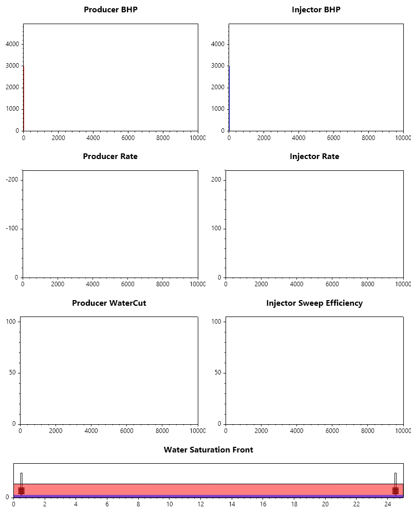
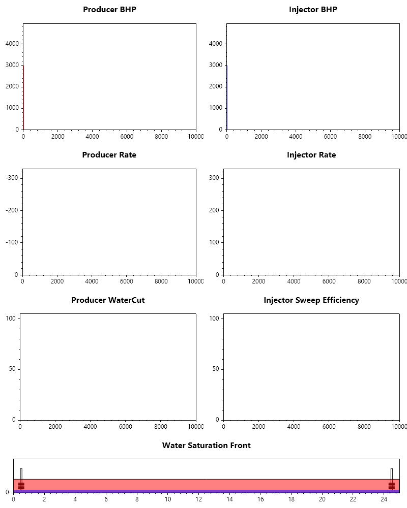
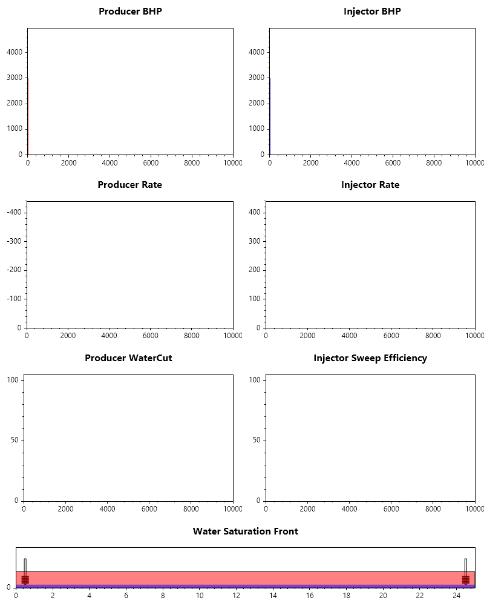
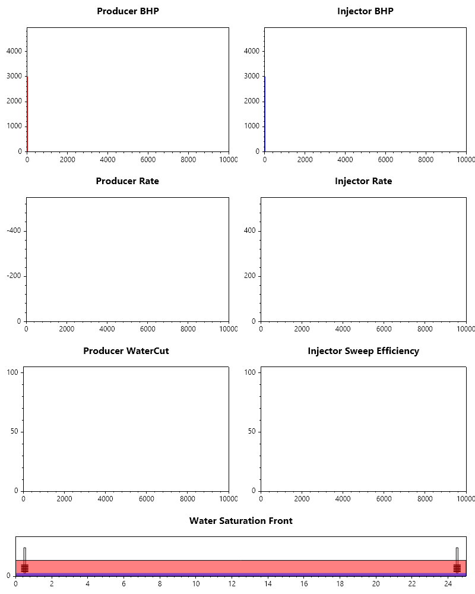

Reservoir Simulator 1D 2 Phases
===============================

Technical Overview and Mathematical Framework
---------------------------------------------
In this section, we develop a comprehensive, fully implicit 1D two-phase reservoir simulator that models the transient, coupled flow of immiscible oil and water through a heterogeneous porous medium. The simulator is designed to capture the complex fluid-fluid and fluid-rock interactions that occur during waterflooding performance.

The mathematical framework couples the physics of multiphase porous media flow with operational engineering constraints.It incorporates highly nonlinear constitutive relationships—including fluid compressibilities, pressure-dependent viscosities, relative permeability curves, and capillary pressure effects—along with dynamic well control logic and an automated adaptive time-stepping engine.

Governing Flow Equations
~~~~~~~~~~~~~~~~~~~~~~~~
The core of the simulator is governed by mass conservation equations for each fluid phase: water (:math:`w`) and oil (:math:`o`). In a 1D horizontal system, assuming Darcy flow, the partial differential equations(PDEs) are expressed as:
Water Phase Mass Conservation:

.. math::

   \frac{\partial }{\partial x} \left[ \alpha \frac{k \cdot k_ { rw }}{\mu_w B_w} \frac{\partial P_w}{\partial x} \right] \pm q_w = \frac{1}{\beta} \frac{\partial}{\partial t} \left( \frac{\phi S_w}{ B_w} \right)

Oil Phase Mass Conservation:

.. math::

   \frac{\partial}{\partial x} \left[ \alpha \frac{ k \cdot k_{ ro} }{\mu_o B_o} \frac{\partial P_o} {\partial x} \right] \pm q_o = \frac{ 1} {\beta} \frac{\partial} {\partial t} \left( \frac{\phi S_o} { B_o} \right)

Where:
:math:`P_o` and :math:`P_w` are the oil and water phase pressures respectively (:math:`\text{psi}`).

:math:`S_o` and :math:`S_w` are the oil and water phase saturations, satisfying the algebraic constraint: :math:`S_o + S_w = 1.0`.

:math:`k` is the absolute rock permeability(:math:`\text{md}`), and :math:`\phi` is the rock porosity.

:math:`\alpha` (:math:`1.127 \times 10^{ -3}`) and :math:`\beta` (:math:`5.615\ \text{ ft}^3/\text{bbl}`) are conversion constants matching standard field units.

:math:`q_w, q_o` represent volumetric source/sink well terms (:math:`\text{STB/day}`).

Constitutive and Petrophysical Relationships

To close the system of equations, several empirical and thermodynamic relationships are explicitly modeled as functions of the primary state variables (:math:`P_o` and :math:`S_w`):

Phase Pressure Coupling (Capillary Pressure)
The water phase pressure is dynamically linked to the oil phase pressure via the laboratory-measured imbibition capillary pressure function (:math:`P_{ cI}`):

.. math::

   P_w = P_o - P_{ cI} (S_w)

The capillary pressure curve is scaled using an effective saturation profile(:math:`S_{ we}`):

.. math::

   S_{ we} = \frac{ S_w - S_{ wr} }  { 1 - S_{ wr} -S_{ or} }

.. math::

   P_{ cI}(S_w) = P_e \cdot \left[ (S_{we})^{ -0.5}-1 \right]

where :math:`P_e` is the entry capillary pressure, :math:`S_{ wr}` is the residual water saturation, and :math:`S_{ or}` is the residual oil saturation.

Relative Permeability(Modified Corey-Brooks Model)
Multiphase fluid interference inside the pore throat structure is dictated by power-law relative permeability functions:

.. math::

   k_{ rw}(S_w) = k_{ rw0} \cdot(S_{ we})^{ n_w}

.. math::

   k_{ ro}(S_o) = k_{ ro0} \cdot \left(1 - \frac{(1 - S_o) - S_{wr}}{ 1 - S_{ wr} -S_{ or} }\right)^{n_o}

Fluid PVT Behavior (Compressibility and Viscosity)
Fluid volumes and flows scale dynamically with local pressure fields to model slightly compressible behaviors:

.. math::

   B_o(P_o) = B_{ o0} \cdot e^{c_o(2000 - P_o)} \quad \text{and} \quad B_w(P_w) = B_{ w0} \cdot e^{c_w(2500 - P_w)}

.. math::

   \mu_o(P_o) = \mu_{o0} \cdot e^{b_o(P_o - 2000)} \quad \text{and} \quad \mu_w(P_w) = \mu_{w0} \cdot e^{b_w(P_w - 2500)}

Spatial Discretization &Transmissibilities

The continuous governing equations are discretized in space using a block-centered finite volume formulation.For fluid flow between block :math:`i` and block :math:`i+1`, the inter-block absolute permeability is resolved using a harmonic mean:

.. math::

   k_{i+1/2} = \text{Harmmean}(k_i, k_{i+1}) = \cfrac{2}{\cfrac{1}{k_i} + \cfrac{1}{k_{i+1}}}

To ensure numerical stability and avoid unphysical oscillations across displacement fronts, the phase fluid mobilities (:math:`k_{r}/(\mu B)`) are evaluated using Single-Point Upstream Weighting. The properties are chosen entirely from the cell possessing the higher phase pressure:

.. math::

   \left(\cfrac{k_{rw}}{\mu_w B_w} \right)_{i+1/2} = \begin{cases} 
   \left(\cfrac{k_{rw}}{\mu_w B_w} \right)_i & \text{if} P_{w, i} > P_{w,i+1} \\
   \left(\cfrac{k_{rw}}{\mu_w B_w} \right)_{i+1} & \text{if} P_{w, i+1} > P_{ w,i} 
   \end{cases}

Wellbore Boundary Equations and Operational Controls
Wells represent external localized source/sink boundary constraints modeled via a radial inflow Peaceman formulation. The equivalent well block radius (:math:`r_e`) and baseline Well Index (:math:`WI`) are evaluated as:

.. math::

   r_e = 0.14\sqrt{\Delta x^2 + \Delta y^2}

.. math::

   WI = \frac{2\pi \alpha \cdot k \cdot \Delta z}{\ln(r_e / r_w)}

The individual phase flow rates produced or injected in a grid block are functions of the drawdown between the cell pressure and the wellbore's bottomhole flowing pressure (:math:`P_{wf}`):

.. math::

   Q_w = WI \cdot \frac{k_{rw}}{\mu_w B_w} \cdot(P_{ wf} - P_w)

.. math::

   Q_o = WI \cdot \frac{k_{ro}}{\mu_o B_o} \cdot(P_{ wf} - P_o)

Dynamic Constraint Swapping

Wells operate on dual-modifier switching scripts. They enforce target surface volume constraints as long as the system remains within safe pressure limits:

Producer: Operates at a target production rate :math:`Q_{ target}`. If the calculated :math:`P_{ wf}` drops below the mechanical limit :math:`P_{ min}` (:math:`1500\ \text{psi}`), the control loop automatically switches to variable-rate, fixed-BHP mode (:math:`P_{ wf} = P_{ min}`).

Injector: Operates at a target injection rate :math:`Q_{ target}`. If the injection pressure exceeds a formation fracturing threshold :math:`P_{ max}` (:math:`4500\ \text{psi}`), the solver seamlessly overrides the control variables to fixed-pressure boundaries (:math:`P_{wf} = P_{max}`).

Numerical Solution and Post-Processing
Applying backward Euler finite differences (Full_Implicit) in time yields a highly non-linear algebraic system of discrete residual equations at each time level (:math:`n+1`). The total mathematical system vector is assembled explicitly via a custom packing scheme:

.. math::

   \vec{R}(\vec{x}) = \begin{bmatrix} \vec{R}{oil} \\ \vec{R}{water} \\ \vec{R}{wellbore_balance} \\ \vec{R}{operational_controls} \end{bmatrix} = \vec{0}

This combined system is solved iteratively using the high-performance Fsolve method, which is part of the Solver class inside SepalSolver—a proprietary scientific computing and mathematical library developed by CypherCrescent. To maximize computational throughput, the simulator pairs SepalSolver's root-finding capabilities with an automated adaptive time-stepping loop. If the non-linear solver encounters a convergence failure or an operational constraint violation, the engine automatically cuts the time step size (:math:`\Delta t`) by :math:`75\%` and retries the step. Conversely, when convergence is achieved rapidly (:math:`\text{Iterations} < 4`), the engine safely scales up :math:`\Delta t` by :math:`25\%` for subsequent steps.
Finally, the localized state data histories collected are processed dynamically to output diagnostic performance graphs (tracking fractional water cuts, bottomhole pressures, and overall volumetric sweep efficiency) while compiling a high-speed animated GIF visualizing the propagation of the transient water saturation shock front over time.

.. code-block:: csharp

   // =========================================================================
   // STAGE 1: GLOBAL SIMULATION PARAMETERS & FIELD CHARACTERISTICS
   // =========================================================================

   // Set root project repository path for exporting tracking diagnostics/GIFs
   // folderpath = "C:\\Users\\lateef.a.kareem\\Documents\\GitHub\\ReservoirSimulation\\";

   // Nblocks: Spatial discretization grid cells
   // L: Maximum block boundary index for flow limits
   // M: Total number of discrete primary variables tracking
   // the porous media blocks (2 variables * 25 blocks)
   // Nwells: Count of source/sink boundaries active in the system
   int Nblocks = 25, L = Nblocks - 1, M = 2*Nblocks, Nwells = 2;

   // Thermodynamic properties, initial pressures (psi),
   // initial fluid saturation baselines,
   // residual saturation limits (Sw_r, So_r),
   // and baseline phase viscosities (cp)
   double Pinit = 3000, Sinit = 0.2, Sw_r = 0.10, So_r = 0.15,
          μw0 = 5.005, μo0 = 2, kro0 = 1.0, krw0 = 0.30, Pe = 2,
          co = 2e-5, cw = 4e-6, cr = 1e-5, bo = 2e-5, bw = 4e-10,
          Bw0 = 1.005, Bo0 = 1.4, no = 2.5, nw = 3;

   // Well operational specifications using named tuples:
   // constraints, metrics, and grid block locations
   var Producer =
       (MinPressure: 1500.0, ProdRate: 0.0,
       OilRate: 0.0, WaterRate: 0.0, Index: 0);
   var Injector =
       (MaxPressure: 4500.0, InjRate: 0.0,
       OilRate: 0.0, WaterRate: 0.0, Index: 24);

   // =========================================================================
   // STAGE 2: DATA STRUCTURE PACKING & UNPACKING (VECTOR TO PHYSICAL FIELDS)
   // =========================================================================

   // Unpacks a monolithic 1D solver array back into distinct,
   // physically meaningful array fields
   (double[], double[], double[], double[]) Unpack(double[] x)
   {
       int indx = 0;
       double[] Po = Zeros(Nblocks), Sw = Zeros(Nblocks),
                Pwells = Zeros(Nwells), Qwells = Zeros(Nwells);

       // Extract interleaved cell variables: [Po_0, Sw_0, Po_1, Sw_1, ...]
       for (int i = 0; i < Nblocks; i++)
       {
           // Extract Oil Pressure
           Po[i] = x[indx++];
           // Extract Water Saturation
           Sw[i] = x[indx++];
       }

       // Extract interleaved well variables: [Pwf_0, Q_0, Pwf_1, Q_1, ...]
       for (int i = 0; i < Nwells; i++)
       {
           // Extract Well Bottomhole Pressure (BHP)
           Pwells[i] = x[indx++];
           // Extract Total Well Volumetric Flow Rate
           Qwells[i] = x[indx++];
       }
       return (Po, Sw, Pwells, Qwells);
   }

   // Packs separate grid-block and well residuals into a single
   // consolidated vector for Fsolve
   double[] Pack(double[] Ro, double[] Rw, double[] Rwells, double[] Rcontrol)
   {
       int indx = 0;
       double[] R_total = Zeros(M + 2*Nwells);

       // Map conservation equations sequentially to match variable indexing
       for (int i = 0; i < Nblocks; i++)
       {
           // Oil mass conservation residual
           R_total[indx++] = Ro[i];
           // Water mass conservation residual
           R_total[indx++] = Rw[i];
       }
       for (int i = 0; i < Nwells; i++)
       {
           // Wellbore mass balance residual
           R_total[indx++] = Rwells[i];
           // Well operating constraint/control residual
           R_total[indx++] = Rcontrol[i];
       }
       return R_total;
   }

   // =========================================================================
   // STAGE 3: CONSTITUTIVE EQUATIONS & PETROPHYSICAL RELATIONS
   // =========================================================================

   // Normalized and effective water saturations used to
   // calculate relative permeabilities and capillary pressures
   double Sws(double Sw) => (Sw - Sw_r)/(1 - Sw_r);
   double Swe(double Sw) => (Sw - Sw_r)/(1 - Sw_r - So_r);

   // Capillary Pressure relationships (Drainage vs Imbibition curves)
   double Pc_D(double Sw) => Pe * Pow(Sws(Sw), -0.5);
   double Pc_I(double Sw) => Pe * (Pow(Swe(Sw), -0.5) - 1);

   // Formation Volume Factors (B-factors) modeling fluid compressibility
   double Bo(double Po) => Bo0 * Exp(co*(1500 - Po));
   double Bw(double Pw) => Bw0 * Exp(cw*(2500 - Pw));

   // Pressure-dependent dynamic fluid viscosities
   double μo(double Po) => μo0 * Exp(bo*(Po - 1500));
   double μw(double Pw) => μw0 * Exp(bw*(Pw - 2500));

   // Modified Corey Brooks models evaluating relative permeability curves
   double Krw(double Sw) => krw0 * Pow(Swe(Sw), nw);
   double Kro(double So) => kro0 * Pow(1 - Swe(1 - So), no);

   // Inter-block transmissibility calculation using the
   // harmonic mean of raw cell permeabilities
   double Harmmean(double x1, double x2) => 2/(1/x1 + 1/x2);

   // Unit conversion coefficients for oilfield standard parameters
   // =================================================================
   // Transmissibility conversion factor (Darcy to Field Units)
   double alpha = 1.127e-3;
   // Geometric productivity factor conversion for radial well inflows
   double alpha_well = alpha*2*pi;
   // Reservoir volume factor (Cubic feet to Stock Tank Barrels)
   double beta = 5.615;

   // Spatial dimensions (ft), block pore volume (STB),
   // and well radius parameters
   double dt, Dx = 200, Dy = 1000, Dz = 20, Ax = Dy*Dz,
          V = Dx*Dy*Dz/beta, rw = 0.5, re, WI, WIw, WIo;

   // Heterogeneous field instantiation using a
   // normal distribution for porosity and permeability
   // Localized Porosity array
   double[] Phi = Randn(Nblocks, 0.2, 0.01);
   // Localized Permeability array (md)
   double[] K = Randn(Nblocks, 900.0, 300.0);

   // Arrays storing baseline values at historical time level (n)
   double[] Po_n, Sw_n, Pwells_n, Qwells_n, Pw_n, So_n;
   // Tracks operational control mode for each well
   // (True = Rate, False = Pressure)
   bool[] RateControl = [true, true];

   // =========================================================================
   // STAGE 4: NONLINEAR RESIDUAL FORMULATION (MASS CONSERVATION & WELL EQUATIONS)
   // =========================================================================
   double[] Residual(double[] xnp1)
   {
       double Po_up, Pw_up, So_up, Sw_up, Tr, Tw, To;

       // Unpack current iteration guess variables for evaluation
       var (Po_np1, Sw_np1, Pwells_np1, Qwells_np1) = Unpack(xnp1);

       // Calculate dependent properties using
       // capillary pressure and saturation definitions
       double[] Pw_np1 = [.. Po_np1.Zip(Sw_np1, (po, sw) => po - Pc_I(sw))],
                So_np1 = [.. Sw_np1.Select(sw => 1 - sw)];

       double[] Rw = Zeros(Nblocks), Ro = Zeros(Nblocks),
                Rwells = Zeros(Nwells), Rcontrol = Zeros(Nwells);

       // Grid block mass balance accumulation loop
       for (int i = 0; i < Nblocks; i++)
       {
           // Inter-block inter-flux flux logic (Left neighbor interaction)
           if (i > 0)
           {
               Tr = alpha*Ax*Harmmean(K[i-1], K[i]);

               // Single-point upstream weighting for water phase stability
               (Pw_up, Sw_up) = Pw_np1[i-1] > Pw_np1[i] ?
                   (Pw_np1[i-1], Sw_np1[i-1]) : (Pw_np1[i], Sw_np1[i]);
               Tw = Tr*Krw(Sw_up)/(μw(Pw_up)*Bw(Pw_up));
               Rw[i] += Tw*(Pw_np1[i-1] - Pw_np1[i])/Dx;

               // Single-point upstream weighting for oil phase stability
               (Po_up, So_up) = Po_np1[i-1] > Po_np1[i] ?
                   (Po_np1[i-1], So_np1[i-1]) : (Po_np1[i], So_np1[i]);
               To = Tr*Kro(So_up)/(μo(Po_up)*Bo(Po_up));
               Ro[i] += To*(Po_np1[i-1] - Po_np1[i])/Dx;
           }

           // Inter-block inter-flux flux logic (Right neighbor interaction)
           if (i < L)
           {
               Tr = alpha*Ax*Harmmean(K[i], K[i+1]);

               // Single-point upstream weighting for water phase stability
               (Pw_up, Sw_up) = Pw_np1[i+1] > Pw_np1[i] ?
                   (Pw_np1[i+1], Sw_np1[i+1]) : (Pw_np1[i], Sw_np1[i]);
               Tw = Tr*Krw(Sw_up)/(μw(Pw_up)*Bw(Pw_up));
               Rw[i] += Tw*(Pw_np1[i+1] - Pw_np1[i])/Dx;

               // Single-point upstream weighting for oil phase stability
               (Po_up, So_up) = Po_np1[i+1] > Po_np1[i] ?
                   (Po_np1[i+1], So_np1[i+1]) : (Po_np1[i], So_np1[i]);
               To = Tr*Kro(So_up)/(μo(Po_up)*Bo(Po_up));
               Ro[i] += To*(Po_np1[i+1] - Po_np1[i])/Dx;
           }

           // Time accumulation terms (implicit backward Euler method)
           Rw[i] -= V*Phi[i]*(Sw_np1[i]/Bw(Pw_np1[i]) - Sw_n[i]/Bw(Pw_n[i]))/dt;
           Ro[i] -= V*Phi[i]*(So_np1[i]/Bo(Po_np1[i]) - So_n[i]/Bo(Po_n[i]))/dt;
       }

       // Peaceman radius calculation for an isolated wellbore
       re = 0.14*Hypot(Dx, Dy);
       int idx;

       // --- Well Formulation: Producer Section ---
       Rwells[0] += Qwells_np1[0];
       idx = Producer.Index;
       // Base Well Index calculation
       WI = alpha_well*K[idx]*Dz/Log(re/rw);
       // Water mobility at well
       WIw = WI*Krw(Sw_np1[idx])/(μw(Pw_np1[idx])*Bw(Pw_np1[idx]));
       // Oil mobility at well
       WIo = WI*Kro(So_np1[idx])/(μo(Po_np1[idx])*Bo(Po_np1[idx]));
       // Calculate phase flow rates using the wellbore
       // pressure and connected grid cell properties
       Producer.WaterRate = (Pwells_np1[0] - Pw_np1[Producer.Index])*WIw;
       Producer.OilRate = (Pwells_np1[0] - Po_np1[Producer.Index])*WIo;
       // Inject sink terms directly back into the connected grid cell
       Rw[Producer.Index] += Producer.WaterRate;
       Ro[Producer.Index] += Producer.OilRate;
       // Well balance check
       Rwells[0] -= Producer.WaterRate + Producer.OilRate;
       // Evaluate dynamic constraint swapping logic
       // (Switch between Target Rate vs Minimum Allowed BHP)
       Rcontrol[0] = RateControl[0] ?
           Qwells_np1[0] - Producer.ProdRate : Pwells_np1[0] - Producer.MinPressure;

       // --- Well Formulation: Injector Section ---
       Rwells[1] += Qwells_np1[1];
       idx = Injector.Index;
       // Base Well Index calculation
       WI = alpha_well*K[idx]*Dz/Log(re/rw);
       // Injecting pure water phase
       WIw = WI*krw0/(μw(Pw_np1[idx])*Bw(Pw_np1[idx]));
       // Calculate injection rate using the
       // wellbore pressure and connected grid cell properties
       Injector.WaterRate = (Pwells_np1[1] - Pw_np1[idx])*WIw;
       // Inject source terms directly back into the connected grid cell
       Rw[idx] += Injector.WaterRate;
       // Well balance check
       Rwells[1] -= Injector.WaterRate;
       // Evaluate dynamic constraint swapping logic
       // (Switch between Target Rate vs Maximum Allowed BHP)
       Rcontrol[1] = RateControl[1] ?
           Qwells_np1[1] - Injector.InjRate : Pwells_np1[1] - Injector.MaxPressure;

       // Consolidate values back into a single vector for solver optimization loops
       return Pack(Ro, Rw, Rwells, Rcontrol);
   }

   // Mathematical mapping and linear interpolation helper utilities
   double betweenab(double a, double b, double f) => a + f*(b-a);
   double interps(List<double> X, List<double> Y, double x)
   {
       int i = X.FindIndex(xi => xi>x);
       double f = (x-X[i-1])/(X[i]-X[i-1]);
       return betweenab(Y[i-1], Y[i], f);
   }
   double[] interpa(List<double> X, List<double[]> Y, double x)
   {
       int i = X.FindIndex(xi => xi>x);
       double f = (x-X[i-1])/(X[i]-X[i-1]);
       return [.. Y[i-1].Zip(Y[i], (a, b) => betweenab(a, b, f))];
   }

   // chunk writer utility for formatted console output of array values
   string Write(double[] data)
   {
       var chunks = data.Chunk(8);
       List<string> sb = [];
       foreach (var chunk in chunks)
           sb.Add(string.Join(", ", chunk.Select(x => x.ToString("F2"))));
       return string.Join(", \n", sb);
   }

   // =========================================================================
   // STAGE 5: RUNTIME EXECUTION MANAGEMENT LOOP & SENSITIVITY DESIGN
   // =========================================================================
   double EndTime = 10000; // Target simulation duration limit (days)
   double delt = EndTime/300; // Time steps for reporting intervals

   // Sensitivity loop testing performance metrics across varying injection-production rates
   for (int rate = 200; rate <= 500; rate += 100)
   {
       dt = 0.01; // Reset to a safe initial time step value

       // Initialize state vectors for a new sensitivity run
       Po_n = Repmat(Pinit, Nblocks); Sw_n = Repmat(Sinit, Nblocks);
       Pwells_n = Repmat(Pinit, Nwells); Qwells_n = Zeros(Nwells);
       Pw_n = [.. Po_n.Zip(Sw_n, (po, sw) => po - Pc_I(sw))];
       So_n = [.. Sw_n.Select(sw => 1 - sw)];

       // Initialize historical data tracking containers for plotting and reporting
       List<double[]> P = [Po_n], S = [Sw_n];
       List<double> Time = [0.0], WaterCut = [0.0], SweepEff = [0.0],
           ProdRate = [Qwells_n[0]], InjRate = [Qwells_n[1]],
           ProdPwf = [Pwells_n[0]], InjPwf = [Pwells_n[1]];

       // Define specific production/injection targets for this scenario run
       Producer.ProdRate = -rate;
       Injector.InjRate = rate;

       // Initialize Plot Subplots for Real-Time Visual Feedback Diagnostics
       Subplot(7, 4, [0, 1, 4, 5]);
       var Pbhp = Plot([0], [0], "r", 2);
       Axis([0, EndTime, 0, Injector.MaxPressure*1.1]);
       Title("Producer BHP");

       Subplot(7, 4, [8, 9, 12, 13]);
       var Prate = Plot([0], [0], "r", 2);
       Axis([0, EndTime, 0, Producer.ProdRate*1.1]);
       Title("Producer Rate");

       Subplot(7, 4, [16, 17, 20, 21]);
       var Pbsw = Plot([0], [0], "r", 2);
       Axis([0, EndTime, 0, 105]);
       Title("Producer WaterCut");

       Subplot(7, 4, [2, 3, 6, 7]);
       var Ibhp = Plot([0], [0], "b", 2);
       Axis([0, EndTime, 0, Injector.MaxPressure*1.1]);
       Title("Injector BHP");

       Subplot(7, 4, [10, 11, 14, 15]);
       var Irate = Plot([0], [0], "b", 2);
       Axis([0, EndTime, 0, Injector.InjRate*1.1]);
       Title("Injector Rate");

       Subplot(7, 4, [18, 19, 22, 23]);
       var Iswp = Plot([0], [0], "b", 2);
       Axis([0, EndTime, 0, 105]);
       Title("Injector Sweep Efficiency");

       // Spatial Profile Schematic setup for the moving Water Saturation Front
       Subplot(7, 4, [24, 25, 26, 27]);
       double[] xpf = [0.3, 0.7], ypf = Linspace(0.3, 0.7, 5);
       var (xperf, yperf) = Meshgrid(xpf, ypf);
       Rectangle([Producer.Index + 0.45, 0.2, 0.1, 1.6]); HoldOn();
       Plot(Producer.Index + xperf, yperf, "k", 2);
       Rectangle([Injector.Index + 0.45, 0.2, 0.1, 1.6]);
       Plot(Injector.Index + xperf, yperf, "k", 2);
       double[] xres = [0, 0, Nblocks, Nblocks], yres = [0, 1, 1, 0];
       Fill(xres, yres, [1, 0, 0], 0.5);
       xpf = Linspace(0.5, Nblocks - 0.5, Nblocks);
       ypf = Repmat(Sinit, Nblocks + 2);
       double[] xplot = [0, 0, .. xpf, Nblocks, Nblocks];
       double[] yplot = [0, .. ypf, 0];
       var Water = Fill(xplot, yplot, [0, 0, 1], 0.5, 0);
       Axis([0, Nblocks, 0, 2.5]);
       Title("Water Saturation Front");
       HoldOff();

       // Package the initial state vector and configure the nonlinear solver options
       double[] xs = Pack(Po_n, Sw_n, Pwells_n, Qwells_n), xn;
       var opts = SolverSet(MaxIter: 10, AbsTol: 1e-6, UseParallel: true);

       Console.WriteLine($"""
       ======================================================================
                  Starting simulation for Rate = {rate} STB/day

       Time: 
       {0:F2} days

       Producer BHP: 
       {Pinit:F2} psi

       Injector BHP: 
       {Pinit:F2} psi
       
       Pressure: 
       {Write(Po_n)}
       
       Saturation:
       {Write(Sw_n)}

       """);

       // =========================================================================
       // STAGE 6: CORE TIME-STEPPING INTERACTION LOOP (NEWTON RAPHSON + CONTROLS)
       // =========================================================================
       double[] displaytimes = Linspace(0, EndTime, 6);
       double printtime = 0;
       while (Time.Last() < EndTime)
       {
           if (displaytimes.Any(t =>
           (Time.Last() - t)*(Time.Last() + dt - t) < 0))
           {
               opts.Display = true;
               printtime = Array.Find(displaytimes,
                   t => (Time.Last() - t)*(Time.Last() + dt - t) < 0);
           }
           else
           {
               opts.Display = false;
           }

           // Call the Newton-Raphson nonlinear solver to
           // find the next state solution
           xn = [.. Fsolve(Residual, xs, opts)];

           // Check convergence. If non-converged,
           // chop the time step (time-step cuts) and retry.
           if (!opts.ans.IsConverged)
           {
               dt = 0.25*dt; continue;
           }

           // Unpack solution values to evaluate operational constraint validations
           var (Po_s, Sw_s, Pwells_s, Qwells_s) = Unpack(xn);

           // Validate Producer constraints:
           // switch to BHP control if pressure falls below minimum limits
           if (Pwells_s[0] < Producer.MinPressure)
           {
               RateControl[0] = Pwells_s[0] > Producer.MinPressure; continue;
           }
           // Validate Injector constraints:
           // switch to BHP control if pressure exceeds fracturing limits
           if (Pwells_s[1] > Injector.MaxPressure)
           {
               RateControl[1] = Pwells_s[1] < Injector.MaxPressure; continue;
           }

           // Accept the validated time step and update internal tracking states
           (Po_n, Sw_n, Pwells_n, Qwells_n) = (Po_s, Sw_s, Pwells_s, Qwells_s);
           Pw_n = [.. Po_n.Zip(Sw_n, (po, sw) => po - Pc_I(sw))];
           So_n = [.. Sw_n.Select(sw => 1 - sw)];

           // Log verified parameters to performance history arrays
           P.Add(Po_n); S.Add(Sw_n);
           ProdPwf.Add(Pwells_n[0]); InjPwf.Add(Pwells_n[1]);
           ProdRate.Add(Qwells_n[0]); InjRate.Add(Qwells_n[1]);
           WaterCut.Add(Producer.WaterRate*100/(Producer.WaterRate + Producer.OilRate));
           SweepEff.Add((Sw_n.Sum()/Nblocks - Sinit)*100/(1 - Sinit));
           Time.Add(Time.Last() + dt);

           // Adaptive Time-Stepping Logic:
           // scale dt up if convergence is fast, scale down if slow
           if (opts.ans.Iter < 4) dt = 1.25*dt;
           if (opts.ans.Iter > 8) dt = 0.5*dt;
           if (dt < 1e-5) throw new Exception("time step is too small");

           // Set current solution vector as the next time step initialization guess (xs)
           xs = [.. xn];

           if (opts.Display)
           {
               Console.WriteLine($"""
       Time: 
       {printtime:F2} days

       Producer BHP: 
       {interps(Time, ProdPwf, printtime):F2} psi

       Injector BHP: 
       {interps(Time, InjPwf, printtime):F2} psi
       
       Pressure: 
       {Write(interpa(Time, P, printtime))}
       
       Saturation:
       {Write(interpa(Time, S, printtime))}

       """);
           }
       }

       // =========================================================================
       // STAGE 7: POST-PROCESSING VISUALIZATION & ANIMATION EXPORT
       // =========================================================================

       // Dynamic closure map function mapping raw state histories
       // directly onto figure frames
       byte[] Animfun(int i)
       {
           // Sync time dimensions to interpolation index targets
           Pbhp.Xdata = Vcart(Pbhp.Xdata, i*delt);
           Pbhp.Ydata = Vcart(Pbhp.Ydata, interps(Time, ProdPwf, i*delt));

           Prate.Xdata = Pbhp.Xdata;
           Prate.Ydata = Vcart(Prate.Ydata, interps(Time, ProdRate, i*delt));

           Pbsw.Xdata = Pbhp.Xdata;
           Pbsw.Ydata = Vcart(Pbsw.Ydata, interps(Time, WaterCut, i*delt));

           Ibhp.Xdata = Pbhp.Xdata;
           Ibhp.Ydata = Vcart(Ibhp.Ydata, interps(Time, InjPwf, i*delt));

           Irate.Xdata = Pbhp.Xdata;
           Irate.Ydata = Vcart(Irate.Ydata, interps(Time, InjRate, i*delt));

           Iswp.Xdata = Pbhp.Xdata;
           Iswp.Ydata = Vcart(Iswp.Ydata, interps(Time, SweepEff, i*delt));

           // Generate spatial mapping visualization showing fluid front changes over time
           Sw_n = interpa(Time, S, i*delt);
           yplot = [0, Sw_n.First(), .. Sw_n, Sw_n.Last(), 0];
           Water.Ydata = yplot;

           // Capture rendered visual asset frame dimensions
           return GetFrame(800, 1000);
       }

       // Compile and output the processed timeline visualization to an animated GIF
       Console.WriteLine(DateTime.Now);
       AnimationMaker(Animfun, $"1D_WaterFlooding_{rate}.gif", 30, 300);
       Console.WriteLine(DateTime.Now);

       // Clean up graphics devices to free memory hooks for the next loop run
       CloseFig();
       Console.WriteLine("=======================================================");
   }

Ouput

.. terminal::

   ======================================================================
              Starting simulation for Rate = 200 STB/day
   
   Time: 
   0.00 days
   
   Producer BHP: 
   3000.00 psi
   
   Injector BHP: 
   3000.00 psi
   
   Pressure: 
   3000.00, 3000.00, 3000.00, 3000.00, 3000.00, 3000.00, 3000.00, 3000.00, 
   3000.00, 3000.00, 3000.00, 3000.00, 3000.00, 3000.00, 3000.00, 3000.00, 
   3000.00, 3000.00, 3000.00, 3000.00, 3000.00, 3000.00, 3000.00, 3000.00, 
   3000.00
   
   Saturation:
   0.20, 0.20, 0.20, 0.20, 0.20, 0.20, 0.20, 0.20, 
   0.20, 0.20, 0.20, 0.20, 0.20, 0.20, 0.20, 0.20, 
   0.20, 0.20, 0.20, 0.20, 0.20, 0.20, 0.20, 0.20, 
   0.20
   
   
   
    Iteration    Func-count       f(x)      Norm of Step
        0            1          175.999        start      
        1            56         0.00449       0.23209     
        2            57       1.697e-005     2.419e-004   
        3            58       5.320e-009     1.049e-006   
        4            59       4.217e-011     2.322e-010   
   Time: 
   2000.00 days
   
   Producer BHP: 
   1500.00 psi
   
   Injector BHP: 
   2302.84 psi
   
   Pressure: 
   1521.31, 1527.71, 1534.07, 1538.98, 1545.62, 1551.19, 1554.40, 1559.84, 
   1578.23, 1595.39, 1603.93, 1612.55, 1617.68, 1622.60, 1627.81, 1633.51, 
   1639.57, 1653.07, 1665.32, 1681.06, 1742.78, 1785.65, 1823.96, 1860.72, 
   1931.35
   
   Saturation:
   0.20, 0.20, 0.20, 0.20, 0.20, 0.20, 0.20, 0.20, 
   0.20, 0.20, 0.20, 0.20, 0.20, 0.20, 0.20, 0.20, 
   0.20, 0.20, 0.20, 0.39, 0.68, 0.74, 0.76, 0.78, 
   0.80
   
   
   
    Iteration    Func-count       f(x)      Norm of Step
        0            1          151.177        start      
        1            56         0.00322       0.36688     
        2            57       1.512e-005     1.780e-004   
        3            58       3.024e-008     4.178e-007   
        4            59       7.708e-011     1.054e-009   
   Time: 
   4000.00 days
   
   Producer BHP: 
   1500.00 psi
   
   Injector BHP: 
   2582.31 psi
   
   Pressure: 
   1521.26, 1527.65, 1534.00, 1538.89, 1545.51, 1551.07, 1554.27, 1559.70, 
   1578.04, 1595.16, 1603.67, 1612.27, 1617.39, 1622.31, 1629.98, 1674.30, 
   1726.23, 1837.30, 1934.18, 1986.52, 2040.32, 2077.63, 2111.85, 2145.37, 
   2211.21
   
   Saturation:
   0.20, 0.20, 0.20, 0.20, 0.20, 0.20, 0.20, 0.20, 
   0.20, 0.20, 0.20, 0.20, 0.20, 0.20, 0.30, 0.63, 
   0.72, 0.75, 0.76, 0.77, 0.78, 0.79, 0.80, 0.81, 
   0.82
   
   
   
    Iteration    Func-count       f(x)      Norm of Step
        0            1          146.516        start      
        1            56         0.00280       0.96974     
        2            57       1.002e-005     2.645e-004   
        3            58       6.715e-009     5.992e-007   
        4            59       3.965e-011     5.120e-010   
   Time: 
   6000.00 days
   
   Producer BHP: 
   1500.00 psi
   
   Injector BHP: 
   2776.79 psi
   
   Pressure: 
   1521.06, 1527.37, 1533.65, 1538.50, 1545.05, 1550.55, 1553.72, 1559.09, 
   1577.26, 1599.34, 1664.04, 1737.79, 1780.18, 1819.83, 1861.06, 1905.33, 
   1951.55, 2052.78, 2142.36, 2191.26, 2241.89, 2277.22, 2309.85, 2342.06, 
   2405.97
   
   Saturation:
   0.20, 0.20, 0.20, 0.20, 0.20, 0.20, 0.20, 0.20, 
   0.20, 0.27, 0.63, 0.72, 0.74, 0.75, 0.76, 0.77, 
   0.77, 0.78, 0.79, 0.79, 0.80, 0.80, 0.81, 0.82, 
   0.83
   
   
   
    Iteration    Func-count       f(x)      Norm of Step
        0            1          152.925        start      
        1            56         0.00507       0.63850     
        2            57       7.084e-006     2.530e-004   
        3            58       7.979e-009     9.248e-007   
        4            59       3.735e-011     4.552e-010   
   Time: 
   8000.00 days
   
   Producer BHP: 
   1500.00 psi
   
   Injector BHP: 
   3083.96 psi
   
   Pressure: 
   1521.14, 1527.48, 1533.78, 1538.64, 1546.09, 1577.51, 1605.06, 1650.40, 
   1800.02, 1937.54, 2004.72, 2071.71, 2111.11, 2148.44, 2187.53, 2229.74, 
   2273.96, 2371.11, 2457.30, 2504.48, 2553.44, 2587.69, 2619.41, 2650.86, 
   2713.59
   
   Saturation:
   0.20, 0.20, 0.20, 0.20, 0.23, 0.56, 0.71, 0.74, 
   0.75, 0.76, 0.76, 0.77, 0.77, 0.78, 0.78, 0.78, 
   0.79, 0.79, 0.80, 0.80, 0.81, 0.81, 0.82, 0.82, 
   0.83
   
   
   
    Iteration    Func-count       f(x)      Norm of Step
        0            1          167.397        start      
        1            56         0.00633       1.54382     
        2            57       2.332e-005      0.00154     
        3            58       2.103e-008     7.103e-006   
        4            59       5.918e-011     6.278e-009   
   Time: 
   10000.00 days
   
   Producer BHP: 
   1500.00 psi
   
   Injector BHP: 
   3259.17 psi
   
   Pressure: 
   1559.18, 1613.12, 1666.02, 1705.68, 1758.33, 1801.99, 1826.88, 1868.65, 
   2008.56, 2138.12, 2201.91, 2265.77, 2303.46, 2339.26, 2376.86, 2417.53, 
   2460.24, 2554.31, 2637.93, 2683.82, 2731.56, 2765.03, 2796.14, 2827.07, 
   2889.05
   
   Saturation:
   0.43, 0.69, 0.73, 0.75, 0.76, 0.76, 0.77, 0.77, 
   0.77, 0.78, 0.78, 0.78, 0.78, 0.79, 0.79, 0.79, 
   0.80, 0.80, 0.80, 0.81, 0.81, 0.82, 0.82, 0.83, 
   0.83
   
   
   
   5/16/2026 3:25:34 AM
   5/16/2026 3:29:53 AM
   =======================================================
   ======================================================================
              Starting simulation for Rate = 300 STB/day
   
   Time: 
   0.00 days
   
   Producer BHP: 
   3000.00 psi
   
   Injector BHP: 
   3000.00 psi
   
   Pressure: 
   3000.00, 3000.00, 3000.00, 3000.00, 3000.00, 3000.00, 3000.00, 3000.00, 
   3000.00, 3000.00, 3000.00, 3000.00, 3000.00, 3000.00, 3000.00, 3000.00, 
   3000.00, 3000.00, 3000.00, 3000.00, 3000.00, 3000.00, 3000.00, 3000.00, 
   3000.00
   
   Saturation:
   0.20, 0.20, 0.20, 0.20, 0.20, 0.20, 0.20, 0.20, 
   0.20, 0.20, 0.20, 0.20, 0.20, 0.20, 0.20, 0.20, 
   0.20, 0.20, 0.20, 0.20, 0.20, 0.20, 0.20, 0.20, 
   0.20
   
   
   
    Iteration    Func-count       f(x)      Norm of Step
        0            1          244.229        start      
        1            56         0.00678       1.34656     
        2            57       1.188e-005     6.928e-004   
        3            58       6.182e-009     1.591e-006   
        4            59       7.407e-011     5.192e-010   
   Time: 
   2000.00 days
   
   Producer BHP: 
   1500.00 psi
   
   Injector BHP: 
   2951.20 psi
   
   Pressure: 
   1531.52, 1540.99, 1550.41, 1557.67, 1567.49, 1575.73, 1580.47, 1588.52, 
   1615.72, 1641.09, 1653.72, 1666.46, 1674.05, 1681.32, 1689.03, 1697.45, 
   1707.06, 1807.32, 1964.12, 2047.14, 2131.42, 2189.53, 2242.53, 2294.17, 
   2394.94
   
   Saturation:
   0.20, 0.20, 0.20, 0.20, 0.20, 0.20, 0.20, 0.20, 
   0.20, 0.20, 0.20, 0.20, 0.20, 0.20, 0.20, 0.20, 
   0.22, 0.53, 0.71, 0.75, 0.76, 0.77, 0.79, 0.80, 
   0.81
   
   
   
    Iteration    Func-count       f(x)      Norm of Step
        0            1          216.470        start      
        1            56         0.00269       1.17142     
        2            57       5.354e-006     1.799e-004   
        3            58       2.923e-009     2.782e-007   
        4            59       1.160e-010     1.684e-010   
   Time: 
   4000.00 days
   
   Producer BHP: 
   1500.00 psi
   
   Injector BHP: 
   3402.24 psi
   
   Pressure: 
   1531.32, 1540.73, 1550.08, 1557.29, 1567.04, 1575.23, 1579.95, 1587.94, 
   1614.99, 1646.67, 1740.85, 1850.79, 1913.94, 1973.00, 2034.40, 2100.36, 
   2169.22, 2320.07, 2453.58, 2526.49, 2602.00, 2654.71, 2703.40, 2751.50, 
   2846.97
   
   Saturation:
   0.20, 0.20, 0.20, 0.20, 0.20, 0.20, 0.20, 0.20, 
   0.20, 0.26, 0.62, 0.72, 0.74, 0.75, 0.76, 0.77, 
   0.77, 0.78, 0.79, 0.79, 0.80, 0.80, 0.81, 0.82, 
   0.83
   
   
   
    Iteration    Func-count       f(x)      Norm of Step
        0            1          227.737        start      
        1            56         0.00267       0.55518     
        2            57       8.646e-006     1.260e-004   
        3            58       1.524e-008     3.596e-007   
        4            59       9.676e-011     8.301e-010   
   Time: 
   6000.00 days
   
   Producer BHP: 
   1500.00 psi
   
   Injector BHP: 
   3980.16 psi
   
   Pressure: 
   1531.63, 1541.13, 1555.16, 1613.31, 1698.01, 1767.02, 1805.89, 1870.68, 
   2086.71, 2286.15, 2384.05, 2481.86, 2539.48, 2594.13, 2651.42, 2713.32, 
   2778.24, 2920.97, 3047.69, 3117.12, 3189.25, 3239.76, 3286.61, 3333.14, 
   3426.17
   
   Saturation:
   0.20, 0.20, 0.30, 0.64, 0.73, 0.74, 0.75, 0.76, 
   0.77, 0.77, 0.77, 0.78, 0.78, 0.78, 0.79, 0.79, 
   0.79, 0.80, 0.80, 0.81, 0.81, 0.81, 0.82, 0.83, 
   0.83
   
   
   
    Iteration    Func-count       f(x)      Norm of Step
        0            1          5.68756        start      
        1            56       5.828e-004      4.29463     
        2            57       1.003e-006      0.00188     
        3            58       5.417e-010     7.745e-007   
        4            59       8.376e-012     7.060e-010   
   Time: 
   8000.00 days
   
   Producer BHP: 
   1500.00 psi
   
   Injector BHP: 
   4269.70 psi
   
   Pressure: 
   1759.11, 1835.99, 1911.60, 1969.30, 2046.55, 2110.86, 2147.59, 2209.33, 
   2416.12, 2607.58, 2701.85, 2796.19, 2851.87, 2904.73, 2960.22, 3020.24, 
   3083.26, 3221.99, 3345.32, 3413.00, 3483.41, 3532.82, 3578.75, 3624.51, 
   3716.34
   
   Saturation:
   0.76, 0.76, 0.77, 0.77, 0.77, 0.77, 0.78, 0.78, 
   0.78, 0.78, 0.79, 0.79, 0.79, 0.80, 0.80, 0.80, 
   0.80, 0.81, 0.81, 0.81, 0.82, 0.82, 0.83, 0.83, 
   0.84
   
   
   
    Iteration    Func-count       f(x)      Norm of Step
        0            1          2.81577        start      
        1            56       4.125e-004      8.31710     
        2            57       1.121e-006      0.00502     
        3            58       8.852e-010     3.284e-006   
        4            59       9.129e-012     3.262e-009   
   Time: 
   10000.00 days
   
   Producer BHP: 
   1500.00 psi
   
   Injector BHP: 
   4208.59 psi
   
   Pressure: 
   1745.94, 1819.35, 1891.86, 1947.38, 2021.91, 2084.06, 2119.62, 2179.48, 
   2380.24, 2566.33, 2658.08, 2750.00, 2804.30, 2855.92, 2910.17, 2968.92, 
   3030.68, 3166.83, 3288.02, 3354.64, 3424.07, 3472.87, 3518.33, 3563.72, 
   3655.10
   
   Saturation:
   0.77, 0.78, 0.78, 0.78, 0.78, 0.78, 0.79, 0.79, 
   0.79, 0.79, 0.80, 0.80, 0.80, 0.80, 0.80, 0.81, 
   0.81, 0.81, 0.81, 0.82, 0.82, 0.82, 0.83, 0.83, 
   0.84
   
   
   
   5/16/2026 3:31:10 AM
   5/16/2026 3:32:25 AM
   =======================================================
   ======================================================================
              Starting simulation for Rate = 400 STB/day
   
   Time: 
   0.00 days
   
   Producer BHP: 
   3000.00 psi
   
   Injector BHP: 
   3000.00 psi
   
   Pressure: 
   3000.00, 3000.00, 3000.00, 3000.00, 3000.00, 3000.00, 3000.00, 3000.00, 
   3000.00, 3000.00, 3000.00, 3000.00, 3000.00, 3000.00, 3000.00, 3000.00, 
   3000.00, 3000.00, 3000.00, 3000.00, 3000.00, 3000.00, 3000.00, 3000.00, 
   3000.00
   
   Saturation:
   0.20, 0.20, 0.20, 0.20, 0.20, 0.20, 0.20, 0.20, 
   0.20, 0.20, 0.20, 0.20, 0.20, 0.20, 0.20, 0.20, 
   0.20, 0.20, 0.20, 0.20, 0.20, 0.20, 0.20, 0.20, 
   0.20
   
   
   
    Iteration    Func-count       f(x)      Norm of Step
        0            1          298.944        start      
        1            56         0.00269       0.54323     
        2            57       6.962e-006     1.034e-004   
        3            58       6.030e-009     1.643e-007   
        4            59       8.767e-011     1.584e-010   
   Time: 
   2000.00 days
   
   Producer BHP: 
   1500.00 psi
   
   Injector BHP: 
   3653.21 psi
   
   Pressure: 
   1542.34, 1555.05, 1567.70, 1577.46, 1590.65, 1601.72, 1608.10, 1618.91, 
   1655.46, 1689.57, 1706.53, 1723.66, 1733.87, 1743.66, 1758.14, 1845.32, 
   1948.88, 2169.93, 2362.56, 2466.58, 2573.45, 2647.58, 2715.56, 2782.16, 
   2913.05
   
   Saturation:
   0.20, 0.20, 0.20, 0.20, 0.20, 0.20, 0.20, 0.20, 
   0.20, 0.20, 0.20, 0.20, 0.20, 0.20, 0.28, 0.63, 
   0.72, 0.75, 0.76, 0.77, 0.78, 0.79, 0.80, 0.81, 
   0.82
   
   
   
    Iteration    Func-count       f(x)      Norm of Step
        0            1          324.180        start      
        1            56         0.00917       0.51873     
        2            57       2.313e-005     5.225e-004   
        3            58       5.099e-009     1.684e-006   
        4            59       9.006e-011     2.604e-010   
   Time: 
   4000.00 days
   
   Producer BHP: 
   1500.00 psi
   
   Injector BHP: 
   4500.00 psi
   
   Pressure: 
   1540.42, 1552.55, 1564.62, 1573.93, 1587.08, 1629.06, 1682.09, 1769.30, 
   2056.16, 2319.34, 2447.68, 2575.53, 2650.67, 2721.80, 2796.26, 2876.59, 
   2960.73, 3145.44, 3309.19, 3398.78, 3491.71, 3556.69, 3616.85, 3676.48, 
   3795.40
   
   Saturation:
   0.20, 0.20, 0.20, 0.20, 0.21, 0.49, 0.70, 0.74, 
   0.75, 0.76, 0.76, 0.77, 0.77, 0.78, 0.78, 0.79, 
   0.79, 0.79, 0.80, 0.80, 0.81, 0.81, 0.82, 0.82, 
   0.83
   
   
   
    Iteration    Func-count       f(x)      Norm of Step
        0            1          8.79538        start      
        1            56       8.057e-004      1.27229     
        2            57       1.416e-006      0.00133     
        3            58       4.567e-010     1.303e-006   
        4            59       8.855e-012     3.725e-010   
   Time: 
   6000.00 days
   
   Producer BHP: 
   1500.00 psi
   
   Injector BHP: 
   4500.00 psi
   
   Pressure: 
   1784.58, 1868.57, 1950.91, 2013.60, 2097.45, 2167.20, 2207.01, 2273.91, 
   2497.90, 2705.24, 2807.30, 2909.43, 2969.68, 3026.89, 3086.94, 3151.88, 
   3220.08, 3370.19, 3503.62, 3576.83, 3652.99, 3706.41, 3756.06, 3805.49, 
   3904.66
   
   Saturation:
   0.75, 0.76, 0.76, 0.77, 0.77, 0.77, 0.78, 0.78, 
   0.78, 0.78, 0.79, 0.79, 0.79, 0.79, 0.80, 0.80, 
   0.80, 0.80, 0.81, 0.81, 0.82, 0.82, 0.82, 0.83, 
   0.84
   
   
   
    Iteration    Func-count       f(x)      Norm of Step
        0            1          3.22296        start      
        1            56       7.170e-004      2.52422     
        2            57       1.716e-006      0.00365     
        3            58       7.647e-010     5.671e-006   
        4            59       8.013e-012     2.040e-009   
   Time: 
   8000.00 days
   
   Producer BHP: 
   1500.00 psi
   
   Injector BHP: 
   4500.00 psi
   
   Pressure: 
   1772.72, 1854.11, 1934.50, 1996.05, 2078.66, 2147.55, 2186.96, 2253.30, 
   2475.78, 2681.97, 2783.64, 2885.49, 2945.67, 3002.86, 3062.98, 3128.08, 
   3196.52, 3347.39, 3481.68, 3555.49, 3632.41, 3686.46, 3736.82, 3787.09, 
   3888.26
   
   Saturation:
   0.77, 0.78, 0.78, 0.78, 0.78, 0.78, 0.79, 0.79, 
   0.79, 0.79, 0.79, 0.80, 0.80, 0.80, 0.80, 0.81, 
   0.81, 0.81, 0.81, 0.82, 0.82, 0.82, 0.83, 0.83, 
   0.84
   
   
   
    Iteration    Func-count       f(x)      Norm of Step
        0            1          2.22709        start      
        1            56       5.891e-004      2.73005     
        2            57       1.321e-006      0.00358     
        3            58       5.300e-010     5.498e-006   
        4            59       6.722e-012     1.660e-009   
   Time: 
   10000.00 days
   
   Producer BHP: 
   1500.00 psi
   
   Injector BHP: 
   4500.00 psi
   
   Pressure: 
   1768.81, 1849.14, 1928.58, 1989.45, 2071.24, 2139.50, 2178.58, 2244.42, 
   2465.37, 2670.29, 2771.41, 2872.79, 2932.73, 2989.75, 3049.73, 3114.73, 
   3183.14, 3334.07, 3468.57, 3542.59, 3619.83, 3674.17, 3724.89, 3775.62, 
   3877.94
   
   Saturation:
   0.78, 0.78, 0.79, 0.79, 0.79, 0.79, 0.79, 0.80, 
   0.80, 0.80, 0.80, 0.80, 0.80, 0.81, 0.81, 0.81, 
   0.81, 0.82, 0.82, 0.82, 0.82, 0.83, 0.83, 0.83, 
   0.84
   
   
   
   5/16/2026 3:33:20 AM
   5/16/2026 3:34:53 AM
   =======================================================
   ======================================================================
              Starting simulation for Rate = 500 STB/day
   
   Time: 
   0.00 days
   
   Producer BHP: 
   3000.00 psi
   
   Injector BHP: 
   3000.00 psi
   
   Pressure: 
   3000.00, 3000.00, 3000.00, 3000.00, 3000.00, 3000.00, 3000.00, 3000.00, 
   3000.00, 3000.00, 3000.00, 3000.00, 3000.00, 3000.00, 3000.00, 3000.00, 
   3000.00, 3000.00, 3000.00, 3000.00, 3000.00, 3000.00, 3000.00, 3000.00, 
   3000.00
   
   Saturation:
   0.20, 0.20, 0.20, 0.20, 0.20, 0.20, 0.20, 0.20, 
   0.20, 0.20, 0.20, 0.20, 0.20, 0.20, 0.20, 0.20, 
   0.20, 0.20, 0.20, 0.20, 0.20, 0.20, 0.20, 0.20, 
   0.20
   
   
   
    Iteration    Func-count       f(x)      Norm of Step
        0            1          406.083        start      
        1            56         0.00666       1.10623     
        2            57       9.753e-006     5.813e-004   
        3            58       2.566e-009     8.710e-007   
        4            59       1.127e-010     1.916e-010   
   Time: 
   2000.00 days
   
   Producer BHP: 
   1500.00 psi
   
   Injector BHP: 
   4500.00 psi
   
   Pressure: 
   1547.84, 1562.20, 1576.49, 1587.51, 1602.39, 1614.88, 1622.08, 1634.27, 
   1676.79, 1807.77, 1975.20, 2139.08, 2233.95, 2323.14, 2416.13, 2516.24, 
   2620.93, 2850.55, 3053.90, 3165.03, 3280.13, 3360.50, 3434.75, 3508.11, 
   3653.75
   
   Saturation:
   0.20, 0.20, 0.20, 0.20, 0.20, 0.20, 0.20, 0.20, 
   0.21, 0.46, 0.70, 0.74, 0.75, 0.76, 0.77, 0.77, 
   0.78, 0.78, 0.79, 0.79, 0.80, 0.80, 0.81, 0.82, 
   0.83
   
   
   
    Iteration    Func-count       f(x)      Norm of Step
        0            1          284.633        start      
        1            56         0.00609       1.43798     
        2            57       1.160e-005      0.00125     
        3            58       1.153e-008     3.761e-006   
        4            59       1.309e-010     3.774e-009   
   Time: 
   4000.00 days
   
   Producer BHP: 
   1500.00 psi
   
   Injector BHP: 
   4500.00 psi
   
   Pressure: 
   1611.88, 1703.81, 1793.20, 1860.27, 1949.42, 2023.41, 2065.61, 2136.53, 
   2374.19, 2594.33, 2702.79, 2811.39, 2875.52, 2936.44, 3000.44, 3069.70, 
   3142.47, 3302.74, 3445.22, 3523.40, 3604.71, 3661.71, 3714.66, 3767.31, 
   3872.71
   
   Saturation:
   0.45, 0.69, 0.73, 0.75, 0.76, 0.76, 0.77, 0.77, 
   0.77, 0.78, 0.78, 0.78, 0.78, 0.79, 0.79, 0.79, 
   0.80, 0.80, 0.80, 0.81, 0.81, 0.82, 0.82, 0.83, 
   0.83
   
   
   
    Iteration    Func-count       f(x)      Norm of Step
        0            1          4.07292        start      
        1            56       6.641e-004      2.04129     
        2            57       1.432e-006      0.00267     
        3            58       6.200e-010     3.542e-006   
        4            59       7.234e-012     1.257e-009   
   Time: 
   6000.00 days
   
   Producer BHP: 
   1500.00 psi
   
   Injector BHP: 
   4500.00 psi
   
   Pressure: 
   1775.12, 1857.11, 1938.02, 1999.90, 2082.92, 2152.12, 2191.69, 2258.29, 
   2481.55, 2688.43, 2790.40, 2892.54, 2952.86, 3010.19, 3070.43, 3135.64, 
   3204.18, 3355.20, 3489.57, 3563.38, 3640.25, 3694.22, 3744.46, 3794.56, 
   3895.18
   
   Saturation:
   0.77, 0.77, 0.77, 0.77, 0.78, 0.78, 0.78, 0.78, 
   0.79, 0.79, 0.79, 0.79, 0.79, 0.80, 0.80, 0.80, 
   0.80, 0.81, 0.81, 0.81, 0.82, 0.82, 0.83, 0.83, 
   0.84
   
   
   
    Iteration    Func-count       f(x)      Norm of Step
        0            1          2.60551        start      
        1            56       5.746e-004      2.48039     
        2            57       1.251e-006      0.00325     
        3            58       4.554e-010     4.837e-006   
        4            59       8.193e-012     1.314e-009   
   Time: 
   8000.00 days
   
   Producer BHP: 
   1500.00 psi
   
   Injector BHP: 
   4500.00 psi
   
   Pressure: 
   1770.05, 1850.73, 1930.49, 1991.60, 2073.70, 2142.20, 2181.42, 2247.47, 
   2469.12, 2674.66, 2776.07, 2877.73, 2937.82, 2994.97, 3055.07, 3120.19, 
   3188.70, 3339.82, 3474.42, 3548.47, 3625.69, 3680.00, 3730.63, 3781.23, 
   3883.15
   
   Saturation:
   0.78, 0.78, 0.78, 0.78, 0.79, 0.79, 0.79, 0.79, 
   0.79, 0.80, 0.80, 0.80, 0.80, 0.80, 0.81, 0.81, 
   0.81, 0.81, 0.82, 0.82, 0.82, 0.82, 0.83, 0.83, 
   0.84
   
   
   
    Iteration    Func-count       f(x)      Norm of Step
        0            1          1.93874        start      
        1            56       6.249e-004      2.92656     
        2            57       1.439e-006      0.00400     
        3            58       6.098e-010     6.455e-006   
        4            59       6.352e-012     2.095e-009   
   Time: 
   10000.00 days
   
   Producer BHP: 
   1500.00 psi
   
   Injector BHP: 
   4500.00 psi
   
   Pressure: 
   1767.16, 1847.04, 1926.06, 1986.64, 2068.07, 2136.05, 2174.99, 2240.62, 
   2460.95, 2665.36, 2766.28, 2867.49, 2927.35, 2984.32, 3044.28, 3109.27, 
   3177.71, 3328.79, 3463.49, 3537.66, 3615.10, 3669.62, 3720.53, 3771.49, 
   3874.33
   
   Saturation:
   0.79, 0.79, 0.79, 0.79, 0.79, 0.79, 0.80, 0.80, 
   0.80, 0.80, 0.80, 0.80, 0.81, 0.81, 0.81, 0.81, 
   0.81, 0.82, 0.82, 0.82, 0.82, 0.83, 0.83, 0.83, 
   0.84
   
   
   
   5/16/2026 3:36:04 AM
   5/16/2026 3:37:32 AM
   =======================================================

