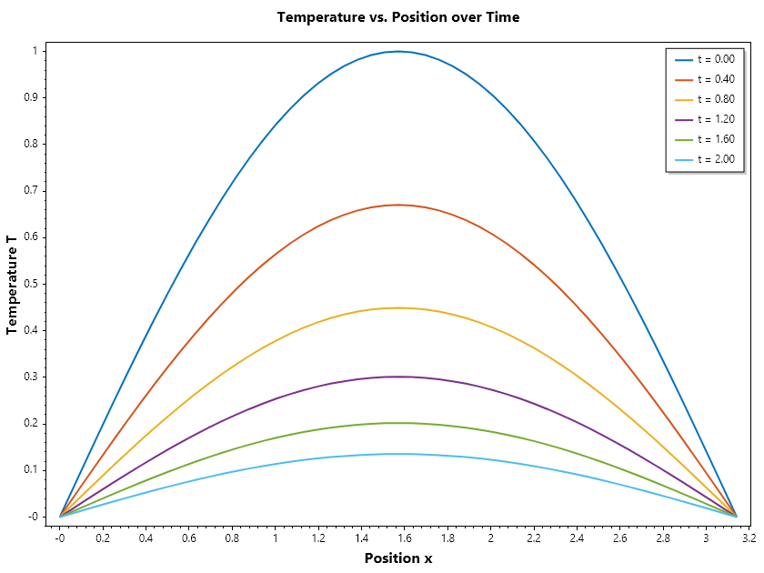

Solution Of PDE by Laplace Transform
====================================

Solution of Partial Differential Equations by Laplace Transform
---------------------------------------------------------------

The Laplace Transform is a powerful integral transform used to convert partial differential equations (PDEs) into algebraic equations, which are often easier to solve. 
This method is particularly useful for solving linear PDEs with constant coefficients and specific boundary conditions. While the Laplace Transform method is not a numerical methods
we have decided to included it in this because of its similarity to method of lines. 

1. Definition of the Laplace Transform
~~~~~~~~~~~~~~~~~~~~~~~~~~~~~~~~~~~~~~
The Laplace Transform of a function :math:`f(t)` is defined as:

.. math::

   F(s) = \mathcal{L}\{f(t)\} = \int_{0}^{\infty} e^{-st} f(t) dt

where :math:`s` is a complex number frequency parameter.

2. Applying the Laplace Transform to PDEs
~~~~~~~~~~~~~~~~~~~~~~~~~~~~~~~~~~~~~~~~~
To solve a PDE using the Laplace Transform, we follow these steps:

1. Take the Laplace Transform of both sides of the PDE with respect to time variable :math:`t`.
2. Solve the resulting algebraic equation in the Laplace domain.
3. Apply the inverse Laplace Transform to obtain the solution in the time domain.

3. Example: Solving the Heat Equation
~~~~~~~~~~~~~~~~~~~~~~~~~~~~~~~~~~~~~
Consider the one-dimensional heat equation:

.. math::

   \frac{\partial u}{\partial t} = \alpha \frac{\partial^2 u}{\partial x^2}

with initial condition :math:`u(x,0) = \sin(\pi x)` and boundary conditions :math:`u(0,t) = u(1,t) = 0`.

**Solution Steps:**

Step 1: Take the Laplace Transform

.. math::

   \mathcal{L}\left\{\frac{\partial u}{\partial t}\right\} = sU(x,s) - u(x,0) = sU(x,s) - \sin(\pi x)

.. math::

   \mathcal{L}\left\{ \alpha \frac{\partial^2 u}{\partial x^2} \right\} = \alpha \frac{\partial^2 U}{\partial x^2}

Step 2: Transform the boundary conditions

.. math::

   U(0,s) = U(1,s) = 0

Step 3: Solve the Ordinary Differential Equation

.. math::

   sU(x,s) - \sin(\pi x) = \alpha \frac{\partial^2 U}{\partial x^2}

Rearranging gives:

.. math::

   \frac{\partial^2 U}{\partial x^2} - \frac{s}{\alpha}U(x,s) = -\frac{1}{\alpha}\sin(\pi x)

Homogeneous solution and particular solution methods can be applied here.

.. math::

   \alpha \frac{\partial^2 U}{\partial x^2} - sU(x,s) = 0

Complementary Solution: 

.. math::

   U(x,s) = C_1(s) \sinh\left(\sqrt{\frac{s}{\alpha}}x\right) + C_2(s) \cosh\left(\sqrt{\frac{s}{\alpha}}x\right)

Particular Solution:
We assume :math:`U_p(x) = A\sin(\pi x) + B\cos(\pi x)`

by substitution in the equation we have

.. math::

   -\pi^2(A\sin(\pi x) + B\cos(\pi x))  - \frac{s}{\alpha} \left(A\sin(\pi x) + B\cos(\pi x) \right) = -\frac{1}{\alpha}\sin(\pi x)

it follows that :math:`B = 0` and :math:`A = 1/(s + \pi^2\alpha)`

General Solution is thus:, 

.. math::

   C_1(s) \sinh\left(\sqrt{\frac{s}{\alpha}}x\right) + C_2(s) \cosh\left(\sqrt{\frac{s}{\alpha}}x\right) + \frac{\sin(\pi x)}{s + \pi^2\alpha}

Step 4: Applying the boundary conditions:

1. at :math:`x = 0`:

.. math::

   U(0, s) = C_1(0) + C_2(1) + 0 = 0 \implies C_2 = 0;

2. at :math:`x = 1`:

.. math::

   C_1(s) \sinh\left(\sqrt{\frac{s}{\alpha}}\right) = 0 \implies  C_1 = 0

hence,

.. math::

   U(x,s) = \frac{\sin(\pi x)}{s + \pi^2\alpha}

Step 5: Apply the inverse Laplace Transform to find :math:`u(x,t)`

.. math::

   u(x, t) = \mathcal{L}^{-1}\left\{\frac{\sin(\pi x)}{ s + \pi^2\alpha} \right\} = \sin(\pi x)\mathcal{L}^{-1}\left\{ \frac{1}{s + \pi^2\alpha} \right\}

.. math::

   u(x, t) = e^{-\alpha\pi^2 t}\sin(\pi x)

.. code-block:: csharp

   // Define the function and interval
   double alpha = 0.5, π = pi;
   ColVec x = Linspace(0, 1, 101);
   RowVec T = Linspace(0, 0.5, 6);
   Matrix U = Exp(-alpha * π * π * T).Times(Sin(π * x));
   Plot(x, U, Linewidth: 2); GridOn();
   Xlabel("Position x"); Ylabel("Temperature T");
   Title("Temperature vs. Position over Time");
   Legend(T.Select(t => $"t = {t:0.00}"));
   SaveAs("Temperature_Laplace.png");

