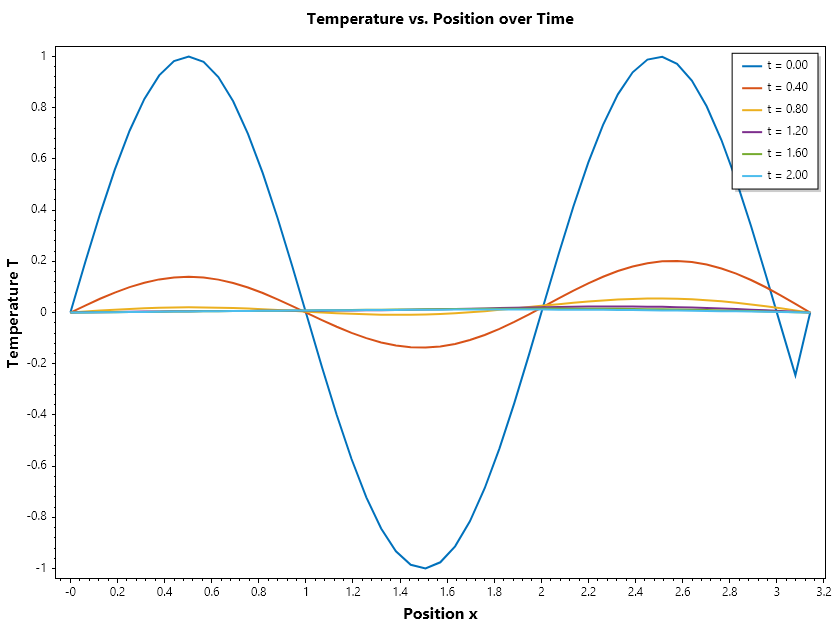
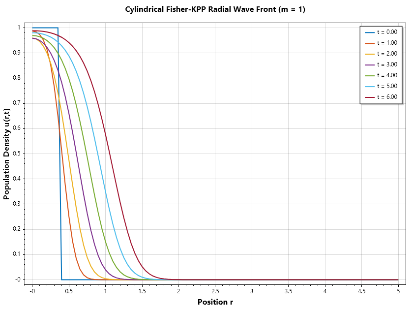
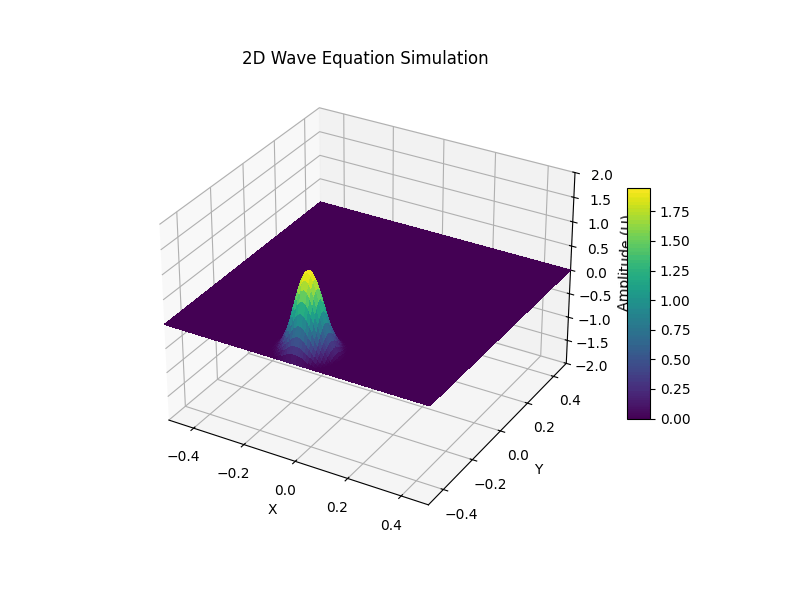

Solution Of PDE by Method of Lines
==================================

The **Method of Lines (MOL)** is a powerful numerical technique used to solve partial differential equations (PDEs), particularly those that are time-dependent (evolutionary).

Instead of discretizing all dimensions(space and time) simultaneously, the core idea is to discretize the spatial variables while leaving the time variable continuous. This transforms a single PDE into a system of coupled **Ordinary Differential Equations(ODEs)**.

How It Works: The 3-Step Process
~~~~~~~~~~~~~~~~~~~~~~~~~~~~~~~~

Imagine you are solving the heat equation: 

.. math::

   \frac{\partial u}{\partial t} = \alpha \frac{\partial^2 u}{\partial x^2}

1. **Spatial Discretization**: You divide the spatial domain into a grid of points(e.g., :math:`x_1, x_2, \cdot, x_n`). You replace the spatial derivatives :math:`(\frac{\partial^2 u}{\partial x^2})` with finite difference approximations, such as:

.. math::

   \frac{\partial^2 u}{\partial x^2} = \frac{u_{i+1} - 2u_i + u_{i-1}}{(\Delta x)^2}

2. **Conversion to ODEs**: By applying this at every grid point, the PDE becomes a set of ODEs, one for each point :

.. math::

   \frac{\partial u_i(t)}{\partial t} \approx \alpha \frac{u_{i+1}(t) - 2u_i(t) + u_{i-1}(t)}{(\Delta x)^2}

3. **Temporal Integration**: Now that you have a system of ODEs, you can use standard, high-performance ODE solvers like **Runge-Kutta** or **Euler’s method** to step forward in time.

## Why Use It? (Advantages)

- **Leverages Existing Tech**: You can use sophisticated, pre-built ODE solvers(like `NDSolve` in Mathematica or `ode45` in MATLAB) that automatically handle error control and adaptive time-stepping.
- **Flexibility**: You can use different spatial discretization methods, such as finite differences, finite elements, or spectral methods, depending on the geometry of your problem
- **Simplification**: It breaks a complex multi-dimensional problem into a more manageable "line-by-line" temporal evolution.

## Limitations

- **Stiffness**: The resulting system of ODEs is often "stiff," meaning you may need implicit solvers to avoid tiny, inefficient time steps.
- **Not for All PDEs**: It is designed for "evolutionary" problems (parabolic and hyperbolic). It cannot be used directly for purely "steady-state" elliptic equations(like Laplace’s equation) without adding a "pseudo-time" variable.

.. list-table:: Comparison at a Glance
   :header-rows: 1

   * - Feature
     - Standard Finite Difference(FDM)
     - Method of Lines(MOL)
   * - **Time Treatment**
     - Discretized at the start
     - Kept continuous initially
   * - **Solving Logic**
     - Solves the whole grid at once
     - Solves ODEs along "lines" of time
   * - **Software**
     - Requires custom time-stepping
     - Uses off-the-shelf ODE solvers

In sepalsolver, the nnumerical solution of pde (Pdepe) is built on Ode45a: 
our differential algebraic equation solver that relies on L-stable diagonally
implicit Runge Kutta. This allows it to handle the boundary conditions implicitly and 
also correct the egde values in situation where the initial condition is not consitent 
with the boundary condition

Example 1: Solving the Heat Equation
~~~~~~~~~~~~~~~~~~~~~~~~~~~~~~~~~~~~
Consider the one-dimensional heat equation:

.. math::

   \frac{\partial u}{\partial t} = \alpha \frac{\partial^2 u}{\partial x^2}

with initial condition :math:`u(x,0) = \sin(\pi x)` and boundary conditions :math:`u(0,t) = u(1,t) = 0`.

.. code-block:: csharp

   // SOLVE_HEAT_EQUATION Solves the 1D heat equation using pdepe
   // Equation:  du/dt = alpha * d^2u/dx^2
   // Domain:    x in [0, 1],  t in [0, 0.5]
   // IC:        u(x,0) = sin(π x)
   // BC:        u(0,t) = 0,  u(1,t) = 0
   //
   // 1. Model Parameters & Mesh Setup
   double alpha = 0.5;       // Thermal diffusivity coefficient
   int m = 0;                // 0 = Slab / Cartesian coordinates
   double L = 1;             // Length of the rod
   double t_final = 0.5;     // Final simulation time

   double[] x = Linspace(0, L, 101);        // 51 spatial grid points
   double[] t = Linspace(0, t_final, 6);   // 6 time steps

   // 2. Defines the PDE components: c* du/ dt = x ^ (-m) * d / dx(x ^ m * f) + s
   (double c, double f, double s) pdefun(double x, double t, double u, double dudx) =>
       (1, alpha * dudx, 0);

   // 3. Initial sinusoidal temperature distribution
   double icfun(double x) => Sin(pi * x);

   // 4. Boundary Conditions defined as: p(x, t, u) + q(x, t) * f = 0
   (double pl, double ql, double pr, double qr) bcfun(double xl, double ul, double xr, double ur, double t) => (ul, 0, ur, 0);

   // 5. Solve the PDE
   (var T, var U) = Pdepe(m, pdefun, icfun, bcfun, x, t);

   // Subplot 2: 2D Temperature Profiles at Selected Times
   Plot(x, U, Linewidth: 2); GridOn();
   Xlabel("Position x"); Ylabel("Temperature T");
   Title("Temperature vs. Position over Time");
   Legend(T.Select(t => $"t = {t:0.00}"));
   SaveAs("Temperature.png");

Example 2: Solving Reactive Diffusion Equation
~~~~~~~~~~~~~~~~~~~~~~~~~~~~~~~~~~~~~~~~~~~~~~
The Fisher-KPP reaction-diffusion model transformed into a cylindrical coordinate system (:math:`m = 1`).
In cylindrical coordinates, the model represents radial population dispersion or chemical wavefront propagation 
outward from a central core (e.g., cell growth in a Petri dish or cylindrical tissue scaffold).

.. math::

   \frac{\partial u}{\partial t} = D\frac{1}{r}\frac{\partial}{\partial r}\left(r\frac{\partial u}{\partial r} \right) + r_g \cdot u(1 - u)

initial condition

.. math::

   u(x,0) = \begin{cases} 0.8 & \text{if } x < 0.5, \\ 0 & \text{otherwise} \end{cases} 

boundary condition

.. math::

   \left.\frac{\partial u}{\partial r}\right|_{(0,t)} = 0, \quad \left.\frac{\partial u}{\partial r}\right|_{(5,t)} = 0

.. code-block:: csharp

   // SOLVE-DIFFUSION-REACTION-EQUATION
   // Solves the 1D reaction-diffusion equation in cylindrical coordinates using pdepe
   // Equation:  du/dt = D/r*d/dr(r*du/dr) + g*u*(1 - u);
   // Domain:    x in [0, 5],  t in [0, 6]
   // IC:        u(x,0) = 0.8 if x < 0.5;
   //                     0.0 otherwise
   // BC:        du/dx(0,t) = 0,  du/dx(5,t) = 0
   //
   // 1. Model Parameters & Mesh Setup
   int m = 1; // Slab geometry
   double D = 0.01; // Diffusion coefficient
   double growthRate = 1.0; // Growth rate

   double[] r = Linspace(0, 5, 101);  // [0, 5]
   double[] t = Linspace(0, 6, 7);    // [0, 6]

   // 2. Defines the PDE components: du/dt = D/r*d/dr(r*du/dr) + g*u*(1 - u);
   (double c, double f, double s) PdeFun(double r, double t, double u, double dudr)
   {
       double capacity = 1.0;
       double flux = D * dudr;
       double source = growthRate * u * (1.0 - u); // Logistic reaction term
       return (capacity, flux, source);
   }

   // 3. Initial localized pulse at x = 0
   double IcFun(double r) => r < 0.4 ? 1.0 : 0.0;

   // 4. Insulated endpoints (zero flux)
   (double pl, double ql, double pr, double qr) BcFun(double rl, double ul, double rr, double ur, double t)
       => (0.0, 1.0, 0.0, 1.0);

   // 5. Solve the PDE
   (ColVec T, Matrix U) = Pdepe(m, PdeFun, IcFun, BcFun, r, t);
   Plot(r, U, Linewidth: 2); GridOn();
   Title("Cylindrical Fisher-KPP Radial Wave Front (m = 1)");
   Xlabel("Position r"); Ylabel("Population Density u(r,t)");
   Legend(T.Select(t => $"t = {t:0.00}"));
   SaveAs("Cylindrical_FisherKPP.png");

It is important to note that pdepe can be invoked with a shothand form as shown in the example below

.. code-block:: csharp

   double D = 0.01;                  // Diffusion coefficient
   double growthRate = 1.0;          // Growth rate
   double C_ambient = 0.0;           // C ambient
   double[] r = Linspace(0, 5, 101); //

   (ColVec T, Matrix U) = Pdepe(
       m: 1,                                                                     // 1 for Cylindrical, 2 for Spherical
       pdefun: (r, t, u, dudr) => (1.0, D * dudr, growthRate * u * (1.0 - u)),   // Pdefunction
       icfun: r => r < 0.4 ? 1.0 : 0.0,                                          // Initial condition
       bcfun: (rl, ul, rr, ur, t) => (0, 1, ur - C_ambient, 0),                  // Boundary Condition :Symmetry at origin, Dirichlet at boundary
       x: r, t: Linspace(0, 6, 7));

   Plot(r, U, Linewidth: 2); GridOn();
   Title("Cylindrical Fisher-KPP Radial Wave Front (m = 1)");
   Xlabel("Position r"); Ylabel("Population Density u(r,t)");
   Legend(T.Select(t => $"t = {t:0.00}"));
   SaveAs("Cylindrical_FisherKPP.png");

For higher dimensions, the same method can be applied. This will be demonstrated using wave equation
assume :math:`c > 0`

.. math::

   \frac{\partial^2 u}{\partial t^2} = c^2\left(\frac{\partial^2 u}{\partial x^2} + \frac{\partial^2 u}{\partial y^2} \right)

initial condition

.. math::

   u(x,y,0) = \begin{cases} 0.5\left(1 + \cos\left(\cfrac{\pi r(x, y)}{R} \right) \right) & \text{if } r(x,y) < R, \\ 0 & \text{otherwise} \end{cases} 

where :math:`r = \sqrt{(x - x_c)^2 + (y - y_c)^2}`

boundary condition

.. math::

   u(\pm L/2, y, t) = 0~\text{for}~y \in [-L/2, L/2]

.. math::

   u(x, \pm L/2, t) = 0~\text{for}~x \in [-L/2, L/2]

Step 1: Convert to system of first order PDEs in time

.. math::

   \frac{\partial u}{\partial t} = v

and hence

.. math::

   \frac{\partial v}{\partial t} = c^2\left(\frac{\partial^2 u}{\partial x^2} + \frac{\partial^2 u}{\partial y^2} \right)

Step 2: discretize the spatial part of the equation as:

.. math::

   \frac{\partial^2 u}{\partial x^2} = \frac{u(i+1, j) - 2u(i, j) + u(i-1, j)}{(\Delta x)^2}

.. math::

   \frac{\partial^2 u}{\partial y^2} = \frac{u(i, j+1) - 2u(i, j) + u(i, j-1)}{(\Delta y)^2}

Step 3: Assemble the system of coupled ODEs

.. math::

   \frac{\partial u(i, j)}{\partial t} = v(i, j)

.. math::

   \frac{\partial v(i, j)}{\partial t} = c^2\left(\frac{u(i+1, j) - 2u(i, j) + u(i-1, j)}{(\Delta x)^2} + \frac{u(i, j+1) - 2u(i, j) + u(i, j-1)}{(\Delta y)^2} \right)

We were given boundary conditions for u but we introduce v, so we have to create the boubdary condition for that by differentiating the given boundary condition. 

.. math::

   \frac{\partial u}{\partial t}(\pm L/2, y, t) = 0~\text{for}~y \in [-L/2, L/2]

.. math::

   \frac{\partial u}{\partial t}(x, \pm L/2, t) = 0~\text{for}~x \in [-L/2, L/2]

we can do so for :math:`\partial u/\partial t` too

.. math::

   \frac{\partial v}{\partial t}(\pm L/2, y, t) = 0~\text{for}~y \in [-L/2, L/2]

.. math::

   \frac{\partial v}{\partial t}(x, \pm L/2, t) = 0~\text{for}~x \in [-L/2, L/2]

.. code-block:: csharp

   // Set the domain
   int Nx = 100, Ny = 100;
   double Lx = 1, Ly = 1;
   double c = 1, dx = Lx / Nx, dy = Ly / Ny;
   double[] x = Linspace(-Lx / 2, Lx / 2, Nx + 1);
   double[] y = Linspace(-Ly / 2, Ly / 2, Ny + 1);
   (var X, var Y) = Meshgrid(x, y);

   // Compute dt to ensure the solution is stable
   double CFL = 0.3;
   double dt = CFL * (dx * dy) / (c * Hypot(dx, dy));
   double dx2 = dx * dx, dy2 = dy * dy, c2 = c * c;

   // Set the function the computes the derivatives
   (Matrix du, Matrix dv) duvdt(Matrix u, Matrix v)
   {
       Matrix du = v, dv = Zeros(Nx + 1, Ny + 1);
       Matrix d2udx2 = (u[..^2, 1..^1] - 2 * u[1..^1, 1..^1] + u[2.., 1..^1]) / dx2;
       Matrix d2udy2 = (u[1..^1, ..^2] - 2 * u[1..^1, 1..^1] + u[1..^1, 2..]) / dy2;
       dv[1..^1, 1..^1] = c2 * (d2udx2 + d2udy2);
       return (du, dv);
   }

   // RungeKutta Integrator
   (Matrix u, Matrix v) rk4(Matrix u, Matrix v)
   {
       (var ku1, var kv1) = duvdt(u, v);
       (var ku2, var kv2) = duvdt(u + 0.5 * ku1 * dt, v + 0.5 * kv1 * dt);
       (var ku3, var kv3) = duvdt(u + 0.5 * ku2 * dt, v + 0.5 * kv2 * dt);
       (var ku4, var kv4) = duvdt(u + ku3 * dt, v + kv3 * dt);
       u += (ku1 + 2 * ku2 + 2 * ku3 + ku4) * dt / 6;
       v += (kv1 + 2 * kv2 + 2 * kv3 + kv4) * dt / 6;
       return (u, v);
   }

   // Initialize
   double xc = 0, yc = -0.4, R = 0.1;
   Matrix r = Hypot(X - xc, Y - yc);
   Matrix U = 1 + Cos(pi * r / R), V = Zeros(Nx + 1, Ny + 1);
   U[r > R] = 0;

   // Simulate
   int n = 1;
   while (n < 1000)
   {
       (U, V) = rk4(U, V);
       n++;
   }

