Sparse Matrices
===============

A **sparse matrix** is a type of matrix in which most of the elements are zero.
This contrasts with a **dense matrix**, where most elements are non-zero.
Sparse matrices are common in scientific computing, data science, and machine 
learning because many real-world problems naturally produce matrices with lots
of zeros.

Key Characteristics
~~~~~~~~~~~~~~~~~~~
- **Definition**: A matrix with significantly more zero elements than non-zero ones.
- **Sparsity**: The proportion of zero elements in the matrix.
- **Density**: The proportion of non-zero elements. For example, a matrix with 74% zeros has 26% density.

Why Sparse Matrices Matter
~~~~~~~~~~~~~~~~~~~~~~~~~~
- **Memory Efficiency**: Storing only non-zero elements saves space.
- **Computational Speed**: Operations can skip zeros, reducing processing time.

Applications
~~~~~~~~~~~~
* Graph algorithms (adjacency matrices often sparse).
* Machine learning (e.g., text data represented as word-frequency matrices).
* Finite element analysis in engineering.

Common Representations
~~~~~~~~~~~~~~~~~~~~~~
Instead of storing all elements, sparse matrices are represented using specialized data structures:

.. list-table:: 
   :header-rows: 1

   * - Representation
     - Description
     - Example Use Case
   * - Coordinate List (COO)
     - Stores row, column, and value of non-zero entries.
     - Quick construction of sparse matrices
   * - Compressed Sparse Row (CSR)
     - Stores non-zero values with row pointers.
     - Efficient row slicing and matrix-vector multiplication.
   * - Compressed Sparse Column (CSC)
     - Similar to CSR but column-based.
     - Useful for column operations.
   * - Linked List Representation
     - Each non-zero element stored as a node with row/column indices.
     - Flexible but less efficient.

SepalSolver represents sparse matrices using a **Dictionary**:

.. code-block:: csharp
   Dictionary<(int, int), double> sparseMatrix;
-Keys: A tuple ``(i, j)`` representing the row and column indices.

-Values: The non-zero entry at that position.

This dictionary-based approach makes construction and updates simple,while providing fast element lookups.

Dynamic Conversion
~~~~~~~~~~~~~~~~~~
Although the dictionary form is flexible, SepalSolver transforms the
matrix into specialized formats during computation for efficiency:

- **CSR (Compressed Sparse Row)**:
* Used when traversing rows.
* Ideal for matrix-vector multiplication and row slicing.
* Example: In multiplication ``A * B``, matrix ``A`` is converted to CSR.

- **CSC (Compressed Sparse Column)**:
* Used when traversing columns.
* Ideal for column slicing and dot products.
* Example: In multiplication ``A * B``, matrix ``B`` is converted to CSC.

Hybrid Approach
~~~~~~~~~~~~~~~
This design combines the strengths of both representations:
* **Flexibility**: Dictionary form is intuitive for construction and updates.
* **Performance**: CSR and CSC conversions ensure efficient heavy operations.
* **Consistency**: Results are returned in dictionary form, keeping the API uniform.

Example Workflow

Matrix multiplication ``C = A * B`` proceeds as follows:
1. ``A`` stored as dictionary → converted to CSR.
2. ``B`` stored as dictionary → converted to CSC.
3. Multiplication performed by traversing rows of ``A`` (CSR) and columns of ``B`` (CSC).
4. Result ``C`` stored back as dictionary ``Dictionary<(int, int), double>``.

SepalSolver’s sparse matrix implementation achieves a balance betwee ease of use and computational efficiency. By starting with a dictionary and dynamically converting to CSR or CSC when needed, it provides both developer-friendly construction and high-performance operations.

Making a ``SparseMatrix``
-------------------------
A SparseMatrix can be made in the following ways: 
1. Converting an existing dense matrix into sparse matrix.
2. From Arrays of row indices, column indices and values.  
3. For a small matrix, you can declare and empty sparse matrix using the number of rows and columns, and then asigne each element into the matrix. 

**Matrix to SpraseMatrix**

.. code-block:: csharp

   Matrix A = new double[,]
   {
       { 5,  0,  0,  0 },
       { 0,  8,  0,  0 },
       { 0,  0,  0,  0 },
       { 0,  0,  3,  0 }
   };

   var Asparse = Sparse(A);
   Console.WriteLine($" Total elements = {Asparse.Numel}");
   Console.WriteLine($" Non-zero elements  = {Asparse.Nnz}");
   Console.WriteLine($" Sparsity = {Asparse.sparsity}");

Ouput

.. terminal::

    Total elements = 16
    Non-zero elements  = 3
    Sparsity = 0.1875

**Rows, Columns and Values**

.. code-block:: csharp

   int[] I = [0, 1, 3], J = [0, 1, 2]; double[] V = [5, 8, 3];
   var Asparse = new SparseMatrix(I, J, V, 4, 4);
   Console.WriteLine($" Total elements = {Asparse.Numel}");
   Console.WriteLine($" Non-zero elements  = {Asparse.Nnz}");
   Console.WriteLine($" Sparsity = {Asparse.sparsity}");

Ouput

.. terminal::

    Total elements = 16
    Non-zero elements  = 3
    Sparsity = 0.1875

**Assigning Values**

.. code-block:: csharp

   var Asparse = SparseMatrix.Zeros(4, 4);
   Asparse[0, 0] = 5;
   Asparse[1, 1] = 8;
   Asparse[3, 2] = 3;
   Console.WriteLine($" Total elements = {Asparse.Numel}");
   Console.WriteLine($" Non-zero elements  = {Asparse.Nnz}");
   Console.WriteLine($" Sparsity = {Asparse.sparsity}");

Ouput

.. terminal::

    Total elements = 16
    Non-zero elements  = 3
    Sparsity = 0.1875
SepalSolver also has inbuilt Sparsematrices that can be loaded without manually creating them as started above.
examples of these are : Squid and Bucky

Visualisation
-------------
SparseMatrices sparsity partterns can be visualized using Spy in the Plotlibrary. 

.. code-block:: csharp

   var A = SparseMatrix.Squid();
   Spy(A);
   SaveAs("Squid-Pattern.png");

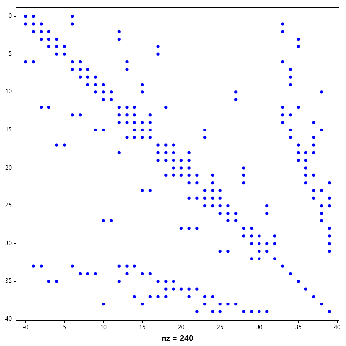

Arithmetic Operation
--------------------
All Operations supported by the Matrix class is also supported by the SparseMatrix Class. In addition to the standard matrix operation, sparse matrices can be reordered. Reordering is done to reduce fillin during matrix factorization.

LU, iLU, Cholesky and iCholesky Factorization
~~~~~~~~~~~~~~~~~~~~~~~~~~~~~~~~~~~~~~~~~~~~~
Just like Matrix class, LU, iLU, Cholesky and iCholesky factorization can be performed using 
``MakeLU()``, ``MakeiLU()``, ``MakeChol()``, ``MakeiChol()`` rspectively. 

Here we look at the incomplete LU and Cholesky, since the complete form as been dealt with in dense matrices and that model carries over into sparse matrices.

.. code-block:: csharp

   // Incomplete LU Factorization of a Sparse Matrix
   Matrix A = new double[,]
   {
       {  5,  0,  0,  0,  0},
       { -2,  5,  0,  0,  0},
       {  0, -2,  5,  0,  0},
       { -2,  0, -2,  5,  0},
       { -2,  0,  0, -2,  5}
   };

   SparseMatrix B = new(A);
   B.MakeiLU();
   Console.WriteLine($"L = {B.L_lu.Full()}");
   Console.WriteLine($"U = {B.U_lu.Full()}");
   Console.WriteLine($"L * U = {(B.L_lu * B.U_lu).Full()}");
   Spy(B.L_lu); 
   Title("L from Incomplete LU Factorization of B");
   SaveAs("L_from_Incomplete_LU_Factorization_of_B.png");
   Spy(B.U_lu);
   Title("U from Incomplete LU Factorization of B");
   SaveAs("U_from_Incomplete_LU_Factorization_of _B.png");

Ouput

.. terminal::

   L = 
      1.0000    0.0000    0.0000    0.0000    0.0000
     -0.4000    1.0000    0.0000    0.0000    0.0000
      0.0000   -0.4000    1.0000    0.0000    0.0000
     -0.4000    0.0000   -0.4000    1.0000    0.0000
     -0.4000    0.0000    0.0000   -0.4000    1.0000
   
   U = 
    5   0   0   0   0 
    0   5   0   0   0 
    0   0   5   0   0 
    0   0   0   5   0 
    0   0   0   0   5 
   
   L * U = 
    5   0   0   0   0 
   -2   5   0   0   0 
    0  -2   5   0   0 
   -2   0  -2   5   0 
   -2   0   0  -2   5 
   

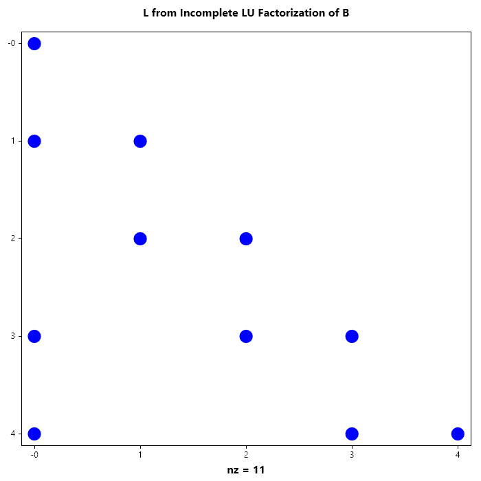

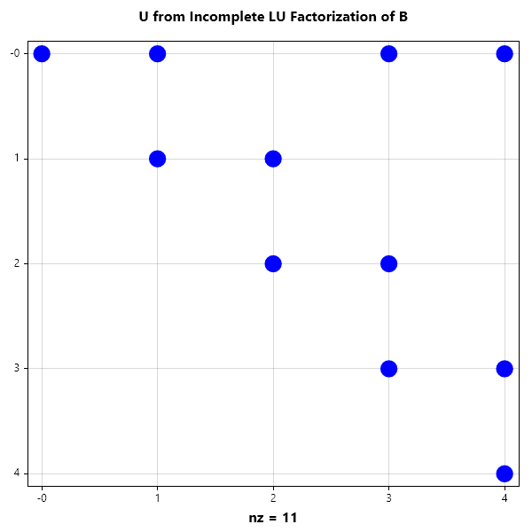

.. code-block:: csharp

   // Incomplete Cholesky Factorization of a Sparse Matrix
   Matrix A = new double[,]
   {
       {  5,  0,  0,  0,  0},
       { -2,  5,  0,  0,  0},
       {  0, -2,  5,  0,  0},
       { -2,  0, -2,  5,  0},
       { -2,  0,  0, -2,  5}
   };

   SparseMatrix B = new(A);
   B.MakeiChol();
   Console.WriteLine($"L = {B.L_chol}");
   Console.WriteLine($"L*LT = {B.L_chol* B.L_chol.T}");

   Spy(B.L_chol);
   Title("L from Incomplete Factorization of B");
   SaveAs("L_from_Incomplete_Cholesky_Factorization_of_B.png");

Ouput

.. terminal::

   L = 
    (0,0)            2.2361
    (1,0)           -0.8944
    (3,0)           -0.8944
    (4,0)           -0.8944
    (1,1)            2.0494
    (2,1)           -0.9759
    (2,2)            2.0119
    (3,2)           -0.9941
    (3,3)            1.7921
    (4,3)           -1.5624
    (4,4)            1.3263
   
   L*LT = 
    (0,0)            5.0000
    (1,0)           -2.0000
    (3,0)           -2.0000
    (4,0)           -2.0000
    (0,1)           -2.0000
    (1,1)            5.0000
    (2,1)           -2.0000
    (3,1)            0.8000
    (4,1)            0.8000
    (1,2)           -2.0000
    (2,2)            5.0000
    (3,2)           -2.0000
    (0,3)           -2.0000
    (1,3)            0.8000
    (2,3)           -2.0000
    (3,3)            5.0000
    (4,3)           -2.0000
    (0,4)           -2.0000
    (1,4)            0.8000
    (3,4)           -2.0000
    (4,4)            5.0000
   

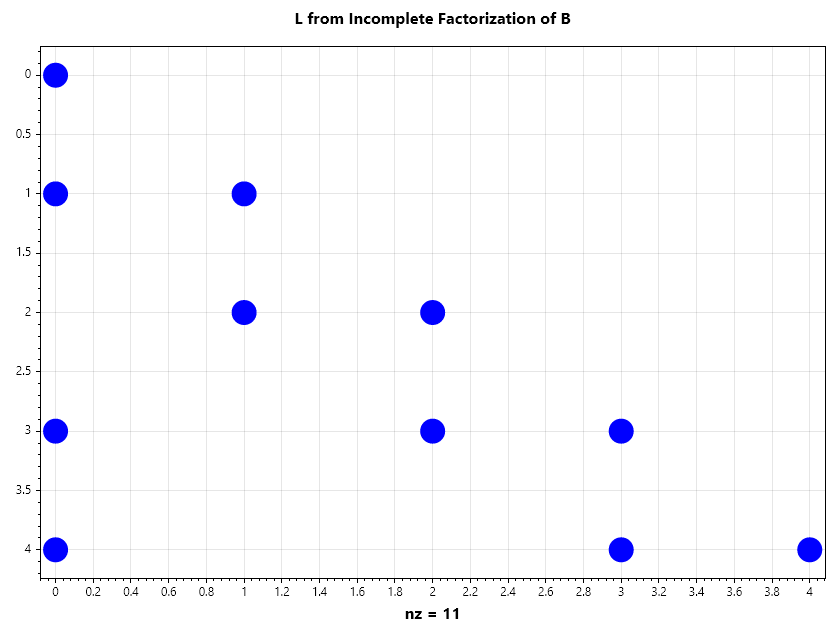

.. code-block:: csharp

   Matrix A = new double[,] 
   { 
       { 22.7345,    1.8859,         0,         0,    1.3000 },
       {  1.8859,   22.2340,    2.0461,         0,         0 },
       {       0,    2.0461,   22.7591,    2.4606,         0 },
       {       0,         0,    2.4606,   22.5848,    2.2768 },
       {  1.3000,         0,         0,    2.2768,   22.4853 } 
   };

   SparseMatrix B = new (A);
   B.MakeChol();
   Console.WriteLine(B.L_chol);

Ouput

.. terminal::

   
    (0,0)            4.7681
    (1,0)            0.3955
    (4,0)            0.2726
    (1,1)            4.6987
    (2,1)            0.4355
    (4,1)           -0.0230
    (2,2)            4.7507
    (3,2)            0.5179
    (4,2)            0.0021
    (3,3)            4.7240
    (4,3)            0.4817
    (4,4)            4.7094
   
Reodering
---------
Matrix rearrangement (or reordering) aims to find a permutation matrix :math:`P` such that the factorization of :math:`PAP^T` minimizes **fill-in**.

**Reverse Cuthill-McKee(RCM)** Reduces the **bandwidth**of the matrix by clustering non-zeros near the diagonal.Ideal for simpler, structured systems.

**Minimum Degree(MD)** A greedy approach that eliminates the vertex with the lowest degree first.This is a local optimization strategy.

**Nested Dissection(ND)** A "divide and conquer" approach using graph separators.

..image::https://upload.wikimedia.org/wikipedia/commons/thumb/e/e5/Sparse_matrix_fill-in.svg/400px-Sparse_matrix_fill-in.svg.png
:alt: Diagram showing fill-in during factorization
:align: center

.. list-table:: 
   :header-rows: 1

   * - Strategy
     - Logic
     - Pros
     - Cons
   * - **RCM**
     - Bandwidth Reduction
     - Fast; simple memory access
     - High total fill-in risk
   * - **Minimum Degree**
     - Local Greedy
     - Great for general matrices
     - Slow on massive systems
   * - **Nested Diss.**
     - Divide & Conquer
     - Best for 3D grids/parallelism
     - Complex implementation

..note::

The fill-in is governed by the elimination tree of the matrix.A "bushy" tree allows for more parallel factorization.

.. code-block:: csharp

   // Load squid matrix 
   SparseMatrix S = SparseMatrix.Squid();

   // Add more weight to the diagonal
   S += 20 * SparseMatrix.Eye(S.Rows);

   // Visualize the sparsity pattern
   Subplot(2, 2, 0); Spy(S); 
   Title("Squid");

   // Perform cholesky factorization
   S.MakeChol();

   // Visualize the sparsity pattern of the cholesky factor
   Subplot(2, 2, 2); Spy(S.L_chol);
   Title("Cholesky factor of Squid");

   // Compute RCM reordering permutation
   int[] I = SparseMatrix.Symrcm(S);

   // Reorder the squid
   SparseMatrix T = S[I, I];

   // Visualize reordered matrix
   Subplot(2, 2, 1); Spy(T, 1e-15); 
   Title("Reodered Squid");

   // Perform cholesky factorization of the 
   T.MakeChol();

   // Visualize the cholesky factor of the reordered matrix
   Subplot(2, 2, 3); Spy(T.L_chol); 
   Title("Cholesky factor of reodered Squid");

   SaveAs("RCM_reordering_of_Squid.png");
   CloseFig();

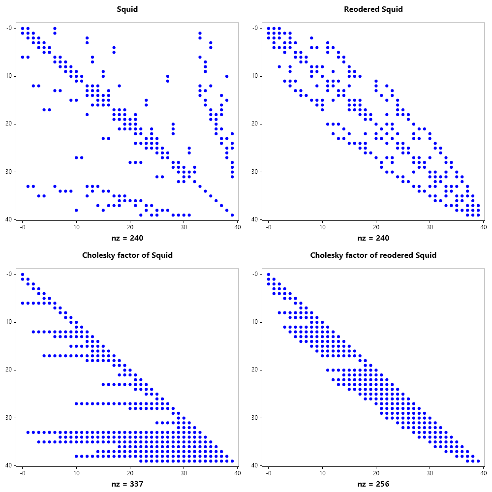

.. code-block:: csharp

   // Load squid matrix 
   SparseMatrix S = SparseMatrix.Squid();

   // Add more weight to the diagonal
   S += 20 * SparseMatrix.Eye(S.Rows);

   // Visualize the sparsity pattern
   Subplot(2, 2, 0); Spy(S);
   Title("Squid");

   // Perform cholesky factorization
   S.MakeChol();

   // Visualize the sparsity pattern of the cholesky factor
   Subplot(2, 2, 2); Spy(S.L_chol);
   Title("Cholesky factor of Squid");

   // Compute AMD reordering permutation
   int[] I = SparseMatrix.Symamd(S);

   // Reorder the squid
   SparseMatrix T = S[I, I];

   // Visualize reordered matrix
   Subplot(2, 2, 1); Spy(T, 1e-15);
   Title("Reodered Squid");

   // Perform cholesky factorization of the 
   T.MakeChol();

   // Visualize the cholesky factor of the reordered matrix
   Subplot(2, 2, 3); Spy(T.L_chol);
   Title("Cholesky factor of reodered Squid");

   SaveAs("AMD_reordering_of_Squid.png");
   CloseFig();

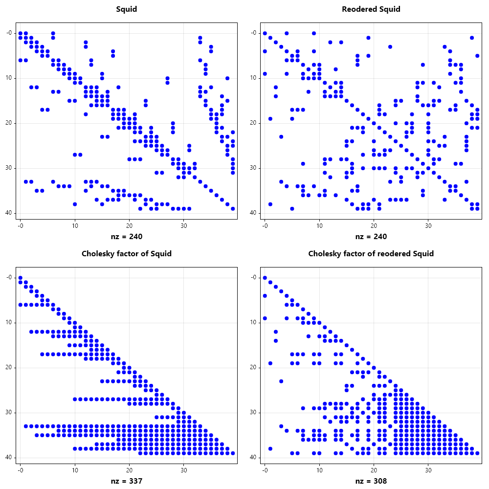

.. code-block:: csharp

   SparseMatrix B = SparseMatrix.Bucky(), R, S;
   B += 20 * SparseMatrix.Eye(B.Rows);
   PermIndexer r = SparseMatrix.Symrcm(B), p = SparseMatrix.Symamd(B);
   R = B[r, r]; S = B[p, p]; B.MakeChol(); R.MakeChol(); S.MakeChol();

   Spy(B, 1e-15);
   Spy(B.L_chol, 1e-15);
   Spy(B.L_chol * B.L_chol.T, 1e-15);

   Spy(R, 1e-15);
   Spy(R.L_chol, 1e-15);
   Spy(R.L_chol * R.L_chol.T, 1e-15);

   Spy(S, 1e-15);
   Spy(S.L_chol, 1e-15);
   Spy(S.L_chol * S.L_chol.T, 1e-15);

.. code-block:: csharp

   SparseMatrix B = SparseMatrix.Bucky();
   B += 20 * SparseMatrix.Eye(B.Rows);

   Subplot(3, 2, 0);
   Spy(B, 1e-15);
   Title("Bucky");

   B.MakeLU();
   Subplot(3, 2, 2);
   Spy(B.L_lu, 1e-15);
   Title("L factor of Bucky");

   Subplot(3, 2, 4);
   Spy(B.U_lu, 1e-15);
   Title("U factor of Bucky");

   // AMD reordering of Bucky
   var I = SparseMatrix.Symamd(B);
   B = B[I, I];
   Subplot(3, 2, 1);
   Spy(B, 1e-15);
   Title("Reordered Bucky");

   B.MakeLU();
   Subplot(3, 2, 3);
   Spy(B.L_lu, 1e-15);
   Title("L factor of Reordered Bucky");

   Subplot(3, 2, 5);
   Spy(B.U_lu, 1e-15);
   Title("U factor of Reordered Bucky");

   SaveAs("AMD_reordering_of_Bucky.png");
   CloseFig();

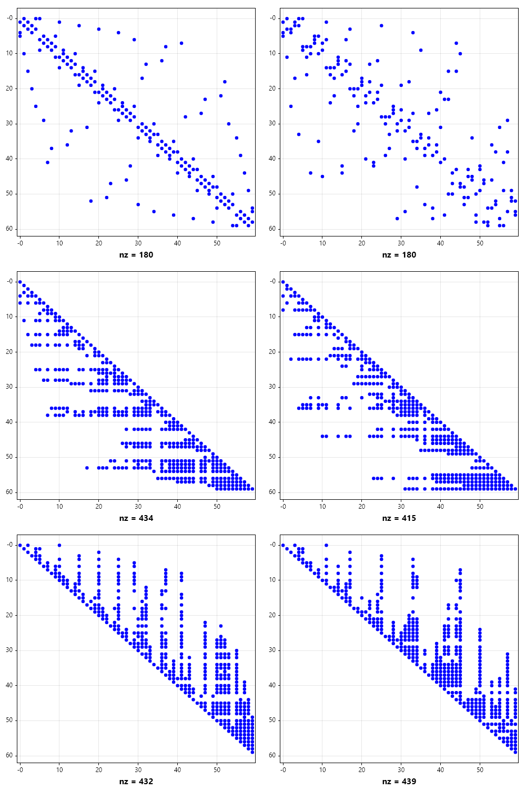

.. code-block:: csharp

   SparseMatrix B = SparseMatrix.Bucky();
   B += 20 * SparseMatrix.Eye(B.Rows);

   Subplot(3, 2, 0);
   Spy(B, 1e-15);
   Title("Bucky");

   B.MakeLU();
   Subplot(3, 2, 2);
   Spy(B.L_lu, 1e-15);
   Title("L factor of Bucky");

   Subplot(3, 2, 4);
   Spy(B.U_lu, 1e-15);
   Title("U factor of Bucky");

   // RCM reordering of Bucky
   var I = SparseMatrix.Symrcm(B);
   B = B[I, I];
   Subplot(3, 2, 1);
   Spy(B, 1e-15);
   Title("Reordered Bucky");

   B.MakeLU();
   Subplot(3, 2, 3);
   Spy(B.L_lu, 1e-15);
   Title("L factor of Reordered Bucky");

   Subplot(3, 2, 5);
   Spy(B.U_lu, 1e-15);
   Title("U factor of Reordered Bucky");

   SaveAs("RCM_reordering_of_Bucky.png");
   CloseFig();

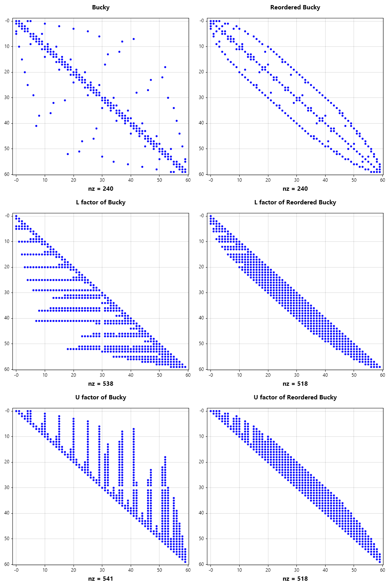

Sparse Matrix Slicing
~~~~~~~~~~~~~~~~~~~~~
Like dense matrices, sparse matrices can also be sliced and this is demonstracted in the example below

.. code-block:: csharp

   SparseMatrix A = SparseMatrix.Bucky();
   Spy(A);
   SaveAs("bucky.png");
   A[.., 10..50] = null;
   Spy(A);
   SaveAs("bucky2.png");
   A[10..50, ..] = null;
   Spy(A);
   SaveAs("bucky3.png");

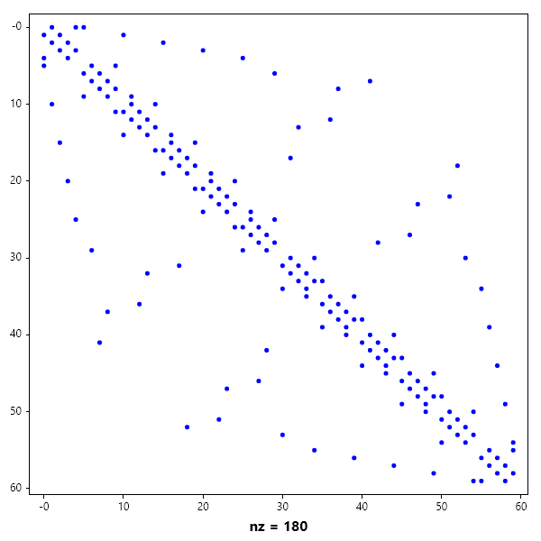

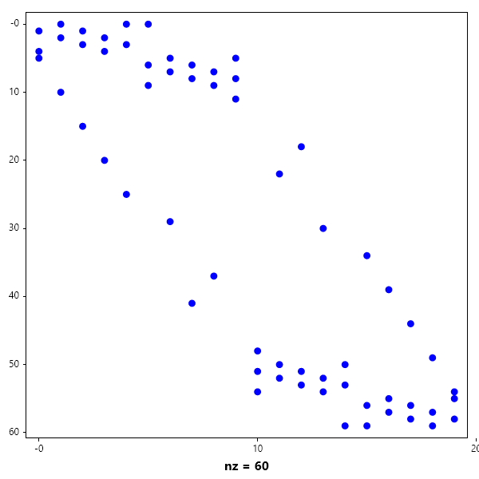

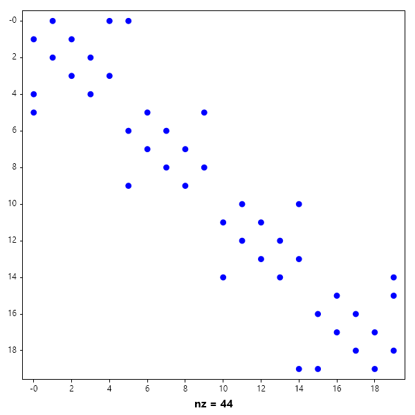

