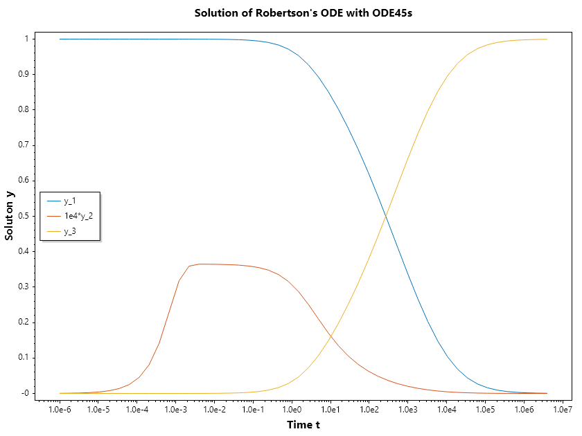

Stiff Differntial Equations
===========================

Stiff Differential Equations
----------------------------
In the world of numerical simulation, Stiffness is a phenomenon where certain terms in a differential equation lead to extremely rapid changes in the solution, even if the overall behavior of the system is smooth. It is not a mathematical property of the equation itself, but rather a practical limitation of the numerical methods used to solve it.A system is generally considered "stiff" when there is a large disparity between the fastest and slowest "time scales" in the problem.

**The "Stability Trap"**
Standard explicit solvers (like the classic Runge-Kutta 4th Order) work by taking small steps based on the current slope. In a stiff system, if the step size :math:`\Delta t` is even slightly too large, the solver will "overcorrect" for a rapid transient, leading to wild oscillations and eventually a total crash (divergence).To maintain stability in a stiff system, an explicit solver is forced to take steps so infinitesimally small that the simulation may take days or years to complete, even though the physical system being modeled is barely changing.

Engineering Usage Examples
--------------------------
Stiff equations appear whenever a system involves processes that happen at vastly different speeds simultaneously.

1. Chemical Kinetics and Combustion
~~~~~~~~~~~~~~~~~~~~~~~~~~~~~~~~~~~
In a car engine's combustion chamber, some chemical reactions occur in microseconds (the creation of free radicals), while the overall combustion process and the movement of the piston take milliseconds. To model the exhaust emissions accurately, you must solve a stiff system that captures both the "lightning-fast" chemistry and the "slow" mechanical motion.

2. Electronic Circuit Simulation
~~~~~~~~~~~~~~~~~~~~~~~~~~~~~~~~
In high-frequency power electronics, a circuit might have a capacitor that charges in nanoseconds alongside a cooling system that responds over minutes. Standard simulators would choke on the nanosecond transients; stiff solvers allow the simulation to "step over" the fast transients once they have stabilized.

3. Stiffness in Structural Mechanics
~~~~~~~~~~~~~~~~~~~~~~~~~~~~~~~~~~~~
A stiffly-supported beam or a very rigid spring system (high spring constant $k$) creates equations where high-frequency vibrations exist alongside slow, large-scale deflections. Stiff solvers are required to ensure the high-frequency "noise" doesn't blow up the math of the "signal."

Solving Strategy: Implicit Methods
----------------------------------
The cure for stiffness is the use of Implicit Methods (such as Backward Euler or BDF - Backward Differentiation Formulas and Diagonally Implicit Runge Kuttas).Unlike explicit methods that look at where the system is, implicit methods look at where the system is going by solving an algebraic equation at every step. While this requires more CPU power per step (often involving a matrix inversion), it allows for much larger time steps without losing stability.

Examples
~~~~~~~~
SepalSolver impelements ODE45s for stiff differential equation. This is an embeded diagonally implicit solver which is capable of error estimate and hence enable adpative time stepping.  Here we look at how to use this function to solve stiff Van der Pol Oscillator and Robertson differential equation. 

.. Admonition:: Example 1 :  Van der Pol Oscillator (:math:`\mu = 1 \times 10^5`)

   Solve the ODE :math:`~d^2y/dt^2 = 10^{5}((1 - y^2)y' - y)~` with initial condition :math:`~y(0) = [2, 0]~` over the interval :math:`[0, 6.3]`.
   
   First we have to convert this to a system of first order differential equations,
   
   .. math::
   
      \begin{array}{rcl}
      y' &=& v \\
      v' &=& 10^{5}((1 - y^2)v - y)
      \end{array}
   
   
   
   .. code-block:: csharp
   
      //define ODE
      double[] vdp2(double t, double[] y)=>
          [y[1], 1e5*((1 - y[0] * y[0]) * y[1] - y[0])];
   
      //Solve ODE
      (ColVec T, Matrix Y) = Ode45s(vdp2, [2, 0], [0, 6.3]);
      // Plot the result
      Plot(T, Y);
      Axis([0, 6.3, -10, 10]);
      Xlabel("Time t"); Ylabel("Soluton y");
      Legend(["y_1", "y_2"], UpperLeft);
      Title("Solution of van der Pol Equation (μ = 1e5) with ODE45s");
      SaveAs("Van-der-Pol-μ=1e5-Ode45s.png");
   
   
   .. figure:: images/Van-der-Pol-μ=1e5-Ode45s.png
      :align: center
      :alt: Van-der-Pol-μ=1e5-Ode45s.png
   

.. Admonition:: Example 2 :  Robertson ODE

   The Robertson ODE is the classic "benchmark" problem used to test the efficiency and stability of numerical solvers for stiff differential equations. It describes a simplified chemical reaction involving three species (:math:`y_1, y_2, y_3`) with reaction rates that differ by several orders of magnitude.
   
   The Reaction Network
   The system models the following three reactions:
   
   - :math:`y_1 \xrightarrow{0.04} y_2` (Slow) 
   
   - :math:`y_2 + y_2 \xrightarrow{3 \cdot 10^7} y_3 + y_2` (Very Fast)
   
   - :math:`y_2 + y_3 \xrightarrow{10^4} y_1 + y_3` (Fast)
   
   The resulting system of differential equations is:
   
   - :math:`\cfrac{dy_1}{dt} = -0.04y_1 + 10^4 y_2 y_3`
   
   - :math:`\cfrac{dy_2}{dt} = 0.04y_1 - 10^4 y_2 y_3 -3 \cdot 10^7 y_2^2`
   
   - :math:`\cfrac{dy_3}{dt} = 3 \cdot 10^7 y_2^2`
   
   
   .. code-block:: csharp
   
      //define ODE
      double[] robertson(double t, double[] y) =>
          [-0.04 * y[0] + 1e4 * y[1]*y[2],
            0.04 * y[0] - 1e4 * y[1]*y[2] - 3e7*y[1]*y[1],
            3e7*y[1]*y[1]];
   
      //Solve ODE
      (ColVec T, Matrix Y) = Ode45s(robertson, [1, 0, 0], [0, 4e6]);
      // Plot the result
      Y[.., 1] = 1e4*Y[.., 1];
      SemiLogx(T, Y);
      Xlabel("Time t"); Ylabel("Soluton y");
      Legend(["y_1", "1e4*y_2", "y_3"], MiddleLeft);
      Title("Solution of Robertson's ODE with ODE45s");
      SaveAs("Robertson-ODE-Ode45s.png");
   
   
   .. figure:: images/Robertson-ODE-Ode45s.png
      :align: center
      :alt: Robertson-ODE-Ode45s.png
   
   

.. note::

   We are allowed to set the points in time we want the solver to compute the solutions. SepalSolver computes this solutions directly during integration, not by interpolation after flying past them. For direct computation and by interpolation in other solvers, integrators take adaptive steps as dictated by the stiffness of the problem being solved. But in the case of sepalsolver, the steps is also adjusted to ensure that the solution is computed as the points supplied by the used. 

.. code-block:: csharp

   //define ODE
   double[] robertson(double t, double[] y) =>
       [-0.04 * y[0] + 1e4 * y[1]*y[2],
         0.04 * y[0] - 1e4 * y[1]*y[2] - 3e7*y[1]*y[1],
         3e7*y[1]*y[1]];

   //Solve ODE
   //Now we want the results to be computed at
   //logarithmically evenly spaced points from 1e-6 to 4e6
   (ColVec T, Matrix Y) = Ode45s(robertson, [1, 0, 0], [0, ..Logspace(-6, 6.6)]);
   // Plot the result
   Y[.., 1] = 1e4*Y[.., 1];
   SemiLogx(T, Y);
   Xlabel("Time t"); Ylabel("Soluton y");
   Legend(["y_1", "1e4*y_2", "y_3"], MiddleLeft);
   Title("Solution of Robertson's ODE with ODE45s");
   SaveAs("Robertson-ODE-given-points-Ode45s.png");

.. note::

   Just like the case of Solvers for nonlinear system, OdeSolvers also has Odeset, that can be used to guide process of the solution or request aditional information from the solution. We can request the statistics be printed so we can see how the problem was solved. We can change the RelTol or absolute tolerance. Note that the absolute tolerance can be scale ( single number to apply to all variables being integrated) or a vector, one for each of the variables. 

.. Admonition:: Example 4 :  Using OdeSet

   Here we look at the use of odeset
   
   .. code-block:: csharp
   
      //define ODE
      double[] robertson(double t, double[] y) =>
          [-0.04 * y[0] + 1e4 * y[1]*y[2],
            0.04 * y[0] - 1e4 * y[1]*y[2] - 3e7*y[1]*y[1],
            3e7*y[1]*y[1]];
   
      //Solve ODE
      // Here we chose reltol = 1e-4(defult is 1e-3), abstol = 1e-7(default is 1e-6)
      var opts = Odeset(RelTol: 1e-4, AbsTol: 1e-7);
      (ColVec T, Matrix Y) = Ode45s(robertson, [1, 0, 0], [0, .. Logspace(-6, 6.6)], opts);
   
   
   
   .. note::
   
      We can request the statistics of the solution process by setting Stats: true. We use this to understand the impact of tolerance setting on computational cost of the solution.
   
   
   
   .. code-block:: csharp
   
      //define ODE
      double[] robertson(double t, double[] y) =>
          [-0.04 * y[0] + 1e4 * y[1]*y[2],
            0.04 * y[0] - 1e4 * y[1]*y[2] - 3e7*y[1]*y[1],
            3e7*y[1]*y[1]];
   
      //Solve ODE
      var opts = Odeset(Stats: true);
      Console.WriteLine("Computational Cost Using Default Tolerance Setting:");
      Ode45s(robertson, [1, 0, 0], [0, .. Logspace(-6, 6.6)], opts);
      Console.WriteLine("\n\n");
      opts = Odeset(Stats: true, RelTol: 1e-4, AbsTol: 1e-7);
      Console.WriteLine("Computational Cost Using Custom Tolerance Setting");
      Ode45s(robertson, [1, 0, 0], [0, .. Logspace(-6, 6.6)], opts);
   
   
   Ouput
   
   .. terminal::
   
      Computational Cost Using Default Tolerance Setting:
      Summary of statistics by Ode45s
              142 successful steps
              0 failed attempts
              3420 function evaluations
              142 partial derivatives
              568 LU decompositions
              2283 solutions of linear systems
      
      
      
      
      Computational Cost Using Custom Tolerance Setting
      Summary of statistics by Ode45s
              210 successful steps
              0 failed attempts
              5490 function evaluations
              210 partial derivatives
              840 LU decompositions
              3809 solutions of linear systems
      
