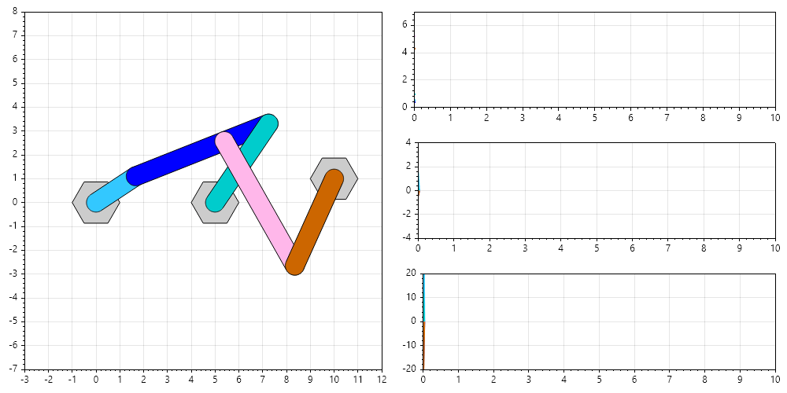
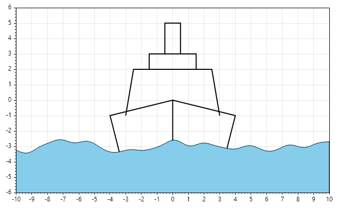
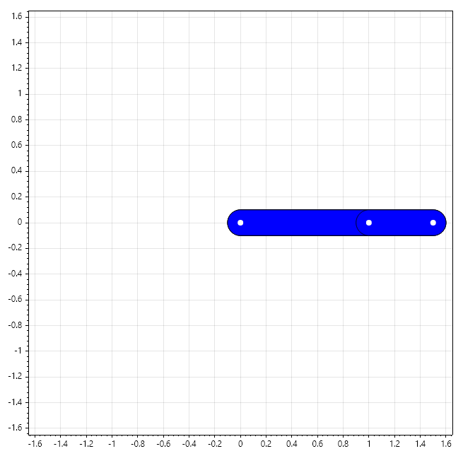
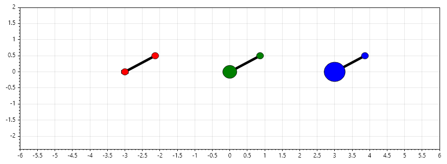
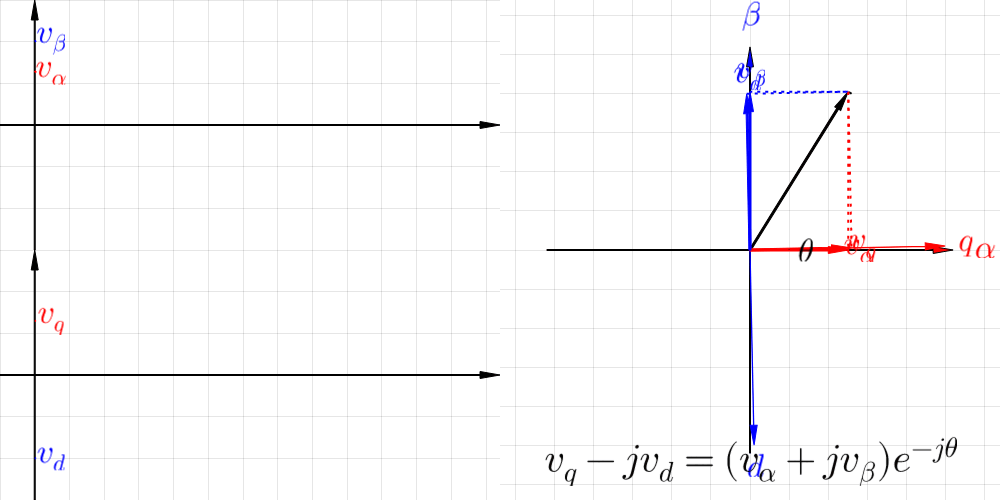

Welcome to Numerical Methods with SepalSolver!
#################################################

Preface
**********

Nearly all modern programming languages come equipped with user-friendly scientific computing toolboxes, providing developers with accessible libraries for numerical analysis, optimization, and simulation. However, C# has historically been an exception to this rule. While Microsoft recognized this gap and sought to address it by partnering with a Moscow university to develop the Open Solving Library for ODEs (OSLO), the project was ultimately stalled due to U.S. sanctions on Russia following the invasion of Ukraine in 2014.

It was in this context that SepalSolver was conceived. SepalSolver was created to serve a very specific purpose: to provide a C#-based, high-performing, and user-friendly scientific computing tool. Unlike many general-purpose libraries, SepalSolver was designed with the dual goals of computational efficiency and ease of use, ensuring that engineers, scientists, and developers working in C# could access the same level of mathematical sophistication available in other programming ecosystems.

The development of SepalSolver was spearheaded by Cyphercrescent, an engineering software development company that uses C# as its primary programming language. For Cyphercrescent, the need was clear: engineering software requires a mathematics library that is both powerful and intuitive. By building SepalSolver, the company not only addressed its internal requirements but also contributed a valuable tool to the broader C# community.

This book introduces readers to the principles of numerical methods through the lens of SepalSolver. It is intended for students, researchers, and professionals who wish to combine theoretical rigor with practical implementation. By weaving together mathematical foundations, algorithmic strategies, and hands-on examples, the text demonstrates how SepalSolver can be applied to solve real-world problems across engineering, physics, finance, and data science.

Ultimately, this work highlights the evolving synergy between mathematical theory and computational innovation. SepalSolver stands as a testament to the importance of accessible scientific computing in C#, and this book seeks to empower readers to harness its capabilities for both academic exploration and professional practice.

Abstract
********

Numerical methods form the backbone of modern scientific computing, enabling the approximation of solutions to problems that are analytically intractable. This book presents a comprehensive exploration of numerical techniques, with a particular emphasis on SepalSolver, a versatile computational framework designed to bridge theory and practice. By integrating classical algorithms with contemporary solver strategies, SepalSolver provides a unified environment for tackling linear and nonlinear systems, optimization problems, differential equations, and large-scale simulations.

Here are some simulation performed with the sepal solver. 

1. **Six Linked Bar Mechanism**
~~~~~~~~~~~~~~~~~~~~~~~~~~~~~~~~
    A six-linked bar mechanism is a type of kinematic chain used in mechanical engineering to achieve complex motion paths and force transmission. It consists of six rigid bars (links) connected by joints, typically revolute (hinge) or prismatic (sliding), forming a closed-loop system. These mechanisms are extensions of four-bar and five-bar linkages, offering greater flexibility and control over motion.
    In essence, a six-linked bar mechanism is a versatile extension of classical linkage theory, enabling engineers to design systems with greater motion complexity and adaptability.

2. **Ship Roll at Sea**
~~~~~~~~~~~~~~~~~~~~~~~
    **Ship roll characteristics** describe the side-to-side tilting motion of a vessel around its longitudinal axis (running bow to stern). This is one of the six fundamental ship motions (heave, sway, surge, yaw, pitch, and roll) and is particularly important because it directly affects stability, comfort, and safety at sea.  

    In essence, roll is the most critical ship motion to manage because it directly ties to **stability and survivability** at sea. Engineers and naval architects devote significant effort to predicting and controlling roll through both design and operational strategies.   

3. **Chaos of Double Compund Pendulum**
~~~~~~~~~~~~~~~~~~~~~~~~~~~~~~~~~~~~~~~
    A double compound pendulum is a classic example of a chaotic system in physics. It consists of two pendulums attached end-to-end, where the motion of the second pendulum depends on the first. Despite its simple construction, the system exhibits highly complex and unpredictable behavior.

4. **Three Double Pendulums with Different Masses**
~~~~~~~~~~~~~~~~~~~~~~~~~~~~~~~~~~~~~~~~~~~~~~~~~~~
    Simulating three double pendulums with different masses is a powerful way to explore how mass distribution influences chaotic dynamics. Even though the governing equations are deterministic, the outcomes vary dramatically depending on the parameters.

5. **Park Transformation**
~~~~~~~~~~~~~~~~~~~~~~~~~~
    In electrical engineering, Park transformation (also called the direct-quadrature-zero (d-q-0) transformation) is a mathematical technique used to simplify the analysis and control of three-phase AC circuits, especially in rotating machines like motors and generators.

Structure of the Book
*********************

The text begins with foundational principles—Basic Operations and Syntax—before progressing to core mathematical structures such as Polynomials, Interpolation, and Special Functions. These form the building blocks for the more complex computational engines within the library.

The middle chapters delve into the heart of numerical computing: Linear Algebra, Integration, and the solution of Ordinary Differential Equations (ODEs). Each section demonstrates how SepalSolver can be applied to real-world problems, offering readers both theoretical insight and practical implementation guidance.

Finally, the book explores high-level applications in Numerical Optimization and Partial Differential Equations (PDEs). Worked examples, case studies, and performance benchmarks illustrate the solver’s efficiency and adaptability across diverse domains, including engineering, physics, and data science.

This book is intended for students, researchers, and professionals seeking a deeper understanding of numerical methods and their computational realization. By combining rigorous mathematical exposition with hands-on solver applications, it equips readers with the tools to design, analyze, and implement robust numerical solutions. Ultimately, the integration of SepalSolver into the study of numerical methods highlights the evolving synergy between mathematical theory and computational innovation.

Getting Started
===============
This video explains how to get started with a console project and install SepalSolver nuget packages

.. youtube:: v3I3McaUMfY

   :width: 960
   :height: 540

Content
===========

.. toctree::

   Basic Operations and Syntax
   Polynomials
   Interpolation
   Special Functions
   Linear Algebra
   Solution of Nonlinear System
   Integration
   Ordinary Differential Equations
   Numerical Optimization
   Partial Differential Equations
   Production System Modelling
   Reservoir Simulation
   Conclusion
